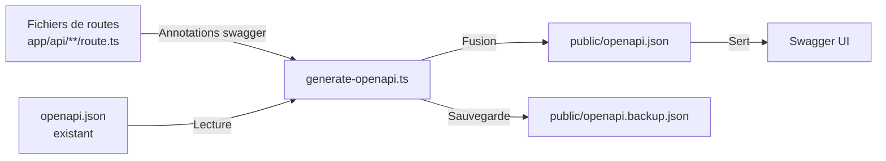

# Génération OpenAPI

Le template inclut un système de génération de documentation OpenAPI automatisé qui analyse les annotations JSDoc `@swagger` dans les fichiers de route API, les fusionne avec la documentation existante et produit une spec `openapi.json` complète.

## Vue d'ensemble



## Exécuter le générateur

```bash
# Génération standard avec sortie
tsx scripts/generate-openapi.ts

# Mode silencieux (pour CI/CD)
tsx scripts/generate-openapi.ts --silent
```

Le script s'exécute automatiquement en mode silencieux lorsque des variables d'environnement CI sont détectées.

## Configuration de base

```typescript
const swaggerOptions = {
  definition: {
    openapi: '3.0.0',
    info: {
      title: 'Ever Works API',
      version: '1.0.0',
      description: 'Documentation API complète pour Directory Web Template',
    },
    servers: [{ url: '/', description: 'Environnement actuel' }],
    components: {
      securitySchemes: {
        sessionAuth: { type: 'http', scheme: 'bearer', bearerFormat: 'JWT' },
        session: { type: 'apiKey', in: 'cookie', name: 'session_token' },
        cronSecret: { type: 'http', scheme: 'bearer', bearerFormat: 'Secret' }
      }
    }
  },
  apis: ['./app/api/**/*.ts'],
};
```

## Approche hybride

Le générateur :
1. Lit le fichier `public/openapi.json` existant (documentation manuelle)
2. Scanne les annotations `@swagger` dans tous les fichiers de route
3. Fusionne les deux sources
4. Écrit la spec complète dans `public/openapi.json`
5. Crée une sauvegarde dans `public/openapi.backup.json`
