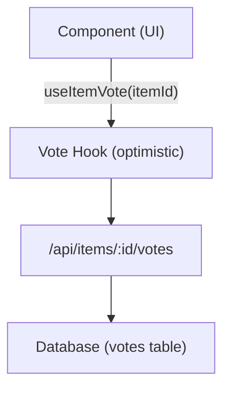

# Système de votes et commentaires

The Ever Works template includes a full voting and commenting system that allows users to upvote/downvote items, leave reviews with star ratings, and engage with content. Both systems use optimistic updates for instant UI feedback.

## Voting System

### Architecture

The voting system uses a per-item vote model where each authenticated user can cast one vote (up or down) per item. The system tracks the net vote count and individual user votes.



### useItemVote Hook

```typescript
import { useItemVote } from '@/hooks/use-item-vote';

const {
  voteCount,       // number -- net vote count
  userVote,        // 'up' | 'down' | null
  isLoading,       // boolean
  handleVote,      // (type: 'up' | 'down') => void
  refreshVotes,    // () => void
} = useItemVote(itemId);
```

### Vote Behavior

| Current State | Action | Result |
|--------------|--------|--------|
| No vote | Click Up | Upvote (+1) |
| No vote | Click Down | Downvote (-1) |
| Upvoted | Click Up | Remove vote (toggle) |
| Upvoted | Click Down | Switch to downvote (-2 net) |
| Downvoted | Click Down | Remove vote (toggle) |
| Downvoted | Click Up | Switch to upvote (+2 net) |

### Optimistic Updates

The vote hook implements optimistic updates with rollback:

1. **onMutate** -- Cancel outgoing queries, snapshot current state, apply optimistic update
2. **onSuccess** -- Replace optimistic data with server response
3. **onError** -- Roll back to snapshot, show error toast

### Authentication

Unauthenticated users who attempt to vote see a login modal via `useLoginModal`:

```typescript
if (!user) {
  loginModal.onOpen('Please sign in to vote on this item');
  throw new Error('Authentication required');
}
```

### Cache Management

The `useVoteCache` utility hook provides cross-component cache operations:

```typescript
import { useVoteCache } from '@/hooks/use-item-vote';

const {
  invalidateAllVotes,     // () => void
  invalidateItemVotes,    // (itemId: string) => void
  clearVoteCache,         // () => void
  prefetchItemVotes,      // (itemId: string) => Promise<void>
} = useVoteCache();
```

## Comments System

### Architecture

Comments support full CRUD operations with star ratings, moderation, and real-time updates.

### useComments Hook

```typescript
import { useComments } from '@/hooks/use-comments';

const {
  comments,              // CommentWithUser[]
  isPending,
  createComment,         // ({ content, itemId, rating }) => Promise
  isCreating,
  updateComment,         // ({ commentId, content?, rating? }) => Promise
  isUpdating,
  deleteComment,         // (commentId) => Promise
  isDeleting,
  rateComment,           // ({ commentId, rating }) => void
  isRatingComment,
  updateCommentRating,   // ({ commentId, rating }) => void
  isUpdatingRating,
  commentRating,         // number
  isLoadingRating,
} = useComments(itemId);
```

### Comment Data Model

Each comment includes:
- `id` -- Unique identifier
- `content` -- Comment text
- `rating` -- Optional star rating (1-5)
- `userId` -- Author reference
- `itemId` -- Associated item
- `user` -- Populated user data (name, email, image)
- `createdAt` / `updatedAt` -- Timestamps

### Rating Integration

Comments and ratings are tightly integrated:
- Creating a comment with a rating updates the item's aggregate rating
- Editing a comment's rating triggers a re-calculation
- The `["item-rating", itemId]` query is refetched after any comment mutation

### Cross-Component Events

The comment system dispatches custom DOM events for cross-component coordination:

```typescript
const COMMENT_MUTATION_EVENT = "comment:mutated";
window.dispatchEvent(new CustomEvent(COMMENT_MUTATION_EVENT, { detail: comment }));
```

Other components can listen for comment changes without direct React Query coupling.

### Admin Moderation

The `useAdminComments` hook provides admin-level comment management:

```typescript
import { useAdminComments } from '@/hooks/use-admin-comments';

const {
  comments,         // AdminCommentItem[]
  totalComments,
  totalPages,
  isDeleting,       // string | null (ID of comment being deleted)
  deleteComment,    // (id: string) => Promise<boolean>
} = useAdminComments({ page: 1, limit: 10, search: '' });
```

### API Endpoints

| Method | Endpoint | Description |
|--------|----------|-------------|
| GET | `/api/items/:id/comments` | Fetch comments for an item |
| POST | `/api/items/:id/comments` | Create a new comment |
| PUT | `/api/items/:id/comments/:commentId` | Update a comment |
| DELETE | `/api/items/:id/comments/:commentId` | Delete a comment |
| POST | `/api/items/:id/comments/rating` | Rate a comment |
| PUT | `/api/items/:id/comments/rating` | Update comment rating |
| GET | `/api/items/:id/comments/rating` | Get aggregate rating |

## Feature Flag Integration

Both voting and comments respect feature flags:

```typescript
const flags = getFeatureFlags();
// flags.ratings -- Controls star rating display
// flags.comments -- Controls comment section visibility
```

When the database is not configured (`DATABASE_URL` is missing), these features are automatically disabled.