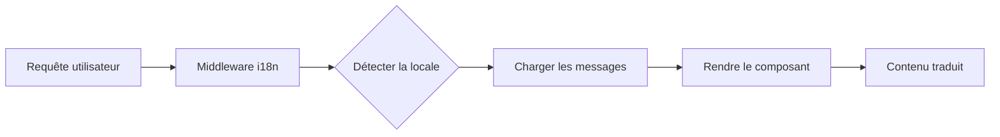

# Internationalisation (i18n)

Ever Works est construit avec l'internationalisation à l'esprit, prenant en charge plusieurs langues dès le départ grâce à `next-intl`.

## 🌍 Langues prises en charge

Le modèle est fourni avec une prise en charge intégrée pour :

- 🇬🇧 **Anglais** (en) - Langue par défaut
- 🇫🇷 **Français** (fr)
- 🇪🇸 **Espagnol** (es)
- 🇩🇪 **Allemand** (de)
- 🇨🇳 **Chinois** (zh)
- 🇸🇦 **Arabe** (ar)
- 🇧🇬 **Bulgare** (bg)
- 🇳🇱 **Néerlandais** (nl)
- 🇮🇱 **Hébreu** (he)
- 🇮🇹 **Italien** (it)
- 🇵🇱 **Polonais** (pl)
- 🇵🇹 **Portugais** (pt)
- 🇷🇺 **Russe** (ru)

## Comment ça fonctionne

### Localisation basée sur l'URL

Ever Works utilise la détection de locale basée sur l'URL :

```
https://votresite.com/en/about    → Anglais
https://votresite.com/fr/about    → Français
https://votresite.com/es/about    → Espagnol
```

### Détection automatique de la locale

Le système automatiquement :
1. Détecte la langue du navigateur de l'utilisateur
2. Redirige vers la locale appropriée
3. Se souvient de la préférence linguistique de l'utilisateur
4. Revient à la langue par défaut (anglais)

## Architecture de traduction



## Fichiers de traduction

Les traductions sont stockées dans des fichiers JSON sous `apps/web/messages/` :

```
messages/
├── en.json    # Anglais
├── fr.json    # Français
├── es.json    # Espagnol
├── de.json    # Allemand
├── zh.json    # Chinois
├── ar.json    # Arabe
└── ...
```

## Utilisation dans les composants

### Composants serveur (recommandé)

```typescript
import { getTranslations } from 'next-intl/server';

export default async function HomePage() {
  const t = await getTranslations('navigation');
  return <h1>{t('title')}</h1>;
}
```

### Composants client

```typescript
'use client';
import { useTranslations } from 'next-intl';

export function NavBar() {
  const t = useTranslations('navigation');
  return <nav>{t('home')}</nav>;
}
```

## Prochaines étapes

- [Guide de traduction](/internationalization/translation-guide) — Comment ajouter de nouvelles traductions
- [Détection de locale](/internationalization/locale-detection) — Paramètres de détection automatique
- [Support RTL](/internationalization/rtl-support) — Configuration pour l'arabe et l'hébreu
