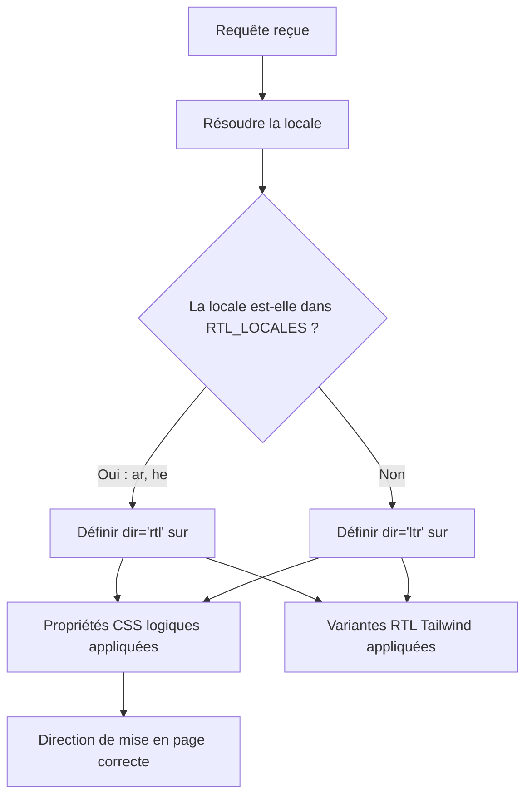

# Support RTL (droite à gauche)

Le modèle prend en charge intégralement les langues de droite à gauche (RTL) telles que l'arabe et l'hébreu. Cette page documente comment la détection RTL fonctionne, comment la direction de la mise en page est appliquée et comment les composants s'adaptent aux contextes RTL.

## Aperçu de l'architecture



## Fichiers sources

| Fichier | Objectif |
|---------|----------|
| `lib/constants.ts` | Définition de la liste des locales RTL |
| `app/layout.tsx` | Mise en page racine appliquant l'attribut `dir` |
| `components/language-switcher.tsx` | Carte de langues avec métadonnées `isRTL` |

## Configuration des locales RTL

Les locales RTL sont définies comme constante dans `lib/constants.ts` :

```typescript
export const RTL_LOCALES: readonly Locale[] = ['ar', 'he'] as const;
```

Le sélecteur de langue maintient également les métadonnées RTL pour chaque locale :

```typescript
const languageMap = {
  en: { flagSrc: "/flags/en.svg", name: "EN", fullName: "English", isRTL: false },
  ar: { flagSrc: "/flags/ar.svg", name: "AR", fullName: "العربية", isRTL: true },
  he: { flagSrc: "/flags/he.svg", name: "HE", fullName: "עברית", isRTL: true },
  fr: { flagSrc: "/flags/fr.svg", name: "FR", fullName: "Français", isRTL: false },
  // ... toutes les autres locales avec isRTL: false
};
```

## Application de la direction

La mise en page racine `app/layout.tsx` détecte la locale actuelle et définit l'attribut `dir` sur l'élément `<html>` :

```typescript
import { isRtlLocale } from '@/lib/utils/locale';

export default function RootLayout({ children, params: { locale } }) {
  const dir = isRtlLocale(locale) ? 'rtl' : 'ltr';
  
  return (
    <html lang={locale} dir={dir}>
      <body>{children}</body>
    </html>
  );
}
```

## Styles RTL avec Tailwind CSS

Utilisez les variantes RTL de Tailwind pour les ajustements de mise en page spécifiques au RTL :

```tsx
// Marge qui change de côté en RTL
<div className="ms-4">       {/* margin-inline-start */}
<div className="pe-2">       {/* padding-inline-end */}

// Variante RTL explicite
<div className="rtl:text-right ltr:text-left">
```

## Test du support RTL

Pour tester votre mise en page RTL :

1. Basculez la langue sur arabe ou hébreu dans le sélecteur de langue
2. Vérifiez que la mise en page est inversée (navigation à droite, texte aligné à droite)
3. Vérifiez que les icônes directionnelles (flèches, chevrons) sont correctement inversées
4. Testez avec du contenu réel incluant du texte bilingue
