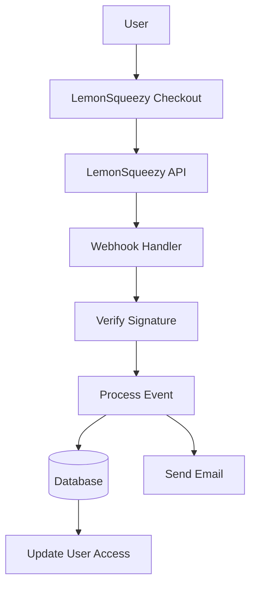

# Configuration LemonSqueezy

This guide explains how to configure LemonSqueezy as a payment provider in your Ever Works application.

## Overview

LemonSqueezy is a merchant of record platform that simplifies:

- 💰 Global payments with automatic tax compliance
- 🌍 Support for 135+ countries
- 📊 Built-in fraud prevention
- 🔄 Subscription management
- 💳 Multiple payment methods
- 📧 Automated email receipts

:::tip Why LemonSqueezy?
LemonSqueezy acts as a merchant of record, handling all tax compliance, VAT, and sales tax automatically. This means you don't need to register for tax in different countries.
:::

## Required Environment Variables

Add these variables to your `.env.local` file:

```env
# LemonSqueezy Configuration
LEMONSQUEEZY_API_KEY=your_api_key_here
LEMONSQUEEZY_WEBHOOK_SECRET=your_webhook_secret_here
LEMONSQUEEZY_STORE_ID=your_store_id_here

# Product/Variant IDs (optional)
NEXT_PUBLIC_LEMONSQUEEZY_PRO_VARIANT_ID=variant_id_here
NEXT_PUBLIC_LEMONSQUEEZY_SPONSOR_VARIANT_ID=variant_id_here
```

## LemonSqueezy Dashboard Setup

### Step 1: Create Your Store

1. Sign up at [LemonSqueezy](https://lemonsqueezy.com)
2. Create a new store
3. Complete your store settings (name, currency, etc.)
4. Copy your **Store ID** from the URL or settings

### Step 2: Create Products

1. Go to **Products** → **New Product**
2. Create your pricing tiers:

| Product | Price | Type | Description |
|---------|-------|------|-------------|
| **Pro Plan** | $10/month | Subscription | Advanced features |
| **Sponsor Plan** | $20 | One-time | Premium support |

3. For each product, create **Variants** with specific pricing
4. Copy the **Variant ID** for each pricing option

### Step 3: Get API Key

1. Go to **Settings** → **API**
2. Create a new API key
3. Copy the API key (starts with `ls_`)
4. Add it to your `.env.local` as `LEMONSQUEEZY_API_KEY`

### Step 4: Configure Webhooks

1. Go to **Settings** → **Webhooks**
2. Click **Create Webhook**
3. Configure the webhook:
   - **URL**: `https://yourdomain.com/api/lemonsqueezy/webhook`
   - **Events**: Select all subscription and order events
   - **Secret**: Generate a secret key

4. Copy the **Webhook Secret** and add it to your `.env.local`

#### Recommended Events

Select these events in your webhook configuration:

- ✅ `subscription_created` - New subscription
- ✅ `subscription_updated` - Subscription changes
- ✅ `subscription_cancelled` - Cancellation
- ✅ `subscription_payment_success` - Successful payment
- ✅ `subscription_payment_failed` - Failed payment
- ✅ `subscription_trial_will_end` - Trial ending
- ✅ `order_created` - One-time purchase
- ✅ `order_refunded` - Refund processed

## Webhook Endpoint

The webhook is available at: `/api/lemonsqueezy/webhook`

### Supported Events Mapping

| LemonSqueezy Event | Internal Event | Description |
|-------------------|----------------|-------------|
| `subscription_created` | `SUBSCRIPTION_CREATED` | New subscription created |
| `subscription_updated` | `SUBSCRIPTION_UPDATED` | Subscription updated |
| `subscription_cancelled` | `SUBSCRIPTION_CANCELLED` | Subscription cancelled |
| `subscription_payment_success` | `SUBSCRIPTION_PAYMENT_SUCCEEDED` | Payment succeeded |
| `subscription_payment_failed` | `SUBSCRIPTION_PAYMENT_FAILED` | Payment failed |
| `subscription_trial_will_end` | `SUBSCRIPTION_TRIAL_ENDING` | Trial ending soon |
| `order_created` | `PAYMENT_SUCCEEDED` | One-time payment |
| `order_refunded` | `REFUND_SUCCEEDED` | Refund processed |

## Implementation

### Payment System Architecture



### Features

#### Security

- ✅ HMAC signature verification (SHA-256)
- ✅ Webhook secret validation
- ✅ Comprehensive error handling
- ✅ Request logging

#### Functionality

- ✅ Subscription lifecycle management
- ✅ Automatic payment processing
- ✅ Email notifications
- ✅ Database synchronization
- ✅ Error monitoring

### Integration Services

The webhook integrates with:

- `WebhookSubscriptionService` - Subscription management
- `PaymentEmailService` - Email notifications
- Database queries - Data persistence
- Configuration management - Secure settings

## Usage Example

### Create a Checkout

```typescript
import { LemonSqueezyProvider } from '@/lib/payment/providers/lemonsqueezy-provider';

const lsProvider = new LemonSqueezyProvider({
  apiKey: process.env.LEMONSQUEEZY_API_KEY!,
  storeId: process.env.LEMONSQUEEZY_STORE_ID!,
});

// Create checkout session
const checkout = await lsProvider.createCheckout({
  variantId: 'variant_id_here',
  customerId: 'customer_id',
  redirectUrl: 'https://yoursite.com/success',
});

// Redirect user to checkout.url
```

### Handle Webhook Events

The webhook automatically handles events. You can customize behavior in:

- `app/api/lemonsqueezy/webhook/route.ts`

## Testing

### Test Mode

1. LemonSqueezy provides a test mode for development
2. Use test API keys (available in dashboard)
3. Test webhooks with LemonSqueezy's webhook testing tool

### Local Testing

```bash
# Use a tool like ngrok to expose your local server
ngrok http 3000

# Update webhook URL in LemonSqueezy dashboard
https://your-ngrok-url.ngrok.io/api/lemonsqueezy/webhook
```

## Monitoring

All webhook events are logged:

- ✅ **Success**: `✅ LemonSqueezy [event] handled successfully`
- ❌ **Errors**: `❌ Failed to handle [event]: [error details]`

Check your application logs for webhook activity.

## Troubleshooting

### Common Issues

**Issue**: "No signature provided" error

- **Solution**: Ensure LemonSqueezy is sending the `x-signature` header
- Check webhook configuration in LemonSqueezy dashboard

**Issue**: "Invalid signature" error

- **Solution**: Verify `LEMONSQUEEZY_WEBHOOK_SECRET` matches the secret in LemonSqueezy
- Ensure webhook URL is correctly configured

**Issue**: "Missing required LemonSqueezy configuration" error

- **Solution**: Check all required environment variables are set
- Verify variable names match exactly

**Issue**: Webhook not receiving events

- **Solution**: Verify webhook URL is publicly accessible
- Use ngrok for local testing
- Check LemonSqueezy webhook logs

### Debug Mode

Set `NODE_ENV=development` to enable test mode for LemonSqueezy operations.

## Security Best Practices

1. **HTTPS Only**: Always use HTTPS for webhook endpoints in production
2. **Secret Rotation**: Rotate webhook secrets regularly
3. **Monitoring**: Monitor webhook logs for suspicious activity
4. **Environment Variables**: Never commit secrets to version control
5. **Rate Limiting**: Implement rate limiting for production webhooks

## Email Notifications

The webhook automatically sends email notifications for:

- ✅ Payment success confirmations
- ✅ Subscription updates
- ✅ Trial ending reminders
- ❌ Payment failures (logged for monitoring)

## Comparison: LemonSqueezy vs Stripe

| Feature | LemonSqueezy | Stripe |
|---------|--------------|--------|
| **Tax Compliance** | Automatic (merchant of record) | Manual setup required |
| **Setup Complexity** | Simple | More complex |
| **Transaction Fees** | Higher (~5-7%) | Lower (~2.9% + 30¢) |
| **Global Support** | 135+ countries | 195+ countries |
| **Customization** | Limited | Extensive |
| **Best For** | Quick setup, global sales | High volume, custom flows |

## Dependencies

Required packages (already included in Ever Works):

```json
{
  "@lemonsqueezy/lemonsqueezy.js": "^3.0.0"
}
```

## Next Steps

- [Stripe Configuration](./stripe) - Alternative payment provider
- [Payment Overview](/payment) - Compare payment providers
- [Environment Variables](/deployment/environment-variables) - Complete environment setup
- [Deployment](/deployment/overview) - Deploy your payment integration

## Resources

- [LemonSqueezy Documentation](https://docs.lemonsqueezy.com/)
- [API Reference](https://docs.lemonsqueezy.com/api)
- [Webhook Guide](https://docs.lemonsqueezy.com/guides/developer-guide/webhooks)
- [Tax Compliance](https://docs.lemonsqueezy.com/help/getting-started/tax-compliance)

## Support

Need help with LemonSqueezy integration? Check our [support page](/advanced-guide/support) or join our community.