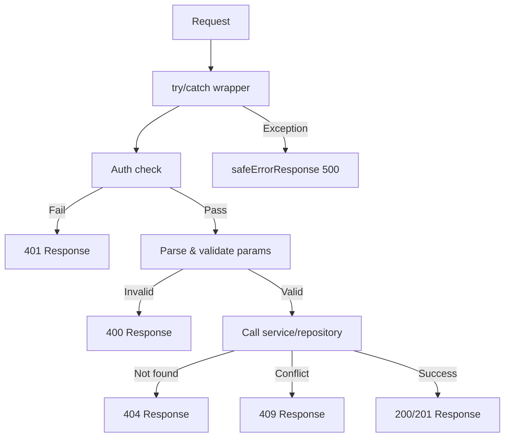

# דפוסי תגובה של API

כל מסלולי ה-API עוקבים אחר מוסכמות תגובה עקביות: סוגי איגודים מובחנים להצלחה/שגיאה, הודעות שגיאה מודעות לסביבה, קודי מצב HTTP סטנדרטיים ותיעוד Swagger/JSDoc. דף זה מכסה כל דפוס.

## מערכת סוג תגובה

### איחוד מופלה (`lib/api/types.ts`)

תגובות ממשק API משתמשות ב-`success` בוליאן כמאפיין:

```typescript
export type ApiResponse<T = unknown> =
  | { success: true; data: T; total?: number; page?: number; limit?: number; totalPages?: number }
  | { success: false; error: string };
```

זה מאפשר למתקשרים לצמצם את הסוג בבטחה:

```typescript
const response: ApiResponse<User[]> = await fetchUsers();
if (response.success) {
  // TypeScript knows: response.data is User[]
  console.log(response.data);
} else {
  // TypeScript knows: response.error is string
  console.error(response.error);
}
```

### תגובה מדורגת

נקודות קצה של רשימה משתמשות במעטפת מעומדת ייעודית:

```typescript
export type PaginatedResponse<T> =
  | {
      success: true;
      data: T[];
      meta: {
        page: number;
        totalPages: number;
        total: number;
        limit: number;
      };
    }
  | { success: false; error: string };
```

### סוגי שגיאות

```typescript
export interface ApiError {
  message: string;
  status?: number;
  code?: string;
}

export interface ErrorResponse {
  success: false;
  error: string;
}
```

## צורות תגובה סטנדרטיות

### תגובות הצלחה

#### משאב יחיד

```typescript
return NextResponse.json({
  success: true,
  item,
  message: "Item created successfully",
}, { status: 201 });
```

#### רשימה עם עימוד

```typescript
return NextResponse.json({
  success: true,
  items: result.items,
  total: result.total,
  page: result.page,
  limit: result.limit,
  totalPages: result.totalPages,
});
```

#### אישור פעולה

```typescript
return NextResponse.json({
  success: true,
  message: "Profile updated successfully",
});
```

### תגובות שגיאה

כל תגובות השגיאה כוללות `success: false` ומחרוזת `error`:

```typescript
// Unauthorized
return NextResponse.json(
  { success: false, error: "Unauthorized. Admin access required." },
  { status: 401 }
);

// Validation error
return NextResponse.json(
  { success: false, error: "Invalid page parameter. Must be a positive integer." },
  { status: 400 }
);

// Conflict
return NextResponse.json(
  { success: false, error: `Item with slug '${slug}' already exists` },
  { status: 409 }
);
```

## מוסכמות קוד מצב HTTP

|סטטוס|שימוש|דוגמה|
|--------|-------|---------|
| `200` |GET, PUT, PATCH, DELETE הצליחו|רשימת פריטים, עדכן פרופיל|
| `201` |POST מוצלח (נוצר משאב)|צור פריט, צור הערה|
| `400` |פרמטרים או גוף לא חוקיים|עימוד גרוע, חסרים שדות חובה|
| `401` |נדרש אימות או נכשל|הפעלה חסרה, משתמש שאינו מנהל|
| `404` |משאב לא נמצא|פריט לא נמצא, פרופיל לא נמצא|
| `409` |קונפליקט (משאב כפול)|כפול מזהה פריט או שבלול|
| `413` |גוף הבקשה גדול מדי|הגוף חורג מהמקסימום `readBodyWithLimit`|
| `500` |שגיאת שרת פנימית|חריגים שלא טופלו|

## תגובת שגיאה בטוחה (`lib/utils/api-error.ts`)

### `safeErrorResponse`

מונע דליפת מידע על ידי הצגת מסרים כלליים בייצור והודעות מפורטות בפיתוח:

```typescript
export function safeErrorResponse(
  error: unknown,
  fallbackMessage: string,
  status: number = 500
): NextResponse {
  const detail = error instanceof Error ? error.message : String(error);

  // Always log full details server-side
  console.error(`[API Error] ${fallbackMessage}:`, detail);

  const message = process.env.NODE_ENV === "development" ? detail : fallbackMessage;

  return NextResponse.json({ success: false, error: message }, { status });
}
```

שימוש במטפלי מסלול:

```typescript
export async function GET(request: NextRequest) {
  try {
    // ... handler logic
  } catch (error) {
    return safeErrorResponse(error, 'Failed to fetch items');
  }
}
```

### `safeErrorMessage`

מחלץ מחרוזת הודעה בטוחה מבלי ליצור `NextResponse`:

```typescript
export function safeErrorMessage(error: unknown, fallbackMessage: string): string {
  if (process.env.NODE_ENV === "development") {
    return error instanceof Error ? error.message : String(error);
  }
  return fallbackMessage;
}
```

### התנהגות סביבתית

|סביבה|פלט שגיאה|יומן שרת|
|-------------|-------------|------------|
|פיתוח|`error.message` (פירוט מלא)|השגיאה המלאה נרשמה|
|הפקה|`fallbackMessage` (גנרי)|השגיאה המלאה נרשמה|

## מבנה מטפל במסלול

כל המטפלים בנתיבי API עוקבים אחר מבנה עקבי:



### דוגמה קנונית GET Handler

```typescript
export async function GET(request: NextRequest) {
  try {
    // 1. Auth check
    const session = await auth();
    if (!session?.user?.isAdmin) {
      return NextResponse.json(
        { success: false, error: "Unauthorized. Admin access required." },
        { status: 401 }
      );
    }

    // 2. Parse and validate parameters
    const { searchParams } = new URL(request.url);
    const paginationResult = validatePaginationParams(searchParams);
    if ('error' in paginationResult) {
      return NextResponse.json(
        { success: false, error: paginationResult.error },
        { status: paginationResult.status }
      );
    }

    // 3. Call service layer
    const result = await repository.findAll(paginationResult);

    // 4. Return structured response
    return NextResponse.json({
      success: true,
      items: result.items,
      total: result.total,
      page: result.page,
      limit: result.limit,
      totalPages: result.totalPages,
    });

  } catch (error) {
    return safeErrorResponse(error, 'Failed to fetch items');
  }
}
```

### דוגמה קנונית POST Handler

```typescript
export async function POST(request: NextRequest) {
  try {
    // 1. Auth check
    const session = await auth();
    if (!session?.user?.isAdmin) {
      return NextResponse.json(
        { success: false, error: "Unauthorized." },
        { status: 401 }
      );
    }

    // 2. Parse and validate body
    const body = await request.json();
    if (!body.name || !body.description) {
      return NextResponse.json(
        { success: false, error: "Name and description are required" },
        { status: 400 }
      );
    }

    // 3. Check for conflicts
    const existing = await repository.findBySlug(body.slug);
    if (existing) {
      return NextResponse.json(
        { success: false, error: `Resource with slug '${body.slug}' already exists` },
        { status: 409 }
      );
    }

    // 4. Create resource
    const item = await repository.create(body);

    // 5. Return created resource
    return NextResponse.json({
      success: true,
      item,
      message: "Created successfully",
    }, { status: 201 });

  } catch (error) {
    return safeErrorResponse(error, 'Failed to create resource');
  }
}
```

## תיעוד Swagger / JSDoc

מסלולי API מתועדים עם הערות Swagger מוטבעות עבור תיעוד API שנוצר אוטומטית:

```typescript
/**
 * @swagger
 * /api/admin/items:
 *   get:
 *     tags: ["Admin - Items"]
 *     summary: "Get paginated items list"
 *     security:
 *       - sessionAuth: []
 *     parameters:
 *       - name: "page"
 *         in: "query"
 *         schema:
 *           type: integer
 *           minimum: 1
 *           default: 1
 *     responses:
 *       200:
 *         description: "Items list retrieved successfully"
 *       400:
 *         description: "Bad request"
 *       401:
 *         description: "Unauthorized"
 *       500:
 *         description: "Internal server error"
 */
```

## סוגי API בצד הלקוח

אפשרויות התצורה והאחזור של לקוח ה-API:

```typescript
export interface ApiClientConfig extends Partial<AxiosRequestConfig> {
  baseURL?: string;
  timeout?: number;
  headers?: Record<string, string>;
  accessToken?: string;
  frontendUrl?: string;
}

export interface FetchOptions {
  method?: 'GET' | 'POST' | 'PUT' | 'PATCH' | 'DELETE';
  headers?: Record<string, string>;
  body?: unknown;
  params?: Record<string, string | number | boolean | undefined>;
}
```

## סיכום האמנות

|אמנה|תיאור|
|------------|-------------|
|כל התגובות כוללות `success`|איגוד מופלה לבטיחות סוג|
|שגיאות משתמשות ב-`{ success: false, error: string }`|צורת שגיאה עקבית|
|`safeErrorResponse` עוטף בלוקי תופס|מיסוך שגיאה מודע לסביבה|
|עימוד משתמש ב-@@TOK000@@@, `page`, `limit`, `totalPages`|מטא נתונים עקביים|
|בדיקת אישור היא הפעולה הראשונה|דפוס מהיר כשל|
|אימות חוזר מוקדם עם כישלון|אין תנאים מקוננים|
|הערות ספוגיות בכל מסלולי הניהול|מסמכי API שנוצרו באופן אוטומטי|
