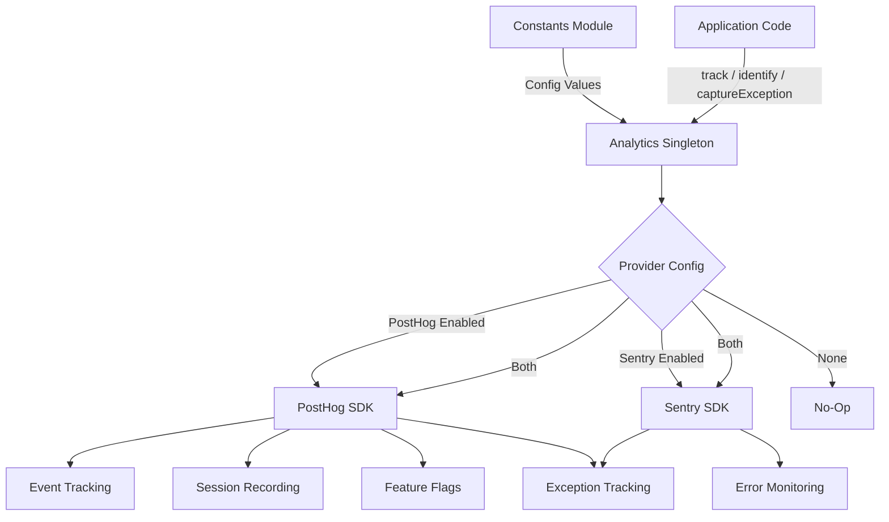
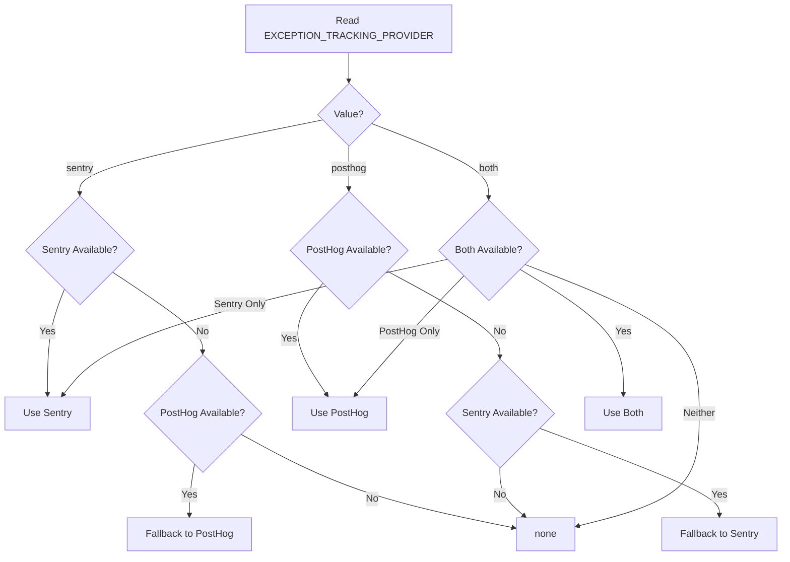

# מודול אנליטיקס

מודול הניתוח (`template/lib/analytics/`) מספק מחלקה יחידה מאוחדת למעקב אחר אירועים בצד הלקוח, זיהוי משתמש, הערכת דגל תכונה ולכידת חריגים. הוא משלב את **PostHog** לניתוח מוצר ו-**Sentry** לניטור שגיאות, עם תמיכה בשימוש בכל אחד מהספקים בנפרד, שניהם בו זמנית, או אף אחד מהם.

## סקירה כללית של אדריכלות



## קבצי מקור

|קובץ|תיאור|
|------|-------------|
|`lib/analytics/index.ts`|`Analytics` כיתת יחיד ו-`analytics` ייצוא|

## כיתת ליבה: `Analytics`

הכיתה `Analytics` היא יחידה שעוטפת את PostHog ו- Sentry. זה בטוח להתקשר בצד השרת -- כל השיטות חוזרות בשקט כאשר `window` אינו מוגדר.

### סוג הגדרות

```typescript
type EventProperties = Properties;          // PostHog Properties type
type UserProperties = Record<string, any>;
type ExceptionTrackingProvider = 'sentry' | 'posthog' | 'both' | 'none';
```

### סינגלטון גישה

```typescript
// Get the singleton instance
const analytics = Analytics.getInstance();

// Or use the pre-created export
import { analytics } from '@/lib/analytics';
```

### `init(): void`

מאתחל את PostHog עם תצורה מרכזית ומגדיר מעקב חריגים. יש לקרוא פעם אחת בצד הלקוח (בדרך כלל בפריסת בסיס או ברכיב ספק).

```typescript
// In your root layout or PostHog provider
'use client';
import { analytics } from '@/lib/analytics';

useEffect(() => {
  analytics.init();
}, []);
```

**התנהגות:**
- מדלג על אתחול אם כבר אתחול או אם פועל בצד השרת
- קורא תצורה מקבועים (`POSTHOG_KEY`, `POSTHOG_HOST`, `POSTHOG_ENABLED` וכו')
- מגדיר הקלטת הפעלה עם מיסוך כאשר `POSTHOG_SESSION_RECORDING_ENABLED` נכון
- מחיל קצב דגימה (`POSTHOG_SAMPLE_RATE`) -- בברירות המחדל של ייצור ל-10%
- מגדיר מטפלים גלובליים של `window.onerror` ו-`unhandledrejection` כאשר מעקב חריגים של PostHog מופעל
- קישור PostHog עם Sentry כאשר שני הספקים פעילים

### `identify(userId: string, properties?: UserProperties): void`

משייך את המשתמש האנונימי הנוכחי למזהה משתמש מזוהה. מגדיר גם את הקשר משתמש Sentry כאשר Sentry מופעל.

```typescript
analytics.identify(session.user.id, {
  email: session.user.email,
  plan: 'premium',
});
```

### `reset(): void`

מאפס את זהות המשתמש הנוכחית (למשל, ביציאה). מנקה את ההקשרים של המשתמש PostHog וגם Sentry.

```typescript
analytics.reset();
```

### `track(eventName: string, properties?: EventProperties): void`

לוכד אירוע מותאם אישית ב-PostHog.

```typescript
analytics.track('item_submitted', {
  itemId: 'abc-123',
  category: 'SaaS Tools',
});
```

### `trackPageView(url: string, properties?: EventProperties): void`

לוכד באופן ידני אירוע תצוגת עמוד. השתמש כאשר `POSTHOG_AUTO_CAPTURE` מושבת ואתה זקוק למעקב מפורש של תצוגות דף.

```typescript
analytics.trackPageView(window.location.href, {
  referrer: document.referrer,
});
```

### `isFeatureEnabled(flagKey: string, defaultValue?: boolean): boolean`

מעריך דגל תכונה PostHog באופן סינכרוני.

```typescript
const showNewUI = analytics.isFeatureEnabled('new-dashboard-ui', false);
```

### `reloadFeatureFlags(): Promise<void>`

מאלץ שליפה מחדש של דגלי תכונה משרת PostHog.

```typescript
await analytics.reloadFeatureFlags();
```

### `captureException(error: Error | string, context?: Record<string, any>): void`

מעקב חריג מאוחד שנשלח לספק(ים) המוגדרים.

```typescript
try {
  await riskyOperation();
} catch (error) {
  analytics.captureException(error, {
    component: 'PaymentForm',
    action: 'submit',
  });
}
```

**ניתוב ספק:**
- `'posthog'` -- שולח `$exception` אירוע ל-PostHog עם מעקב מחסנית
- `'sentry'` -- שיחות `Sentry.captureException` עם הקשר נוסף
- `'both'` -- נשלח לשני הספקים
- `'none'` -- משליך בשקט

### `captureError(error: Error, context?: Record<string, any>): void`

**הוצא משימוש.** כינוי עבור `captureException`. רושם אזהרת הוצאה משימוש.

### `getExceptionTrackingProvider(): ExceptionTrackingProvider`

מחזיר את ספק מעקב החריגים הפעיל כעת.

### `setUserProperties(properties: UserProperties): void`

מגדיר מאפייני משתמש קבועים בפרופיל האדם של PostHog באמצעות `posthog.people.set()`.

```typescript
analytics.setUserProperties({
  subscription_tier: 'premium',
  company: 'Acme Corp',
});
```

### `setSuperProperties(properties: Record<string, any>): void`

רושם נכסי על שנשלחים עם כל אירוע עוקב דרך `posthog.register()`.

```typescript
analytics.setSuperProperties({
  app_version: '2.1.0',
  environment: 'production',
});
```

## קבועי תצורה

כל תצורת הניתוח מונעת על ידי קבועים מ-`lib/constants.ts`:

|קבוע|ברירת מחדל|תיאור|
|----------|---------|-------------|
|`POSTHOG_KEY`|env var|מפתח API של פרויקט PostHog|
|`POSTHOG_HOST`|env var|כתובת האתר המארח של PostHog API|
|`POSTHOG_ENABLED`|נגזרת|נכון כאשר הן מפתח והן מארח מוגדרים|
|`POSTHOG_DEBUG`|env var|אפשר רישום באגים PostHog|
|`POSTHOG_SESSION_RECORDING_ENABLED`|`'true'`|אפשר הקלטת הפעלה|
|`POSTHOG_AUTO_CAPTURE`|`'false'`|לכידה אוטומטית של תצוגות עמוד|
|`POSTHOG_SAMPLE_RATE`|`0.1` (פרוד) / `1.0` (פיתוח)|קצב דגימת אירועים|
|`POSTHOG_SESSION_RECORDING_SAMPLE_RATE`|`0.1` (פרוד) / `1.0` (פיתוח)|קצב דגימת הקלטה|
|`EXCEPTION_TRACKING_PROVIDER`|`'both'`|איזה ספק מטפל בחריגים|
|`SENTRY_ENABLED`|נגזרת|נכון כאשר DSN מוגדר ו-env מאפשר|

## פתרון ספק מעקב חריג

הספק נקבע בזמן הבנייה עם היגיון חוזר:



## שימוש עם Next.js

אינטגרציה אופיינית בפרויקט Next.js App Router:

```tsx
// app/providers.tsx
'use client';
import { useEffect } from 'react';
import { analytics } from '@/lib/analytics';
import { useSession } from 'next-auth/react';
import { usePathname } from 'next/navigation';

export function AnalyticsProvider({ children }: { children: React.ReactNode }) {
  const { data: session } = useSession();
  const pathname = usePathname();

  useEffect(() => {
    analytics.init();
  }, []);

  useEffect(() => {
    if (session?.user?.id) {
      analytics.identify(session.user.id, {
        email: session.user.email,
      });
    }
  }, [session]);

  useEffect(() => {
    analytics.trackPageView(pathname);
  }, [pathname]);

  return <>{children}</>;
}
```
