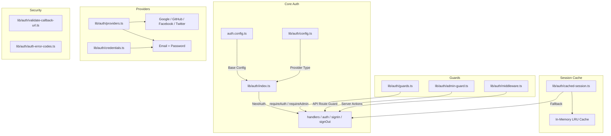
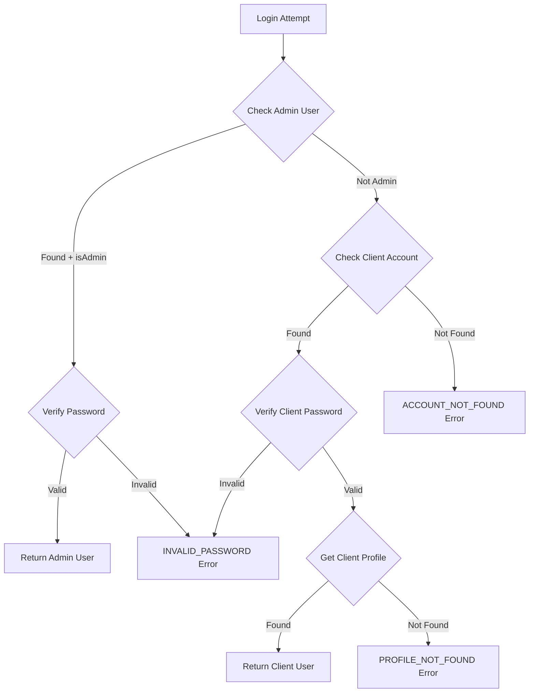

# מודול Auth Utilities

מודול עזרי האימות (`template/lib/auth/`) מספק שכבת אימות מקיפה הבנויה על NextAuth.js (Auth.js) עם תמיכה במספר ספקים, שמירה במטמון של הפעלה, מאבטחים בצד השרת, פעולות שרת מאומתות ו-Supabase כחלק אחורי של אימות חלופי.

## סקירה כללית של אדריכלות



## קבצי מקור

|קובץ|תיאור|
|------|-------------|
|`lib/auth/index.ts`|תצורת NextAuth.js עם מתאם טפטוף|
|`lib/auth/config.ts`|תצורת סוג ספק הסמכה|
|`lib/auth/credentials.ts`|ספק אישורי דוא"ל/סיסמה|
|`lib/auth/providers.ts`|מפעל ספק OAuth|
|`lib/auth/guards.ts`|שומרי דפים בצד השרת|
|`lib/auth/admin-guard.ts`|שומר ניהול נתיב API|
|`lib/auth/middleware.ts`|תוכנת תווך של פעולת שרת מאומתת|
|`lib/auth/cached-session.ts`|שכבת מטמון הפעלה|
|`lib/auth/session-cache.ts`|יישום מטמון|
|`lib/auth/validate-callback-url.ts`|אימות כתובת אתר להפניה מחדש|
|`lib/auth/auth-error-codes.ts`|Enum קוד שגיאה|
|`lib/auth/supabase/`|לקוח/שרת/תוכנת אמצעי אימות Supabase|

## תצורת NextAuth.js (`index.ts`)

הייצוא הראשי מספק את ממשק NextAuth.js הסטנדרטי:

```typescript
import { auth, signIn, signOut, handlers, unstable_update } from '@/lib/auth';
```

### אסטרטגיית מושב

- **אסטרטגיה:** JWT (לא הפעלות של מסד נתונים)
- **גיל מקסימלי:** 30 ימים
- **גיל עדכון:** 24 שעות (מרווח רענון הפעלה)

### JWT Callback

ה-callback של JWT מעשיר אסימונים ב:
- `userId` -- מאובייקט משתמש או אסימון `sub`
- `clientProfileId` -- נוצר אוטומטית עבור משתמשי OAuth בכניסה ראשונה
- `isAdmin` -- נקבע מ-`isClient`/`isAdmin` דגלים או ברירת מחדל ל-`false`
- `provider` -- שם ספק האימות

### התקשרות חוזרת

ה-callback של הפגישה ממפה שדות JWT לאובייקט הפגישה:
- `session.user.id`
- `session.user.clientProfileId`
- `session.user.provider`
- `session.user.isAdmin`

### דפים מותאמים אישית

```typescript
pages: {
  signIn: '/auth/signin',
  signOut: '/auth/signout',
  error: '/auth/error',
  verifyRequest: '/auth/verify-request',
  newUser: '/auth/register',
}
```

### אירועים

- **יציאה** - מבטל את תוקף מטמון ההפעלה עבור המשתמש
- **updateUser** - מבטל את תוקף מטמון ההפעלה כאשר נתוני המשתמש משתנים

## תצורת אישור (`config.ts`)

### `AuthProviderType`

```typescript
type AuthProviderType = 'supabase' | 'next-auth' | 'both';
```

### `AuthConfig`

```typescript
interface AuthConfig {
  provider: AuthProviderType;
  supabase?: {
    url: string;
    anonKey: string;
    redirectUrl?: string;
  };
  nextAuth?: {
    enableCredentials?: boolean;
    enableOAuth?: boolean;
    providers?: any[];
  };
}
```

### `getAuthConfig(): AuthConfig`

פותר תצורה עם עדיפות זו:
1. עקיפה גלובלית באמצעות `configureAuth()`
2. זיהוי מבוסס סביבה (נוכחות כתובת URL/מפתח של Supabase)
3. ברירת מחדל: `next-auth` עם אישורים ו-OAuth מופעלים

## ספק אישורים (`credentials.ts`)

### פונקציות סיסמא

```typescript
async function hashPassword(password: string): Promise<string>;
// Uses bcryptjs with 10 salt rounds, loaded via dynamic import

async function comparePasswords(plainText: string, hashed: string | null): Promise<boolean>;
// Returns false if hashed is null
```

### זרימת אימות



### `AuthProviders` Enum

```typescript
enum AuthProviders {
  CREDENTIALS = 'credentials',
  GOOGLE = 'google',
  FACEBOOK = 'facebook',
  GITHUB = 'github',
  TWITTER = 'twitter',
  X = 'x',
  MICROSOFT = 'microsoft',
}
```

## ספקי OAuth (`providers.ts`)

### `createNextAuthProviders(config?): Provider[]`

יוצר באופן דינמי מופעים של ספקי NextAuth בהתבסס על תצורה:

```typescript
import { createNextAuthProviders } from '@/lib/auth/providers';

const providers = createNextAuthProviders({
  google: { enabled: true, clientId: '...', clientSecret: '...' },
  github: { enabled: true, clientId: '...', clientSecret: '...' },
  credentials: { enabled: true },
});
```

ספקים נתמכים: **Google**, **GitHub**, **Facebook**, **Twitter**, **אישורים**.

## שומרי צד שרת (`guards.ts`)

### `requireAuth(): Promise<Session>`

דורש אימות. מפנה אל `/auth/signin` אם לא מאומת.

```typescript
export default async function ProtectedPage() {
  const session = await requireAuth();
  return <div>Welcome {session.user.email}</div>;
}
```

### `requireAdmin(): Promise<Session>`

דורש תפקיד מנהל. מפנה אל `/admin/auth/signin` אם לא מאומת, `/unauthorized` אם לא מנהל.

```typescript
export default async function AdminPage() {
  const session = await requireAdmin();
  return <div>Admin Dashboard</div>;
}
```

### `getSession(): Promise<Session | null>`

מקבל את ההפעלה הנוכחית מבלי להפנות מחדש. מחזירה `null` עבור משתמשים לא מאומתים.

### `checkIsAdmin(): Promise<boolean>`

בודק את סטטוס המנהל מבלי להפנות מחדש.

## API Route Guard (`admin-guard.ts`)

### `checkAdminAuth(): Promise<NextResponse | null>`

מחזירה `null` אם מורשה, או שגיאה `NextResponse` (401/403/500) אם לא:

```typescript
export async function GET() {
  const authError = await checkAdminAuth();
  if (authError) return authError;
  // ... handle authorized request
}
```

### `withAdminAuth(handler): handler`

פונקציה מסדר גבוה העוטפת מטפלים בנתיבי API:

```typescript
import { withAdminAuth } from '@/lib/auth/admin-guard';

export const GET = withAdminAuth(async (request) => {
  // Only reached if user is authenticated admin
  return NextResponse.json({ data: await getAdminData() });
});
```

## פעולות שרת מאומתות (`middleware.ts`)

### `validatedAction(schema, action)`

עוטף פעולת שרת עם אימות Zod:

```typescript
import { validatedAction } from '@/lib/auth/middleware';
import { z } from 'zod';

const schema = z.object({ name: z.string().min(1), email: z.string().email() });

export const updateProfile = validatedAction(schema, async (data, formData) => {
  await db.update(users).set(data);
  return { success: 'Profile updated' };
});
```

### `validatedActionWithUser(schema, action)`

זהה לעיל אבל גם מאמת את האימות ומחדיר למשתמש:

```typescript
export const submitItem = validatedActionWithUser(schema, async (data, formData, user) => {
  await db.insert(items).values({ ...data, userId: user.id });
  return { success: 'Item submitted' };
});
```

### `ActionState` סוג

```typescript
type ActionState = {
  error?: string;
  success?: string;
  redirect?: string;
  [key: string]: any;
};
```

## מטמון הפעלה (`cached-session.ts`)

מפחית את תקרת האימות על ידי שמירת הפעלות מפוענחות במטמון בזיכרון.

### `getCachedSession(request?): Promise<Session | null>`

```typescript
import { getCachedSession } from '@/lib/auth/cached-session';

// In server components
const session = await getCachedSession();

// In API routes (pass request for token extraction)
const session = await getCachedSession(request);
```

### `invalidateSessionCache(token?, userId?): Promise<void>`

מבטל את תוקף הפעלות בקובץ שמור לפי אסימון או מזהה משתמש.

### `clearSessionCache(): void`

מנקה את כל ההפעלות המאוחסנות במטמון (עבור פריסות או עדכונים קריטיים).

### חילוץ אסימונים

אסימונים נשלפים מבקשות לפי הסדר הזה:
1. `next-auth.session-token` או `__Secure-next-auth.session-token` cookie
2. כותרת `Authorization: Bearer <token>`
3. `X-Session-Token` כותרת מותאמת אישית

## קודי שגיאה (`auth-error-codes.ts`)

```typescript
enum AuthErrorCode {
  ACCOUNT_NOT_FOUND = 'ACCOUNT_NOT_FOUND',
  INVALID_PASSWORD = 'INVALID_PASSWORD',
  PROFILE_NOT_FOUND = 'PROFILE_NOT_FOUND',
  GENERIC_ERROR = 'GENERIC_ERROR',
  RATE_LIMITED = 'RATE_LIMITED',
  USE_OAUTH_PROVIDER = 'USE_OAUTH_PROVIDER',
  SESSION_REFRESH_FAILED = 'SESSION_REFRESH_FAILED',
  PAGE_REFRESH_FAILED = 'PAGE_REFRESH_FAILED',
}
```

## אימות כתובת אתר להתקשרות חוזרת (`validate-callback-url.ts`)

### `isValidCallbackUrl(url: string | null): boolean`

מונע פגיעויות הפניה פתוחות:

```typescript
isValidCallbackUrl('/admin/items')       // true
isValidCallbackUrl('/client/dashboard')  // true
isValidCallbackUrl('https://evil.com')   // false
isValidCallbackUrl('//evil.com')         // false
```

### `getSafeRedirectPath(callbackUrl, fallbackPath): string`

מחזירה את כתובת האתר להתקשרות חוזרת אם היא חוקית, אחרת את נתיב החזרה.

### `createSafeCallbackUrl(pathname, search?): string`

יוצר כתובת URL להתקשרות חזרה מוגבלת ל-2048 תווים כדי למנוע זיהום פרמטרים.
