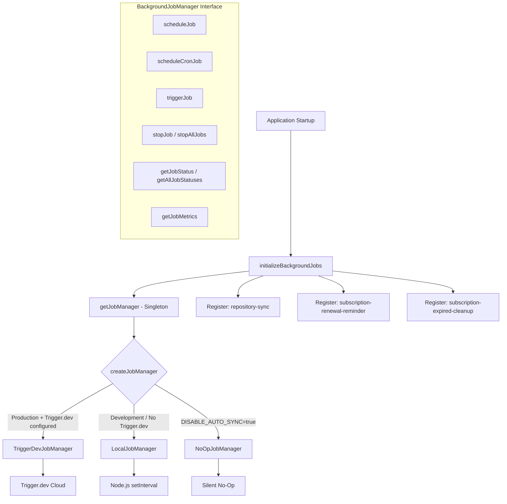
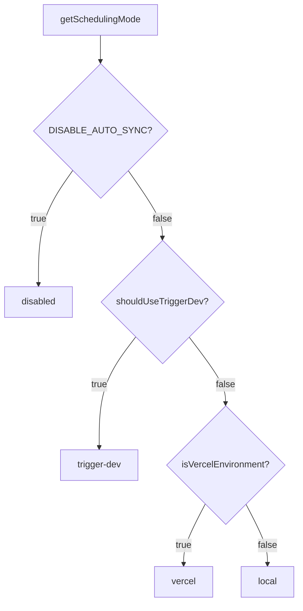

# מודול משרות רקע

מודול משרות הרקע (`template/lib/background-jobs/`) מספק שכבת הפשטה לתזמון וביצוע משימות חוזרות. הוא תומך בשלוש אסטרטגיות זמן ריצה -- **Trigger.dev** לייצור, **מקומי `setInterval`** לפיתוח, ומצב **ללא הפעלה** להשבית לחלוטין משימות -- נבחר אוטומטית על סמך תצורת הסביבה.

## סקירה כללית של אדריכלות



## קבצי מקור

|קובץ|תיאור|
|------|-------------|
|`lib/background-jobs/types.ts`|הגדרות ממשק וסוג|
|`lib/background-jobs/config.ts`|זיהוי מצב תזמון והגדרות Trigger.dev|
|`lib/background-jobs/job-factory.ts`|תפקוד מפעל ומנהל יחיד|
|`lib/background-jobs/local-job-manager.ts`|`LocalJobManager` יישום|
|`lib/background-jobs/trigger-dev-job-manager.ts`|`TriggerDevJobManager` יישום|
|`lib/background-jobs/noop-job-manager.ts`|`NoOpJobManager` יישום|
|`lib/background-jobs/initialize-jobs.ts`|רישום עבודה בהפעלת אפליקציה|
|`lib/background-jobs/index.ts`|יצוא חבית|

## סוג הגדרות

### `BackgroundJobManager` ממשק

```typescript
interface BackgroundJobManager {
  scheduleJob(id: string, name: string, job: () => void | Promise<void>, interval: number): void;
  scheduleCronJob(id: string, name: string, job: () => void | Promise<void>, cronExpression: string): void;
  triggerJob(id: string): Promise<void>;
  stopJob(id: string): void;
  stopAllJobs(): void;
  getJobStatus(id: string): JobStatus | undefined;
  getAllJobStatuses(): JobStatus[];
  getJobMetrics(): JobMetrics;
}
```

### `JobStatus`

```typescript
type JobStatusType = 'running' | 'completed' | 'failed' | 'scheduled' | 'stopped';

interface JobStatus {
  id: string;
  name: string;
  status: JobStatusType;
  lastRun: Date | null;
  nextRun: Date | null;
  duration: number;     // Last execution duration in ms
  error?: string;       // Error message if status is 'failed'
}
```

### `JobMetrics`

```typescript
interface JobMetrics {
  totalExecutions: number;       // Total invocations (not unique jobs)
  successfulJobs: number;
  failedJobs: number;
  averageJobDuration: number;    // Rolling average in ms
  lastCleanup: Date;
}
```

### `TriggerDevConfig`

```typescript
interface TriggerDevConfig {
  enabled: boolean;
  apiKey?: string;
  apiUrl?: string;
  environment: string;
  isFullyConfigured: boolean;
  isPartiallyConfigured: boolean;
}
```

### `SchedulingMode`

```typescript
type SchedulingMode = 'trigger-dev' | 'vercel' | 'local' | 'disabled';
```

## פונקציות תצורה

### `getTriggerDevConfig(): TriggerDevConfig`

קורא את הגדרות Trigger.dev מ-ConfigService.

### `shouldUseTriggerDev(): boolean`

מחזירה `true` כאשר Trigger.dev מוגדר במלואו, מופעל והסביבה נמצאת בייצור.

### `getSchedulingMode(): SchedulingMode`

קובע איזו מערכת תזמון צריכה להיות פעילה באמצעות עדיפות זו:



## מפעל וסינגלטון

### `createJobManager(): BackgroundJobManager`

יוצר את מנהל העבודה המתאים בהתבסס על הסביבה:

```typescript
import { createJobManager } from '@/lib/background-jobs';

const manager = createJobManager();
// Returns: TriggerDevJobManager | LocalJobManager | NoOpJobManager
```

### `getJobManager(): BackgroundJobManager`

מחזיר את מופע הסינגלטון, יוצר אותו בשיחה הראשונה:

```typescript
import { getJobManager } from '@/lib/background-jobs';

const manager = getJobManager();
manager.scheduleJob('my-job', 'My Job', async () => {
  await doWork();
}, 60_000);
```

### `resetJobManager(): void`

מפסיק את כל העבודות והורס את הסינגלטון (שימושי לבדיקה):

```typescript
import { resetJobManager } from '@/lib/background-jobs';
resetJobManager();
```

## LocalJobManager

משתמש ב-Node.js `setInterval` עבור סביבות פיתוח וסביבות ניצול.

**התנהגויות מפתח:**
- דילוג על ביצוע כאשר עבודה כבר פועלת (מונע חפיפה)
- עוקב אחר מדדים עם משך ממוצע מתגלגל
- ממירה ביטויי cron למרווחים באמצעות מיפוי פשוט
- מפחית את רישום המסוף במצב פיתוח

### מיפוי Cron-to-Interval

|דפוס קרון|מרווח|
|-------------|----------|
| `*/30 * * * * *` |30 שניות|
| `*/2 * * * *` |2 דקות|
| `*/5 * * * *` |5 דקות|
| `*/15 * * * *` |15 דקות|
| `0 * * * *` |שעה אחת|
| `0 9 * * *` |24 שעות|
|ברירת מחדל|דקה אחת|

## TriggerDevJobManager

רושם לוחות זמנים עם `@trigger.dev/sdk` v4 לוחות זמנים API. האם **לא** מפעיל טיימרים מקומיים -- הביצוע מטופל על ידי תהליך העבודה Trigger.dev.

**התנהגויות מפתח:**
- עומס בעצלתיים `@trigger.dev/sdk` באמצעות ייבוא דינמי
- ממיר לוחות זמנים מבוססי מרווחים לביטויי cron
- עוקב אחר מדדים מקומיים כאשר משימות פועלות בהקשר של עובד
- `stopJob` / `stopAllJobs` רק מצב מקומי ברור (לוחות זמנים מרוחקים מנוהלים על ידי Trigger.dev)

## NoOpJobManager

כל הפעולות הן ללא פעולות בשקט. משמש כאשר `DISABLE_AUTO_SYNC=true` בפיתוח.

## רישום עבודה

הפונקציה `initializeBackgroundJobs()` רושמת את כל משרות היישום בעת ההפעלה:

```typescript
import { initializeBackgroundJobs } from '@/lib/background-jobs/initialize-jobs';

// Called once during app initialization
await initializeBackgroundJobs();
```

### משרות רשומות

|מזהה משרה|לוח זמנים|תיאור|
|--------|----------|-------------|
|`repository-sync`|כל 5 דקות|מסנכרן תוכן CMS מבוסס Git באמצעות `syncManager.performSync()`|
|`subscription-renewal-reminder`|מדי יום בשעה 9:00 בבוקר|שולח תזכורות לחידוש עבור מנויים שיפוג בעוד 7 ימים|
|`subscription-expired-cleanup`|מדי יום בחצות|מעבד ויפוג מינויים לאחר תאריך הסיום שלהם|

**חשוב:** כל החזרות לעבודות משתמשות בייבוא דינמי כדי למנוע מ-webpack לאגד מודולים ספציפיים ל-Node.js בזמן הבנייה:

```typescript
manager.scheduleJob('repository-sync', 'Repository Synchronization', async () => {
  // Dynamic import prevents webpack bundling of isomorphic-git chain
  const { syncManager } = await import('@/lib/services/sync-service');
  await syncManager.performSync();
}, 5 * 60 * 1000);
```

## דוגמאות לשימוש

### תזמון משרה מותאמת אישית

```typescript
import { getJobManager } from '@/lib/background-jobs';

const manager = getJobManager();

// Interval-based (every 10 minutes)
manager.scheduleJob('cleanup-temp', 'Temp File Cleanup', async () => {
  await cleanupTempFiles();
}, 10 * 60 * 1000);

// Cron-based (every hour)
manager.scheduleCronJob('hourly-report', 'Hourly Report', async () => {
  await generateReport();
}, '0 * * * *');
```

### עבודות ניטור

```typescript
const manager = getJobManager();

// Check specific job
const status = manager.getJobStatus('repository-sync');
console.log(status?.status, status?.lastRun, status?.duration);

// List all jobs
const allStatuses = manager.getAllJobStatuses();

// Get aggregate metrics
const metrics = manager.getJobMetrics();
console.log(`Total: ${metrics.totalExecutions}, Failed: ${metrics.failedJobs}`);
```

### טריגר ידני

```typescript
const manager = getJobManager();
await manager.triggerJob('repository-sync');
```
