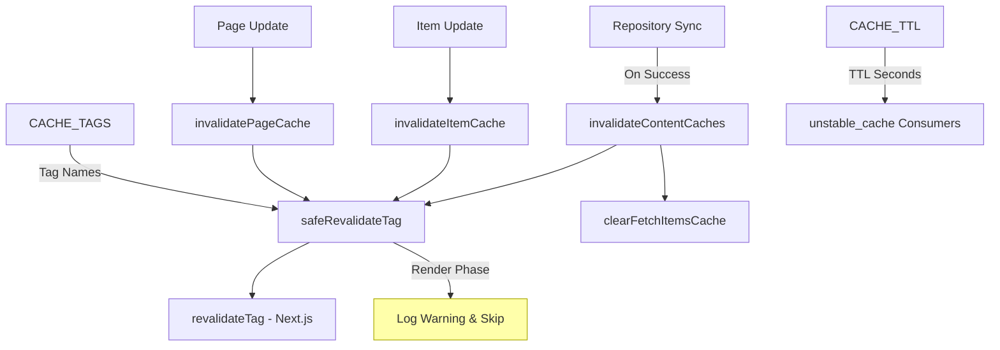
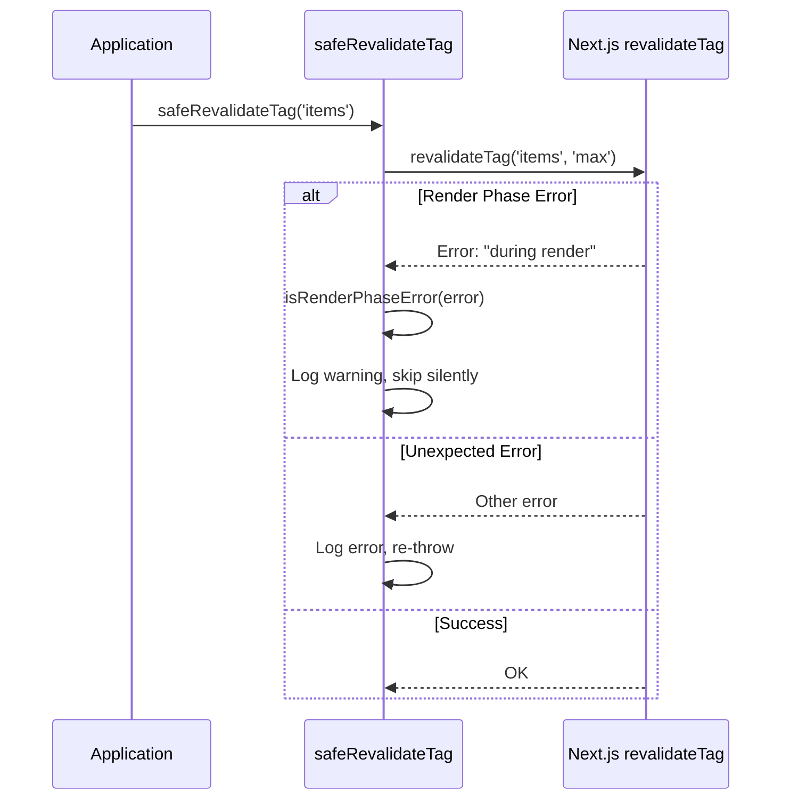
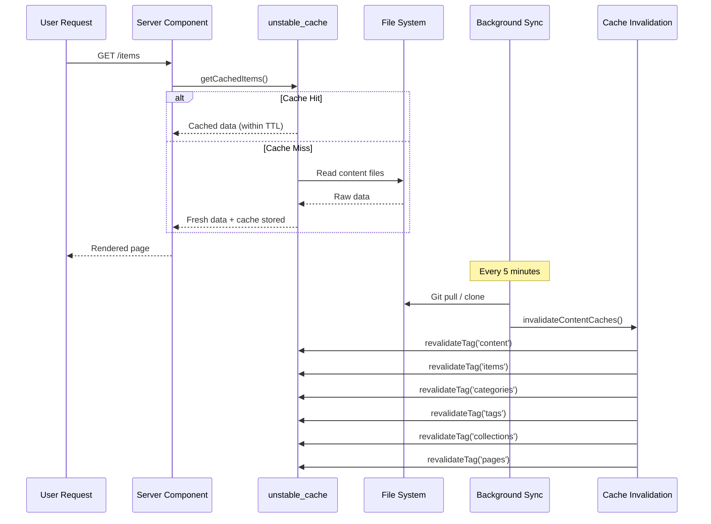

# מודול אי תוקף מטמון

מודול אי תוקף המטמון (`template/lib/cache-config.ts` ו-`template/lib/cache-invalidation.ts`) מספק מערכת תגי מטמון מרכזית ופונקציות אי תוקף עבור Next.js `unstable_cache` ו-`revalidateTag`. זה מבטיח שמטמוני תוכן בוטלו כראוי לאחר סנכרון המאגר תוך טיפול בהגבלות שלב רינדור Next.js בחן.

## סקירה כללית של אדריכלות



## קבצי מקור

|קובץ|תיאור|
|------|-------------|
|`lib/cache-config.ts`|מטמון קבועי TTL והגדרות תג|
|`lib/cache-invalidation.ts`|פונקציות ביטול עם בטיחות שלב רינדור|

## תצורת TTL של מטמון

כל ערכי ה-TTL נמצאים ב**שניות**, בשימוש עם Next.js `unstable_cache`:

```typescript
const CACHE_TTL = {
  CONTENT: 600,   // 10 minutes -- content listings
  ITEM: 600,      // 10 minutes -- individual items
  CONFIG: 600,    // 10 minutes -- site configuration
  PAGES: 600,     // 10 minutes -- static pages
} as const;
```

### שימוש עם `unstable_cache`

```typescript
import { unstable_cache } from 'next/cache';
import { CACHE_TTL, CACHE_TAGS } from '@/lib/cache-config';

const getCachedItems = unstable_cache(
  async () => fetchAllItems(),
  ['items-list'],
  {
    revalidate: CACHE_TTL.CONTENT,
    tags: [CACHE_TAGS.CONTENT, CACHE_TAGS.ITEMS],
  }
);
```

## תגי מטמון

תגיות משמשות עם `revalidateTag()` כדי לבטל באופן סלקטיבי מטמונים.

### תגים סטטיים

|תג קבוע|ערך|תיאור|
|-------------|-------|-------------|
|`CACHE_TAGS.CONTENT`|`'content'`|תג מאסטר -- מבטל את כל מטמוני התוכן|
|`CACHE_TAGS.ITEMS`|`'items'`|כל אוסף הפריטים|
|`CACHE_TAGS.CATEGORIES`|`'categories'`|כל הקטגוריות|
|`CACHE_TAGS.TAGS`|`'tags'`|כל התגים|
|`CACHE_TAGS.COLLECTIONS`|`'collections'`|כל האוספים|
|`CACHE_TAGS.CONFIG`|`'config'`|תצורת האתר|
|`CACHE_TAGS.PAGES`|`'pages'`|כל הדפים סטטיים|

### תגים דינמיים (פונקציות)

|פונקציית תג|פלט לדוגמה|תיאור|
|-------------|---------------|-------------|
|`CACHE_TAGS.ITEM(slug)`|`'item:my-tool'`|פריט ספציפי לפי שבלול|
|`CACHE_TAGS.PAGE(slug)`|`'page:about'`|עמוד ספציפי לפי שבלול|
|`CACHE_TAGS.ITEMS_LOCALE(locale)`|`'items:en'`|פריטים מסוננים לפי מיקום|
|`CACHE_TAGS.CATEGORIES_LOCALE(locale)`|`'categories:fr'`|קטגוריות לפי אזור|
|`CACHE_TAGS.TAGS_LOCALE(locale)`|`'tags:de'`|תיוג לפי מיקום|
|`CACHE_TAGS.COLLECTIONS_LOCALE(locale)`|`'collections:es'`|אוספים לפי אזור|

### דוגמה: מטמון ספציפי למיקום

```typescript
import { CACHE_TAGS, CACHE_TTL } from '@/lib/cache-config';

const getCachedItemsByLocale = unstable_cache(
  async (locale: string) => fetchItemsByLocale(locale),
  ['items-by-locale'],
  {
    revalidate: CACHE_TTL.CONTENT,
    tags: [CACHE_TAGS.ITEMS, CACHE_TAGS.ITEMS_LOCALE('en')],
  }
);
```

## פונקציות ביטול

### `invalidateContentCaches(): Promise<void>`

מבטל את תוקף **כל** המטמונים הקשורים לתוכן. נקרא לאחר שסנכרון המאגר הושלם בהצלחה.

```typescript
import { invalidateContentCaches } from '@/lib/cache-invalidation';

// After successful repository sync
await performSync();
await invalidateContentCaches();
```

**מבטל את התגים האלה:**
- `CONTENT`, `ITEMS`, `CATEGORIES`, `TAGS`, `COLLECTIONS`, `PAGES`
- מנקה גם את המטמון `fetchItems` בזיכרון באמצעות `clearFetchItemsCache()`

### `invalidateItemCache(slug: string): Promise<void>`

מבטל את תוקף המטמון עבור פריט בודד.

```typescript
import { invalidateItemCache } from '@/lib/cache-invalidation';

await invalidateItemCache('my-saas-tool');
// Revalidates tag: 'item:my-saas-tool'
```

### `invalidatePageCache(slug: string): Promise<void>`

מבטל את תוקף המטמון עבור עמוד סטטי בודד.

```typescript
import { invalidatePageCache } from '@/lib/cache-invalidation';

await invalidatePageCache('about');
// Revalidates tag: 'page:about'
```

## בטיחות עיבוד שלב

Next.js אינו מאפשר `revalidateTag()` בשלב הרינדור של רכיבי שרת. המודול מטפל בזה עם עטיפה `safeRevalidateTag`.

### איך זה עובד



### דפוסי זיהוי שגיאות

הפונקציה `isRenderPhaseError` בודקת מספר דפוסים כדי להיות עמידים בפני שינויים בהודעת השגיאה Next.js:

- `"during render"` -- הודעת Next.js נוכחית
- `"render phase"` -- ניסוח חלופי
- `"revalidate"` + `"render"` -- שתי מילות המפתח קיימות
- `"unsupported"` + `"render"` -- בדיקת שילוב

## תרשים זרימת מטמון


