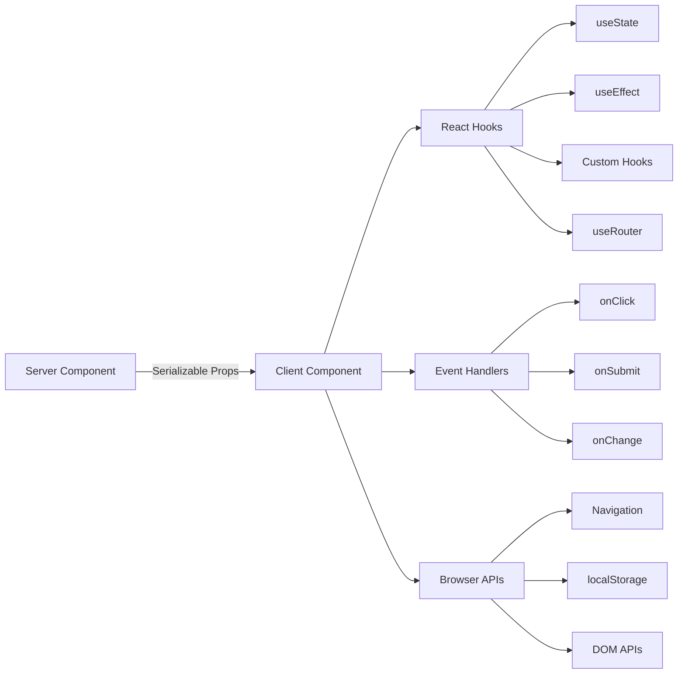

# דפוסי רכיבי לקוח

## סקירה כללית

רכיבי לקוח בתבנית Ever Works הם "איים" אינטראקטיביים המטפלים באירועי משתמשים, מנהלים מצב מקומי ומשתלבים עם ממשקי API של דפדפן. הם מזוהים על ידי ההוראה `"use client"` בראש הקובץ ומשמשים באופן סלקטיבי כאשר נדרשת אינטראקטיביות.

## אדריכלות



## קבצי מקור

|קובץ|דפוס|
|------|---------|
|`template/app/[locale]/admin/page.tsx`|האצלת מעטפת לקוח מינימלית לרכיב|
|`template/app/not-found.tsx`|ניווט לקוח עם `useRouter`|
|`template/app/global-error.tsx`|גבול שגיאה עם פונקציונליות איפוס|
|`template/components/filters/filter-url-parser.tsx`|ניהול מצב כתובת URL|
|`template/components/header/more-menu.tsx`|תפריטים נפתחים אינטראקטיביים|

## דפוסי ליבה

### תבנית 1: עטיפות לקוחות מינימליות

רכיבי עמוד רבים משתמשים בעטיפת הלקוח הדקה ביותר האפשרית:

```typescript
"use client";

import { AdminDashboard } from "@/components/admin";

export default function AdminPage() {
    return <AdminDashboard />;
}
```

דפוס זה שומר על קובץ העמוד קטן תוך האצלת כל ההיגיון לרכיב נפרד. ההנחיה `"use client"` מסמנת את הגבול שבו עובר עץ רכיבי השרת לעיבוד לקוח.

### דפוס 2: רכיבי גבול שגיאה

מטפל השגיאות הגלובלי מדגים את דפוס גבול השגיאה:

```typescript
'use client';

export default function GlobalError({
    error,
    reset,
}: {
    error: Error & { digest?: string };
    reset: () => void;
}) {
    useEffect(() => {
        console.error(error);
    }, [error]);

    return (
        <html lang="en">
            <body>
                <div>
                    <h1>Something went wrong!</h1>
                    {process.env.NODE_ENV !== 'production' && (
                        <div>
                            <p>{error.message}</p>
                            {error.digest && <p>Error ID: {error.digest}</p>}
                        </div>
                    )}
                    <Button onPress={() => reset()}>Refresh</Button>
                    <Link href="/">Go Home</Link>
                </div>
            </body>
        </html>
    );
}
```

היבטים מרכזיים:
- האביזר `error` כולל `digest` אופציונלי למעקב אחר שגיאות שרת
- הפונקציה `reset()` מעבדת מחדש את הילדים של גבול השגיאה
- עקבות מחסנית מוצגות רק בפיתוח
- הרכיב עוטף את התגיות `<html>` ו-`<body>` משלו מאחר שגיאות גלובליות מחליפות את הדף כולו

### דפוס 3: ניווט בצד הלקוח

הדף לא נמצא מדגים דפוסי ניווט בצד הלקוח:

```typescript
'use client';

import { useRouter } from 'next/navigation';

export default function NotFound() {
    const router = useRouter();

    return (
        <div>
            <Button onClick={() => router.back()}>Go Back</Button>
            <Button onClick={() => router.push('/')}>Back to Home</Button>
            <button onClick={() => router.push('/help')}>Contact Support</button>
        </div>
    );
}
```

ה-`useRouter` מבית `next/navigation` מספק ניווט פרוגרמטי. שימו לב שזה מ-`next/navigation`, לא מ-`next/router` (נתב דפים).

### דפוס 4: ניווט לקוח i18n-Aware

התבנית מספקת ווים ניווט מודעים לאזור דרך `i18n/navigation.ts`:

```typescript
import { createNavigation } from "next-intl/navigation";
import { routing } from "./routing";

export const { Link, redirect, usePathname, useRouter, getPathname } =
    createNavigation(routing);
```

רכיבי לקוח שצריכים לייבא ניווט מודע למיקום ממודול זה במקום `next/navigation`:

```typescript
'use client';

import { Link, useRouter, usePathname } from '@/i18n/navigation';

function LocaleAwareComponent() {
    const router = useRouter();
    const pathname = usePathname();

    // router.push('/about') automatically includes the current locale prefix
    return <Link href="/about">About</Link>;
}
```

### דפוס 5: פעולות שרת עם אימות טופס

רכיבי לקוח משתלבים עם פעולות שרת באמצעות דפוס הפעולה המאומת מ-`lib/auth/middleware.ts`:

```typescript
// Server action (lib/auth/middleware.ts)
export function validatedAction<S extends z.ZodType, T>(
    schema: S,
    action: ValidatedActionFunction<S, T>
) {
    return async (prevState: ActionState, formData: FormData): Promise<T> => {
        const result = schema.safeParse(Object.fromEntries(formData));
        if (!result.success) {
            return { error: result.error.issues[0].message } as T;
        }
        return action(result.data, formData);
    };
}

// Client component
'use client';

import { useActionState } from 'react';
import { myServerAction } from './actions';

function MyForm() {
    const [state, formAction, isPending] = useActionState(myServerAction, {});

    return (
        <form action={formAction}>
            {state.error && <p>{state.error}</p>}
            <input name="email" type="email" />
            <button type="submit" disabled={isPending}>Submit</button>
        </form>
    );
}
```

### דפוס 6: ניהול מדינה עם ווים מותאמים אישית

התבנית מארגנת את ההיגיון בצד הלקוח לתוך ווים מותאמים אישית בספרייה `hooks/`:

```typescript
'use client';

import { useFavorites } from '@/hooks/useFavorites';
import { useFilters } from '@/hooks/useFilters';

function ItemList() {
    const { favorites, toggleFavorite } = useFavorites();
    const { filters, updateFilter, resetFilters } = useFilters();

    return (
        <div>
            <FilterBar filters={filters} onChange={updateFilter} onReset={resetFilters} />
            <ItemGrid items={items} favorites={favorites} onToggleFavorite={toggleFavorite} />
        </div>
    );
}
```

## גבולות רכיבי לקוח

### מתי להשתמש `"use client"`

- **מטפלי אירועים**: `onClick`, `onSubmit`, `onChange`
- ** ווים תגובה**: `useState`, `useEffect`, `useRef`, ווים מותאמים אישית
- ** ממשקי API של דפדפן**: `window`, `localStorage`, `navigator`
- **ספריות לקוח של צד שלישי**: ספריות רכיבי ממשק משתמש הדורשות אינטראקטיביות

### מתי לשמור כרכיב שרת

- עיבוד תוכן סטטי
- אחזור ושינוי נתונים
- טעינת תרגום (`getTranslations`)
- יצירת מטא נתונים
- עטיפות פריסה

## שיטות עבודה מומלצות בתבנית

1. **דחף `"use client"` עמוק ככל האפשר** -- שמור את הגבול קרוב לדף האינטראקטיבי
2. **העבר את נתוני השרת כאביזרים** -- הימנע מאחזור מחדש בלקוח
3. **השתמש ב-@@TOK000@@@ לתופעות לוואי בלבד** -- לא לאיסוף נתונים
4. **העדף פעולות שרת על פני מסלולי API** -- להגשת טפסים ומוטציות
5. **ייבוא ניווט מ-`@/i18n/navigation`** -- מבטיח ניתוב מודע לאזור
6. **ממשק משתמש לפיתוח שער בלבד** -- השתמש ב-`process.env.NODE_ENV !== 'production'` המחאות
