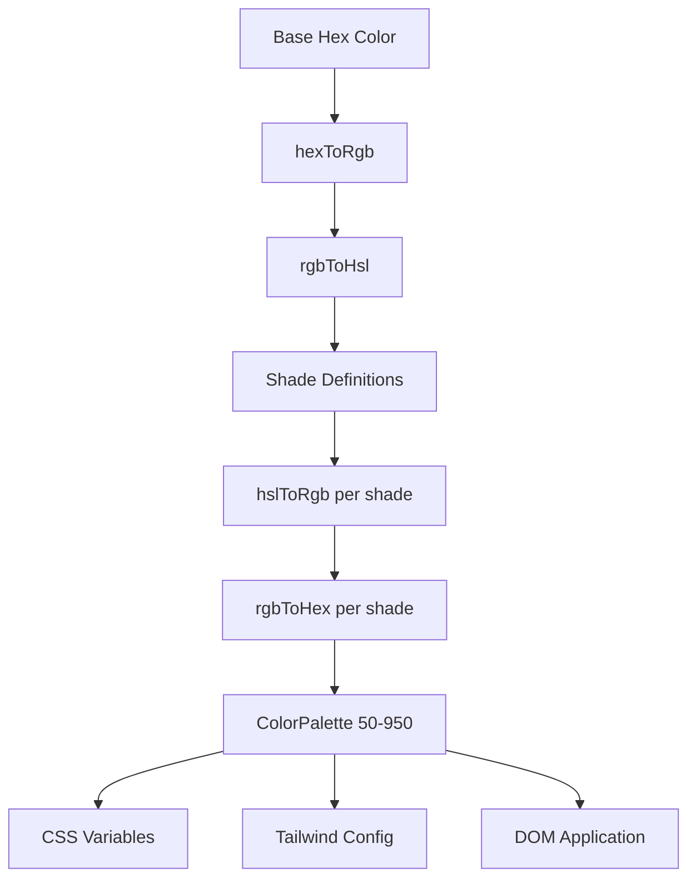

# מערכת צבע

התבנית משתמשת במערכת יצירת צבעים דינמית שיוצרת פלטות צבעים שלמות מצבעי משושה בסיסיים. זה מניע את מנוע הנושא ומאפשר התאמה אישית של צבע בזמן ריצה באמצעות משתני CSS ושילוב Tailwind CSS.

## סקירה כללית של אדריכלות



## קבצי מקור

|קובץ|מטרה|
|------|---------|
|`lib/color-generator.ts`|יצירת פלטות ליבה מצבעי hex|
|`lib/theme-color-manager.ts`|אפליקציית צבע ברמת הנושא ויצירת CSS|
|`lib/theme-utils.ts`|שיעורי שירות, עוזרי אטימות והגדרות קבועות מראש של ערכות נושא|

## צינור המרת צבע

המערכת ממירה צבעים באמצעות ייצוגים מרובים כדי ליצור גוונים במדויק. ארבע פונקציות המרה מתמודדות עם הנסיעה הלוך ושוב.

```typescript
// Hex -> RGB -> HSL (for manipulation) -> RGB -> Hex (output)
export function hexToRgb(hex: string): { r: number; g: number; b: number };
export function rgbToHsl(r: number, g: number, b: number): { h: number; s: number; l: number };
export function hslToRgb(h: number, s: number, l: number): { r: number; g: number; b: number };
export function rgbToHex(r: number, g: number, b: number): string;
```

התאמות בהירות ורוויה מתרחשות בחלל צבע HSL, המספק מעברי גוונים אחידים מבחינה תפיסתית על פני הפלטה.

## הגדרות צל

לכל רמת גוון יש התאמות בהירות ורוויה קבועות ביחס לצבע הבסיס (500):

|צל|התאם קלות|התאמת הרוויה|שימוש|
|-------|-----------------|-------------------|-------|
| 50 | +45 | -30 |הרקע הקל ביותר|
| 100 | +40 | -25 |רחף ברקע|
| 200 | +30 | -20 |רקע פעיל|
| 300 | +20 | -10 |גבולות|
| 400 | +10 | -5 |טקסט מציין מיקום|
| **500** | **0** | **0** |**צבע בסיס**|
| 600 | -10 | +5 |מצבי ריחוף|
| 700 | -20 | +10 |מצבים פעילים|
| 800 | -30 | +15 |טקסט דגש|
| 900 | -40 | +20 |כותרות|
| 950 | -45 | +25 |הרקע הכי כהה|

## ממשק ColorPalette

```typescript
export interface ColorPalette {
  50: string;
  100: string;
  200: string;
  300: string;
  400: string;
  500: string;  // Base color
  600: string;
  700: string;
  800: string;
  900: string;
  950: string;
}
```

## יצירת פלטה

הפונקציה `generateColorPalette` לוקחת כל צבע משושה ומייצרת את פלטת 11 הגוונים המלאה:

```typescript
import { generateColorPalette } from '@/lib/color-generator';

const palette = generateColorPalette('#3b82f6');
// Returns: { 50: '#e8f0fe', 100: '#d4e4fd', ..., 950: '#0a1d3d' }
```

הערכים מוצמדים בין 0 ל-100 הן לבהירות והן לרוויה כדי למנוע צבעים מחוץ לטווח.

## יצירת משתני CSS

המערכת מייצרת מאפייני CSS מותאמים אישית עבור כל גוון:

```typescript
import { generateCssVariables } from '@/lib/color-generator';

const palette = generateColorPalette('#3b82f6');
const css = generateCssVariables('theme-primary', palette);
// Output:
// --theme-primary: #3b82f6;
// --theme-primary-50: #e8f0fe;
// --theme-primary-100: #d4e4fd;
// ... (all 11 shades)
```

## שילוב CSS של Tailwind

צור אובייקטי תצורה של Tailwind המתייחסים למשתני CSS:

```typescript
import { generateTailwindConfig } from '@/lib/color-generator';

const config = generateTailwindConfig('theme-primary');
// Returns: {
//   DEFAULT: 'var(--theme-primary)',
//   50: 'var(--theme-primary-50)',
//   100: 'var(--theme-primary-100)',
//   ...
// }
```

## מנהל צבעי נושא

המודול `theme-color-manager.ts` מחיל פלטות על ה-DOM בזמן ריצה.

### תצורות ערכות נושא מורחבות

ארבעה ערכות נושא מובנות מגדירות צבעי בסיס עבור ראשוני, משני, מבטא, רקע, משטח וטקסט:

```typescript
export const EXTENDED_THEME_CONFIGS: Record<ThemeKey, ThemeConfig> = {
  everworks: {
    primary: "#3d70ef",
    secondary: "#00c853",
    accent: "#0056b3",
    background: "#ffffff",
    surface: "#f8f9fa",
    text: "#1a1a1a",
    textSecondary: "#6c757d",
  },
  corporate: { /* ... */ },
  material: { /* ... */ },
  funny: { /* ... */ },
};
```

### החלת פלטות על ה-DOM

```typescript
import { applyColorPalette, applyThemeWithPalettes } from '@/lib/theme-color-manager';

// Apply a single color palette
applyColorPalette('theme-primary', '#3d70ef');

// Apply an entire theme (primary + secondary + accent + utility colors)
applyThemeWithPalettes('everworks');
```

הפונקציה `applyColorPalette` מייצרת גם גרסת RGB לתמיכה באטימות:

```typescript
// Sets both:
// --theme-primary: #3d70ef
// --theme-primary-rgb: 61, 112, 239
```

### יצירת CSS סטטי

עבור עיבוד בצד השרת או יצירת CSS בזמן בנייה:

```typescript
import { generateThemeCss } from '@/lib/theme-color-manager';

const css = generateThemeCss('everworks');
// Returns full CSS variable string for all theme colors
```

## שיעורי שירות בנושא נושא

המודול `theme-utils.ts` מספק שילובי כיתות Tailwind מובנים מראש:

```typescript
import { themeClasses } from '@/lib/theme-utils';

// Button variants
themeClasses.button.primary   // "bg-theme-primary hover:bg-theme-accent text-white"
themeClasses.button.secondary // "bg-theme-secondary hover:bg-theme-secondary/80 text-white"
themeClasses.button.outline   // "border-2 border-theme-primary text-theme-primary ..."
themeClasses.button.ghost     // "text-theme-primary hover:bg-theme-primary/10"

// Text variants
themeClasses.text.primary     // "text-theme-text"
themeClasses.text.secondary   // "text-theme-text-secondary"
themeClasses.text.accent      // "text-theme-primary"
```

### פונקציות עוזר

```typescript
import { withOpacity, getCssVariable, cn, buildThemeClasses } from '@/lib/theme-utils';

// Generate opacity variant
withOpacity('bg-theme-primary', 50); // "bg-theme-primary/50"

// Get CSS variable reference
getCssVariable('theme-primary'); // "var(--theme-primary)"

// Conditional class building
buildThemeClasses('base-class', 'theme-class', {
  'active-class': isActive,
  'disabled-class': isDisabled,
});
```

## יצירת צבעי נושא אצווה

צור תצורת CSS ו-Tailwind עבור מספר צבעים בו-זמנית:

```typescript
import { generateThemeColors } from '@/lib/color-generator';

const result = generateThemeColors({
  primary: '#3d70ef',
  secondary: '#00c853',
  accent: '#0056b3',
});

// result.css - Complete CSS variable declarations
// result.tailwind - Tailwind config object for all colors
```

## יישום ערכת נושא מותאם אישית

החל צבעים שרירותיים מבלי להשתמש בערכות הנושא המוגדרות מראש:

```typescript
import { applyCustomTheme } from '@/lib/theme-color-manager';

applyCustomTheme({
  primary: '#e91e63',
  secondary: '#9c27b0',
  accent: '#673ab7',
});
```

## טיפול בשגיאות

מנהל צבעי הנושא כולל התנהגות סתירה:

- אם מפתח ערכת נושא לא נמצא, הוא חוזר לנושא ברירת המחדל `everworks`.
- אם החלת ערכת נושא זורקת שגיאה והערכת נושא המבוקשת אינה `everworks`, היא מנסה שוב אוטומטית עם ערכת הנושא המוגדרת כברירת מחדל.
- בטיחות SSR: `useThemeWithPalettes` בודק זמינות `window` לפני החלת שינויים ב-DOM.
