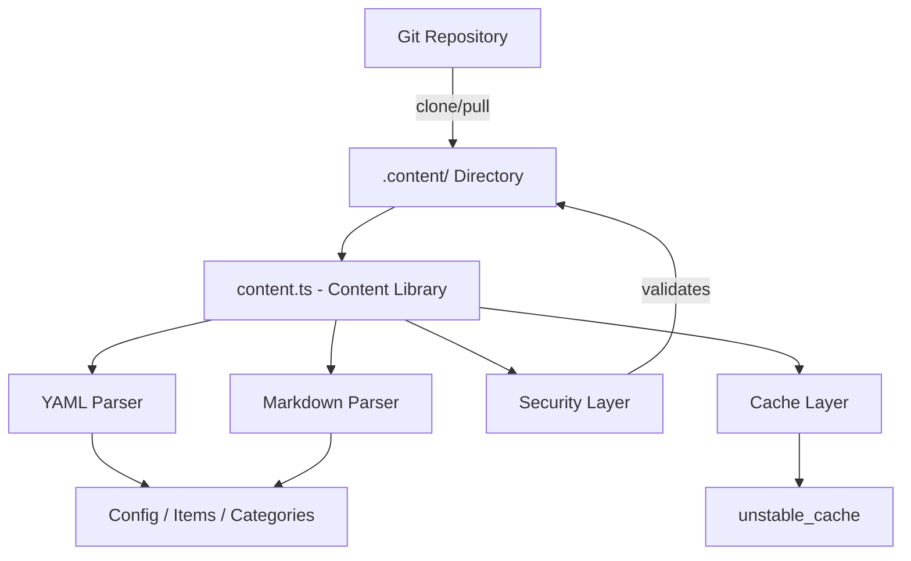
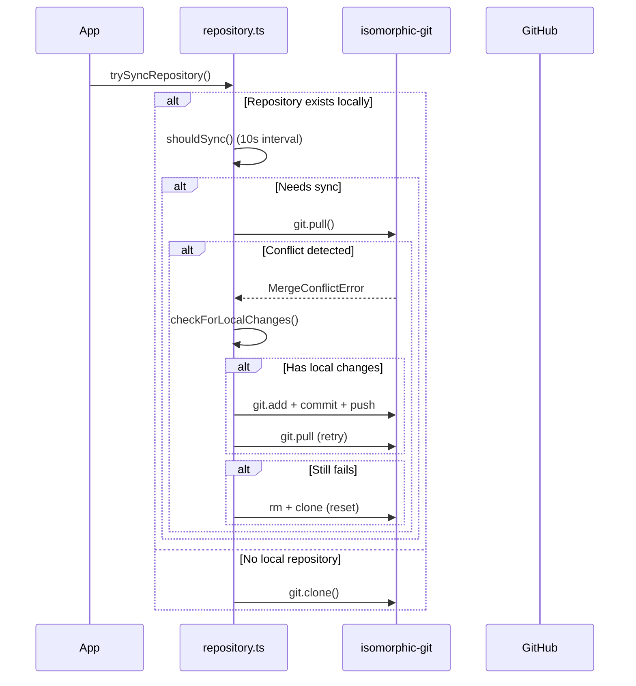

# ספריית תוכן

ספריית התוכן (`lib/content.ts`) מספקת כלי עזר בצד השרת לקריאה, ניתוח ושמירה במטמון ממאגר CMS מבוסס Git. הוא מטפל בקובצי תוכן YAML/Markdown, ניהול תצורה וסנכרון תוכן עם אמצעי אבטחה חזקים.

## סקירה כללית של אדריכלות



## קבצי מקור

|קובץ|מטרה|
|------|---------|
|`lib/content.ts`|עיבוד תוכן עיקרי, קריאה ושמירה במטמון|
|`lib/repository.ts`|סינכרון שיבוט/משיכה של Git עם מאגר מרוחק|
|`lib/lib.ts`|כלי עזר לנתיבים (`getContentPath`, `fsExists`, `dirExists`)|
|`lib/cache-config.ts`|תגי מטמון ותצורת TTL|

## שכבת אבטחה

ספריית התוכן אוכפת אמצעי אבטחה מרובים כדי למנוע מעבר נתיבים והתקפות הזרקה.

### אימות קוד שפה

```typescript
function validateLanguageCode(lang: string): boolean {
  const validLangPattern = /^[a-zA-Z0-9_-]+$/;
  return validLangPattern.test(lang) && lang.length <= 10;
}
```

רק תווים אלפאנומריים, מקפים וקווים תחתונים מתקבלים באורך מקסימלי של 10 תווים.

### חיטוי שם קובץ

```typescript
function sanitizeFilename(filename: string): string {
  const sanitized = path.basename(filename);
  if (sanitized.includes('..') || sanitized.includes('/') || sanitized.includes('\\')) {
    throw new Error('Invalid filename: contains dangerous characters');
  }
  return sanitized;
}
```

משתמש ב-`path.basename` כדי להסיר רכיבי ספרייה ודוחה את כל תווי המעבר שנותרו.

### אימות נתיב

```typescript
function validatePath(filepath: string, basePath: string): void {
  const resolvedPath = path.resolve(filepath);
  const resolvedBase = path.resolve(basePath);
  if (!resolvedPath.startsWith(resolvedBase + path.sep) && resolvedPath !== resolvedBase) {
    throw new Error('Invalid file path: outside of allowed directory');
  }
}
```

הפונקציה `safeReadFile` מבצעת בדיקה כפולה: היא מאמתת את הנתיב ולאחר מכן מאמתת שהנתיב האמיתי שנפתר (בעקבות סימלינקים) נשאר בתוך ספריית הבסיס.

### אימות כתובת אתר

```typescript
function isValidUrl(url: string): boolean {
  const trimmed = url.trim();
  if (trimmed.startsWith('/') && !trimmed.startsWith('//')) return true;
  return trimmed.startsWith('http://') || trimmed.startsWith('https://');
}
```

חוסם `javascript:`, `data:`, `vbscript:`, ותכניות פרוטוקול מסוכנות אחרות.

### אימות גודל CSS

```typescript
function isValidCssSize(value: string): boolean {
  if (['auto', 'inherit', 'initial', 'unset'].includes(value.trim())) return true;
  return /^\d+(\.\d+)?(px|em|rem|vh|vw|%|pt|cm|mm|in)?$/.test(value.trim());
}
```

מונע הזרקת CSS דרך שדות frontmatter של גיבור מותאמים אישית.

## עיבוד תוכן

### ניתוח YAML

קובצי תוכן מנותחים באמצעות הספרייה `yaml` עם אימות סכימת Zod עבור frontmatter:

```typescript
const customHeroFrontmatterSchema = z.object({
  background_image: z.string().refine(isValidUrl, {
    message: 'Invalid URL: must be http, https, or relative path'
  }).optional(),
  // ... additional validated fields
});
```

### שמירה במטמון של תצורה

תצורת האתר נשמרת במטמון באמצעות Next.js `unstable_cache` עם TTLs ותגי מטמון מוגדרים:

```typescript
import { CACHE_TAGS, CACHE_TTL } from './cache-config';

const getCachedConfig = unstable_cache(
  async () => { /* read and parse config.yml */ },
  [CACHE_TAGS.CONFIG],
  { revalidate: CACHE_TTL }
);
```

## סינכרון מאגר Git

המודול `repository.ts` מנהל פעולות Git באמצעות `isomorphic-git`.

### סנכרון זרימת



### הגנה על פסק זמן

כל פעולות Git עוטפות עם פסקי זמן הניתנים להגדרה:

```typescript
async function withTimeout<T>(promise: Promise<T>, timeoutMs: number = 120000): Promise<T> {
  const timeoutPromise = new Promise<never>((_, reject) => {
    setTimeout(() => reject(new Error(`Operation timeout after ${timeoutMs}ms`)), timeoutMs);
  });
  return Promise.race([promise, timeoutPromise]);
}
```

### יישוב סכסוכים

המערכת מטפלת בקונפליקטים של מיזוג באמצעות אסטרטגיה רב-שלבית:

1. **זהה שינויים מקומיים** באמצעות `git.statusMatrix()`
2. **ניסיון דחיפה** של שינויים מקומיים לפני משיכה
3. **נסה למשוך שוב** לאחר דחיפה מוצלחת
4. **איפוס מלא** (מחיקה + שיבוט מחדש) כמוצא אחרון

### התנהגות נפילה

אם `DATA_REPOSITORY` אינו מוגדר או שהשיבוט נכשל, המערכת יוצרת תוכן חלופי מינימלי:

```typescript
// Creates empty content directory with minimal config
const DEFAULT_CONFIG = `site_name: Website
item_name: Item
items_name: Items
copyright_year: ${new Date().getFullYear()}
`;
```

## אכיפה לשרת בלבד

גם `content.ts` וגם `repository.ts` משתמשים בייבוא `server-only` כדי למנוע שימוש מקרי בצד הלקוח:

```typescript
'use server';
import 'server-only';
```

זה מבטיח שפעולות תוכן עם גישה למערכת קבצים לעולם לא ידלפו לחבילות לקוח.

## פונקציות מפתח מיוצאות

|פונקציה|תיאור|
|----------|-------------|
|`getCachedConfig()`|מחזיר את תצורת האתר השמור מ-`config.yml`|
|`trySyncRepository()`|משבט או מושך תוכן ממאגר Git מרוחק|
|`pullChanges()`|מושך את השינויים האחרונים עם פתרון סכסוכים|
|`validateLanguageCode()`|מאמת פורמט קוד שפה i18n|
|`sanitizeFilename()`|מסיר רכיבי ספרייה משמות קבצים|
|`safeReadFile()`|קורא קבצים עם הגנת חציית נתיב מלאה|
