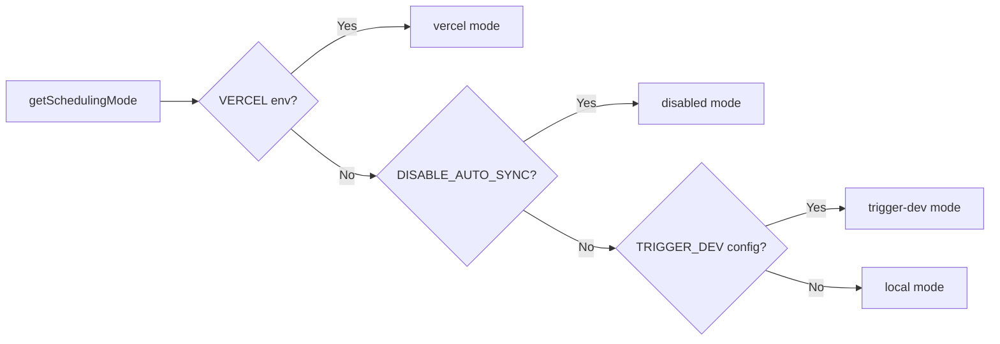

# מערכת Cron Job

## סקירה כללית

תבנית Ever Works מיישמת מערכת גמישות לעבודות רקע התומכת בשלושה מצבי תזמון: **Vercel Cron**, **Trigger.dev** ו**מתזמן מקומי**. נקודות קצה Cron הן מסלולים סטנדרטיים של Next.js API המאומתים באמצעות `CRON_SECRET`, והמערכת כוללת מודול אתחול יחיד המבטיח שעבודות מוגדרות פעם אחת בדיוק בכל תהליך.

## אדריכלות

```mermaid
flowchart TD
    A[Scheduling Mode Detection] --> B{getSchedulingMode}

    B -->|vercel| C[Vercel Cron]
    B -->|trigger-dev| D[Trigger.dev]
    B -->|local| E[Local Scheduler]
    B -->|disabled| F[No Jobs]

    C --> G[vercel.json crons]
    G --> G1[/api/cron/sync]
    G --> G2[/api/cron/subscription-reminders]
    G --> G3[/api/cron/subscription-expiration]

    G1 --> H[CRON_SECRET Verification]
    G2 --> H
    G3 --> H

    H -->|Valid| I[Execute Job]
    H -->|Invalid| J[401 Unauthorized]

    I --> I1[triggerManualSync]
    I --> I2[subscriptionRenewalReminderJob]
    I --> I3[processExpiredSubscriptions]

    D --> K[Trigger.dev SDK]
    E --> L[Internal setInterval]

    K --> I
    L --> I
```

## קבצי מקור

|קובץ|מטרה|
|------|---------|
|`template/vercel.json`|הגדרות לוח זמנים של Vercel cron|
|`template/app/api/cron/sync/route.ts`|נקודת קצה cron של סינכרון תוכן|
|`template/app/api/cron/subscription-reminders/route.ts`|מיילים לתזכורת לחידוש|
|`template/app/api/cron/subscription-expiration/route.ts`|עיבוד מנוי שפג תוקפו|
|`template/app/api/cron/jobs/background-jobs-init.ts`|אתחול עבודת Singleton|

## תצורת לוח זמנים של Cron

### vercel.json

```json
{
    "crons": [
        {
            "path": "/api/cron/sync",
            "schedule": "0 3 * * *"
        },
        {
            "path": "/api/cron/subscription-reminders",
            "schedule": "0 9 * * *"
        },
        {
            "path": "/api/cron/subscription-expiration",
            "schedule": "0 0 * * *"
        }
    ]
}
```

|איוב|לוח זמנים|זמן|תיאור|
|-----|----------|------|-------------|
|סינכרון תוכן| `0 3 * * *` |03:00 UTC מדי יום|מסנכרן תוכן מ-CMS מבוסס Git|
|תזכורות על מנוי| `0 9 * * *` |9:00 UTC מדי יום|שולח מיילים תזכורת לחידוש|
|תפוגת מנוי| `0 0 * * *` |חצות UTC מדי יום|מעבד מנויים שפג תוקפם|

## אימות

### אימות סודי תזמון בטוח

כל נקודות הקצה של ה-cron מאמתות את `CRON_SECRET` באמצעות השוואה בטוחה בתזמון כדי למנוע התקפות תזמון:

```typescript
import crypto from 'crypto';

function verifyCronSecret(request: NextRequest): boolean {
    const authHeader = request.headers.get('authorization');
    const cronSecret = process.env.CRON_SECRET;

    // Development bypass
    if (!cronSecret && process.env.NODE_ENV === 'development') {
        console.log('[Cron] Bypassing cron auth in development');
        return true;
    }

    if (!cronSecret || !authHeader) return false;

    const expectedValue = `Bearer ${cronSecret}`;

    // Length check before timing-safe comparison
    if (authHeader.length !== expectedValue.length) return false;

    return crypto.timingSafeEqual(
        Buffer.from(authHeader, 'utf8'),
        Buffer.from(expectedValue, 'utf8')
    );
}
```

תכונות אבטחה עיקריות:
- **השוואה בטוחה בתזמון** באמצעות `crypto.timingSafeEqual` -- מונעת מתוקפים למדוד הבדלי זמני תגובה כדי לנחש את הסוד
- **בדיקה מוקדמת באורך** -- `timingSafeEqual` דורש מאגרים באורך שווה
- **עקיפת פיתוח** -- רק כאשר `CRON_SECRET` אינו מוגדר ו-`NODE_ENV=development`

### אימות אוטומטי של Vercel

בעת פריסה ב-Vercel, הפלטפורמה כוללת אוטומטית את הכותרת `Authorization: Bearer <CRON_SECRET>` עבור משימות cron מוגדרות. אתה רק צריך להגדיר את משתנה הסביבה `CRON_SECRET` בלוח המחוונים של Vercel.

## ביצוע עבודה

### עבודת סינכרון תוכן

```typescript
export async function GET(request: Request): Promise<NextResponse> {
    const startTime = Date.now();

    // Verify authorization
    if (!isAuthorized) {
        return NextResponse.json({ success: false, message: "Unauthorized" }, { status: 401 });
    }

    try {
        const result = await triggerManualSync();
        const duration = Date.now() - startTime;

        return NextResponse.json({
            success: result.success,
            timestamp: new Date().toISOString(),
            duration,
            message: result.message,
        }, {
            headers: { "Cache-Control": "no-cache, no-store, must-revalidate" },
        });
    } catch (error) {
        return NextResponse.json({
            success: false,
            message: "Cron sync failed",
            details: safeErrorMessage(error, "Unknown error"),
        }, { status: 500 });
    }
}
```

פורמט תגובה:
```json
{
    "success": true,
    "timestamp": "2025-01-15T03:00:05.123Z",
    "duration": 5123,
    "message": "Sync completed successfully"
}
```

### עבודת תפוגת מנוי

עבודה זו מעבדת מנויים שפג תוקפם ושולחת הודעות אימייל:

```typescript
export async function GET(request: NextRequest) {
    if (!verifyCronSecret(request)) {
        return NextResponse.json({ success: false, message: 'Unauthorized' }, { status: 401 });
    }

    // 1. Find and update expired subscriptions
    const result = await subscriptionService.processExpiredSubscriptions();

    // 2. Send notification emails
    const { service: emailService } = await createEmailService();
    if (emailService.isServiceAvailable()) {
        for (const subscription of result.subscriptions) {
            const user = await getUserById(subscription.userId);
            const emailTemplate = getSubscriptionExpiredTemplate({ /* ... */ });
            await sendEmailSafely(emailService, emailConfig, emailTemplate, user.email);
        }
    }

    // 3. Return results
    return NextResponse.json({
        success: true,
        data: {
            processed: result.processed,
            affectedUsers,
            errors: result.errors,
            timestamp: new Date().toISOString()
        }
    });
}
```

התנהגויות מפתח:
- כשלים באימייל אינם גורמים לכשל בעבודה
- השיטה `POST` מיוצאת גם ככינוי לטריגרים ידניים
- מחזירה `207 Multi-Status` להצלחות חלקיות

### משרות תזכורות מנוי

```typescript
export async function GET(request: NextRequest) {
    if (!verifyCronSecret(request)) {
        return NextResponse.json({ error: 'Unauthorized' }, { status: 401 });
    }

    const result = await subscriptionRenewalReminderJob();

    if (!result.success) {
        return NextResponse.json(
            { error: 'Job completed with errors', ...result },
            { status: 207 }  // Multi-Status for partial success
        );
    }

    return NextResponse.json({
        message: 'Subscription reminder job completed',
        ...result
    });
}

// Support POST for Vercel Cron
export async function POST(request: NextRequest) {
    return GET(request);
}
```

## אתחול משרות רקע

### תבנית סינגלטון

מודול האתחול משתמש ב-@@TOK000@@@ כדי להבטיח שמשרות מוגדרות פעם אחת בדיוק, אפילו על פני הפקות פונקציות ללא שרת:

```typescript
const GLOBAL_KEY = '__BACKGROUND_JOBS_INIT__' as const;

interface BackgroundJobsGlobalState {
    initializationState: 'pending' | 'initializing' | 'completed';
    initializationPromise: Promise<void> | null;
    loggedMode: SchedulingMode | null;
}

export async function ensureBackgroundJobsInitialized(): Promise<void> {
    // Skip during tests and builds
    if (process.env.NODE_ENV === 'test') return;
    if (process.env.NEXT_PHASE === 'phase-production-build') return;

    const state = getGlobalState();

    // Fast path: already completed
    if (state.initializationState === 'completed') return;

    // Wait for in-progress initialization
    if (state.initializationState === 'initializing') {
        return state.initializationPromise;
    }

    // Start initialization
    state.initializationState = 'initializing';
    state.initializationPromise = doInitialize();

    try {
        await state.initializationPromise;
        state.initializationState = 'completed';
    } catch (error) {
        state.initializationState = 'pending'; // Allow retry
        throw error;
    }
}
```

### מצבי תזמון



|מצב|התנהגות|
|------|----------|
|`vercel`|משרות המטופלות על ידי Vercel Cron באמצעות נקודות קצה HTTP|
|`trigger-dev`|משרות מנוהלות על ידי מתזמן הענן Trigger.dev|
|`local`|מתזמן פנימי מבוסס `setInterval` לפיתוח|
|`disabled`|אין תזמון אוטומטי (`DISABLE_AUTO_SYNC=true`)|

## משתני סביבה

|משתנה|חובה|תיאור|
|----------|----------|-------------|
|`CRON_SECRET`|ייצור בלבד|אסימון נושא לאימות קרון|
|`DISABLE_AUTO_SYNC`|לא|הגדר ל-`true` כדי להשבית את כל עבודות הרקע|
|`VERCEL`|הגדרה אוטומטית|מוגדר אוטומטית על ידי פלטפורמת Vercel|

## שיטות עבודה מומלצות

1. **השתמש תמיד בהשוואה בטוחה בתזמון** לסודות קרון - מונע התקפות תזמון
2. **ייצא גם GET וגם POST** -- Vercel Cron יכול להשתמש בכל אחת מהשיטות
3. **הגדר `Cache-Control: no-cache`** על תגובות -- מנע שמירה במטמון של תוצאות עבודה
4. **יומן משך העבודה** -- עוזר לזהות רגרסיות ביצועים
5. **טפל בכשלונות דוא"ל בחן** -- אל תיתן לכשלים בהתראה לקרוס את העבודה
6. **השתמש ב-`207 Multi-Status`** להצלחות חלקיות -- מבחין בין הצלחה/כישלון מלא
