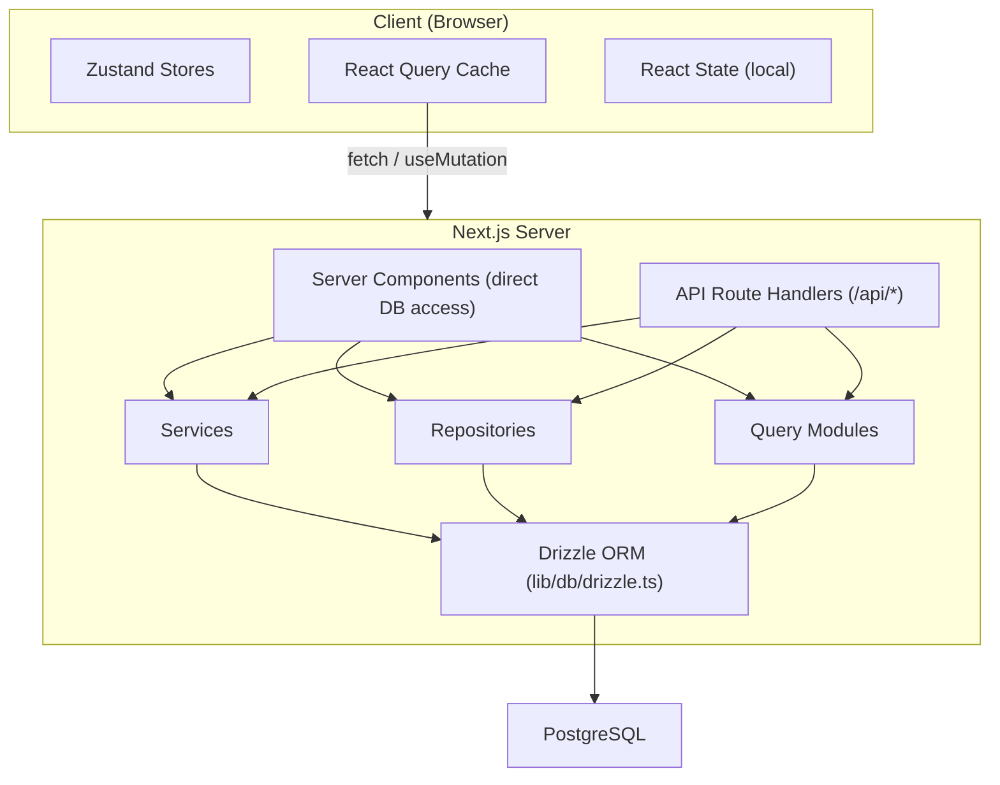

# ניהול זרימת נתונים ומדינה

מסמך זה מתאר כיצד הנתונים זורמים דרך תבנית Ever Works, ממסד הנתונים לממשק המשתמש, המכסים את רכיבי השרת, נתיבי API, React Query, מאגרי Zustand ודפוס המאגר.

## סקירה כללית של אדריכלות

התבנית משתמשת בארכיטקטורת נתונים רב שכבתית:



## אחזור נתונים בצד השרת

### רכיבי שרת (גישה ישירה ל-DB)

רכיבי שרת בספריה `app/` יכולים לייבא ולקרוא ישירות לפונקציות שאילתת מסד נתונים או שיטות מאגר. זהו הנתיב היעיל ביותר מכיוון שהוא מונע סיבובי HTTP מיותרים.

```typescript
// app/[locale]/admin/items/page.tsx (simplified)
import { getItems } from '@/lib/db/queries';

export default async function AdminItemsPage() {
  const items = await getItems();
  return <ItemsList items={items} />;
}
```

### מטפלי נתיב API

מסלולי API ב-`app/api/` משמשים כגשר בין רכיבי הלקוח והלוגיקה בצד השרת. הם עוקבים אחר דפוס מטפל דק: מאמתים קלט, קוראים לשירות או למאגר המתאים ומחזירים תגובת HTTP.

```typescript
// Typical API route pattern
export async function GET(request: NextRequest) {
  const session = await auth();
  if (!session?.user) {
    return NextResponse.json({ error: 'Unauthorized' }, { status: 401 });
  }

  const data = await someRepository.findAll();
  return NextResponse.json({ success: true, data });
}
```

## ניהול המדינה בצד הלקוח

### TanStack Query (React Query 5)

React Query הוא הכלי העיקרי לניהול מצב שרת בצד הלקוח. התבנית משתמשת בה באופן נרחב באמצעות ווים מותאמים אישית בספריית `hooks/`.

**תצורה גלובלית** (`lib/react-query-config.ts`):
- זמן ברירת מחדל מיושן: 5 דקות
- זמן איסוף אשפה: 10 דקות
- ניסיון חוזר אוטומטי עם השבתה אקספוננציאלית (עד 3 ניסיונות חוזרים)
- אחזר את מיקוד החלון והתחבר מחדש
- אין ניסיון חוזר על שגיאות לקוח 4xx

**דפוס Hook**: לכל אזור תכונה יש ווים ייעודיים העוטפים שאילתת תגובה:

```typescript
// hooks/use-admin-items.ts (simplified pattern)
import { useQuery, useMutation, useQueryClient } from '@tanstack/react-query';

export function useAdminItems(params) {
  return useQuery({
    queryKey: ['admin', 'items', params],
    queryFn: () => fetch('/api/admin/items').then(r => r.json()),
    staleTime: 5 * 60 * 1000,
  });
}

export function useCreateItem() {
  const queryClient = useQueryClient();
  return useMutation({
    mutationFn: (data) => fetch('/api/admin/items', {
      method: 'POST',
      body: JSON.stringify(data),
    }).then(r => r.json()),
    onSuccess: () => {
      queryClient.invalidateQueries({ queryKey: ['admin', 'items'] });
    },
  });
}
```

### חנויות זוסטנד

Zustand משמש למצב ממשק משתמש בלבד שאינו זקוק לסנכרון שרת. דוגמאות כוללות:

- **מצב נושא**: העדפת מצב בהיר/כהה
- **מצב סינון**: בחירות מסנן פעילות
- **מצב מודאלי**: מצב פתוח/סגור עבור מודלים ושכבות-על
- **העדפות פריסה**: תצוגת רשת לעומת רשימה, מצב סרגל צד

### ההקשר של תגובה

ספקי הקשר ב-`components/context/` ו-`components/providers/` מספקים מצב משותף לתתי-עצים של רכיבים. מעטפת ספקי השורש (`app/[locale]/providers.tsx`) מורכבת:

- ספק שאילתות תגובה (עם לקוח שאילתה)
- ספק נושא
- ספק הפעלת אימות
- ספק הודעות טוסט

## שכבות גישה לנתונים

### דפוס מאגר

מאגרים ב-`lib/repositories/` מספקים הפשטה נקייה על פעולות מסד נתונים. כל מאגר מקפל שאילתות עבור ישות תחום ספציפית.

```
lib/repositories/
├── admin-analytics-optimized.repository.ts
├── admin-stats.repository.ts
├── category.repository.ts
├── client-dashboard.repository.ts
├── client-item.repository.ts
├── collection.repository.ts
├── integration-mapping.repository.ts
├── item.repository.ts
├── role.repository.ts
├── sponsor-ad.repository.ts
├── tag.repository.ts
├── twenty-crm-config.repository.ts
└── user.repository.ts
```

### מודולי שאילתה

הספרייה `lib/db/queries/` מכילה 23+ מודולי שאילתות המאורגנים לפי תחום. אלה מספקים פונקציות שאילתות גולמיות של Drizzle ORM שמאגרים ושירותים צורכים.

### שכבת שירותים

הספרייה `lib/services/` מכילה 30+ קבצי שירות המיישמים לוגיקה עסקית. השירותים מתזמרים מאגרים מרובים, קריאות API חיצוניות ותופעות לוואי (אימייל, התראות, webhooks).

## ארכיטקטורת לקוח API

### לקוח API בצד השרת

`lib/api/server-api-client.ts` מספק לקוח HTTP מרכזי עבור קריאות בצד השרת עם:
- ניסיון חוזר אוטומטי עם השבתה אקספוננציאלית
- פסקי זמן הניתנים להגדרה (ברירת מחדל 30 שניות)
- פיתוח התחברות מובנית
- נורמליזציה של שגיאה

### לקוח API בצד הדפדפן

`lib/api/api-client.ts` ו-`lib/api/api-client-class.ts` מספקים את הפשטת ה-API בצד הלקוח המשמשת את ווים של React Query לקריאה לנתיבי API.

## נתוני תוכן (CMS מבוסס Git)

תוכן הפריטים (רשימות ספריות) מאוחסן במאגר Git ומנוהל באמצעות `lib/content.ts` ו-`lib/repository.ts`. תוכן זה משוכפל לתוך `.content/` בזמן הבנייה ומסונכרן מעת לעת. מערכת התוכן משתמשת ב-@@TOK003@@@ עבור פעולות Git ישירות מ-Node.js.

## אסטרטגיית מטמון

התבנית מיישמת גישת מטמון מרובת רמות:

1. **מטמון React Query**: בצד הלקוח עם זמני מיושן/GC הניתנים להגדרה לכל שאילתה
2. **מטמון Next.js**: עיבוד בצד השרת ומטמון נתונים באמצעות `lib/cache-config.ts`
3. **אי תוקף מטמון**: ביטול ממוקד באמצעות `lib/cache-invalidation.ts` באמצעות תגי אימות מחדש
4. **איגום חיבורי מסד נתונים**: מוגדר ב-`lib/db/drizzle.ts` עם גדלי מאגר בין 1-50 חיבורים
