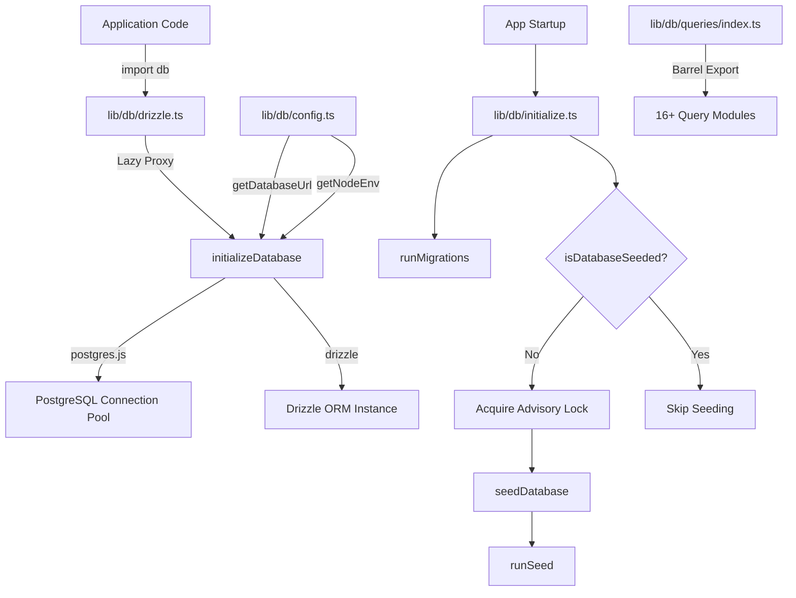
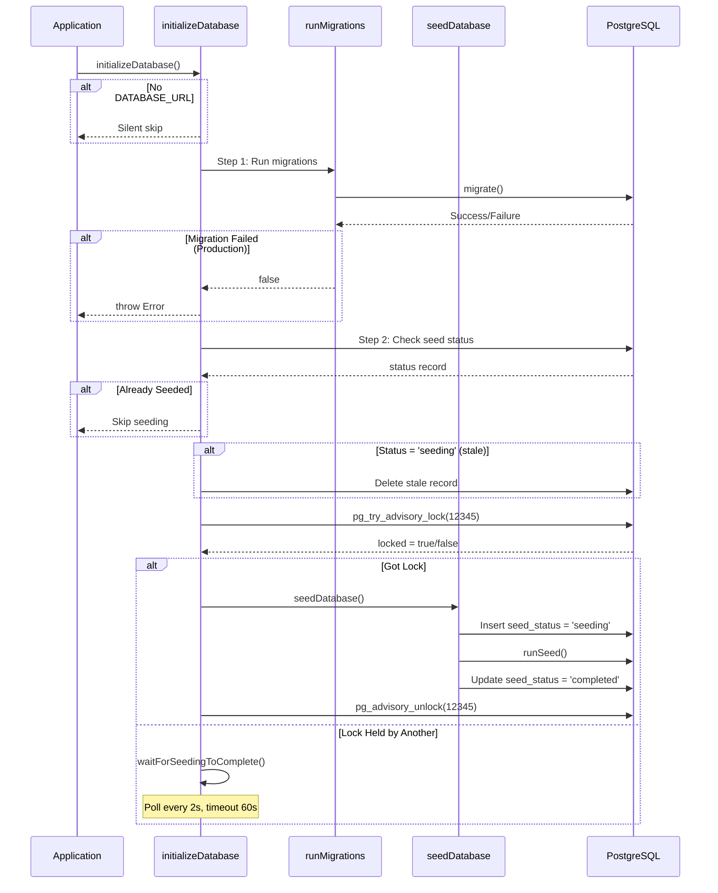

# מודול עזרי מסד נתונים

מודול עזרי מסד הנתונים (`template/lib/db/`) מנהל את איגום חיבורי PostgreSQL באמצעות `postgres.js`, אתחול Drizzle ORM, העברות אוטומטיות וזרימת מסד נתונים עם נעילה בטוחה במקביל. הוא נועד לעבוד בסביבות ללא שרתים (Vercel) שבהן מספר התחלות קרות יכולות להתחרות כדי לאתחל את מסד הנתונים.

## סקירה כללית של אדריכלות



## קבצי מקור

|קובץ|תיאור|
|------|-------------|
|`lib/db/config.ts`|תצורת מסד נתונים בטוחה בסקריפט (ללא `server-only`)|
|`lib/db/drizzle.ts`|בריכת חיבור ומופע טפטוף עם פרוקסי עצלן|
|`lib/db/initialize.ts`|הגירה אוטומטית ותזמור זריעה|
|`lib/db/migrate.ts`|רץ הגירה|
|`lib/db/queries/index.ts`|ייצוא חבית עבור כל מודולי השאילתה|

## תצורת מסד נתונים (`config.ts`)

פונקציות בטוחות לסקריפט ש**לא** מייבאות את `server-only`, ומאפשרות שימוש בהעברת סקריפטים וסרדטים:

```typescript
function getDatabaseUrl(): string | undefined;
function getNodeEnv(): 'development' | 'production' | 'test';
function isProduction(): boolean;
```

## חיבור ו-ORM (`drizzle.ts`)

### דפוס פרוקסי עצלן

הייצוא `db` משתמש ב-JavaScript `Proxy` כדי לדחות את אתחול החיבור עד לשימוש הראשון. זה מונע שגיאות חיבור במהלך זמן הבנייה כאשר `DATABASE_URL` ייתכן שלא יהיה זמין.

```typescript
// Proxy intercepts all property access and initializes on demand
export const db = new Proxy({} as ReturnType<typeof drizzle>, {
  get(target, prop) {
    const database = initializeDatabase();
    return database[prop as keyof typeof database];
  },
});
```

### תצורת מאגר חיבורים

```typescript
function getPoolSize(): number;
// - Reads DB_POOL_SIZE env var (clamped to 1-50)
// - Defaults: 20 (production), 10 (development)
```

הגדרות בריכה:
- `idle_timeout`: 20 שניות
- `connect_timeout`: 30 שניות
- `prepare`: false (נדרש עבור חלק מהסביבות ללא שרת)

### סינגלטון דרך `globalThis`

החיבור נמצא במטמון ב-`globalThis` כדי לשרוד את טעינת המודול החם של Next.js בפיתוח:

```typescript
const globalForDb = globalThis as unknown as {
  conn: postgres.Sql | undefined;
  db: ReturnType<typeof drizzle> | undefined;
};
```

### גישה ישירה למופע

למקרים הדורשים מופע טפטוף בפועל (למשל, מתאם NextAuth.js טפטוף):

```typescript
import { getDrizzleInstance } from '@/lib/db/drizzle';

const adapter = DrizzleAdapter(getDrizzleInstance(), { ... });
```

## רץ הגירה (`migrate.ts`)

### `runMigrations(): Promise<boolean>`

מפעיל העברת טפטוף מהתיקיה `./lib/db/migrations`. בטוח להתקשר לכל סטארט-אפ מכיוון שה-`migrate()` של Drrizzle הוא אידמפוטנטי -- הוא עוקב אחר העברות מיושמות בטבלה `__drizzle_migrations`.

```typescript
import { runMigrations } from '@/lib/db/migrate';

const success = await runMigrations();
if (!success) {
  console.error('Migrations failed -- run pnpm db:migrate manually');
}
```

**התנהגות:**
- רושם היסטוריית העברה אחרונה לפני ואחרי הביצוע
- מחזיר `true` על הצלחה, `false` על כישלון
- לא זורק -- כשלים נרשמים ומוחזרים כבוליאניים

## אתחול מסד הנתונים (`initialize.ts`)

### `initializeDatabase(): Promise<void>`

פונקציית האתחול הראשית נקראה בעת הפעלת האפליקציה. מטפל במחזור החיים המלא:



### בטיחות במקביל

מופעים מרובים ללא שרת יכולים להתחיל בו זמנית. המודול מונע זריעה כפולה באמצעות:

1. **נעילת ייעוץ PostgreSQL** (`pg_try_advisory_lock(12345)`) -- לא חוסם
2. **טבלת סטטוס זרעים** מעקב אחר `seeding`, `completed`, `failed` מדינות
3. **זיהוי עבש** -- סף של 5 דקות לסטטוס `seeding` תקוע
4. **המתן והסקר** -- מקרים שאינם יכולים להשיג את סקר הנעילה כל 2 שניות

### פונקציות עוזר

```typescript
// Check if database has been successfully seeded
async function isDatabaseSeeded(): Promise<boolean>;

// Wait for another instance to finish seeding (60s timeout, 2s intervals)
async function waitForSeedingToComplete(): Promise<boolean>;
```

## מודולי שאילתה

הספרייה `lib/db/queries/` מכילה מודולי שאילתה ספציפיים לדומיין, כולם מיוצאים מחדש באמצעות `index.ts`:

|מודול|דומיין|
|--------|--------|
|`activity.queries.ts`|רישום פעילויות|
|`auth.queries.ts`|אימות (חיפוש משתמש, אימות סיסמה)|
|`client.queries.ts`|פרופילי לקוחות|
|`comment.queries.ts`|הערות|
|`company.queries.ts`|פרופילי חברה|
|`dashboard.queries.ts`|נתונים סטטיסטיים של לוח המחוונים|
|`engagement.queries.ts`|צפיות, הצבעות, צבירת מועדפים|
|`item.queries.ts`|פריט CRUD|
|`location-index.queries.ts`|אינדקס מבוסס מיקום|
|`newsletter.queries.ts`|מנויים לניוזלטר|
|`payment.queries.ts`|רישומי תשלום|
|`report.queries.ts`|דוחות|
|`subscription.queries.ts`|מנויים|
|`survey.queries.ts`|סקרים ותגובות|
|`user.queries.ts`|ניהול משתמשים|
|`vote.queries.ts`|מערכת הצבעה|

### ייבוא דפוס

```typescript
import {
  getUserByEmail,
  getClientProfileByUserId,
  logActivity,
  isUserAdmin,
} from '@/lib/db/queries';
```

## משתני סביבה

|משתנה|חובה|תיאור|
|----------|----------|-------------|
|`DATABASE_URL`|לא (DB אופציונלי)|מחרוזת חיבור PostgreSQL|
|`DB_POOL_SIZE`|לא|גודל בריכת חיבור (ברירת מחדל: 10/20)|
|`NODE_ENV`|לא|קובע את ברירת המחדל של גודל הבריכה ורישום|
