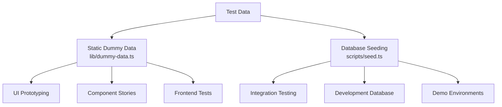
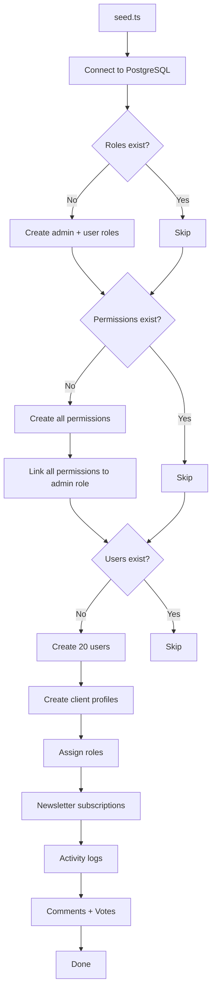
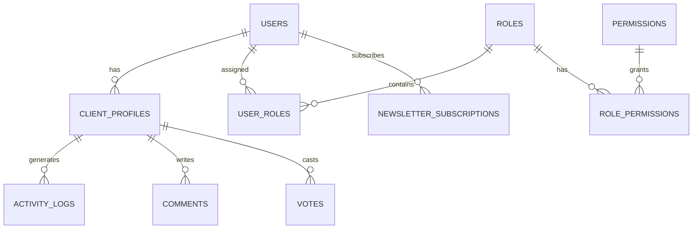

# מערכת נתונים דמה

התבנית מספקת שתי גישות לבדיקת נתונים: נתוני דמה סטטיים לפיתוח ממשק משתמש ויצירת אב טיפוס, ומערכת זריעה של מסד נתונים להפקת רשומות מציאותיות ב-PostgreSQL. יחד הם מכסים את מחזור חיי הפיתוח המלא מדגמים ועד בדיקות אינטגרציה.

## סקירה כללית



## נתוני דמה סטטיים

המודול `lib/dummy-data.ts` מייצא נתונים לדוגמה מוקלדים לשימוש ברכיבים במהלך הפיתוח.

### ממשק הגשה

```typescript
export interface Submission {
  id: string;
  title: string;
  description: string;
  status: "approved" | "pending" | "rejected";
  submittedAt: string | null;
  approvedAt?: string;
  rejectedAt?: string;
  rejectionReason?: string;
  category: string;
  tags: string[];
  views: number;
  likes: number;
}
```

### dummySubmissions

שש הגשות לדוגמה המכסות את כל מצבי הסטטוס:

|תעודה מזהה|כותרת|סטטוס|קטגוריה|צפיות|אוהב|
|---|---|---|---|---|---|
| 1 |פלטפורמת מסחר אלקטרוני מודרנית|אושר|פיתוח אתרים| 1250 | 89 |
| 2 |אפליקציית ניהול משימות|בהמתנה|פיתוח נייד| 567 | 23 |
| 3 |לוח המחוונים של מזג האוויר|נדחה|פיתוח אתרים| 890 | 45 |
| 4 |עוזר צ'אט בינה מלאכותית|אושר|AI/ML| 2100 | 156 |
| 5 |אפליקציית מעקב כושר|בהמתנה|פיתוח נייד| 432 | 18 |
| 6 |פלטפורמת בלוגים|בהמתנה|פיתוח אתרים| 0 | 0 |

שימוש ברכיבים:

```typescript
import { dummySubmissions } from '@/lib/dummy-data';

export function SubmissionList() {
  return (
    <div>
      {dummySubmissions.map((submission) => (
        <SubmissionCard key={submission.id} submission={submission} />
      ))}
    </div>
  );
}
```

### dummyPortfolio

שלושה פריטי תיק לדוגמא להצגת כרטיסי פרויקט:

|תעודה מזהה|כותרת|מוצגים|תגים|
|---|---|---|---|
| 1 |פלטפורמת מסחר אלקטרוני|כן|Next.js, Stripe, מסחר אלקטרוני|
| 2 |אפליקציית ניהול משימות|כן|תגובה, Firebase, בזמן אמת|
| 3 |לוח המחוונים של מזג האוויר|לא|Vue.js, Weather API, לוח מחוונים|

כל פריט תיק כולל:

```typescript
{
  id: string;
  title: string;
  description: string;
  imageUrl: string;      // Unsplash placeholder image
  externalUrl: string;   // Demo link
  tags: string[];
  isFeatured: boolean;
}
```

## זריעה של מסד נתונים

הסקריפט `scripts/seed.ts` מייצר נתונים מציאותיים ישירות ב-PostgreSQL באמצעות Drizzle ORM.

### זריעה ארכיטקטורה



### קשרי נתונים



### פרופילי משתמש שנוצרו

המזרע יוצר פרופילים עם וריאציה דטרמיניסטית:

```typescript
// Plan distribution
plan: i % 5 === 0 ? 'premium'    // 20% premium
    : i % 3 === 0 ? 'standard'   // ~13% standard
    : 'free';                     // ~67% free

// Job titles alternate
jobTitle: i % 2 === 0 ? 'Developer' : 'Designer';

// Companies alternate
company: i % 2 === 0 ? 'Acme Inc.' : 'Globex';

// Bios for every 3rd user
bio: i % 3 === 0 ? 'Power user' : null;
```

### דפוסי יומן פעילות

יומני פעילות עוברים במחזוריות של ארבעה סוגי פעולות:

|תבנית אינדקס|פעולה|תיאור|
|---|---|---|
|`i % 4 === 0`|`SIGN_UP`|יצירת חשבון|
|`i % 4 === 1`|`SIGN_IN`|אירוע התחברות|
|`i % 4 === 2`|`COMMENT`|התגובה פורסמה|
|`i % 4 === 3`|`VOTE`|הצביעו|

חותמות הזמן מחולקות באקראי במהלך 7 הימים האחרונים.

### חלוקת קולות

ההצבעות משתמשות בחלוקה של 75/25 המעדיפה הצבעות כלפי מעלה:

```typescript
voteType: i % 4 === 0 ? VoteType.DOWNVOTE : VoteType.UPVOTE
```

### תצורת חיבור

ה-Seeder משתמש בהגדרות חיבור שמרניות המתאימות לתסריטים:

```typescript
const conn = postgres(databaseUrl, {
  max: 1,              // Single connection (no pool needed)
  idle_timeout: 20,    // Close idle connections after 20s
  connect_timeout: 10, // 10-second connection timeout
  prepare: false,      // Disable prepared statements
});
```

## זריעה של מוצר פס

הסקריפט `scripts/seed-stripe-products.ts` יוצר את קטלוג החיובים ב-Stripe. עיין בתיעוד [סקריפטים של מסד נתונים](../development/database-scripts.md) עבור רשימת המוצרים המלאה.

## אידמונטיות

שתי גישות הזריעה נועדו להיות בטוחות לביצוע חוזר:

|סוג נתונים|מצב שומר|התנהגות בהפעלה מחדש|
|---|---|---|
|תפקידים|`SELECT * FROM roles LIMIT 1`|דלג אם קיימים|
|הרשאות|`SELECT * FROM permissions LIMIT 1`|דלג אם קיימים|
|משתמשים|`SELECT count(*) FROM users`|דלג אם ספירה > 0|
|ניוזלטר|כלול בבלוק יצירת משתמש|דילג עם משתמשים|

## שימוש ב-Dummy Data בפיתוח

### דפוס 1: יצירת אב טיפוס של רכיבים

השתמש בנתוני דמה סטטיים כדי לבנות רכיבי ממשק משתמש לפני שה-backend מוכן:

```typescript
import { dummySubmissions, type Submission } from '@/lib/dummy-data';

interface SubmissionCardProps {
  submission: Submission;
}

export function SubmissionCard({ submission }: SubmissionCardProps) {
  const statusColors = {
    approved: 'bg-green-100 text-green-800',
    pending: 'bg-yellow-100 text-yellow-800',
    rejected: 'bg-red-100 text-red-800',
  };

  return (
    <div className="p-4 border rounded-lg">
      <h3>{submission.title}</h3>
      <span className={statusColors[submission.status]}>
        {submission.status}
      </span>
      <p>{submission.description}</p>
      <div className="flex gap-2">
        {submission.tags.map(tag => (
          <span key={tag} className="badge">{tag}</span>
        ))}
      </div>
    </div>
  );
}
```

### תבנית 2: מוקאפים של לוח המחוונים

```typescript
import { dummySubmissions } from '@/lib/dummy-data';

// Derive stats from dummy data
const stats = {
  total: dummySubmissions.length,
  approved: dummySubmissions.filter(s => s.status === 'approved').length,
  pending: dummySubmissions.filter(s => s.status === 'pending').length,
  rejected: dummySubmissions.filter(s => s.status === 'rejected').length,
  totalViews: dummySubmissions.reduce((sum, s) => sum + s.views, 0),
};
```

### דפוס 3: החלף בנתונים אמיתיים

כאשר שילוב הקצה האחורי מוכן, החלף את הייבוא:

```typescript
// Before (dummy data)
import { dummySubmissions } from '@/lib/dummy-data';
const submissions = dummySubmissions;

// After (real data)
const submissions = await getSubmissions();
```

## הוספת נתוני דמה חדשים

בעת הוספת תכונות חדשות, הרחיב את `lib/dummy-data.ts` עם נתונים לדוגמה מוקלדים:

1. הגדר את ממשק TypeScript עבור צורת הנתונים
2. ייצא אותו לשימוש ברכיבים
3. צור ערכים לדוגמה המכסים מקרי קצה (שדות ריקים, מחרוזות באורך מקסימלי, כל ערכי הסטטוס)
4. השתמש בערכים מציאותיים (שמות פרטיים, כתובות אתרים חוקיות, מספרים סבירים)
5. כלול גם פריטים נבחרים וגם פריטים שאינם מוצגים במידת הצורך

```typescript
// Example: adding dummy reviews
export interface DummyReview {
  id: string;
  authorName: string;
  rating: number;
  comment: string;
  createdAt: string;
}

export const dummyReviews: DummyReview[] = [
  {
    id: "1",
    authorName: "Jane Developer",
    rating: 5,
    comment: "Excellent tool for rapid prototyping",
    createdAt: "2024-02-01T10:00:00Z"
  },
  // ... more entries covering 1-star, no comment, etc.
];
```
