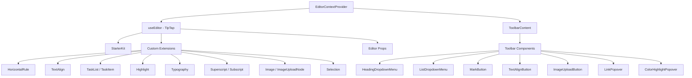

# מערכת עורך

התבנית כוללת עורך טקסט עשיר בנוי על TipTap (ProseMirror) עם ארכיטקטורה מודולרית של הרחבות, רכיבי סרגל כלים, ווים ופונקציות שירות. העורך תומך בכותרות, רשימות, רשימות משימות, תמונות, בלוקי קוד, עיצוב טקסט ועוד.

## סקירה כללית של אדריכלות



## קבצי מקור

|ספרייה|תוכן|
|-----------|----------|
|`lib/editor/extensions/`|הרחבת TipTap מייצאת מחדש ותצורה|
|`lib/editor/components/`|רכיבי ממשק משתמש (לחצני סרגל כלים, חלונות קופצים, סמלים)|
|`lib/editor/hooks/`|ווי תגובה לניהול מדינת העורך|
|`lib/editor/providers/`|ספק הקשר של עורך עם הגדרת הרחבה|
|`lib/editor/contents/`|פריסת סרגל הכלים ורכיבי תוכן עורך|
|`lib/editor/utils/`|פונקציות שירות (קיצורי דרך, אימות, העלאה)|

## תצורת הרחבה

הרחבות רשומות ב-`EditorContextProvider`. ה-`StarterKit` מספק פונקציונליות בסיסית, עם הרחבות נוספות בשכבות למעלה:

```typescript
const extensions = useMemo(() => [
  StarterKit.configure({
    horizontalRule: false,
    link: { openOnClick: false, enableClickSelection: true },
  }),
  HorizontalRule,
  TextAlign.configure({ types: ['heading', 'paragraph'] }),
  ImageUploadNode.configure({
    accept: 'image/*',
    maxSize: MAX_FILE_SIZE, // 5MB
    limit: 3,
    upload: handleImageUpload,
    onError: (error) => console.error('Upload failed:', error),
  }),
  TaskList,
  TaskItem.configure({ nested: true }),
  Highlight.configure({ multicolor: true }),
  Image,
  Typography,
  Superscript,
  Subscript,
  Selection,
], []);
```

### סיכום הרחבה

|הרחבה|מקור|מטרה|
|-----------|--------|---------|
|`StarterKit`|`@tiptap/starter-kit`|פסקאות, מודגשות, נטוי, רשימות, קוד, ציטוט בלוק|
|`HorizontalRule`|`@tiptap/extension-horizontal-rule`|חוצצים אופקיים|
|`TextAlign`|`@tiptap/extension-text-align`|שמאל, מרכז, ימין, הצדק יישור|
|`TaskList` / `TaskItem`|`@tiptap/extension-list`|רשימות תיבות סימון אינטראקטיביות|
|`Highlight`|`@tiptap/extension-highlight`|הדגשת טקסט רב צבעים|
|`Typography`|`@tiptap/extension-typography`|ציטוטים חכמים, מקפים, אליפסיס|
|`Superscript`|`@tiptap/extension-superscript`|טקסט בכתב-על|
|`Subscript`|`@tiptap/extension-subscript`|טקסט מנוי|
|`Selection`|`@tiptap/extensions`|טיפול משופר בבחירה|
|`Image`|`@tiptap/extension-image`|תצוגת תמונה סטטית|
|`ImageUploadNode`|מותאם אישית|העלאת תמונה עם התקדמות גרור ושחרר|

## ספק הקשר של עורך

העורך מסופק באמצעות React Context לגישה לכל העץ:

```typescript
export const EditorContext = createContext<Editor | null>(null);

export function EditorContextProvider({ children }: { children: React.ReactNode }) {
  const editor = useEditor({
    immediatelyRender: false,
    shouldRerenderOnTransaction: false,
    editorProps: {
      attributes: {
        autocomplete: 'on',
        autocorrect: 'on',
        autocapitalize: 'off',
        'aria-label': 'Main content area, start typing to enter text.',
        class: cn('min-h-96'),
      },
    },
    extensions,
  });

  return <EditorContext.Provider value={editor}>{children}</EditorContext.Provider>;
}
```

אפשרויות תצורה מרכזיות:
- `immediatelyRender: false` מונע אי התאמה של הידרציה של SSR
- `shouldRerenderOnTransaction: false` מייעל את הביצועים על ידי הימנעות מעיבודים חוזרים מיותרים

## תצורת סרגל הכלים

הרכיב `ToolbarContent` מגדיר את פריסת סרגל הכלים המלאה המאורגנת בקבוצות:

|קבוצה|רכיבים|
|-------|------------|
|היסטוריה|בטל, בצע שוב|
|סוגי בלוקים|כותרת נפתחת (H1-H4), רשימה נפתחת (כדור, הזמנה, משימה), Blockquote, Block Code|
|סימנים מוטבעים|מודגש, נטוי, חוצה, קוד, קו תחתון, הדגשת צבע, קישור|
|תסריט|כתב עילית, מנוי|
|יישור|שמאל, מרכז, ימין, הצדק|
|מדיה|העלאת תמונה|

קבוצות מופרדות על ידי `ToolbarSeparator` רכיבים עם `Spacer` אלמנטים למיקום.

## עורך הוקס

### `useTiptapEditor`

מספק גישה גמישה למופע העורך מאבזרים או מהקשר:

```typescript
export function useTiptapEditor(providedEditor?: Editor | null): {
  editor: Editor | null;
  editorState?: Editor["state"];
  canCommand?: Editor["can"];
}
```

הוק זה ממזג עורך שסופק ישירות עם עורך ההקשר, מה שמאפשר לרכיבים לעבוד הן עצמאיות והן בתוך עץ הספקים.

### ווים נוספים

|הוק|מטרה|
|------|---------|
|`use-editor.ts`|עורך הליבה ניהול המדינה|
|`use-editor-sync.ts`|סנכרון בין מופעי עורך|
|`use-cursor-visibility.ts`|מעקב אחר מיקום הסמן וראות|
|`use-element-rect.ts`|מעקב אחר מלבן תוחם אלמנט|
|`use-scrolling.ts`|מיקום והתנהגות גלילה|
|`use-throttled-callback.ts`|ביצוע התקשרות חוזרת מצערת|
|`use-window-size.ts`|מעקב אחר גודל חלון רספונסיבי|
|`use-unmount.ts`|ניקוי בעת ביטול ההרכבה של הרכיב|

## פונקציות שירות

### עיצוב מקשי קיצור

המערכת מטפלת בקיצורי מקשים ספציפיים לפלטפורמה:

```typescript
export const MAC_SYMBOLS: Record<string, string> = {
  mod: "Command", command: "Command", meta: "Command",
  ctrl: "Ctrl", alt: "Option", shift: "Shift",
  // ... additional mappings
};

export const formatShortcutKey = (key: string, isMac: boolean, capitalize?: boolean) => {
  // Returns Mac symbols or formatted key names
};

export const parseShortcutKeys = (props: {
  shortcutKeys: string | undefined;
  delimiter?: string;
  capitalize?: boolean;
}) => string[];
```

### אימות סכימה

```typescript
// Check if a mark type exists in the editor schema
export const isMarkInSchema = (markName: string, editor: Editor | null): boolean;

// Check if a node type exists in the editor schema
export const isNodeInSchema = (nodeName: string, editor: Editor | null): boolean;

// Check if extensions are registered
export function isExtensionAvailable(editor: Editor | null, extensionNames: string | string[]): boolean;
```

### ניווט בצומת

```typescript
// Find a node at a specific document position
export function findNodeAtPosition(editor: Editor, position: number): TiptapNode | null;

// Find a node by reference or position
export function findNodePosition(props: {
  editor: Editor | null;
  node?: TiptapNode | null;
  nodePos?: number | null;
}): { pos: number; node: TiptapNode } | null;

// Move focus to the next node
export function focusNextNode(editor: Editor): boolean;
```

### העלאת תמונה

```typescript
export const MAX_FILE_SIZE = 5 * 1024 * 1024; // 5MB

export const handleImageUpload = async (
  file: File,
  onProgress?: (event: { progress: number }) => void,
  abortSignal?: AbortSignal
): Promise<string>;
```

מטפל ההעלאה מאמת את גודל הקובץ, תומך במעקב אחר התקדמות ומטפל בביטול באמצעות `AbortSignal`.

### חיטוי כתובות אתרים

```typescript
export function isAllowedUri(uri: string | undefined, protocols?: ProtocolConfig): boolean;
export function sanitizeUrl(inputUrl: string, baseUrl: string, protocols?: ProtocolConfig): string;
```

מבטיח שרק פרוטוקולים בטוחים (`http`, `https`, `ftp`, `mailto` וכו') מותרים בקישורים. כתובות אתרים לא בטוחות מוחלפות ב-`"#"`.
