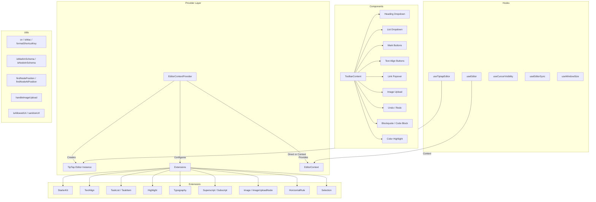

# מודול כלי עזר לעורך

מודול כלי עזר לעורך (`template/lib/editor/`) מספק פתרון מלא לעריכת טקסט עשיר הבנוי על **TipTap** (ProseMirror). הוא כולל ספק עורך מוגדר מראש, הרחבות TipTap, ספריית רכיבי סרגל כלים מלאה, פונקציות שירות למניפולציה של DOM, ו-React Hooks מותאמים אישית לניהול מצב עורך.

## סקירה כללית של אדריכלות



## קבצי מקור

|ספרייה|תיאור|
|-----------|-------------|
|`lib/editor/index.ts`|ייצוא חבית עבור כל תת-מודולי|
|`lib/editor/providers/`|`EditorContextProvider` ו-`EditorContext`|
|`lib/editor/extensions/`|תוסף TipTap מייצא מחדש|
|`lib/editor/hooks/`|ווי React מותאמים אישית|
|`lib/editor/utils/`|פונקציות שירות|
|`lib/editor/contents/`|`ToolbarContent` ו-`EditorContent` רכיבים|
|`lib/editor/components/`|פרימיטיבים של ממשק משתמש, לחצני סרגל כלים, אייקונים, צמתים|
|`lib/editor/styles/`|עורך סגנונות CSS|

## ספק עורך

### `EditorContextProvider`

עוטף ילדים עם מופע עורך TipTap מוגדר מראש:

```tsx
import { EditorContextProvider } from '@/lib/editor';

function MyEditor() {
  return (
    <EditorContextProvider>
      <ToolbarContent editor={null} />
      <EditorContent />
    </EditorContextProvider>
  );
}
```

### תצורה

הספק מגדיר את TipTap עם ההגדרות הבאות:

```typescript
const editor = useEditor({
  immediatelyRender: false,
  shouldRerenderOnTransaction: false,
  editorProps: {
    attributes: {
      autocomplete: 'on',
      autocorrect: 'on',
      autocapitalize: 'off',
      'aria-label': 'Main content area, start typing to enter text.',
      class: 'min-h-96',
    },
  },
  extensions: [/* ... */],
});
```

### הרחבות מוגדרות מראש

|הרחבה|תצורה|
|-----------|--------------|
|`StarterKit`|`horizontalRule: false`, `link.openOnClick: false`|
|`HorizontalRule`|ברירת מחדל|
|`TextAlign`|חל על צמתים `heading` ו-`paragraph`|
|`ImageUploadNode`|קבל: `image/*`, מקסימום 5MB, הגבלת 3 תמונות|
|`TaskList` / `TaskItem`|משימות מקוננות מופעלות|
|`Highlight`|ריבוי צבעים מופעל|
|`Image`|ברירת מחדל|
|`Typography`|ציטוטים ומקפים חכמים|
|`Superscript` / `Subscript`|ברירת מחדל|
|`Selection`|ברירת מחדל|

## ווים

### `useEditor(): Editor`

מאחזר את מופע העורך מה-`EditorContext`. חייב לשמש בתוך `EditorContextProvider`.

```typescript
import { useEditor } from '@/lib/editor';

function MyComponent() {
  const editor = useEditor();
  // editor is the TipTap Editor instance
}
```

### `useTiptapEditor(providedEditor?): { editor, editorState?, canCommand? }`

וו גמיש שמקבל מופע עורך אופציונלי או נופל חזרה להקשר של TipTap:

```typescript
import { useTiptapEditor } from '@/lib/editor/hooks';

function ToolbarButton({ editor: externalEditor }) {
  const { editor, editorState, canCommand } = useTiptapEditor(externalEditor);

  const isBold = editorState ? editor?.isActive('bold') : false;
  const canBold = canCommand ? canCommand().toggleBold() : false;
}
```

### ווים אחרים

|הוק|מטרה|
|------|---------|
|`useCursorVisibility`|עוקב אחר נראות מיקום הסמן בשדה התצוגה|
|`useEditorSync`|מסנכרן את תוכן העורך עם מצב חיצוני|
|`useElementRect`|עוקב אחר מלבן תוחם אלמנט|
|`useScrolling`|מזהה מצב גלילה|
|`useThrottledCallback`|מצערת פונקציית התקשרות חוזרת|
|`useUnmount`|מפעיל ניקוי בעת ביטול הרכבה של רכיב|
|`useWindowSize`|עוקב אחר מידות החלונות|

## פונקציות שירות

### עוזר שמות הכיתה

```typescript
function cn(...classes: (string | boolean | undefined | null)[]): string;
// Filters falsy values and joins with space
cn('min-h-96', isActive && 'bg-blue-500', undefined); // 'min-h-96 bg-blue-500'
```

### זיהוי פלטפורמה

```typescript
function isMac(): boolean;
// Returns true if navigator.platform includes 'mac'
```

### עיצוב מקשי קיצור

```typescript
function formatShortcutKey(key: string, isMac: boolean, capitalize?: boolean): string;
// Mac: 'ctrl' -> '???', 'alt' -> '???', 'shift' -> '???', 'meta' -> '???'
// Windows: 'ctrl' -> 'Ctrl'

function parseShortcutKeys(props: {
  shortcutKeys: string | undefined;
  delimiter?: string;    // default: '+'
  capitalize?: boolean;  // default: true
}): string[];
// 'ctrl+shift+b' -> ['???', '???', 'B'] (Mac) or ['Ctrl', 'Shift', 'B'] (Windows)
```

### בדיקת סכימה

```typescript
function isMarkInSchema(markName: string, editor: Editor | null): boolean;
// Checks if a mark type exists in the editor schema

function isNodeInSchema(nodeName: string, editor: Editor | null): boolean;
// Checks if a node type exists in the editor schema

function isExtensionAvailable(editor: Editor | null, extensionNames: string | string[]): boolean;
// Checks if one or more extensions are registered
// Logs a warning if none found
```

### פעולות צומת

```typescript
function findNodeAtPosition(editor: Editor, position: number): TiptapNode | null;
// Returns the node at the given document position

function findNodePosition(props: {
  editor: Editor | null;
  node?: TiptapNode | null;
  nodePos?: number | null;
}): { pos: number; node: TiptapNode } | null;
// Finds position by node reference or position number

function focusNextNode(editor: Editor): boolean;
// Moves cursor to the next node, creating a paragraph if at end

function isNodeTypeSelected(editor: Editor | null, types: string[]): boolean;
// Checks if current selection is a NodeSelection matching any type

function isValidPosition(pos: number | null | undefined): pos is number;
// Type guard for valid document positions (>= 0)
```

### העלאת תמונה

```typescript
const MAX_FILE_SIZE = 5 * 1024 * 1024; // 5MB

async function handleImageUpload(
  file: File,
  onProgress?: (event: { progress: number }) => void,
  abortSignal?: AbortSignal,
): Promise<string>;
// Returns the URL of the uploaded image
// Default implementation is a demo stub -- replace with actual upload logic
```

### אימות כתובת אתר

```typescript
function isAllowedUri(uri: string | undefined, protocols?: ProtocolConfig): boolean;
// Checks URI against allowed protocols:
// http, https, ftp, ftps, mailto, tel, callto, sms, cid, xmpp
// Plus any custom protocols passed in

function sanitizeUrl(inputUrl: string, baseUrl: string, protocols?: ProtocolConfig): string;
// Returns sanitized URL or '#' if not allowed
```

## תוכן סרגל הכלים

הרכיב `ToolbarContent` מספק סרגל כלים שלם ומוגדר מראש:

```tsx
import { ToolbarContent } from '@/lib/editor/contents';

<ToolbarContent editor={editor} />
```

### קבוצות סרגל כלים

|קבוצה|רכיבים|
|-------|-----------|
|בטל/בצע מחדש|`UndoRedoButton` (בטל, מחדש)|
|עיצוב בלוק|`HeadingDropdownMenu` (H1-H4), `ListDropdownMenu` (כדור, מסודר, משימה), `BlockquoteButton`, `CodeBlockButton`|
|עיצוב מוטבע|`MarkButton` (מודגש, נטוי, סטרייק, קוד, קו תחתון), `ColorHighlightPopover`, `LinkPopover`|
|כתב-על|`MarkButton` (כתב על, מנוי)|
|יישור טקסט|`TextAlignButton` (שמאל, מרכז, ימין, הצדק)|
|מדיה|`ImageUploadButton`|

## ספריית רכיבים

### רכיבים פרימיטיביים

רכיבי ממשק המשתמש הבסיסיים המשמשים את לחצני סרגל הכלים:

- `Badge`, `Button`, `Card`, `DropdownMenu`, `Input`, `Popover`, `Separator`, @@@TOK007@@TOK, @@TOK007@@@0, `Tooltip`

### רכיבי צומת

תצוגות צומת TipTap מותאמות אישית:

- `HorizontalRuleNode` -- הרחבת כלל אופקי מותאם אישית
- `ImageUploadNode` -- צומת העלאת קבצים עם גרירה ושחרור

### רכיבי סמל

סמלי SVG עבור כל פעולות סרגל הכלים (מודגש, נטוי, רמות כותרות, רשימות, יישור וכו').
