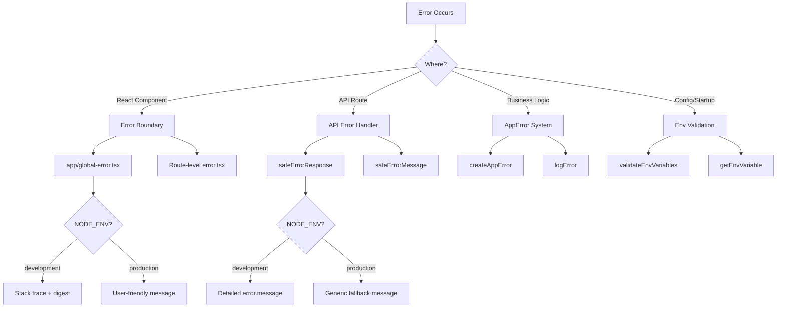

# דפוסי טיפול בשגיאות

## סקירה כללית

תבנית Ever Works מיישמת אסטרטגיית טיפול בשגיאות רב-שכבתית המכסה את גבולות השגיאה של React, תגובות שגיאות בנתיב API, שגיאות הקלדה ביישום ואימות משתני סביבה. העיצוב נותן עדיפות לאבטחה (ללא דליפת מידע בייצור) תוך שמירה על ניפוי באגים ידידותי למפתחים בפיתוח.

## אדריכלות



## קבצי מקור

|קובץ|מטרה|
|------|---------|
|`template/app/global-error.tsx`|גבול שגיאת תגובה ברמת השורש|
|`template/app/not-found.tsx`|עמוד 404 לא נמצא|
|`template/lib/utils/api-error.ts`|כלי עזר לשגיאת נתיב API|
|`template/lib/utils/error-handler.ts`|סוגי שגיאות יישומים ורישום|
|`template/lib/auth/error-handler.ts`|טיפול בשגיאות ספציפיות לאימות|

## גבולות שגיאה של תגובה

### גבול שגיאה גלובלי

הקובץ `global-error.tsx` תופס שגיאות לא מטופלות בשורש היישום:

```typescript
'use client';

export default function GlobalError({
    error,
    reset,
}: {
    error: Error & { digest?: string };
    reset: () => void;
}) {
    useEffect(() => {
        console.error(error);
    }, [error]);

    return (
        <html lang="en">
            <body>
                <h1>Something went wrong!</h1>
                {process.env.NODE_ENV !== 'production' && (
                    <div>
                        <p className="text-red-600">{error.message}</p>
                        {error.stack && <pre>{error.stack}</pre>}
                        {error.digest && <p>Error ID: {error.digest}</p>}
                    </div>
                )}
                <Button onPress={() => reset()}>Refresh</Button>
                <Link href="/">Go Home</Link>
            </body>
        </html>
    );
}
```

התנהגויות מפתח:
- **פיתוח**: מציג הודעת שגיאה, מעקב מחסנית ותקציר שגיאות
- **ייצור**: מציג רק הודעה כללית
- **תקציר שגיאות**: מזהה ייחודי שנוצר על ידי Next.js עבור מתאם שגיאות בצד השרת
- **פונקציית איפוס**: מעבד מחדש את תת-עץ גבול השגיאה
- **HTML עצמאי**: כולל תגיות `<html>` ו-`<body>` משלו מאחר שהוא מחליף את כל הדף

### עמוד לא נמצא

```typescript
'use client';

export default function NotFound() {
    const router = useRouter();
    return (
        <div>
            <h1>404</h1>
            <h2>Page Not Found</h2>
            <Button onClick={() => router.back()}>Go Back</Button>
            <Button onClick={() => router.push('/')}>Back to Home</Button>
        </div>
    );
}
```

## טיפול בשגיאות API

### safeErrorResponse

כלי השירות העיקרי עבור תגובות שגיאה בנתיב API:

```typescript
export function safeErrorResponse(
    error: unknown,
    fallbackMessage: string,
    status: number = 500
): NextResponse {
    const detail = error instanceof Error ? error.message : String(error);

    // Always log full details server-side
    console.error(`[API Error] ${fallbackMessage}:`, detail);

    const message = process.env.NODE_ENV === "development" ? detail : fallbackMessage;

    return NextResponse.json({ success: false, error: message }, { status });
}
```

שימוש במסלולי API:

```typescript
export async function GET(request: NextRequest) {
    try {
        const result = await someOperation();
        return NextResponse.json(result);
    } catch (error) {
        return safeErrorResponse(error, 'Failed to process request');
    }
}
```

### safeErrorMessage

במקרים שבהם אתה צריך את מחרוזת השגיאה מבלי ליצור תגובה:

```typescript
export function safeErrorMessage(error: unknown, fallbackMessage: string): string {
    if (process.env.NODE_ENV === "development") {
        return error instanceof Error ? error.message : String(error);
    }
    return fallbackMessage;
}
```

## מערכת שגיאות אפליקציה

### סוגי שגיאות

```typescript
export enum ErrorType {
    AUTH = 'auth',
    CONFIG = 'config',
    DATABASE = 'database',
    NETWORK = 'network',
    VALIDATION = 'validation',
    UNKNOWN = 'unknown'
}

export interface AppError {
    message: string;
    type: ErrorType;
    code?: string;
    originalError?: unknown;
}
```

### יצירת שגיאות הקלדה

```typescript
import { createAppError, ErrorType } from '@/lib/utils/error-handler';

const error = createAppError(
    'Failed to configure OAuth providers',
    ErrorType.CONFIG,
    'OAUTH_CONFIG_FAILED',
    originalError
);
```

### רישום שגיאות מובנה

```typescript
import { logError } from '@/lib/utils/error-handler';

// Logs: [CONFIG] [Auth Config]: Failed to configure OAuth providers
// Logs: Error code: OAUTH_CONFIG_FAILED
// Logs: Original error: <original error details>
logError(error, 'Auth Config');
```

הפונקציה `logError` מטפלת בשלוש צורות שגיאה:
1. **AppError** - יומן מובנה עם סוג, קוד ושגיאה מקורית
2. **שגיאה** -- יומן רגיל עם הודעה ומעקב מחסנית
3. **לא ידוע** -- יומן חוזר עם כפיית מיתר

### אימות משתנה סביבתי

```typescript
import { validateEnvVariables, getEnvVariable } from '@/lib/utils/error-handler';

// Validate multiple variables at once
const validationError = validateEnvVariables([
    'DATABASE_URL', 'AUTH_SECRET', 'CRON_SECRET'
]);
if (validationError) {
    logError(validationError, 'Startup');
}

// Get a single required variable (throws if missing)
const dbUrl = getEnvVariable('DATABASE_URL');

// Get an optional variable
const optional = getEnvVariable('OPTIONAL_VAR', false);
```

## טיפול בשגיאות ב-Auth

תצורת האימות משתמשת בהשפלה חיננית:

```typescript
const configureProviders = () => {
    try {
        const oauthProviders = configureOAuthProviders();
        return createNextAuthProviders({ /* full config */ });
    } catch (error) {
        const appError = createAppError(
            'Failed to configure OAuth providers. Falling back to credentials only.',
            ErrorType.CONFIG,
            'OAUTH_CONFIG_FAILED',
            error
        );
        logError(appError, 'Auth Config');

        // Fallback to credentials only
        return createNextAuthProviders({
            credentials: { enabled: true },
            google: { enabled: false },
            github: { enabled: false },
            facebook: { enabled: false },
            twitter: { enabled: false },
        });
    }
};
```

אם תצורת ספק OAuth נכשלת, המערכת חוזרת לאימות אישורים בלבד במקום לקרוס.

## שגיאה בטיפול בזרימה לפי שכבה

|שכבה|אסטרטגיה|התנהגות הפקה|
|-------|----------|-------------------|
|רכיבי תגובה|גבול שגיאה (`global-error.tsx`)|הודעה כללית, ללא עקבות מחסנית|
|מסלולי API|`safeErrorResponse()`|הודעת סתירה כללית|
|פעולות שרת|`validatedAction()` תופס שגיאות Zod|הודעת שגיאה ראשונה של אימות|
|Auth Config|נסה/תפוס עם `createAppError()`|השפלה חיננית לתעודות|
|קרון ג'ובס|נסה/תפוס + רישום מובנה|שגיאה נרשמה, התגובה הוחזרה|
|Webhooks|נסה/תפוס + 400 תגובה|הודעת כשל כללית לספק|

## שיטות עבודה מומלצות

1. **לעולם אל תחשוף חלקים פנימיים בייצור** -- השתמש תמיד ב-`safeErrorResponse` עבור מסלולי API
2. **תיעוד הכל בצד השרת** -- פרטי השגיאה המלאים עוברים למסוף/רישום ללא קשר לסביבה
3. **השתמש בשגיאות הקלדה** -- `createAppError` עם `ErrorType` לסיווג עקבי
4. **השפלה חיננית** -- חזור לפונקציונליות מופחתת במקום לקרוס
5. **תקצירי שגיאות עבור מתאם** -- השתמש בשדה `digest` משגיאות Next.js כדי להתחקות אחר בעיות בצד השרת
6. **אמת בגבולות** -- בדוק את ה-env vars בהפעלה, אמת את הקלט בגבולות ה-API
