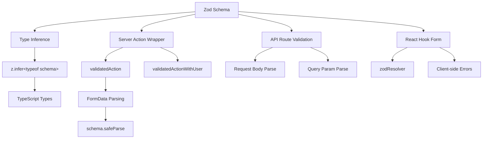

# דפוסי אימות טפסים

## סקירה כללית

תבנית Ever Works משתמשת ב-**Zod** כמקור האמת היחיד לאימות נתונים על פני גבולות הלקוח והשרת כאחד. סכימות אימות מאורגנות ב-`lib/validations/` ונצרכות על ידי:

- **פעולות שרת** באמצעות עטיפות `validatedAction()` ו-`validatedActionWithUser()`
- **מטפלי נתיב API** לאימות גוף הבקשה/פרמטר שאילתה
- אינטגרציה של **React Hook Form** לאימות טפסים בצד הלקוח
- **הקש מסקנות** באמצעות `z.infer<>` לבטיחות סוג מקצה לקצה

## אדריכלות



## קבצי מקור

|קובץ|מטרה|
|------|---------|
|`template/lib/validations/auth.ts`|סכימת אימות סיסמה|
|`template/lib/validations/company.ts`|סכימות CRUD של החברה|
|`template/lib/validations/client-item.ts`|הגשת/עדכון סכימות של פריט לקוח|
|`template/lib/validations/client-dashboard.ts`|סכימות שאילתות בלוח המחוונים|
|`template/lib/validations/sponsor-ad.ts`|סכימות מחזור חיים של מודעות חסות|
|`template/lib/validations/item.ts`|סכימת נתוני מיקום|
|`template/lib/validations/user-location.ts`|סכימת הגדרות מיקום משתמש|
|`template/lib/auth/middleware.ts`|`validatedAction` / `validatedActionWithUser` כלי עזר|

## דפוסי סכימת אימות

### תבנית 1: אימות סיסמה עם כללים משורשרים

```typescript
import { z } from "zod";

export const passwordSchema = z
    .string()
    .min(8, "Password must be at least 8 characters")
    .regex(/[A-Z]/, "Password must contain at least one uppercase letter")
    .regex(/[a-z]/, "Password must contain at least one lowercase letter")
    .regex(/[0-9]/, "Password must contain at least one number")
    .regex(/[^A-Za-z0-9]/, "Password must contain at least one special character");
```

סכימה זו אוכפת דרישות סיסמה חזקות באמצעות חידודים משורשרים. כל `.regex()` מספק הודעת שגיאה ספציפית שממשק המשתמש יכול להציג בשורה.

### דפוס 2: צור/עדכן צמדי סכימה

אימות החברה מדגים את דפוס היצירה/עדכון:

```typescript
export const createCompanySchema = z.object({
    name: z.string().min(1, "Company name is required").max(255),
    website: z.string().url("Invalid URL format").optional().or(z.literal("")),
    domain: z.string().max(255).optional()
        .transform((val) => val?.toLowerCase().trim() || undefined),
    slug: z.string().max(255).optional()
        .transform((val) => val?.toLowerCase().trim() || undefined)
        .refine(
            (val) => !val || /^[a-z0-9-]+$/.test(val),
            { message: "Slug must contain only lowercase letters, numbers, and hyphens" }
        ),
    status: z.enum(companyStatus).default("active"),
});

export const updateCompanySchema = z.object({
    id: z.string().uuid(),
    name: z.string().min(1).max(255).optional(),  // Optional for updates
    // ... other fields also optional
    status: z.enum(companyStatus).optional(),
});
```

הבדלים מרכזיים:
- **צור סכימות** יש שדות חובה עם ברירות מחדל
- **עדכון סכימות** דורשות `id` והפיכת כל שאר השדות לאופציונליים
- שניהם חולקים `.transform()` היגיון לנורמליזציה (למשל, שבלולים קטנים)

### דפוס 3: שדות סטטוס מבוססי-Enum

```typescript
export const companyStatus = ["active", "inactive"] as const;
export const itemStatus = ['pending', 'approved', 'rejected'] as const;
export const sponsorAdStatuses = [
    "pending_payment", "pending", "rejected",
    "active", "expired", "cancelled",
] as const;

// Usage in schemas
status: z.enum(companyStatus).default("active"),
status: z.enum(sponsorAdStatuses).optional(),
```

שימוש במערכים `as const` עם `z.enum()` מספק גם אימות של זמן ריצה וגם בטיחות מסוג זמן קומפילציה.

### דפוס 4: סכימות פרמטר שאילתות עם טרנספורמציות

```typescript
export const clientItemsListQuerySchema = z.object({
    page: z.string().optional()
        .transform(val => (val ? parseInt(val, 10) : 1))
        .refine(val => !Number.isNaN(val), { message: 'Page must be a valid number' })
        .refine(val => val >= 1, { message: 'Page must be at least 1' }),
    limit: z.string().optional()
        .transform(val => (val ? parseInt(val, 10) : 10))
        .refine(val => val >= 1 && val <= 100, { message: 'Limit must be between 1 and 100' }),
    status: z.enum(clientStatusFilter).optional().default('all'),
    search: z.string().max(100, 'Search query is too long').optional(),
    sortBy: z.enum(['name', 'updated_at', 'status', 'submitted_at']).optional().default('updated_at'),
    sortOrder: z.enum(['asc', 'desc']).optional().default('desc'),
    deleted: z.string().optional().transform(val => val === 'true'),
});
```

פרמטרי שאילתה מגיעים כמחרוזות. הסכימה משתמשת ב-@@TOK000@@@ כדי להמיר אותם לסוגים הנכונים (מספרים, בוליאנים) תוך החלת אימות וברירות מחדל.

### דפוס 5: סכימות אובייקט מקוננות עם אימות חוצה שדות

```typescript
export const updateLocationSchema = z
    .object({
        defaultLatitude: z.number().min(-90).max(90).nullable().optional(),
        defaultLongitude: z.number().min(-180).max(180).nullable().optional(),
        defaultCity: z.string().max(200).nullable().optional(),
        defaultCountry: z.string().max(100).nullable().optional(),
        locationPrivacy: locationPrivacySchema.optional(),
    })
    .refine(
        (data) => {
            const hasLat = data.defaultLatitude != null;
            const hasLng = data.defaultLongitude != null;
            return hasLat === hasLng;  // Both or neither
        },
        { message: 'Both latitude and longitude must be provided together' }
    );
```

ה-`.refine()` ברמת האובייקט מאמת תלות בין שדות -- קו הרוחב והאורך חייבים להיות נוכחים או שניהם נעדרים.

### דפוס 6: סוגי איגוד לכניסות גמישות

```typescript
category: z.union([
    z.string().min(1, 'Category is required'),
    z.array(z.string().min(1)).min(1, 'At least one category is required'),
]).optional().nullable(),
```

זה מקבל גם מחרוזת בודדת וגם מערך של מחרוזות עבור שדה הקטגוריה, המתאים לסוגי קלט טפסים שונים.

## אימות צד שרת

### validatedAction Wrapper

```typescript
export function validatedAction<S extends z.ZodType<any, any>, T>(
    schema: S,
    action: ValidatedActionFunction<S, T>
) {
    return async (prevState: ActionState, formData: FormData): Promise<T> => {
        const result = schema.safeParse(Object.fromEntries(formData));
        if (!result.success) {
            return { error: result.error.issues[0].message } as T;
        }
        return action(result.data, formData);
    };
}
```

פונקציה זו מסדר גבוה:
1. ממירה `FormData` לאובייקט רגיל
2. מאמת כנגד סכימת Zod באמצעות `safeParse()`
3. מחזירה את שגיאת האימות הראשונה אם אינה חוקית
4. קורא לפונקציית הפעולה עם נתונים מנותחים ומוקלדים אם הם חוקיים

### validatedActionWithUser Wrapper

```typescript
export function validatedActionWithUser<S extends z.ZodType<any, any>, T>(
    schema: S,
    action: ValidatedActionWithUserFunction<S, T>
) {
    return async (prevState: ActionState, formData: FormData): Promise<T> => {
        const session = await auth();
        if (!session?.user) {
            throw new Error("User is not authenticated");
        }
        const result = schema.safeParse(Object.fromEntries(formData));
        if (!result.success) {
            return { error: result.error.issues[0].message } as T;
        }
        return action(result.data, formData, session.user);
    };
}
```

זה מוסיף בדיקת אימות לפני אימות, ומעביר את האובייקט המאומת `user` לפונקציית הפעולה.

## הקלד מסקנות

כל סכימה מייצאת סוגי TypeScript משוערים:

```typescript
export type CreateCompanyInput = z.infer<typeof createCompanySchema>;
export type UpdateCompanyInput = z.infer<typeof updateCompanySchema>;
export type ClientUpdateItemInput = z.infer<typeof clientUpdateItemSchema>;
export type ClientCreateItemInput = z.infer<typeof clientCreateItemSchema>;
```

סוגים אלה משמשים לאורך שכבת השירות ומסלולי ה-API, מה שמבטיח שצורת הנתונים המאומתת תואמת למה שהלוגיקה העסקית מצפה.

## שיטות עבודה מומלצות

1. **סכימה בודדת, צרכנים מרובים** -- הגדר פעם אחת ב-`lib/validations/`, השתמש בכל מקום
2. **המרה בגבול** -- השתמש ב-`.transform()` כדי להמיר מחרוזות לסוגים מתאימים
3. **הודעות שגיאה מותאמות אישית** -- כל כלל אימות כולל הודעה ידידותית למשתמש
4. **תת-סכימות משותפות** -- שימוש חוזר בסכימות כמו `locationSchema` ו-`passwordSchema` בכל הטפסים
5. **הסק סוגים מסכימות** -- לעולם אל תגדיר ידנית סוגים המשכפלים הגדרות סכימה
6. **אימות חוצה שדות** -- השתמש ב-@@TOK000@@@ ברמת האובייקט עבור חוקים מרובי שדות
7. **ברירות מחדל הגיוניות** -- השתמש ב-`.default()` עבור שדות אופציונליים עם ערכים סטנדרטיים
