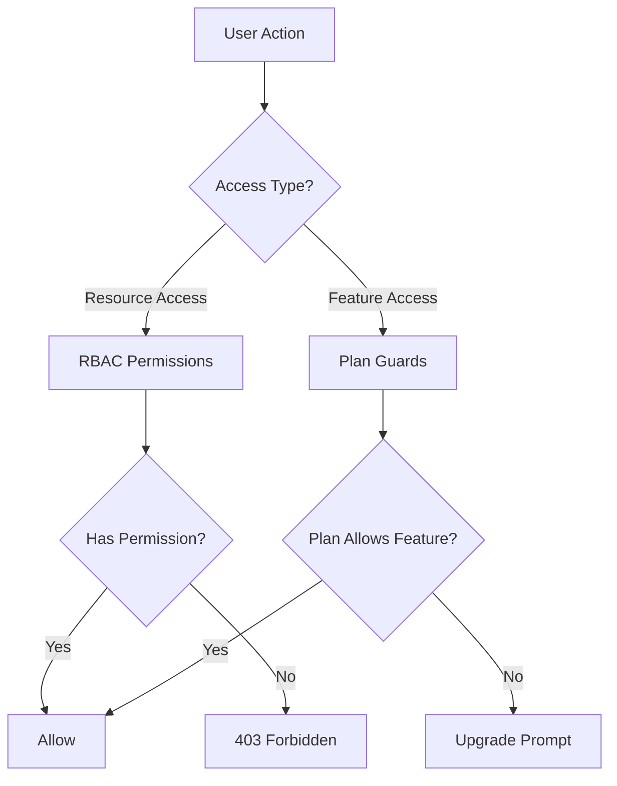
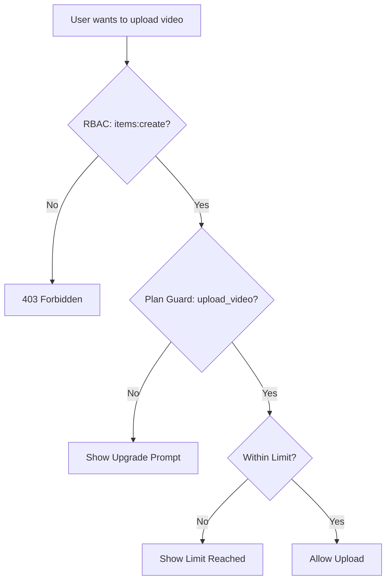

# מערכת שומרים ואישורים

תבנית Ever Works מיישמת מערכת בקרת גישה דו-שכבתית: **הרשאות RBAC** עבור גישה למשאבים מבוססת תפקידים ו**שומרי תוכנית** עבור שער תכונות מבוססות מנוי. יחד, מערכות אלו שולטות במה המשתמשים יכולים לעשות ולאילו תכונות הם יכולים לגשת.

## ארכיטקטורת מערכת



## מערכת הרשאות RBAC

### הגדרות הרשאה

כל ההרשאות מוגדרות ב-`lib/permissions/definitions.ts` בפורמט `resource:action`:

```typescript
const PERMISSIONS = {
  items: {
    read: 'items:read',
    create: 'items:create',
    update: 'items:update',
    delete: 'items:delete',
    review: 'items:review',
    approve: 'items:approve',
    reject: 'items:reject',
  },
  categories: { read, create, update, delete },
  tags: { read, create, update, delete },
  roles: { read, create, update, delete },
  users: { read, create, update, delete, assignRoles },
  analytics: { read, export },
  system: { settings },
} as const;
```

### סוג הרשאה

הסוג `Permission` נגזר מהאובייקט `PERMISSIONS` const, מה שמבטיח בטיחות סוג:

```typescript
type Permission = 'items:read' | 'items:create' | ... | 'system:settings';
```

### תפקידי ברירת מחדל

שני תפקידי ברירת מחדל מוגדרים מראש:

|תפקיד|תעודה מזהה|הרשאות|
|---|---|---|
|מנהל על|`super-admin`|כל הרשאות המערכת|
|מנהל תוכן|`content-manager`|פריטים + קטגוריות + תגיות (CRUD מלא + סקירה)|

### קבוצות הרשאה

ההרשאות מאורגנות בקבוצות ידידותיות לממשק המשתמש ב-`lib/permissions/groups.ts`:

|קבוצה|סמל|משאבים כלולים|
|---|---|---|
|ניהול תוכן|`FileText`|פריטים, קטגוריות, תגיות|
|ניהול משתמשים|`Users`|משתמשים, תפקידים|
|מערכת ואנליטיקה|`Settings`|אנליטיקה, מערכת|

### פונקציות שירות

המודול `lib/permissions/utils.ts` מספק כלי עזר לניהול מצב עבור ממשק המשתמש של ההרשאות:

```typescript
// Create a permission state map for checkboxes
const state = createPermissionState(currentPermissions);
// { 'items:read': true, 'items:create': true, ... }

// Get selected permissions from state
const selected = getSelectedPermissions(state);

// Calculate changes between old and new permissions
const changes = calculatePermissionChanges(original, updated);
// { added: ['items:delete'], removed: ['tags:create'] }

// Compare two permission sets
const equal = arePermissionsEqual(perms1, perms2);

// Filter permissions by search term
const filtered = filterPermissions(allPerms, 'items');
```

## מערכת משמרות תוכנית

שומרי התוכנית שולטים בגישה לתכונות על סמך תוכנית המנוי של המשתמש. המערכת מוגדרת ב-`lib/guards/plan-features.guard.ts`.

### היררכיית תוכניות

```typescript
const PLAN_LEVELS: Record<string, number> = {
  free: 1,
  standard: 2,
  premium: 3,
};
```

### הגדרות תכונה

כל התכונות הסגורות רשומות ב-`FEATURES`:

|קטגוריה|תכונות|
|---|---|
|הגשה|`submit_product`, `extended_description`, `unlimited_description`, `upload_images`, `upload_video`|
|תגים|`verified_badge`, `sponsored_badge`|
|סקירה|`priority_review`, `instant_review`|
|נראות|`search_visibility`, `category_placement`, `sponsored_position`, `homepage_featured`, `newsletter_mention`|
|אנליטיקס|`view_statistics`, `advanced_analytics`|
|תמיכה|`email_support`, `priority_email_support`, `phone_support`|
|חברתי|`social_sharing`, `learn_more_button`|
|אחר|`free_modifications`, `unlimited_submissions`|

### מטריצת גישה לתכונה

כל תכונה ממפה לכלל גישה:

|סוג גישה|תחביר|דוגמה|
|---|---|---|
|כל התוכניות|`'all'`|`submit_product`, `upload_images`|
|תוכנית יחידה|`PaymentPlan.PREMIUM`|`upload_video`, `instant_review`|
|תוכנית מינימום|`{ minPlan: PaymentPlan.STANDARD }`|`verified_badge`, `priority_review`|
|תוכניות ספציפיות|`[PaymentPlan.STANDARD, PaymentPlan.PREMIUM]`|(תכונות מותאמות אישית)|

### גבולות תוכנית

מגבלות מספריות משתנות בהתאם לתוכנית:

|הגבלה|חינם|סטנדרטי|פרימיום|
|---|---|---|---|
|`max_images`| 1 | 5 |ללא הגבלה|
|`max_description_words`| 200 | 500 |ללא הגבלה|
|`max_submissions`| 1 | 10 |ללא הגבלה|
|`review_days`| 7 | 3 | 1 |
|`free_modification_days`| 0 | 30 | 365 |

### שימוש בשומר בצד השרת

```typescript
import { canAccessFeature, createPlanGuard, FEATURES } from '@/lib/guards';

// Simple check
const allowed = canAccessFeature(FEATURES.UPLOAD_VIDEO, userPlan);

// Guard factory for multiple checks
const guard = createPlanGuard(userPlan);
guard.canAccess(FEATURES.VERIFIED_BADGE);       // boolean
guard.requireFeature(FEATURES.UPLOAD_VIDEO);     // throws PlanGuardError
guard.getLimit('max_images');                    // number | null
guard.isWithinLimit('max_submissions', count);   // boolean
guard.getAccessibleFeatures();                   // Feature[]
```

### PlanGuardError

כאשר `requireFeature` נכשל, הוא זורק שגיאת הקלדה:

```typescript
class PlanGuardError extends Error {
  feature: Feature;      // e.g., 'upload_video'
  userPlan: string;      // e.g., 'free'
  requiredPlan: PaymentPlan; // e.g., 'premium'
}
```

### וו מגן צד לקוח

החיבור `usePlanGuard` ב-`hooks/use-plan-guard.ts` עוטף את מערכת השמירה עבור רכיבי React:

```typescript
import { usePlanGuard, FEATURES } from '@/hooks/use-plan-guard';

function VideoUploadButton() {
  const { canAccess, requireUpgrade, isLoading } = usePlanGuard();

  if (isLoading) return <Spinner />;

  const upgradePlan = requireUpgrade(FEATURES.UPLOAD_VIDEO);
  if (upgradePlan) {
    return <UpgradePrompt plan={upgradePlan} />;
  }

  return <Button>Upload Video</Button>;
}
```

### ווים מיוחדים

#### `useFeatureAccess`

בדוק גישה לתכונה בודדת:

```typescript
const { hasAccess, requiredPlan, isLoading } = useFeatureAccess(FEATURES.VERIFIED_BADGE);
```

#### `useFeatureLimit`

בדוק מגבלות מספריות עם ספירה שנותרה:

```typescript
const { limit, isUnlimited, remaining, isWithinLimit } = useFeatureLimit('max_images', currentCount);

if (!isUnlimited && remaining <= 0) {
  return <LimitReached />;
}
```

## מלחין גארדים

השומרים מרכיבים באופן טבעי עבור תרחישי בקרת גישה מורכבים:

```typescript
// Server: Combine RBAC + plan check
function canCreateItem(userPermissions: UserPermissions, userPlan: string): boolean {
  const hasRBACAccess = hasPermission(userPermissions, 'items:create');
  const hasPlanAccess = canAccessFeature(FEATURES.SUBMIT_PRODUCT, userPlan);
  return hasRBACAccess && hasPlanAccess;
}

// Client: Combine hooks
function CreateItemButton() {
  const { canAccess } = usePlanGuard();
  const { permissions } = useRolePermissions();

  const canCreate =
    hasPermission(permissions, 'items:create') &&
    canAccess(FEATURES.SUBMIT_PRODUCT);

  if (!canCreate) return null;
  return <Button>Create Item</Button>;
}
```

## תרשים זרימת משמר



## הוספת שומרים חדשים

### הוספת הרשאה חדשה

1. הוסף ל-`PERMISSIONS` ב-`lib/permissions/definitions.ts`:

```typescript
billing: {
  read: 'billing:read',
  manage: 'billing:manage',
},
```

2. הוסף לקבוצת הרשאות ב-`lib/permissions/groups.ts`
3. הקצה לתפקידי ברירת מחדל מתאימים

### הוספת תכונת תוכנית חדשה

1. הוסף את קבוע התכונה ל-`FEATURES` ב-`lib/guards/plan-features.guard.ts`
2. הגדר את כלל הגישה ב-`FEATURE_ACCESS`
3. אפשר להוסיף מגבלות מספריות ל-`PLAN_LIMITS`

## שיטות עבודה מומלצות

1. **העדיפו שומרי תוכנית עבור דלתות תכונה** ו-RBAC עבור בקרת גישה למשאבים -- אל תערבבו אותם.
2. **בדוק תמיד בשרת** גם אם הלקוח מסתיר רכיבי ממשק משתמש -- בדיקות בצד הלקוח מיועדות ל-UX בלבד.
3. **השתמש ב-`createPlanGuard`** עבור מספר בדיקות באותה בקשה כדי למנוע חיפושים חוזרים של תוכנית.
4. **טפל במצבי טעינה** ב-hooks -- נתוני התוכנית עשויים להיטען באופן אסינכרוני משירות המנויים.
5. **שמור על שמות מאפיינים תיאוריים** -- השתמש ב-`upload_video` לא ב-`feature_3` לבהירות ביומנים ובהודעות שגיאה.
