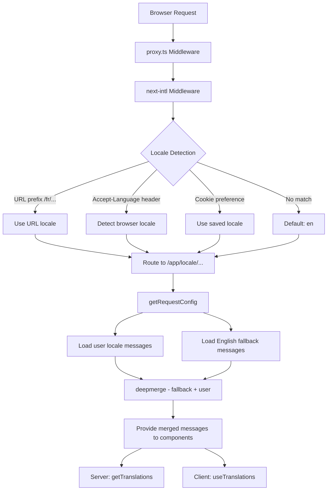

# יישום i18n

## סקירה כללית

תבנית Ever Works מיישמת בינלאומיזציה באמצעות **next-intl** עם תמיכה ב-20+ מקומות, כיוון טקסט RTL (מימין לשמאל), מיזוג עמוק של מסרים וניווט מודע לאזור. המערכת בנויה סביב שלוש שכבות: תצורת ניתוב, טעינת הודעות עם סתירה, ועוזרי ניווט מודעים לאזור.

## אדריכלות



## קבצי מקור

|קובץ|מטרה|
|------|---------|
|`template/i18n/routing.ts`|תצורת ניתוב מקומי|
|`template/i18n/request.ts`|טעינת הודעה בהיקף של בקשה|
|`template/i18n/navigation.ts`|ייצוא ניווט מודע למיקום|
|`template/lib/constants.ts`|הגדרות מקומיות ו-RTL|
|`template/messages/*.json`|תרגום קבצי הודעות|
|`template/proxy.ts`|תוכנת אמצעית עם רזולוציית קידומת מקומית|

## מקומות נתמכים

```typescript
// lib/constants.ts
export const DEFAULT_LOCALE = 'en';
export const LOCALES = [
    'en', 'fr', 'es', 'de', 'zh', 'ar', 'he',
    'ru', 'uk', 'pt', 'it', 'ja', 'ko', 'nl',
    'pl', 'tr', 'vi', 'th', 'hi', 'id', 'bg'
] as const;

export type Locale = (typeof LOCALES)[number];

/** Locales that use right-to-left text direction */
export const RTL_LOCALES: readonly Locale[] = ['ar', 'he'] as const;
```

התבנית תומכת ב-20 מקומות כולל שני מקומות RTL (ערבית ועברית).

## תצורת ניתוב

```typescript
// i18n/routing.ts
import { defineRouting } from "next-intl/routing";
import { DEFAULT_LOCALE, LOCALES } from "@/lib/constants";

export const routing = defineRouting({
    locales: LOCALES,
    defaultLocale: DEFAULT_LOCALE,
    localeDetection: true,
    localePrefix: "as-needed",
});
```

|הגדרה|ערך|אפקט|
|---------|-------|--------|
|`locales`|20 קודי אזור|ערכת שפה נתמכת|
|`defaultLocale`|`'en'`|חזרה כשאין מיקום תואם|
|`localeDetection`|`true`|זיהוי אוטומטי מהכותרת `Accept-Language`|
|`localePrefix`|`"as-needed"`|למיקום ברירת המחדל אין קידומת; אחרים עושים|

עם `localePrefix: "as-needed"`:
- אנגלית (ברירת מחדל): `https://example.com/about`
- צרפתית: `https://example.com/fr/about`
- ערבית: `https://example.com/ar/about`

## טעינת הודעה עם Fallback

```typescript
// i18n/request.ts
import deepmerge from "deepmerge";
import { getRequestConfig } from "next-intl/server";

export default getRequestConfig(async ({ requestLocale }) => {
    let locale = await requestLocale;

    if (!locale || !routing.locales.includes(locale as any)) {
        locale = routing.defaultLocale;
    }

    const userMessages = (await import(`../messages/${locale}.json`)).default;
    const defaultMessages = (await import(`../messages/en.json`)).default;
    const messages = deepmerge(defaultMessages, userMessages) as any;

    return { locale, messages };
});
```

אסטרטגיית המיזוג העמוק מבטיחה כי:
1. הודעות באנגלית משמשות כסט החזרה המלא
2. הודעות ספציפיות לאזור עוקפות את האנגלית כאשר קיימים תרגומים
3. תרגומים חסרים חוזרים בחן לאנגלית במקום להציג מפתחות

### מבנה קובץ ההודעה

```
messages/
  en.json        # Complete English messages (base)
  fr.json        # French translations
  es.json        # Spanish translations
  de.json        # German translations
  ar.json        # Arabic translations
  he.json        # Hebrew translations
  zh.json        # Chinese translations
  ...            # 13+ more locales
```

### פורמטים של תאריך/מספר

```typescript
// i18n/request.ts
export const formats = {
    dateTime: {
        short: {
            day: "numeric",
            month: "short",
            year: "numeric",
        },
    },
    number: {
        precise: {
            maximumFractionDigits: 5,
        },
    },
    list: {
        enumeration: {
            style: "long",
            type: "conjunction",
        },
    },
} satisfies Formats;
```

## עוזרי ניווט

```typescript
// i18n/navigation.ts
import { createNavigation } from "next-intl/navigation";
import { routing } from "./routing";

export const { Link, redirect, usePathname, useRouter, getPathname } =
    createNavigation(routing);
```

יצוא זה מחליף את כלי הניווט הסטנדרטיים של Next.js עם גרסאות מודעת למיקום:

|ייצוא|סטנדרטי Next.js|התנהגות מודעת למקום|
|--------|-----------------|----------------------|
|`Link`|`next/link`|מוסיף קידומת מקומית ל-`href`|
|`redirect`|`next/navigation`|שומר על המקום הנוכחי בהפניה מחדש|
|`usePathname`|`next/navigation`|מחזיר נתיב ללא קידומת מקומית|
|`useRouter`|`next/navigation`|`push()` / `replace()` הוסף קידומת מקומית|
|`getPathname`| -- |נתיב בצד השרת עם מיקום|

### שימוש ברכיבי שרת

```typescript
import { getTranslations } from 'next-intl/server';

export default async function Page({ params }: { params: Promise<{ locale: string }> }) {
    const { locale } = await params;
    const t = await getTranslations({ locale, namespace: 'common' });

    return <h1>{t('WELCOME')}</h1>;
}
```

### שימוש ברכיבי לקוח

```typescript
'use client';
import { useTranslations } from 'next-intl';
import { Link } from '@/i18n/navigation';

export function NavLink() {
    const t = useTranslations('navigation');
    return <Link href="/about">{t('ABOUT')}</Link>;
}
```

## פתרון מקומי של תוכנת אמצעית

תוכנת האמצע ב-`proxy.ts` פותרת מידע מקומי עבור החלטות שומר אישור:

```typescript
function resolveLocalePrefix(pathname: string): {
    prefix: string;           // "/fr" or ""
    hasLocale: boolean;
    locale?: string;
    pathWithoutLocale: string; // "/admin/items"
} {
    const segments = pathname.split('/').filter(Boolean);
    const maybeLocale = segments[0];
    const hasLocale = routing.locales.includes(maybeLocale as any);
    const pathWithoutLocale = hasLocale
        ? `/${segments.slice(1).join('/')}`
        : pathname;
    return {
        prefix: hasLocale ? `/${maybeLocale}` : '',
        hasLocale,
        locale: hasLocale ? maybeLocale : undefined,
        pathWithoutLocale
    };
}
```

זה משמש לבניית כתובות URL להפניה מחדש מודעות למיקום בשומרי אימות:

```typescript
url.pathname = `${localePrefix}/auth/signin`;
```

## תמיכת RTL

מקומות RTL מוגדרים ב-`lib/constants.ts`:

```typescript
export const RTL_LOCALES: readonly Locale[] = ['ar', 'he'] as const;
```

רכיב פריסת השורש צריך להחיל את התכונה `dir` בהתבסס על המקום הנוכחי:

```typescript
// app/[locale]/layout.tsx
const isRTL = RTL_LOCALES.includes(locale as Locale);

return (
    <html lang={locale} dir={isRTL ? 'rtl' : 'ltr'}>
        {/* ... */}
    </html>
);
```

## SEO: Hreflang Alternates

כלי השירות `lib/seo/hreflang.ts` מייצר קישורי שפה חלופיים עבור SEO:

```typescript
import { generateHreflangAlternates } from '@/lib/seo/hreflang';

export async function generateMetadata(): Promise<Metadata> {
    return {
        alternates: {
            languages: generateHreflangAlternates('/about')
        }
    };
}
```

זה יוצר תגיות `<link rel="alternate" hreflang="fr" href="...">` עבור כל האזורים הנתמכים, בתוספת ערך `x-default` המצביע על הגרסה האנגלית.

## שילוב פלאגין Next.js

```typescript
// next.config.ts
import createNextIntlPlugin from "next-intl/plugin";

const withNextIntl = createNextIntlPlugin('./i18n/request.ts');
const configWithIntl = withNextIntl(nextConfig);
```

הפלאגין `next-intl` מוחל על תצורת Next.js עם נתיב מפורש לקובץ תצורת הבקשה.

## שיטות עבודה מומלצות

1. **השתמש תמיד ב-`getTranslations` ברכיבי שרת** -- טוען תרגומים ללא עלות חבילת לקוח
2. **ייבא ניווט מ-`@/i18n/navigation`** -- מבטיח קישור מודע לאזור
3. **שמור על השפה האנגלית מלאה** -- זה משמש כנקודת מוצא עבור כל שאר המקומות
4. **השתמש בתרגומים ברווחי שם** -- ארגן לפי תכונה (`common`, `footer`, `pages` וכו')
5. **בדוק RTL עם `RTL_LOCALES`** -- החל `dir="rtl"` ברמת הפריסה
6. **צור תגי hreflang** -- השתמש ב-`generateHreflangAlternates()` בפונקציות מטא נתונים
