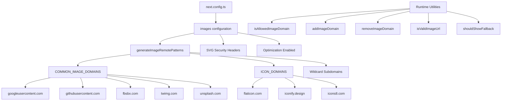

# אופטימיזציה של תמונה

## סקירה כללית

תבנית Ever Works מגדירה את אופטימיזציית התמונות של Next.js עם תבניות דינמיות מרחוק, תמיכה ב-SVG ושכבת שירות לניהול תחום. המערכת מטפלת בתמונות מספקי OAuth (גוגל, GitHub, Facebook, Twitter), שירותי צילום מלאי (Unsplash) וספריות אייקונים, תוך אכיפת כותרות אבטחה עבור תוכן SVG.

## אדריכלות



## קבצי מקור

|קובץ|מטרה|
|------|---------|
|`template/next.config.ts`|תצורת תמונה של Next.js|
|`template/lib/utils/image-domains.ts`|כלי עזר לניהול דומיין|

## תצורה

### הגדרות תמונה של Next.js

```typescript
// next.config.ts
images: {
    remotePatterns: generateImageRemotePatterns(),
    dangerouslyAllowSVG: true,
    contentDispositionType: 'attachment',
    contentSecurityPolicy: "default-src 'self'; script-src 'none'; sandbox;",
    unoptimized: false,
},
```

|הגדרה|ערך|מטרה|
|---------|-------|---------|
|`remotePatterns`|דינמי דרך `generateImageRemotePatterns()`|רשימת היתרים של דומיינים של תמונות חיצוניות|
|`dangerouslyAllowSVG`|`true`|אפשר תמונות SVG דרך כלי האופטימיזציה|
|`contentDispositionType`|`'attachment'`|כפה הורדה במקום עיבוד מוטבע עבור גישה גולמית|
|`contentSecurityPolicy`|ארגז חול קפדני|מנע התקפות XSS מבוססות SVG|
|`unoptimized`|`false`|השאר את אופטימיזציית התמונה מופעלת|

### אבטחת SVG

קובצי SVG יכולים להכיל JavaScript מוטבע. התבנית מפחיתה זאת עם:
- **מדיניות אבטחת תוכן**: `script-src 'none'; sandbox;` מונעת ביצוע סקריפט ב-SVGs
- **פיזור התוכן**: `attachment` מבטיח שה-SVG יורדים, לא יבוצעו, כאשר הם ניגשים ישירות

## יצירת דפוסים מרחוק

הפונקציה `generateImageRemotePatterns()` בונה את רשימת ההיתרים באופן דינמי:

```typescript
export function generateImageRemotePatterns() {
    const patterns = [
        {
            protocol: 'https' as const,
            hostname: 'lh3.googleusercontent.com',
            pathname: '/a/**'
        },
        {
            protocol: 'https' as const,
            hostname: 'avatars.githubusercontent.com',
            pathname: '/u/**'
        },
        {
            protocol: 'https' as const,
            hostname: 'platform-lookaside.fbsbx.com',
            pathname: '/platform/**'
        },
        // ... more specific patterns
    ];

    // Add wildcard subdomain patterns
    [...COMMON_IMAGE_DOMAINS, ...ICON_DOMAINS].forEach((domain) => {
        patterns.push({
            protocol: 'https' as const,
            hostname: `*.${domain}`,
            pathname: '/**'
        });
    });

    return patterns;
}
```

### דומיינים מותרים

**דומיינים נפוצים של תמונה** (אווטרים של OAuth, תמונות מאגר):

|דומיין|מקור|
|--------|--------|
|`lh3.googleusercontent.com`|אווטרים של Google OAuth|
|`avatars.githubusercontent.com`|אווטרים של GitHub OAuth|
|`platform-lookaside.fbsbx.com`|אווטרים של Facebook OAuth|
|`pbs.twimg.com`|אווטרים של טוויטר/X|
|`images.unsplash.com`|תמונות מאגר של Unsplash|

**דומיינים של סמלים** (סמלים של פריט):

|דומיין|מקור|
|--------|--------|
|`flaticon.com`|סמלים שטוחים|
|`iconify.design`|אייקוני אייקונים|
|`icons8.com`|אייקונים8 אייקונים|
|`feathericons.com`|אייקוני נוצות|
|`heroicons.com`|אייקוני גיבורים|
|`tabler-icons.io`|סמלי טבלר|

## ניהול דומיינים בזמן ריצה

### בדיקת תחומים מותרים

```typescript
import { isAllowedImageDomain } from '@/lib/utils/image-domains';

// Returns true for whitelisted domains
isAllowedImageDomain('https://lh3.googleusercontent.com/a/photo.jpg'); // true
isAllowedImageDomain('https://cdn.flaticon.com/icons/svg/123.svg');    // true
isAllowedImageDomain('https://evil-site.com/image.jpg');               // false

// Relative URLs are always allowed
isAllowedImageDomain('/images/logo.png'); // true
```

### הוספת דומיין דינמי

```typescript
import { addImageDomain, removeImageDomain } from '@/lib/utils/image-domains';

// Add a new domain at runtime
addImageDomain('cdn.example.com');

// Add as an icon domain
addImageDomain('my-icons.com', true);

// Remove a domain
removeImageDomain('old-cdn.com');
```

הערה: תוספות זמן ריצה משפיעות על פונקציות השירות אך אינן משנות את התבניות המרוחקות של Next.js `next.config.ts` (אלה דורשות בנייה מחדש).

### אימות כתובת אתר

```typescript
import { isValidImageUrl, isProblematicUrl, shouldShowFallback } from '@/lib/utils/image-domains';

// Check URL format validity
isValidImageUrl('https://example.com/photo.jpg'); // true
isValidImageUrl('/images/local.png');              // true (relative)
isValidImageUrl('not-a-url');                      // false

// Check for problematic URLs (non-image pages, redirect URLs)
isProblematicUrl('https://flaticon.com/icone-gratuite/search'); // true (not a direct image)
isProblematicUrl('https://cdn.flaticon.com/icon.svg');          // false (has image extension)

// Determine if fallback icon should be shown
shouldShowFallback('');                                          // true (empty)
shouldShowFallback('https://flaticon.com/icone-gratuite/123');   // true (problematic)
shouldShowFallback('https://cdn.flaticon.com/icon.svg');         // false
```

## כותרות אבטחה

ה-`next.config.ts` מחיל כותרות אבטחה על כל המסלולים:

```typescript
async headers() {
    return [{
        source: "/(.*)",
        headers: [
            { key: "X-Content-Type-Options", value: "nosniff" },
            { key: "X-Frame-Options", value: "DENY" },
            { key: "Referrer-Policy", value: "strict-origin-when-cross-origin" },
            { key: "X-DNS-Prefetch-Control", value: "on" },
            { key: "Strict-Transport-Security", value: "max-age=63072000; includeSubDomains; preload" },
            {
                key: "Content-Security-Policy",
                value: "default-src 'self'; script-src 'self' 'unsafe-inline' https://assets.lemonsqueezy.com; style-src 'self' 'unsafe-inline'; img-src 'self' data: https:; font-src 'self'; connect-src 'self' https:; frame-ancestors 'none';"
            },
        ],
    }];
},
```

ההנחיה `img-src 'self' data: https:` מאפשרת תמונות מאותו מקור, URI נתונים וכל מקור HTTPS. זה מתיר בכוונה עבור `img-src` מכיוון שרכיב Next.js Image מטפל באימות דומיין ברמת היישום.

## שיטות עבודה מומלצות

1. **השתמש ב-`next/image`** עבור כל התמונות החיצוניות -- הוא מטפל באופטימיזציה, טעינה עצלנית והמרת פורמט
2. **הוסף דומיינים חדשים ל-`image-domains.ts`** -- לא מוטבע ב-`next.config.ts`
3. **בדוק `shouldShowFallback()`** לפני העיבוד -- הצג סמל ברירת מחדל עבור כתובות URL לא חוקיות/חסרות
4. **שמור על כותרות אבטחה של SVG** -- לעולם אל תסיר את ההגדרות `contentSecurityPolicy` או `contentDispositionType`
5. **העדיפו הגבלות על שם נתיב** -- השתמשו בתבניות `pathname` ספציפיות (למשל, `/a/**`) על פני תווים כלליים לחיפוש במידת האפשר
