# Lib Utilities סקירה כללית

ספריית `template/lib/` היא שכבת השירות והלוגיקה העסקית הליבה של תבנית Ever Works. הוא מכיל מודולים משותפים לניתוח, תקשורת API, אימות, עבודות רקע, שמירה במטמון, תצורה, גישה למסד נתונים, תשלומים, כלי עורך, שומרים ועוד. כל ההיגיון שאינו רכיב, ללא מסלול חי כאן לפי העיקרון של שמירה על רכיבים מצגתיים והאצלת היגיון כבד ל-`lib/`.

## מפת מודול

```mermaid
graph TD
    subgraph Core Infrastructure
        A[config/] --> B[config.ts / config-manager.ts]
        C[db/] --> D[drizzle.ts / queries/ / migrate.ts]
        E[cache-config.ts] --> F[cache-invalidation.ts]
    end

    subgraph Auth & Security
        G[auth/] --> H[NextAuth / Supabase / Guards / Caching]
        I[guards/] --> J[Plan Feature Access Control]
        K[permissions/] --> L[Role-Based Permissions]
    end

    subgraph API Layer
        M[api/] --> N[ApiClient / ServerClient / Error Handling]
    end

    subgraph Analytics & Tracking
        O[analytics/] --> P[PostHog + Sentry Singleton]
    end

    subgraph Background Processing
        Q[background-jobs/] --> R[Trigger.dev / Local / NoOp]
    end

    subgraph Content & Editor
        S[content.ts] --> T[Git CMS Content Loader]
        U[editor/] --> V[TipTap Rich Text Editor]
        W[lib.ts] --> X[Content Path / File Utilities]
    end

    subgraph Business Logic
        Y[services/] --> Z[20+ Domain Services]
        AA[repositories/] --> AB[Data Access Layer]
        AC[payment/] --> AD[Stripe / LemonSqueezy / Polar]
    end

    subgraph Shared Utilities
        AE[constants.ts + constants/]
        AF[utils.ts + utils/]
        AG[types.ts + types/]
        AH[validations/]
        AI[helpers.ts]
    end
```



## מבנה ספריות

|ספרייה / קובץ|תיאור|
|-----------------|-------------|
|`lib/analytics/`|PostHog + Sentry analytics singleton ([docs](./analytics-module))|
|`lib/api/`|לקוחות HTTP עבור דפדפן ושרת ([docs](./api-client-module))|
|`lib/auth/`|אימות עם NextAuth.js + Supabase ([docs](./auth-utilities-module))|
|`lib/background-jobs/`|תזמון עבודה עם Trigger.dev / local / no-op ([docs](./background-jobs-module))|
|`lib/cache-config.ts`|הגדרות מטמון TTL ותג ([docs](./cache-invalidation-module))|
|`lib/cache-invalidation.ts`|פונקציות אי תוקף מטמון ([docs](./cache-invalidation-module))|
|`lib/config/`|שירות תצורה מרכזי עם סכימות Zod|
|`lib/config.ts`|תצורת האתר (`siteConfig`)|
|`lib/config-manager.ts`|מנהל תצורת זמן ריצה|
|`lib/constants.ts`|קנה קבוע של יישום ([docs](./constants-reference-module))|
|`lib/constants/`|קבועים ספציפיים לתחום (תשלום, ניתוח)|
|`lib/content.ts`|טעינת תוכן CMS מבוסס Git ואחסון במטמון|
|`lib/db/`|חיבור למסד נתונים, העברות, זרימה, שאילתות ([docs](./db-utilities-module))|
|`lib/editor/`|TipTap רכיבים וכלי שירות של עורך טקסט עשיר ([docs](./editor-utilities-module))|
|`lib/guards/`|בקרת גישה לתכונה מבוססת תוכנית ([docs](./guards-module))|
|`lib/helpers.ts`|מיפוי קוד שפה לקוד מדינה|
|`lib/lib.ts`|רזולוציית נתיב תוכן, כלי עזר למערכת קבצים|
|`lib/logger.ts`|כלי רישום מובנה|
|`lib/mail/`|שליחת אימייל עם תמיכת תבניות|
|`lib/mappers/`|ממפים לשינוי נתונים|
|`lib/maps/`|אינטגרציות של ספקי מפות (Google Maps, Mapbox)|
|`lib/middleware/`|תוכנת עזר של Next.js|
|`lib/newsletter/`|ספקי מנוי לניוזלטר|
|`lib/paginate.ts`|פונקציית מסייעת לעידון|
|`lib/payment/`|עיבוד תשלום (Stripe, LemonSqueezy, Solidgate, Polar)|
|`lib/permissions/`|הגדרות הרשאות מבוססות תפקידים|
|`lib/query-client.ts`|תצורת לקוח React Query|
|`lib/react-query-config.ts`|אפשרויות ברירת המחדל של React Query|
|`lib/repositories/`|שכבת גישה לנתונים (דפוס מאגר)|
|`lib/repository.ts`|פעולות מאגר Git (שיבוט, משיכה, סנכרון)|
|`lib/seo/`|מטא נתונים של SEO ומחוללי נתונים מובנים|
|`lib/services/`|שירותי לוגיקה עסקית (20+ שירותי דומיין)|
|`lib/stripe-helpers.ts`|כלי עזר ספציפיים לפס|
|`lib/swagger/`|הערות Swagger/OpenAPI|
|`lib/theme-color-manager.ts`|ניהול צבע ערכת נושא דינמי|
|`lib/theme-utils.ts`|פונקציות שירות נושא|
|`lib/themes.tsx`|הגדרות נושא|
|`lib/types.ts`|הגדרות סוגים משותפות|
|`lib/types/`|הגדרות סוגים ספציפיים לתחום|
|`lib/utils.ts`|פונקציות שירות כלליות|
|`lib/utils/`|כלי שירות ספציפיים לתחום (15+ מודולים)|
|`lib/validations/`|סכימות אימות Zod|

## מודולים עצמאיים מרכזיים

### `lib/helpers.ts` -- מיפוי קוד שפה/מדינה

```typescript
type LanguageCode = 'en' | 'fr' | 'es' | 'zh' | 'de' | 'ar' | ... ;

const LANGUAGE_COUNTRY_CODES: Record<LanguageCode, string>;
// { en: 'US', fr: 'FR', es: 'ES', zh: 'CN', ... }

const appLocales: string[];
// All supported locale codes

function getCountryCode(languageCode?: LanguageCode): string;
// 'en' -> 'US', 'fr' -> 'FR'
```

### `lib/lib.ts` -- נתיב תוכן ומערכת קבצים

כלי עזר לשרת בלבד לניהול ספריות תוכן:

```typescript
function getContentPath(): string;
// Returns '.content' path (local) or '/tmp/.content' (Vercel runtime)

async function ensureContentAvailable(): Promise<string>;
// Ensures content is available, triggering Git clone if needed

async function fsExists(filepath: string): Promise<boolean>;
async function dirExists(dirpath: string): Promise<boolean>;
```

### `lib/paginate.ts` -- עוזר עימוד

```typescript
function paginate<T>(items: T[], page: number, limit: number): T[];
```

### `lib/logger.ts` -- רישום מובנה

```typescript
const logger = {
  info(message: string, context?: Record<string, any>): void;
  warn(message: string, context?: Record<string, any>): void;
  error(message: string, context?: Record<string, any>): void;
  debug(message: string, context?: Record<string, any>): void;
};
```

### `lib/color-generator.ts` -- יצירת צבעים דטרמיניסטי

מייצר צבעים עקביים ממחרוזות (המשמשים לאוואטרים, תגיות וכו').

### `lib/theme-color-manager.ts` -- צבעי נושא דינמיים

מנהל עדכוני נכסים מותאמים אישית של CSS עבור החלפת ערכת נושא.

## שכבת שירותים (`lib/services/`)

ספריית השירותים מכילה שירותי לוגיקה עסקית המאורגנים לפי תחום:

|שירות|אחריות|
|---------|---------------|
|`analytics-background-processor.ts`|עיבוד ניתוח רקע|
|`analytics-export.service.ts`|ייצוא נתוני Analytics|
|`analytics-scheduled-reports.service.ts`|דוחות ניתוח מתוזמנים|
|`category-file.service.ts`|פעולות קבצי קטגוריה|
|`category-git.service.ts`|פעולות קטגוריה Git|
|`collection-git.service.ts`|פעולות Collection Git|
|`company.service.ts`|ניהול פרופיל חברה|
|`currency-detection.service.ts`|זיהוי מטבעות של המשתמש|
|`currency.service.ts`|המרת מטבע|
|`email-notification.service.ts`|התראות באימייל|
|`engagement.service.ts`|הצג/הצבע/מעקב אחר מועדפים|
|`file.service.ts`|העלאת/ניהול קבצים|
|`geocoding/`|קידוד גיאוגרפי עם ספקי Google/Mapbox|
|`item-audit.service.ts`|מסלול ביקורת פריט|
|`item-git.service.ts`|פעולות פריט Git|
|`location/`|אינדקס וניהול מיקומים|
|`moderation.service.ts`|ניהול תוכן|
|`notification.service.ts`|הודעות דחיפה|
|`posthog-api.service.ts`|ממשק API של PostHog בצד השרת|
|`role-db.service.ts`|ניהול תפקידים|
|`settings.service.ts`|הגדרות אפליקציה|
|`sponsor-ad.service.ts`|ניהול מודעות חסות|
|`stripe-products.service.ts`|סנכרון מוצר פס|
|`subscription-jobs.ts`|משרות ברקע מנוי|
|`subscription.service.ts`|מחזור חיים של מנוי|
|`survey.service.ts`|ניהול סקר|
|`sync-service.ts`|סנכרון מאגר Git|
|`tag-git.service.ts`|תג פעולות Git|
|`twenty-crm-*.ts`|שילוב של עשרים CRM (5 קבצים)|
|`user-db.service.ts`|פעולות במסד הנתונים של המשתמש|
|`webhook-subscription.service.ts`|ניהול Webhook|

## Utils Layer (`lib/utils/`)

מודולי שירות לבעיות ספציפיות:

|מודול|מטרה|
|--------|---------|
|`api-error.ts`|מחלקת שגיאות API|
|`bot-detection.ts`|זיהוי בוט משתמש-סוכן|
|`checkout-utils.ts`|עוזרי קופה לתשלומים|
|`client-auth.ts`|כלי עזר לאישור בצד הלקוח|
|`currency-format.ts`|עיצוב מטבע|
|`custom-navigation.ts`|ניווט בנתב מותאם אישית|
|`database-check.ts`|בדיקת תקינות מסד הנתונים|
|`email-validation.ts`|אימות פורמט אימייל|
|`error-handler.ts`|מטפל בשגיאות גלובלי|
|`featured-items.ts`|בחירת פריט מומלץ|
|`footer-utils.ts`|כלי עזר לקישור תחתונה|
|`image-domains.ts`|תחומי תמונה מותרים|
|`pagination-validation.ts`|אימות פרמטר עימוד|
|`payment-provider.ts`|זיהוי ספק תשלומים|
|`plan-expiration.utils.ts`|תוכנית חישובי תפוגה|
|`rate-limit.ts`|הגבלת קצב API|
|`request-body.ts`|בקש ניתוח גוף|
|`server-url.ts`|רזולוציית כתובת האתר של השרת|
|`settings.ts`|פונקציות עוזר הגדרות|
|`slug.ts`|יצירת שבלול כתובות אתרים|
|`url-cleaner.ts`|חיטוי כתובות אתרים|
|`url-filter-sync.ts`|סנכרון מצב מסנן כתובת URL|

## עקרונות עיצוב

1. **הפרדת דאגות** -- היגיון עסקי ב-`services/`, גישה לנתונים ב-`repositories/` ו-`db/queries/`, הצגה ב-`components/`.

2. **בטיחות סקריפט** -- מודולים המשמשים על ידי סקריפטים של העברה/מקור (כמו `constants/payment.ts` ו-`db/config.ts`) נמנעים מיבוא קוד ספציפי ל-Next.js.

3. **אתחול עצלן** -- חיבורי מסדי נתונים, לקוחות API ומנהלי עבודה משתמשים בדפוסי יחיד עם אתחול עצלן כדי למנוע שגיאות במהלך זמן הבנייה.

4. **יבוא דינמי** -- מודולים ספציפיים ל-Node.js משתמשים בייבוא דינמי בעבודות רקע ובאימות כדי למנוע בעיות של חבילת חבילות אינטרנט.

5. **גבול שרת/לקוח** -- מודולים לשרת בלבד משתמשים בחבילת `server-only`. מודולים בטוחים ללקוח נמנעים מיבוא שרתים. נעשה שימוש במשורה בהנחיית `'use client'`.
