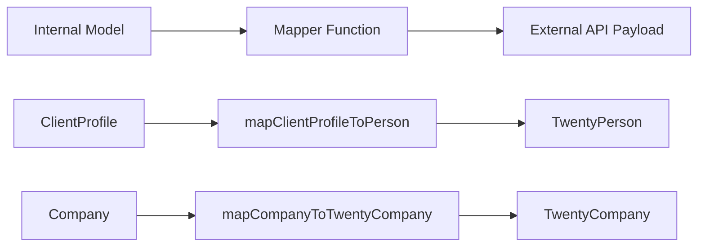

# דפוסי מיפוי

התבנית משתמשת בפונקציות ממפה טהורות כדי להפוך נתונים בין מודלים פנימיים ומטעני API חיצוניים. ממפים הם נטולי תופעות לוואי, בטוחים לאפס, ומאמתים שדות נדרשים לפני השינוי.

## סקירה כללית של אדריכלות



## קבצי מקור

|קובץ|מטרה|
|------|---------|
|`lib/mappers/twenty-crm.mapper.ts`|ממפה ישויות מקומיות לעשרים מטענים של CRM API|

## עקרונות עיצוב

מודול ה-Mapper עוקב אחר מוסכמות תכנות פונקציונליות קפדניות:

1. **פונקציות טהורות** -- ללא תופעות לוואי, ללא מוטציות, ללא שיחות למסד נתונים
2. **Null-safe** -- כל השדות האופציונליים משתמשים בבדיקות null/לא מוגדרות מפורשות
3. **אימות לפני מיפוי** -- שדות חובה מאומתים עם שגיאות תיאור
4. **אכיפה של זיהוי חיצוני** -- לכל ישות ממופה חייבת להיות `external_id` חוקי

## אימות זיהוי חיצוני

כל ישות הממופת למערכת חיצונית דורשת מזהה חוקי:

```typescript
export function ensureExternalId(id: string | undefined | null, entityType: string): string {
  if (!id || id.trim() === '') {
    throw new Error(`${entityType} ID is required for external_id mapping`);
  }
  return id.trim();
}
```

פונקציה זו נקראת בתחילת כל ממפה כדי להבטיח שהשדה `external_id` לעולם לא ריק.

## חילוץ מיקום

פונקציית שירות מנתחת שמות ערים ממחרוזות מיקום בטקסט חופשי:

```typescript
export function extractCityFromLocation(location: string | undefined | null): string | null {
  if (!location || location.trim() === '') return null;
  const parts = location.split(',');
  const city = parts[0]?.trim();
  return city || null;
}
```

מטפל בפורמטים כמו `"San Francisco"`, `"San Francisco, CA"` ו-`"San Francisco, CA, USA"`.

## פרופיל לקוח ל-20 איש CRM

ממפה רשומות פנימיות של `ClientProfile` ל-Twenty CRM `TwentyPerson`:

```typescript
export function mapClientProfileToPerson(clientProfile: ClientProfile): TwentyPerson {
  const external_id = ensureExternalId(clientProfile.id, 'ClientProfile');

  const person: TwentyPerson = {
    external_id,
    name: clientProfile.name,
    email: clientProfile.email,
  };

  // Optional field mapping (null-safe)
  if (clientProfile.phone)     person.phone = clientProfile.phone;
  if (clientProfile.jobTitle)  person.job_title = clientProfile.jobTitle;
  if (clientProfile.company)   person.company_name = clientProfile.company;
  if (clientProfile.website)   person.website = clientProfile.website;

  const city = extractCityFromLocation(clientProfile.location);
  if (city) person.city = city;

  // Custom fields
  if (clientProfile.accountType) person.account_type = clientProfile.accountType;
  if (clientProfile.plan)        person.plan = clientProfile.plan;
  if (clientProfile.totalSubmissions !== null && clientProfile.totalSubmissions !== undefined) {
    person.total_submissions = clientProfile.totalSubmissions;
  }

  return person;
}
```

### טבלת מיפוי שדות

|שדה פרופיל הלקוח|שדה TwentyPerson|חובה|הערות|
|--------------------|--------------------|----------|-------|
|`id`|`external_id`|כן|מאומת וגזוז|
|`name`|`name`|כן|מיפוי ישיר|
|`email`|`email`|כן|מיפוי ישיר|
|`phone`|`phone`|לא|רק אם קיים|
|`jobTitle`|`job_title`|לא|camelCase ל-snake_case|
|`company`|`company_name`|לא|שדה שונה|
|`website`|`website`|לא|מיפוי ישיר|
|`location`|`city`|לא|חולץ דרך `extractCityFromLocation`|
|`accountType`|`account_type`|לא|שדה מותאם אישית|
|`plan`|`plan`|לא|שדה מותאם אישית|
|`totalSubmissions`|`total_submissions`|לא|נדרשת בדיקת Null מפורשת|

## חברה ל-Twenty CRM Company

ממפה ישויות פנימיות `Company` למטען ה-Twenty CRM `TwentyCompany`:

```typescript
export function mapCompanyToTwentyCompany(company: Company): TwentyCompany {
  const external_id = ensureExternalId(company.id, 'Company');

  const twentyCompany: TwentyCompany = {
    external_id,
    name: company.name,
  };

  if (company.domain)  twentyCompany.domain_name = company.domain;
  if (company.website) twentyCompany.website = company.website;
  if (company.status)  twentyCompany.status = company.status;

  return twentyCompany;
}
```

### טבלת מיפוי שדות

|שדה חברה|שדה TwentyCompany|חובה|הערות|
|--------------|---------------------|----------|-------|
|`id`|`external_id`|כן|מאומת וגזוז|
|`name`|`name`|כן|מיפוי ישיר|
|`domain`|`domain_name`|לא|שדה שונה|
|`website`|`website`|לא|מיפוי ישיר|
|`status`|`status`|לא|`'active'` או `'inactive'`|

## הוספת מייפים חדשים

בעת יצירת ממפים עבור אינטגרציות חדשות, עקוב אחר הדפוסים שנקבעו:

```typescript
// 1. Always validate external_id first
const external_id = ensureExternalId(entity.id, 'EntityName');

// 2. Build the required fields object
const payload: ExternalType = {
  external_id,
  // ... required fields
};

// 3. Conditionally add optional fields (null-safe)
if (entity.optionalField) {
  payload.optional_field = entity.optionalField;
}

// 4. Return the payload -- never mutate the input
return payload;
```

## שיקולי בדיקה

מכיוון שממפים הם פונקציות טהורות, הם פשוטים לבדיקת יחידה:

- בדוק עם כל השדות האופציונליים מאוכלסים
- בדוק עם כל השדות האופציונליים כמו `null` או `undefined`
- בדוק שמזהים נדרשים חסרים גורמים לשגיאות תיאוריות
- בדיקת מיצוי מיקום עם פורמטים שונים של מחרוזת
- ודא שאובייקט הקלט לעולם לא עבר מוטציה
