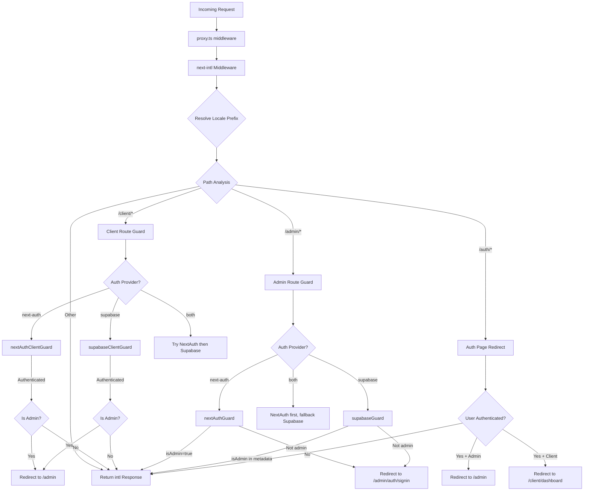

# שרשרת ועיבוד בקשות של תוכנת אמצעית

## סקירה כללית

תבנית Ever Works משתמשת בארכיטקטורת **תוכנות ביניים מאוחדות** המוגדרת ב-`proxy.ts` בשורש הפרויקט. תוכנת הביניים הזו מתזמרת שלוש חששות קריטיים עבור כל בקשה נכנסת:

1. **בינלאומיות** -- זיהוי מקומי, הכנסת קידומת וניתוב באמצעות `next-intl`
2. **שומרי אימות** -- הגנה על נתיבים `/admin/*` ו-`/client/*` באמצעות NextAuth, Supabase או שניהם
3. **הפניה מחדש מבוססת תפקידים** - שליחת משתמשים מאומתים הרחק מדפי אימות ציבוריים והפניית מנהלים/לקוחות למרכזי השליטה שלהם.

העיצוב תומך במודל של **ספק אישור הניתן לחיבור**: תוכנת התווך קוראת את `AuthProviderType` (`'next-auth'`, `'supabase'`, או `'both'`) מתצורת האישור המרכזי ובוחרת את פונקציות השמירה המתאימות בהתאם.

## תרשים אדריכלות



## קבצי מקור

|קובץ|מטרה|
|------|---------|
|`template/proxy.ts`|נקודת הכניסה העיקרית של תוכנת האמצע|
|`template/lib/auth/config.ts`|תצורת ספק אישור (`getAuthConfig()`)|
|`template/lib/auth/supabase/middleware.ts`|עוזר רענון הפגישה של Supabase|
|`template/lib/auth/validate-callback-url.ts`|בניית כתובת URL בטוחה להתקשרות חוזרת|
|`template/i18n/routing.ts`|תצורת ניתוב מקומי|

## בקש עיבוד הזמנה

### שלב 1: בינלאומי

כל בקשה עוברת תחילה דרך תוכנת האמצע `next-intl` שנוצרה עם `createIntlMiddleware(routing)`:

```typescript
import createIntlMiddleware from 'next-intl/middleware';
import { routing } from './i18n/routing';

const intl = createIntlMiddleware(routing);
```

זה מטפל בזיהוי מקומי באמצעות הכותרת `Accept-Language`, העדפות קובצי Cookie וקידומת כתובת אתר. תצורת הניתוב משתמשת ב-`localePrefix: "as-needed"`, כלומר אזור ברירת המחדל (`en`) אינו דורש קידומת URL.

### שלב 2: רזולוציית מיקום

העוזר `resolveLocalePrefix` מחלץ מידע מקומי משם הנתיב:

```typescript
function resolveLocalePrefix(pathname: string): {
    prefix: string;       // e.g., "/fr" or ""
    hasLocale: boolean;
    locale?: string;
    pathWithoutLocale: string;  // e.g., "/admin/items"
}
```

זה קריטי מכיוון שכל התאמת הנתיב העוקבת (למשל, בדיקת `/admin` או `/client`) חייבת לפעול בנתיב **ללא** קידומת המקום.

### שלב 3: בחירת משמר מבוסס מסלול

תוכנת האמצע מעריכה את `pathWithoutLocale` כדי לקבוע איזו שרשרת שמירה להחיל:

|דפוס נתיב|שומר הוחל|מטרה|
|-------------|--------------|---------|
|`/client` או `/client/*`|שומר סמכות לקוח|דורש אימות; מפנה מנהלים ל-`/admin`|
|`/admin/*` (למעט `/admin/auth/signin`)|שומר סמכות מנהל|דורש אימות + דגל `isAdmin`|
|`/auth/*`|הפניית דף אימות|מפנה מחדש משתמשים מאומתים הרחק מהכניסה/הרשמה|
|כל השאר|אין שומר|עובר עם תגובת i18n|

### שלב 4: אימות אימות

#### NextAuth Guard (מבוסס JWT)

```typescript
const token = await getToken({ req, secret: process.env.AUTH_SECRET });
if (token?.isAdmin === true) {
    return baseRes; // Admin access granted
}
```

שומרי NextAuth משתמשים ב-`getToken()` מ-`next-auth/jwt` כדי לקרוא את אסימון JWT מקובצי Cookie. זה תואם Edge Runtime ואינו דורש חיפוש מסד נתונים.

#### סופאבייס גארד

```typescript
const supRes = await supabaseUpdate(req);
// Merge cookies...
const { data: { user } } = await supabase.auth.getUser();
const isAdmin = user?.user_metadata?.isAdmin === true
    || user?.user_metadata?.role === 'admin';
```

השומר של Supabase מרענן תחילה את ההפעלה באמצעות `updateSession()`, ולאחר מכן בודק מטא-נתונים של המשתמש עבור דגלים של מנהל מערכת.

### שלב 5: הפצת עוגיות

פרט יישום קריטי: כאשר שומר מייצר תגובת הפניה מחדש, יש להפיץ את כל העוגיות מה-`intlResponse`:

```typescript
const redirectRes = NextResponse.redirect(url);
baseRes.cookies.getAll().forEach((c) => redirectRes.cookies.set(c));
return redirectRes;
```

זה מבטיח שהעדפות מקומיות וקובצי Cookie של הפעלת אימות ישרדו הפניות מחדש.

## תצורה

### בחירת ספק אישור

ספק האישור נקבע על ידי `getAuthConfig()` ב-`lib/auth/config.ts`:

```typescript
export type AuthProviderType = 'supabase' | 'next-auth' | 'both';

export function getAuthConfig(): AuthConfig {
    // Priority 1: Global override via configureAuth()
    // Priority 2: Environment-based (detects Supabase env vars)
    // Priority 3: Default ('next-auth')
}
```

### תואם תווך

```typescript
export const config = {
    matcher: ['/((?!api|trpc|_next|_vercel|.*\\..*).*)']
};
```

ביטוי רגולרי זה אינו כולל:
- `/api/*` מסלולים (מטופל על ידי שכבת ה-API של Next.js)
- `/trpc/*` מסלולים
- `/_next/*` (פנימי Next.js)
- `/_vercel/*` (פנימי Vercel)
- כל נתיב עם סיומת קובץ (נכסים סטטיים)

### אבטחת כתובת URL להתקשרות חוזרת

תוכנת האמצע משתמשת ב-@@TOK000@@@ כדי למנוע התקפות הפניה פתוחות:

```typescript
export function createSafeCallbackUrl(pathname: string, search?: string): string {
    // Limits URL length to 2048 characters
    // Validates relative-only paths
}

export function isValidCallbackUrl(url: string | null): boolean {
    return url?.startsWith('/') && !url.startsWith('//');
}
```

## מצב ספק כפול ("שניהם")

כאשר `provider === 'both'`, תוכנת האמצע מיישמת שרשרת חוזרת:

1. **מסלולי לקוח**: נסה קודם את NextAuth; אם לא מאומת, נסה את Supabase
2. **מסלולי ניהול**: נסה קודם את NextAuth; אם הוא מייצר הפניה מחדש (נדחה), נסה את Supabase
3. **דפי אימות**: תחילה בדוק את אסימון NextAuth, ולאחר מכן בדוק את הפעלת Supabase

זה מאפשר לארגונים לעבור בין ספקי אישור מבלי להפריע למשתמשים קיימים.

## פרטי יישום מרכזיים

### תאימות לזמן ריצה של Edge

תוכנת האמצע פועלת ב- Next.js Edge Runtime. כל בדיקות האימות משתמשות בממשקי API תואמי Edge:
- NextAuth: `getToken()` (מבוסס JWT, אין צורך ב-DB)
- Supabase: `createServerClient()` עם הפעלה מבוססת קובצי Cookie

### פיתוח מול רישום ייצור

רישום באגים מסודר מאחורי `NODE_ENV === 'development'`:

```typescript
if (process.env.NODE_ENV === 'development') {
    console.log('[Middleware] Admin access granted via token');
}
```

### רענון הפעלה של Supabase

מסייע התווך של Supabase (`updateSession`) נקרא לפני כל בדיקת אימות כדי לוודא שאסימונים רענון:

```typescript
export async function updateSession(request: NextRequest) {
    const supabase = createServerClient(url, anonKey, {
        cookies: { getAll, setAll }
    });
    // IMPORTANT: DO NOT REMOVE auth.getUser()
    await supabase.auth.getUser();
    return supabaseResponse;
}
```

ההערה בקוד המקור מדגישה שאסור להסיר את `auth.getUser()` -- היא מפעילה את מחזור רענון האסימון שמונע התנתקות אקראית.
