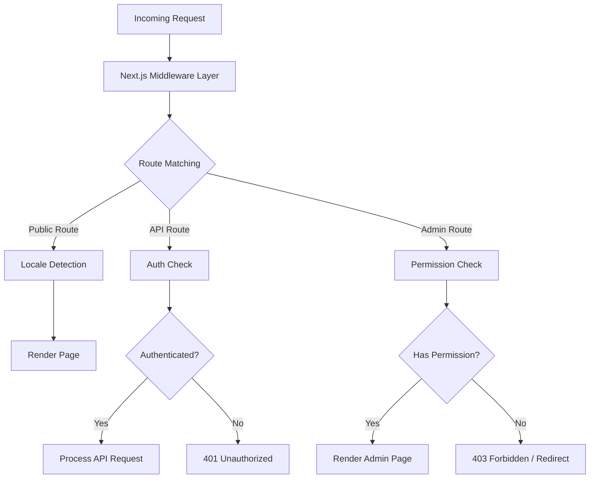
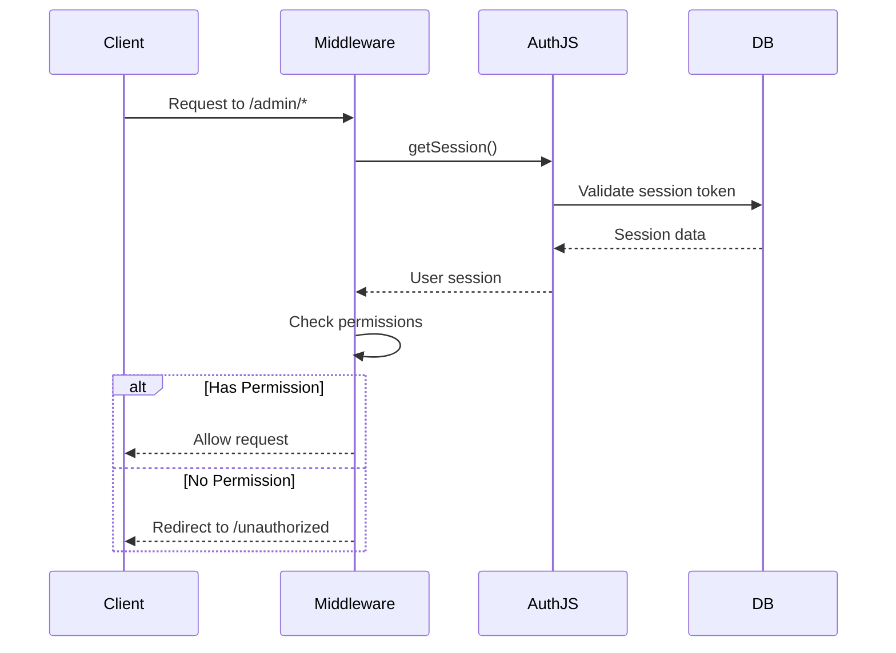
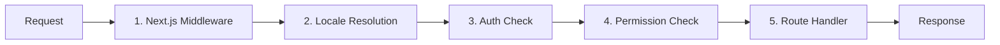

# Middleware Deep Dive

תבנית Ever Works משתמשת בארכיטקטורת תווך שכבתית הבנויה על מוסכמות Next.js App Router והיגיון מותאם אישית של בדיקת הרשאות. מסמך זה מכסה את צינור עיבוד הבקשות המלא, בדיקות הרשאות, תוכנת אימות, טיפול מקומי והזמנת תווך.

## סקירה כללית של אדריכלות



## בדיקת הרשאות תוכנת ביניים

מערכת בדיקת ההרשאות נמצאת ב-`lib/middleware/permission-check.ts` ומספקת בקרת גישה פרטנית לנתיבי API ודפי ניהול.

### ממשק ליבה

```typescript
interface UserPermissions {
  userId: string;
  roles: string[];
  permissions: Permission[];
}
```

### פונקציות בדיקת הרשאות

|פונקציה|מטרה|מחזיר|
|---|---|---|
|`hasPermission(user, permission)`|בדוק הרשאה בודדת|`boolean`|
|`hasAnyPermission(user, permissions)`|בדוק אם למשתמש יש לפחות אחד|`boolean`|
|`hasAllPermissions(user, permissions)`|בדוק אם המשתמש רשם הכל|`boolean`|
|`hasResourcePermission(user, resource, action)`|בדוק את הפורמט `resource:action`|`boolean`|
|`getResourcePermissions(user, resource)`|קבל את כל ההרשאות עבור משאב|`Permission[]`|
|`canManageResource(user, resource)`|סמן גישת יצירה/עדכון/מחיקה|`boolean`|
|`isSuperAdmin(user)`|בדוק אם יש תפקיד מנהל-על או את כל ההרשאות|`boolean`|

### שימוש בנתיבי API

```typescript
import { hasPermission, hasAnyPermission } from '@/lib/middleware/permission-check';

export async function GET(request: Request) {
  const userPermissions = await getUserPermissions(session);

  // Single permission check
  if (!hasPermission(userPermissions, 'items:read')) {
    return new Response('Forbidden', { status: 403 });
  }

  // Multiple permission check (any)
  if (!hasAnyPermission(userPermissions, ['items:review', 'items:approve'])) {
    return new Response('Forbidden', { status: 403 });
  }
}
```

### בדיקות ברמת משאבים

```typescript
// Check specific resource and action
const canEdit = hasResourcePermission(userPermissions, 'items', 'update');

// Get all permissions for a resource
const itemPerms = getResourcePermissions(userPermissions, 'items');
// Returns: ['items:read', 'items:create', 'items:update']

// Check management capability (create, update, or delete)
const canManage = canManageResource(userPermissions, 'categories');
```

### עוזרי הרשאה מיוחדים

תוכנת הביניים מספקת עוזרים ספציפיים לדומיין המשלבים בדיקות הרשאות מרובות:

```typescript
// Can the user review, approve, or reject items?
const canReview = canReviewItems(userPermissions);

// Can the user manage users (read, create, update, delete, assignRoles)?
const canAdmin = canManageUsers(userPermissions);

// Can the user view analytics data?
const canView = canViewAnalytics(userPermissions);

// Is the user a super admin?
const isAdmin = isSuperAdmin(userPermissions);
```

### זיהוי סופר אדמין

הפונקציה `isSuperAdmin` משתמשת בגישה דו-שכבתית:

1. **בדיקת תפקיד** (ראשי): בודק אם למשתמש יש את התפקיד `super-admin`
2. **בדיקת הרשאות** (החלפה): מאמת שלמשתמש יש כל הרשאות מערכת

```typescript
function isSuperAdmin(userPermissions: UserPermissions): boolean {
  // Fast path: check role
  if (userPermissions.roles.includes('super-admin')) {
    return true;
  }
  // Exhaustive check: verify all permissions
  return hasAllPermissions(userPermissions, allSystemPermissions);
}
```

## תוכנת אמצעית אימות

האימות מטופל באמצעות NextAuth.js (Auth.js v5) המוגדר ב-`auth.config.ts`. התווך פועל על כל בקשה למסלולים מוגנים.

### תצורת ספק

תצורת האישור מגדירה באופן דינמי את ספקי OAuth עם סתירה חיננית:

|ספק|מקור תצורה|
|---|---|
|גוגל|`authConfig.google.clientId/clientSecret`|
|GitHub|`authConfig.github.clientId/clientSecret`|
|פייסבוק|`authConfig.facebook.clientId/clientSecret`|
|טוויטר/X|`authConfig.twitter.clientId/clientSecret`|
|אישורים|מופעל תמיד|

אם תצורת OAuth נכשלת, המערכת חוזרת לאימות אישורים בלבד.

### זרימת סשן אישור



## Locale Middleware

התבנית תומכת ב-20+ מקומות באמצעות `next-intl` שילוב תוכנת ביניים. זיהוי המקום עוקב אחר דפוס הקידומת "לפי הצורך":

- מקום ברירת מחדל (`en`): אין קידומת כתובת אתר -- `/items/my-app`
- אזורים אחרים: קידומת מקום -- `/fr/items/my-app`

### מקומות נתמכים

|מקום|שפה|מקום|שפה|
|---|---|---|---|
|`en`|אנגלית (ברירת מחדל)|`ja`|יפני|
|`fr`|צרפתית|`ko`|קוריאנית|
|`es`|ספרדית|`nl`|הולנדית|
|`de`|גרמנית|`pl`|פולני|
|`zh`|סינית|`tr`|טורקית|
|`ar`|ערבית|`vi`|וייטנאמית|
|`he`|עברית|`th`|תאילנדית|
|`ru`|רוסית|`hi`|הינדי|
|`uk`|אוקראינית|`id`|אינדונזית|
|`pt`|פורטוגזית|`bg`|בולגרית|
|`it`|איטלקי| | |

## צינור עיבוד בקשה

צינור עיבוד הבקשות המלא פועל לפי הסדר הזה:



### שלבי צינור

1. **Next.js Middleware** (`middleware.ts`): פועל על כל בקשה התואמת למתאמים המוגדרים. מטפל בהפניות מחדש, שכתובים והזרקת כותרות.

2. **רזולוציית מיקום**: מזהה את המקום המועדף על המשתמש מנתיב כתובת האתר, הכותרת `Accept-Language` או קובץ ה-cookie. מגדיר את המקום עבור הקשר הבקשה.

3. **בדיקת אישור**: עבור מסלולים מוגנים (`/admin/*`, `/dashboard/*`, `/api/admin/*`), מאמת את אסימון ההפעלה של המשתמש.

4. **בדיקת הרשאות**: לאחר האימות, מאמת שלמשתמש יש את ההרשאות הנדרשות עבור המשאב והפעולה הספציפיים.

5. **מטפל בנתיבים**: רכיב הדף בפועל או המטפל בנתיב ה-API מעבד את הבקשה.

### התחייבות להזמנה של תוכנת אמצעית

המערכת אוכפת פקודה קפדנית:

- זיהוי המקום פועל תמיד ראשון (דרוש עבור דפי שגיאה)
- בדיקות אימות פועלות לפני בדיקות הרשאות (צריך משתמש כדי לבדוק הרשאות)
- בדיקות ההרשאה הן השער האחרון לפני מטפלי המסלול
- נתיבי API משתמשים בבדיקות הרשאות ברמת הפונקציה (לא ברמת התוכנה)

## כלי עזר לאימות הרשאה

תוכנת האמצע כוללת עוזרי אימות לעבודה עם מחרוזות הרשאות:

```typescript
// Validate a permission string
validatePermission('items:read');     // true
validatePermission('invalid:perm');   // false

// Parse a permission into parts
parsePermission('items:update');
// Returns: { resource: 'items', action: 'update' }

// Get summary grouped by resource
getPermissionSummary(userPermissions);
// Returns: { items: ['read', 'create'], categories: ['read'] }
```

## טיפול בשגיאות

מערכת התווך מטפלת בשגיאות בכל שכבה:

|שכבה|שגיאה|תגובה|
|---|---|---|
|מקום|מקום לא חוקי|הפנה מחדש למקום ברירת המחדל|
|Auth|אין ישיבה|401 או הפנה מחדש לכניסה|
|Auth|פג תוקף ההפעלה|401 עם רמז לרענון|
|רשות|חסר הרשאה|403 אסור|
|רשות|מחרוזת הרשאות לא חוקית|אזהרה נרשמה, הגישה נדחתה|

## שיטות עבודה מומלצות

1. **השתמש בצ'ק הספציפי ביותר** -- העדיפו `hasPermission` עם הרשאה אחת על פני `isSuperAdmin` עבור שער תכונות רגיל.

2. **בדוק הרשאות בנתיבי API** -- אל תסתמך רק על תוכנת ביניים; תמיד לאמת במטפל המסלול להגנה לעומק.

3. **השתמש בייבוא דינמי** בתוכנת הביניים כדי להימנע מאגד מודולים לשרת בלבד בזמן הריצה של הקצה.

4. **שמור על בדיקות הרשאות מהירות** -- חיפוש קבוצת ההרשאות `O(1)` מבטיח תקורה מינימלית לכל בקשה.

5. **כשלי הרשאות ביומן** -- השתמש ברישום מובנה עם מזהה המשתמש וניסיון הרשאה לביקורת אבטחה.
