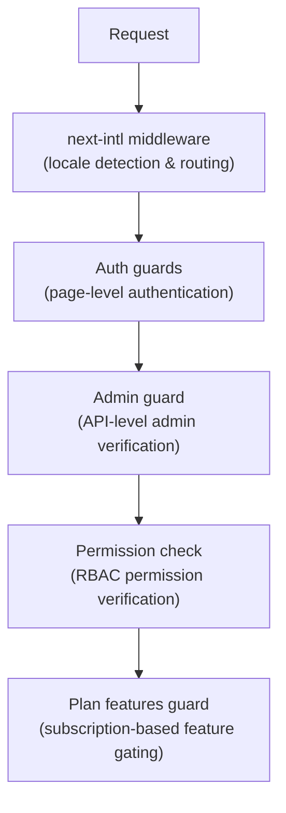

# כלי ביניים ושומרים

תבנית Ever Works משתמשת במערכת הגנה שכבתית המורכבת מתוכנת ביניים Next.js לניתוב, שומרי אימות להגנה על עמודים ו-API, בדיקות הרשאות עבור RBAC ושומרי תכונה מבוססי תוכנית עבור שער מנוי.

## שכבות תוכנת ביניים



## Locale Middleware (next-intl)

תוכנת הבסיס מטפלת בניתוב בינלאומי באמצעות `next-intl`. הוא מוגדר דרך `i18n/routing.ts` ו-`i18n/request.ts`.

אחריות:
- זהה את אזור המשתמש מנתיב כתובת האתר, קובצי Cookie או כותרת `Accept-Language`
- בקשות להפניה מחדש ללא קידומת מקומית למקום המתאים
- ברירת מחדל לאנגלית (`en`) כאשר לא מזוהה העדפה
- תמיכה ב-6 אזורים: `en`, `fr`, `es`, `de`, `ar`, `zh`

## שומרי אימות

### שומרים ברמת הדף (`lib/auth/guards.ts`)

מודול השומרים מספק בדיקות אימות של דפים בצד השרת. אלה נקראים בחלק העליון של רכיבי השרת כדי להגן על גישה לדף.

**`requireAuth()`** -- דורש אימות של המשתמש:

```typescript
import { requireAuth } from '@/lib/auth/guards';

export default async function ProtectedPage() {
  const session = await requireAuth();
  // session.user is guaranteed to exist here
  return <div>Welcome {session.user.email}</div>;
}
```

אם המשתמש אינו מאומת, הוא מנותב אל `/auth/signin`.

**`requireAdmin()`** -- דורש שהמשתמש יעבור אימות ושיהיה לו תפקיד מנהל:

```typescript
import { requireAdmin } from '@/lib/auth/guards';

export default async function AdminPage() {
  const session = await requireAdmin();
  return <div>Admin: {session.user.email}</div>;
}
```

אם המשתמש אינו מאומת, הוא מנותב אל `/admin/auth/signin`. אם הם מאומתים אך אינם מנהלים, הם מנותבים אל `/unauthorized`.

**`getSession()`** -- מקבל הפעלה ללא הפנייה מחדש:

```typescript
const session = await getSession();
if (session) {
  // Authenticated
} else {
  // Guest
}
```

**`checkIsAdmin()`** -- בודק את סטטוס המנהל מבלי להפנות מחדש:

```typescript
const isAdmin = await checkIsAdmin();
// Returns true or false
```

### פעולות מאומתות (`lib/auth/guards.ts`)

מודול השומרים מספק גם מעטפת פעולה מאומתת עבור פעולות שרת Next.js:

**`validatedAction(schema, action)`** -- מאמת נתוני טופס כנגד סכימת Zod:

```typescript
export const myAction = validatedAction(mySchema, async (data, formData) => {
  // data is validated and typed
});
```

**`validatedActionWithUser(schema, action)`** -- מאמת ודורשת אימות:

```typescript
export const myAction = validatedActionWithUser(mySchema, async (data, formData, user) => {
  // data is validated, user is authenticated
});
```

## Admin Guard (`lib/auth/admin-guard.ts`)

משמר הניהול מספק הגנה על נתיב API במיוחד עבור נקודות קצה של מנהל מערכת.

**`checkAdminAuth()`** -- פונקציית תוכנת אמצעית עבור מסלולי API:

```typescript
import { checkAdminAuth } from '@/lib/auth/admin-guard';

export async function GET(request: NextRequest) {
  const authError = await checkAdminAuth();
  if (authError) return authError;

  // User is verified admin, proceed with handler
}
```

מחזירה `null` אם מורשה, או `NextResponse` עם סטטוס השגיאה המתאים (401 או 403).

**`withAdminAuth(handler)`** -- מעטפת פונקציות מסדר גבוה יותר:

```typescript
import { withAdminAuth } from '@/lib/auth/admin-guard';

export const GET = withAdminAuth(async (request) => {
  // Already verified as admin
  return NextResponse.json({ data: 'admin only' });
});
```

שומר המנהל מאמת הן את האימות (קיימת הפעלה) והן את ההרשאה (למשתמש יש תפקיד אדמין במסד הנתונים באמצעות בדיקת `isAdmin()`).

## מערכת בדיקת הרשאות (`lib/middleware/permission-check.ts`)

מערכת ההרשאות מיישמת בקרת גישה מבוססת תפקידים (RBAC) עם הרשאות מפורטות.

### מבנה ההרשאה

ההרשאות עוקבות אחר פורמט `resource:action`:

```typescript
// Examples of permission keys
'items:read'
'items:create'
'items:update'
'items:delete'
'items:review'
'items:approve'
'items:reject'
'categories:read'
'categories:create'
'users:assignRoles'
'analytics:read'
'system:settings'
```

### פונקציות בדיקת הרשאות

```typescript
import {
  hasPermission,
  hasAnyPermission,
  hasAllPermissions,
  hasResourcePermission,
  canManageResource,
  canReviewItems,
  canManageUsers,
  canManageRoles,
  canViewAnalytics,
  isSuperAdmin,
} from '@/lib/middleware/permission-check';

// Single permission check
hasPermission(userPermissions, 'items:create');

// Any of multiple permissions
hasAnyPermission(userPermissions, ['items:create', 'items:update']);

// All permissions required
hasAllPermissions(userPermissions, ['items:read', 'items:update']);

// Resource-level check
hasResourcePermission(userPermissions, 'items', 'create');

// Domain-specific helpers
canManageResource(userPermissions, 'categories'); // create, update, or delete
canReviewItems(userPermissions);                  // review, approve, or reject
canManageUsers(userPermissions);                  // user CRUD + assignRoles
isSuperAdmin(userPermissions);                    // all system permissions
```

### זיהוי סופר אדמין

הפונקציה `isSuperAdmin()` בודקת שני תנאים:
1. האם למשתמש יש את התפקיד `super-admin` (מועדף)
2. כחלופה, האם למשתמש יש את כל הרשאות המערכת

### אימות הרשאה

```typescript
// Validate a permission string is defined in the system
validatePermission('items:create'); // true
validatePermission('invalid:perm'); // false

// Parse permission into resource and action
parsePermission('items:create'); // { resource: 'items', action: 'create' }
```

## משמר תכונות תוכנית (`lib/guards/plan-features.guard.ts`)

התוכנית כוללת בקרות שמירה על גישה המבוססת על תוכניות מנוי (חינם, רגילה, פרימיום).

### היררכיית תוכניות

```typescript
const PLAN_LEVELS = {
  free: 1,
  standard: 2,
  premium: 3,
};
```

### מטריצת גישה לתכונה

כל תכונה ממופה לתוכניות שיכולות לגשת אליה:

|תכונה|חינם|סטנדרטי|פרימיום|
|---------|------|----------|---------|
|שלח מוצר|כן|כן|כן|
|העלה תמונות|כן|כן|כן|
|תמיכה בדוא"ל|כן|כן|כן|
|תיאור מורחב| - |כן|כן|
|תג מאומת| - |כן|כן|
|סקירת עדיפות| - |כן|כן|
|צפה בסטטיסטיקה| - |כן|כן|
|העלה סרטון| - | - |כן|
|תג ממומן| - | - |כן|
|עמוד הבית מוצג| - | - |כן|
|אנליטיקס מתקדם| - | - |כן|
|הגשות ללא הגבלה| - | - |כן|

### גבולות תוכנית

לכל תוכנית יש מגבלות מספריות עבור תכונות מסוימות:

|הגבלה|חינם|סטנדרטי|פרימיום|
|-------|------|----------|---------|
|מקסימום תמונות| 1 | 5 |ללא הגבלה|
|מקסימום מילות תיאור| 200 | 500 |ללא הגבלה|
|מקסימום הגשות| 1 | 10 |ללא הגבלה|
|ימי סקירה| 7 | 3 | 1 |
|ימי שינוי חינם| 0 | 30 | 365 |

### שימוש ב- Plan Guard

**שיחות ישירות לפונקציה:**

```typescript
import { canAccessFeature, getFeatureLimit, isWithinLimit } from '@/lib/guards';

canAccessFeature('upload_video', 'free');    // false
canAccessFeature('upload_video', 'premium'); // true
getFeatureLimit('max_images', 'standard');   // 5
isWithinLimit('max_submissions', 3, 'free'); // false (limit is 1)
```

**מפעל משמר (לבדיקות מרובות):**

```typescript
import { createPlanGuard } from '@/lib/guards';

const guard = createPlanGuard('standard');
guard.canAccess('verified_badge');     // true
guard.canAccess('upload_video');       // false
guard.getLimit('max_images');          // 5
guard.requireFeature('upload_video');  // throws PlanGuardError
```

**שילוב הוק תגובה:**

```typescript
import { createPlanGuardResult } from '@/lib/guards';

// In a hook or component
const guardResult = createPlanGuardResult(userPlan);
guardResult.canAccess('verified_badge');
guardResult.accessibleFeatures; // array of all accessible features
```

ה-`PlanGuardError` שנזרק על ידי `requireFeature()` כולל את שם התכונה, התוכנית הנוכחית של המשתמש והתוכנית הנדרשת, מה שמאפשר הנחיות שדרוג אינפורמטיביות בממשק המשתמש.
