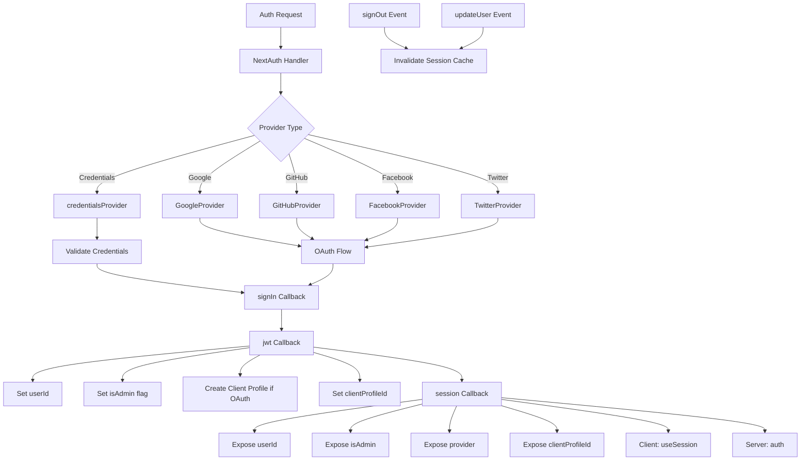

# תצורת NextAuth

## סקירה כללית

תבנית ה-Ever Works מגדירה את NextAuth.js (Auth.js v5) עם הפעלות מבוססות JWT, מתאם Drizzle ORM, מספר ספקי OAuth (Google, GitHub, Facebook, Twitter), אימות מבוסס אישורים והתקשרויות מותאמות אישית לניהול תפקידי אדמין/לקוח. המערכת תומכת ביצירה אוטומטית של פרופיל לקוח עבור משתמשי OAuth ושמירה במטמון של הפעלה עם ביטול תוקף של מטמון.

## אדריכלות



## קבצי מקור

|קובץ|מטרה|
|------|---------|
|`template/lib/auth/index.ts`|תצורה וייצוא ראשי של NextAuth|
|`template/auth.config.ts`|תצורת ספק (תואמת Edge)|
|`template/lib/auth/config.ts`|בחירת סוג ספק הסמכה|
|`template/lib/auth/providers.ts`|פונקציות המפעל של ספק OAuth|
|`template/lib/auth/credentials.ts`|הטמעת ספק אישורים|
|`template/lib/auth/guards.ts`|כלי עזר לשמירה בצד השרת|
|`template/lib/auth/middleware.ts`|עטיפות פעולה מאומתות|
|`template/lib/auth/setup.ts`|עוזר אתחול אישור|
|`template/lib/auth/cached-session.ts`|ניהול מטמון הפעלה|
|`template/lib/auth/session-cache.ts`|יישום מטמון הפעלה|
|`template/lib/auth/admin-guard.ts`|היגיון שומר ספציפי למנהל מערכת|

## אתחול NextAuth

```typescript
// lib/auth/index.ts
export const { handlers, auth, signIn, signOut, unstable_update } = NextAuth({
    adapter: drizzle,
    session: {
        strategy: 'jwt',
        maxAge: 30 * 24 * 60 * 60,    // 30 days
        updateAge: 24 * 60 * 60        // Refresh every 24 hours
    },
    jwt: {
        maxAge: 30 * 24 * 60 * 60      // 30 days
    },
    callbacks: { authorized, redirect, signIn, jwt, session },
    events: { signOut, updateUser },
    pages: {
        signIn: '/auth/signin',
        signOut: '/auth/signout',
        error: '/auth/error',
        verifyRequest: '/auth/verify-request',
        newUser: '/auth/register'
    },
    ...authConfig  // Merges providers from auth.config.ts
});
```

### אסטרטגיית מושב

התבנית משתמשת ב**הפעלות JWT** (`strategy: 'jwt'`), לא בהפעלות מסד נתונים. המשמעות היא:
- הפעלות מאוחסנות בעוגיות מוצפנות, לא במסד הנתונים
- אין צורך בשאילתת מסד נתונים כדי לאמת הפעלה
- תואם ל-Edge Runtime (תוכנה בינונית)
- נתוני הפגישה מוגבלים למה שמתאים לאסימון JWT

## מתאם מסד נתונים

```typescript
const isDatabaseAvailable = !!coreConfig.DATABASE_URL && typeof db !== 'undefined';

const drizzle = isDatabaseAvailable
    ? DrizzleAdapter(getDrizzleInstance(), {
        usersTable: users,
        accountsTable: accounts,
        sessionsTable: sessions,
        verificationTokensTable: verificationTokens
    })
    : undefined;
```

המתאם נוצר באופן מותנה בהתבסס על זמינות מסד הנתונים. זה מאפשר לתבנית להתחיל גם ללא מסד נתונים (למשל, במהלך ההגדרה הראשונית), אם כי האימות יהיה מוגבל.

## תצורת ספק

### auth.config.ts (תואם Edge)

```typescript
// auth.config.ts
const configureProviders = () => {
    try {
        const oauthProviders = configureOAuthProviders();
        return createNextAuthProviders({
            google: oauthProviders.find((p) => p.id === 'google')
                ? { enabled: true, clientId: '...', clientSecret: '...' }
                : { enabled: false },
            github: { /* ... */ },
            facebook: { /* ... */ },
            twitter: { /* ... */ },
            credentials: { enabled: true },
        });
    } catch (error) {
        // Fallback to credentials only
        return createNextAuthProviders({
            credentials: { enabled: true },
            google: { enabled: false },
            github: { enabled: false },
            facebook: { enabled: false },
            twitter: { enabled: false },
        });
    }
};

export default {
    trustHost: true,
    providers: configureProviders(),
} satisfies NextAuthConfig;
```

### מפעל ספק

```typescript
// lib/auth/providers.ts
export function createNextAuthProviders(config: OAuthProvidersConfig) {
    const providers = [];

    if (config.google?.enabled && config.google.clientId && config.google.clientSecret) {
        providers.push(GoogleProvider({
            clientId: config.google.clientId,
            clientSecret: config.google.clientSecret,
            ...config.google.options,
        }));
    }
    // GitHub, Facebook, Twitter follow the same pattern...

    if (config.credentials?.enabled) {
        providers.push(credentialsProvider);
    }

    return providers;
}
```

ספקים מתווספים רק כאשר יש להם אישורים חוקיים, ומונעים שגיאות תצורה בעת ההפעלה.

## התקשרויות חוזרות

### כניסה להתקשרות חוזרת

```typescript
signIn: async ({ user, account, profile }) => {
    const isCredentials = account?.provider === 'credentials';

    if (!user?.email) {
        return !isCredentials; // Allow OAuth without email
    }

    if (!isDatabaseAvailable) {
        return !isCredentials; // Skip DB validation if no DB
    }

    // For OAuth providers, allow account linking
    if (!isCredentials && account?.provider) {
        return true;
    }

    return true;
}
```

### jwt Callback

התקשרות חוזרת של JWT היא הליבה של צינור האימות. הוא פועל על כל בקשה ומנהל:

```typescript
jwt: async ({ token, user, account }) => {
    // 1. Set userId from user object or token.sub
    if (user?.id) token.userId = user.id;
    if (!token.userId && token.sub) token.userId = token.sub;

    // 2. Set clientProfileId
    if (user?.clientProfileId) token.clientProfileId = user.clientProfileId;

    // 3. Record provider
    if (account?.provider) token.provider = account.provider;

    // 4. Auto-create client profile for OAuth users
    if (isOAuthProvider && !token.clientProfileId && token.userId) {
        let clientProfile = await getClientProfileByUserId(token.userId);
        if (!clientProfile) {
            clientProfile = await createClientProfile({
                userId: token.userId,
                email: token.email,
                name: token.name || token.email?.split('@')[0],
            });
        }
        token.clientProfileId = clientProfile?.id;
    }

    // 5. Set isAdmin flag
    if (user?.isClient !== undefined) {
        token.isAdmin = !user.isClient;
    } else if (user?.isAdmin !== undefined) {
        token.isAdmin = user.isAdmin;
    } else if (token.isAdmin === undefined) {
        token.isAdmin = false; // Default: non-admin
    }

    return token;
}
```

### התקשרות חוזרת

ממפה שדות אסימון JWT לאובייקט ההפעלה החשוף לרכיבי לקוח:

```typescript
session: async ({ session, token }) => {
    if (token && session.user) {
        session.user.id = token.userId;
        session.user.clientProfileId = token.clientProfileId;
        session.user.provider = token.provider || 'credentials';
        session.user.isAdmin = token.isAdmin;
    }
    return session;
}
```

## אירועים

### אי תוקף מטמון הפעלה

```typescript
events: {
    signOut: async (event) => {
        const token = 'token' in event ? event.token : undefined;
        if (token?.userId) {
            await invalidateSessionCache(undefined, token.userId);
        }
    },
    updateUser: async ({ user }) => {
        if (user?.id) {
            await invalidateSessionCache(undefined, user.id);
        }
    }
}
```

גם אירועי `signOut` וגם `updateUser` מפעילים אי תוקף של מטמון הפעלה, מה שמבטיח שנתוני הפעלה מיושנים לא יוגשו לאחר שינויים במצב האימות.

## שומרי צד של השרת

### requireAuth

```typescript
export async function requireAuth() {
    const session = await auth();
    if (!session?.user) {
        redirect('/auth/signin');
    }
    return session;
}
```

### requireAdmin

```typescript
export async function requireAdmin() {
    const session = await auth();
    if (!session?.user) {
        redirect('/admin/auth/signin');
    }
    if (!session.user.isAdmin) {
        redirect('/unauthorized');
    }
    return session;
}
```

### משמרות שירות

```typescript
// Check without redirecting
export async function getSession() {
    return await auth();
}

export async function checkIsAdmin() {
    const session = await auth();
    return session?.user?.isAdmin === true;
}
```

## דפים מותאמים אישית

|עמוד|נתיב|מטרה|
|------|------|---------|
|היכנס|`/auth/signin`|טופס התחברות|
|צא|`/auth/signout`|אישור התנתקות|
|שגיאה|`/auth/error`|תצוגת שגיאת אימות|
|אמת את הבקשה|`/auth/verify-request`|בקשת אימות באימייל|
|הרשמה|`/auth/register`|רישום משתמש חדש|

## משתני סביבה

|משתנה|חובה|מטרה|
|----------|----------|---------|
|`AUTH_SECRET`|כן|סוד הצפנת JWT|
|`AUTH_GOOGLE_ID`|לא|מזהה לקוח של Google OAuth|
|`AUTH_GOOGLE_SECRET`|לא|סוד לקוח Google OAuth|
|`AUTH_GITHUB_ID`|לא|מזהה לקוח של GitHub OAuth|
|`AUTH_GITHUB_SECRET`|לא|סוד לקוח GitHub OAuth|
|`AUTH_FACEBOOK_ID`|לא|מזהה לקוח של Facebook OAuth|
|`AUTH_FACEBOOK_SECRET`|לא|סוד לקוח OAuth של Facebook|
|`AUTH_TWITTER_ID`|לא|מזהה לקוח של Twitter/X OAuth|
|`AUTH_TWITTER_SECRET`|לא|סוד לקוח Twitter/X OAuth|
|`DATABASE_URL`|עבור מתאם|מחרוזת חיבור למסד נתונים|

## שיטות עבודה מומלצות

1. **השתמש באסטרטגיית JWT** לתאימות Edge Runtime בתוכנת ביניים
2. **צור אוטומטית פרופילי לקוח** עבור משתמשי OAuth בהתקשרות חוזרת של JWT
3. **השפלה חיננית** -- אם תצורת OAuth נכשלת, חזור לאישורים בלבד
4. **בטל את תוקף המטמון באירועי אימות** -- יציאה ועדכן משתמש בשתי הפעלות נקה מטמון
5. **מתאם מותנה** - אפשר אתחול ללא מסד נתונים לתצורה ראשונית
6. **פונקציות השמירה** - השתמש ב-`requireAuth()` / `requireAdmin()` ברכיבי שרת, לא בבדיקות הפעלה ידניות
7. **דפים מותאמים אישית** - עוקף דפי NextAuth ברירת מחדל עבור ממשק משתמש עקבי עם עיצוב התבנית
