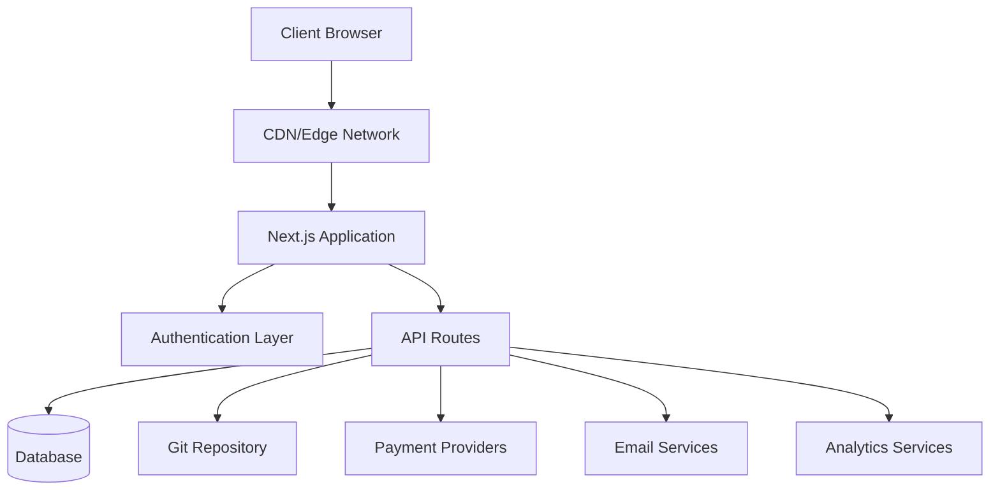
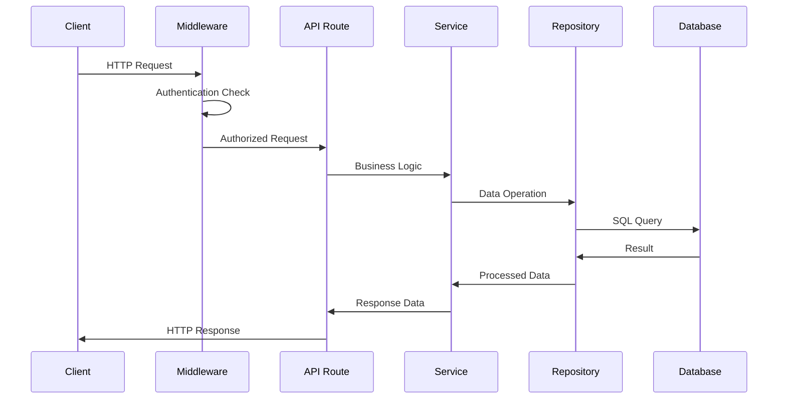
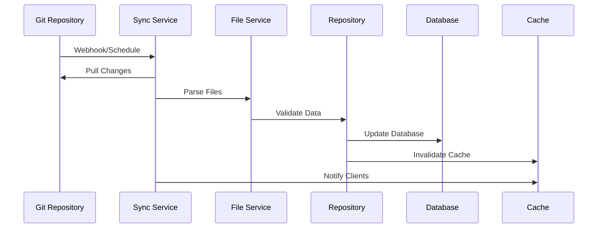
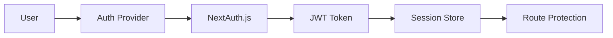

# סקירה כללית של אדריכלות

The Ever Works עוקב אחר ארכיטקטורה מודרנית וניתנת להרחבה המיועדת לביצועים, תחזוקה וחוויית מפתח.

## אדריכלות ברמה גבוהה



## עקרונות ליבה

### 1. הפרדת חששות
- **שכבת מצגת**: רכיבי תגובה ולוגיקת ממשק משתמש
- **שכבה עסקית**: שירותים ומאגרים
- **שכבת נתונים**: מסד נתונים וממשקי API חיצוניים

### 2. עיצוב מודולרי
- ארגון מבוסס תכונות
- רכיבים לשימוש חוזר
- שילובים דמויי פלאגין

### 3. הקלד בטיחות
- TypeScript לאורך כל הדרך
- בדיקת סוגים קפדנית
- אימות זמן ריצה עם Zod

### 4. תחילה ביצועים
- עיבוד בצד השרת
- ייצור סטטי במידת האפשר
- אסטרטגיות מטמון אופטימליות

## שכבות יישום

### שכבת חזית

**טכנולוגיה**: React 19 + Next.js 15
**אחריות**:
- עיבוד ממשק משתמש
- ניהול מדינה בצד הלקוח
- אינטראקציות של משתמשים
- טיפול במסלול

**רכיבי מפתח**:
- רכיבי עמוד (`app/[locale]/`)
- רכיבי ממשק משתמש ניתנים לשימוש חוזר (`components/`)
- ווים מותאמים אישית (`hooks/`)
- ספקי הקשר (`components/providers/`)

### שכבת API

**טכנולוגיה**: נתיבי API של Next.js
**אחריות**:
- ביצוע לוגיקה עסקית
- אימות נתונים
- שילוב שירותים חיצוניים
- טיפול באימות

**מבנה**:
```
app/api/
├── auth/           # Authentication endpoints
├── admin/          # Admin-only endpoints
├── items/          # Item management
└── webhooks/       # External service webhooks
```

### שכבת נתונים

**טכנולוגיות**: טפטוף ORM + PostgreSQL
**אחריות**:
- התמדה בנתונים
- אופטימיזציה של שאילתות
- ניהול עסקאות
- העברות סכמה

**רכיבים**:
- סכימת מסד נתונים (`lib/db/schema.ts`)
- מאגרים (`lib/repositories/`)
- קובצי הגירה (`lib/db/migrations/`)

### שכבת תוכן

**טכנולוגיה**: CMS מבוסס Git
**אחריות**:
- סנכרון תוכן
- בקרת גרסאות
- עריכה משותפת
- אימות תוכן

**מבנה**:
```
.content/
├── config.yml      # Site configuration
├── items/          # Item definitions
├── categories/     # Category definitions
└── tags/           # Tag definitions
```

## דפוסי עיצוב

### 1. תבנית מאגר

לוגיקה של גישה לתקצירים:

```typescript
interface ItemRepository {
  findById(id: string): Promise<Item | null>;
  findBySlug(slug: string): Promise<Item | null>;
  findWithFilters(filters: ItemFilters): Promise<Item[]>;
  create(item: CreateItemRequest): Promise<Item>;
  update(id: string, updates: UpdateItemRequest): Promise<Item>;
  delete(id: string): Promise<void>;
}
```

### 2. דפוס שכבת שירות

מטמיע היגיון עסקי:

```typescript
class ItemService {
  constructor(
    private itemRepository: ItemRepository,
    private gitService: GitService,
    private notificationService: NotificationService
  ) {}

  async submitItem(data: SubmitItemRequest): Promise<SubmissionResult> {
    // Business logic here
  }
}
```

### 3. תבנית מפעל

יוצר מופעי שירות:

```typescript
class PaymentProviderFactory {
  static create(provider: PaymentProvider): PaymentService {
    switch (provider) {
      case 'stripe':
        return new StripePaymentService();
      case 'lemonsqueezy':
        return new LemonSqueezyPaymentService();
      default:
        throw new Error(`Unsupported provider: ${provider}`);
    }
  }
}
```

### 4. תבנית צופה

עדכונים מונעי אירועים:

```typescript
class ContentSyncService {
  private observers: ContentObserver[] = [];

  addObserver(observer: ContentObserver): void {
    this.observers.push(observer);
  }

  notifyObservers(event: ContentEvent): void {
    this.observers.forEach(observer => observer.update(event));
  }
}
```

## זרימת נתונים

### 1. בקש זרימה



### 2. זרימת סינכרון תוכן



## ארכיטקטורת אבטחה

### 1. זרימת אימות



### 2. שכבות הרשאה

- **רמת המסלול**: הגנה על תוכנת אמצעית
- **רמת API**: שומרי נקודות קצה
- **רמת נתונים**: אבטחה ברמת השורה
- **רמת UI**: בקרת גישה מבוססת רכיבים

### 3. אמצעי אבטחה

- **אימות קלט**: סכימות Zod
- **SQL Injection**: שאילתות עם פרמטרים
- **XSS Protection**: חיטוי תוכן
- **הגנה על CSRF**: אימות אסימון
- **הגבלת תעריפים**: בקש מצערת

## אסטרטגיית מטמון

### 1. מטמון יישומים

- **React Query**: מטמון נתונים בצד הלקוח
- **מטמון Next.js**: מטמון נתיב דף ו-API
- **דור סטטי**: דפים מובנים מראש

### 2. מטמון מסד נתונים

- **איגוד חיבורים**: חיבורי DB יעילים
- **אופטימיזציה של שאילתות**: שאילתות שנוספו לאינדקס
- **קריאת העתקים**: פעולות קריאה מבוזרות

### 3. CDN Cache

- **נכסים סטטיים**: תמונות, CSS, JS
- **תגובות API**: נקודות קצה שניתנות למטמון
- **מיקומי קצה**: הפצה עולמית

## שיקולי מדרגיות

### 1. קנה מידה אופקי

- **עיצוב חסר מצב**: אין הפעלות בצד השרת
- ** קנה מידה של מסד נתונים**: קרא העתקים וריסוק
- **הפצת CDN**: מטמון קצה עולמי

### 2. מיטוב ביצועים

- **פיצול קוד**: יבוא דינמי
- **אופטימיזציה של תמונה**: רכיב תמונה של Next.js
- **אופטימיזציה של חבילות**: רעידות עצים והקטנה

### 3. ניטור וצפייה

- **מעקב שגיאות**: שילוב זקיף
- **ניטור ביצועים**: חיוני ליבה לאינטרנט
- **אנליטיקה**: שילוב PostHog
- **רישום**: רישום מובנה

## החלטות טכנולוגיות

### למה Next.js?
- **מסגרת מלאת מחסנית**: מסלולי API + חזית
- **ביצועים**: SSR, SSG ו-ISR
- **חווית מפתח**: טעינה חמה, תמיכה ב-TypeScript
- **מערכת אקולוגית**: מערכת אקולוגית עשירה של תוספים

### למה לטפטף ORM?
- **בטיחות סוג**: תמיכה מלאה ב-TypeScript
- **ביצועים**: תקורה מינימלית
- **גמישות**: SQL גולמי בעת הצורך
- **מערכת הגירה**: שינויים בסכימה מבוקרי גרסה

### למה CMS מבוסס Git?
- **בקרת גרסה**: מעקב היסטוריה מלא
- **שיתוף פעולה**: זרימת עבודה של בקשה למשוך
- **גיבוי**: מופץ לפי הטבע
- **גמישות**: כל ספק Git

### למה להגיב לשאילתה?
- **מטמון**: ניהול מטמון חכם
- **סנכרון**: עדכוני רקע
- **עדכונים אופטימיים**: UX טוב יותר
- **טיפול בשגיאות**: נסה שוב לוגיקה

## נקודות הרחבה

הארכיטקטורה מספקת מספר נקודות הרחבה:

### 1. ספקי אימות מותאם אישית
```typescript
// lib/auth/providers/custom-provider.ts
export function CustomProvider(options: CustomProviderOptions) {
  return {
    id: "custom",
    name: "Custom Provider",
    type: "oauth",
    // Implementation
  }
}
```

### 3. שילוב מקור תוכן
```typescript
// lib/content/sources/custom-source.ts
export class CustomContentSource implements ContentSource {
  async sync(): Promise<SyncResult> {
    // Implementation
  }
}
```

## השלבים הבאים

- [חקור את ערימת הטכנולוגיה](./tech-stack) בפירוט
