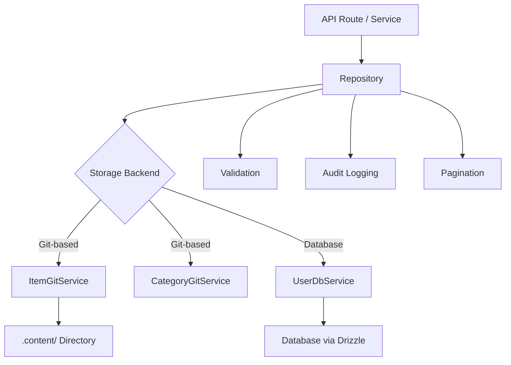

# דפוסי מאגר

התבנית מיישמת את דפוס המאגר כדי לספק שכבת גישה נקייה לנתונים בין ההיגיון העסקי ואחסון הנתונים. מאגרים מקיפים בניית שאילתות, אימות, עימוד ורישום ביקורת תוך האצלת אחסון בפועל לשירותים הבסיסיים (מבוססים Git או מגובים במסד נתונים).

## סקירה כללית של אדריכלות



## קבצי מקור

|קובץ|מטרה|
|------|---------|
|`lib/repositories/item.repository.ts`|פריט CRUD עם אחסון Git, סינון, ביקורת|
|`lib/repositories/category.repository.ts`|ניהול קטגוריות עם אחסון Git|
|`lib/repositories/user.repository.ts`|פעולות משתמש עם אחסון מסד נתונים|
|`lib/repositories/tag.repository.ts`|ניהול תגים|
|`lib/repositories/role.repository.ts`|ניהול תפקידים|
|`lib/repositories/collection.repository.ts`|ניהול גבייה|
|`lib/repositories/sponsor-ad.repository.ts`|ניהול מודעות חסות|
|`lib/repositories/client-item.repository.ts`|פעולות פריט מול לקוח|
|`lib/repositories/client-dashboard.repository.ts`|נתוני לוח המחוונים של הלקוח|
|`lib/repositories/admin-stats.repository.ts`|סטטיסטיקה של מנהל מערכת|
|`lib/repositories/admin-analytics-optimized.repository.ts`|שאילתות ניתוח אופטימליות|
|`lib/repositories/integration-mapping.repository.ts`|מיפויי אינטגרציה חיצוניים|
|`lib/repositories/twenty-crm-config.repository.ts`|עשרים תצורת CRM|

## שיטות מאגר נפוצות

כל המאגרים עוקבים אחר משטח API עקבי:

|שיטה|תיאור|
|--------|-------------|
|`findAll(options?)`|אחזר את כל הרשומות עם סינון אופציונלי|
|`findAllPaginated(page, limit, options?)`|שליפה מדורגת|
|`findById(id)`|מצא רשומה בודדת לפי תעודת זהות|
|`findBySlug(slug)`|מצא רשומה בודדת לפי שבלול|
|`create(data)`|צור רשומה חדשה עם אימות|
|`update(id, data)`|עדכן רשומה קיימת עם אימות|
|`delete(id)`|קשה למחוק רשומה|
|`getStats()`|קבל נתונים סטטיסטיים מצטברים|

## מאגר פריטים

המאגר המקיף ביותר, המדגים את כל דפוסי המפתח.

### אתחול שירות עצלן

שירות Git מאותחל בעצלתיים בשימוש הראשון:

```typescript
export class ItemRepository {
  private gitService: ItemGitService | null = null;

  private async getGitService(): Promise<ItemGitService> {
    if (!this.gitService) {
      const dataRepo = coreConfig.content.dataRepository;
      const token = coreConfig.content.ghToken;
      // Parse GitHub URL, create service config
      this.gitService = await createItemGitService(config);
    }
    return this.gitService;
  }
}
```

### סינון

השיטה `findAll` תומכת בסינון ריבוי קריטריונים עם לוגיקה OR עבור מערכים:

```typescript
async findAll(options: ItemListOptions = {}): Promise<ItemData[]> {
  const items = await gitService.readItems(options.includeDeleted ?? false);
  let filteredItems = items;

  if (options.status)
    filteredItems = filteredItems.filter(item => item.status === options.status);

  if (options.categories?.length > 0)
    filteredItems = filteredItems.filter(item => {
      const itemCategories = Array.isArray(item.category) ? item.category : [item.category];
      return options.categories!.some(cat => itemCategories.includes(cat));
    });

  if (options.tags?.length > 0)
    filteredItems = filteredItems.filter(item =>
      options.tags!.some(tag => item.tags.includes(tag))
    );

  if (options.search) {
    const searchLower = options.search.toLowerCase();
    filteredItems = filteredItems.filter(item =>
      item.name.toLowerCase().includes(searchLower) ||
      item.description.toLowerCase().includes(searchLower)
    );
  }

  return filteredItems;
}
```

### עימוד

```typescript
async findAllPaginated(page = 1, limit = 10, options = {}): Promise<{
  items: ItemData[];
  total: number;
  page: number;
  limit: number;
  totalPages: number;
}> {
  return await gitService.getItemsPaginated(page, limit, options);
}
```

### רישום ביקורת

כל הפעולות המשתנות מתחברות לשביל ביקורת (במאמץ הטוב ביותר, ללא חסימה):

```typescript
async create(data: CreateItemRequest, auditUser?: AuditUser): Promise<ItemData> {
  this.validateCreateData(data);
  const item = await gitService.createItem(data);

  try {
    await itemAuditService.logCreation(item, auditUser);
  } catch (err) {
    console.warn('Audit logCreation failed:', err);
  }

  return item;
}
```

אירועי ביקורת שנתפסו:

|מבצע|שיטת ביקורת|נתונים שנלכדו|
|-----------|-------------|---------------|
|צור|`logCreation`|פריט חדש, משתמש|
|עדכון|`logUpdate`|מצב קודם, מצב חדש, משתמש|
|סקירה|`logReview`|פריט, סטטוס קודם, הערות, משתמש|
|מחק|`logDeletion`|פריט, משתמש, דגל רך/קשה|
|שחזר|`logRestoration`|פריט, משתמש|

### פעולות אצווה

שיטת `batchUpdate` מבצעת אופטימיזציה של עדכונים מרובים ב-Git Commit יחיד:

```typescript
async batchUpdate(updates: Array<{ id: string; data: UpdateItemRequest }>): Promise<ItemData[]> {
  // Pre-validate ALL updates before writing
  for (const { id, data } of updates) {
    this.validateUpdateData(id, data);
  }

  // Write each update without committing
  for (const { id, data } of updates) {
    await gitService.updateItemWithoutCommit(id, data);
  }

  // Single commit for all changes
  await gitService.commitAndPushBatch(`Batch update ${updates.length} items`);

  // Audit logging after successful commit
  for (const entry of auditEntries) {
    await itemAuditService.logUpdate(entry.previous, entry.updated, auditUser);
  }
}
```

### אימות

מאגרים מבצעים אימות קלט לפני פעולות אחסון:

```typescript
private validateCreateData(data: CreateItemRequest): void {
  if (!data.id?.trim())          throw new Error('Item ID is required');
  if (!data.name?.trim())        throw new Error('Item name is required');
  if (!data.slug?.trim())        throw new Error('Item slug is required');
  if (!data.description?.trim()) throw new Error('Item description is required');
  if (!data.source_url?.trim())  throw new Error('Item source URL is required');

  if (!/^[a-z0-9-]+$/.test(data.slug))
    throw new Error('Slug must contain only lowercase letters, numbers, and hyphens');

  try { new URL(data.source_url); }
  catch { throw new Error('Invalid source URL format'); }
}
```

### מחיקה ושחזור רכה

```typescript
async softDelete(id: string): Promise<ItemData> {
  return await gitService.softDeleteItem(id);
}

async restore(id: string): Promise<ItemData> {
  return await gitService.restoreItem(id);
}
```

## מאגר קטגוריות

מדגים דפוס יחיד ובדיקה כפולה:

```typescript
export class CategoryRepository {
  // Duplicate name checking (case-insensitive, excludes self for updates)
  private async checkDuplicateName(name: string, excludeId?: string): Promise<void> {
    const categories = await gitService.readCategories();
    const duplicate = categories.find(cat =>
      cat.name.toLowerCase() === name.toLowerCase() && cat.id !== excludeId
    );
    if (duplicate) throw new Error(`Category with name "${name}" already exists`);
  }

  // Sorting
  private sortCategories(categories, options): CategoryData[] {
    return categories.sort((a, b) => {
      const comparison = a.name.localeCompare(b.name);
      return options.sortOrder === 'desc' ? -comparison : comparison;
    });
  }
}

// Singleton export
export const categoryRepository = new CategoryRepository();
```

## מאגר משתמש

משתמש באחסון מגובה מסד נתונים באמצעות `UserDbService` עם אימות Zod:

```typescript
export class UserRepository {
  private userDbService: UserDbService;

  async create(data: CreateUserRequest): Promise<AuthUserData> {
    // Zod schema validation
    const validatedData = userValidationSchema
      .pick({ email: true, password: true })
      .parse(data);

    // Uniqueness check
    const exists = await this.userDbService.emailExists(validatedData.email);
    if (exists) throw new Error('Email already in use');

    return await this.userDbService.createUser(validatedData);
  }
}
```

## אסטרטגיית טיפול בשגיאות

מאגרים עוקבים אחר דפוס טיפול עקבי בשגיאות:

1. זרוק מחדש שגיאות עסקיות ידועות (למשל, "אימייל כבר בשימוש")
2. רישום ועטוף שגיאות לא ידועות בהודעות כלליות
3. כשלים ברישום ביקורת נתפסים ומוזהרים, לעולם אינם חוסמים את הפעולה
