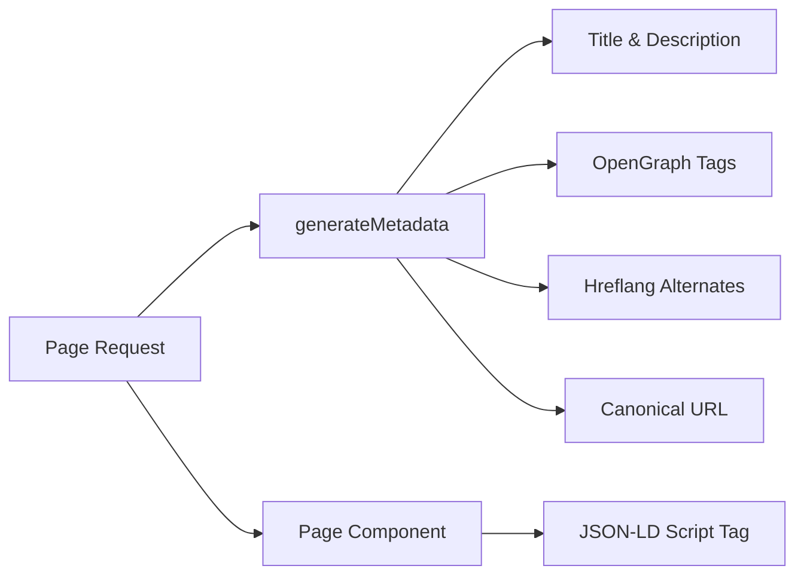

# מערכת SEO

תבנית Ever Works כוללת מערכת SEO מקיפה המייצרת נתונים מובנים (JSON-LD), תגי hreflang, מטא נתונים של OpenGraph ומפות אתר דינמיות. כל כלי השירות לקידום אתרים חיים תחת `lib/seo/` ומשתלבים עם ה-API של Next.js Metadata.

## סקירה כללית של אדריכלות



### קבצי מקור

|קובץ|מטרה|
|---|---|
|`lib/seo/schema.ts`|מחוללי נתונים מובנים JSON-LD|
|`lib/seo/hreflang.ts`|מחוללי כתובות אתרים חלופיות בשפה|
|`lib/seo/listing-metadata.ts`|מפעל מטא נתונים של דף הרישום|

## נתונים מובנים של JSON-LD

המודול `lib/seo/schema.ts` מייצר נתונים מובנים של Schema.org לתוצאות עשירות במנועי חיפוש.

### סכימת מוצר

עבור דפי פרטי פריט, יוצר סכימה `Product`:

```typescript
import { generateProductSchema } from '@/lib/seo/schema';

const schema = generateProductSchema({
  name: 'My App',
  description: 'A productivity tool',
  image: 'https://example.com/icon.png',
  url: 'https://example.com/items/my-app',
  category: 'Productivity',
  sourceUrl: 'https://myapp.com',
  brandName: 'MyApp Inc.',
});
```

פלט שנוצר:

```json
{
  "@context": "https://schema.org",
  "@type": "Product",
  "name": "My App",
  "description": "A productivity tool",
  "image": "https://example.com/icon.png",
  "url": "https://example.com/items/my-app",
  "category": "Productivity",
  "brand": {
    "@type": "Brand",
    "name": "MyApp Inc."
  },
  "offers": {
    "@type": "Offer",
    "url": "https://myapp.com",
    "availability": "https://schema.org/InStock"
  }
}
```

### סכימת ארגון

יוצר סכימת `Organization` לכל האתר עבור נראות לוח הידע:

```typescript
import { generateOrganizationSchema } from '@/lib/seo/schema';

const schema = generateOrganizationSchema();
```

סכימה זו כוללת:
- שם מותג, כתובת אתר ולוגו
- קישורי פרופיל חברתי (`sameAs` מערך) מ-`siteConfig.social`
- נקודת מגע עם דוא"ל (כאשר מוגדרת)

### סכימת אתר עם SearchAction

מפעיל את תיבת החיפוש של Google Sitelinks:

```typescript
import { generateWebSiteSchema } from '@/lib/seo/schema';

const schema = generateWebSiteSchema('en');
// Includes potentialAction with SearchAction targeting /?q={search_term_string}
```

הסכימה מכבדת קידומות מקומיות:
- אזור ברירת מחדל: `https://example.com`
- מקומות אחרים: `https://example.com/fr`

### סכימת פירורי לחם

מייצר `BreadcrumbList` עבור תוצאות חיפוש מודעות לניווט:

```typescript
import { generateBreadcrumbSchema } from '@/lib/seo/schema';

const schema = generateBreadcrumbSchema([
  { name: 'Home', url: 'https://example.com' },
  { name: 'Productivity', url: 'https://example.com/categories/productivity' },
  { name: 'My App', url: 'https://example.com/items/my-app' },
]);
```

### הטמעה בדפים

JSON-LD מוטבע באמצעות תג `<script>` ברכיב העמוד:

```tsx
export default function ItemDetailPage({ item }) {
  const schema = generateProductSchema({ ... });

  return (
    <>
      <script
        type="application/ld+json"
        dangerouslySetInnerHTML={{ __html: JSON.stringify(schema) }}
      />
      <ItemDetail item={item} />
    </>
  );
}
```

## תגי Hreflang

המודול `lib/seo/hreflang.ts` מייצר כתובות אתרים חלופיות בשפה לקידום אתרים מרובים.

### דפוס כתובת אתר

התבנית משתמשת בדפוס קידומת המקום "לפי הצורך":

|מקום|דפוס כתובת אתר|
|---|---|
|`en` (ברירת מחדל)|`https://example.com/items/my-app`|
|`fr`|`https://example.com/fr/items/my-app`|
|`es`|`https://example.com/es/items/my-app`|
|`x-default`|זהה ל-`en` (אזור ברירת המחדל)|

### יצירת חלופות

```typescript
import { generateHreflangAlternates } from '@/lib/seo/hreflang';

// For any page path
const alternates = generateHreflangAlternates('/about');
// Returns: { en: 'https://example.com/about', fr: 'https://example.com/fr/about', ... }

// Convenience functions for common page types
import { generateItemHreflangAlternates } from '@/lib/seo/hreflang';
const itemAlternates = generateItemHreflangAlternates('my-app');

import { generatePageHreflangAlternates } from '@/lib/seo/hreflang';
const pageAlternates = generatePageHreflangAlternates('about');
```

### אינטגרציה עם Next.js Metadata

```typescript
export async function generateMetadata({ params }) {
  const { locale, slug } = await params;
  return {
    alternates: {
      canonical: `https://example.com/${locale}/items/${slug}`,
      languages: generateItemHreflangAlternates(slug),
    },
  };
}
```

### מיפוי מקומי נתמך

כל 20+ המקומות ממופים ב-`LOCALE_TO_HREFLANG`:

```
en -> en, fr -> fr, es -> es, de -> de, zh -> zh,
ar -> ar, he -> he, ru -> ru, uk -> uk, pt -> pt,
it -> it, ja -> ja, ko -> ko, nl -> nl, pl -> pl,
tr -> tr, vi -> vi, th -> th, hi -> hi, id -> id, bg -> bg
```

## מטא נתונים של דף הרישום

המודול `lib/seo/listing-metadata.ts` מייצר אובייקטים שלמים של `Metadata` עבור דפי רישום וקטגוריות.

### שימוש

```typescript
import { generateListingMetadata } from '@/lib/seo/listing-metadata';

export async function generateMetadata({ params }) {
  const { locale } = await params;
  return generateListingMetadata({
    title: 'Time Tracking Tools',
    description: 'Browse the best time tracking tools',
    path: '/categories/time-tracking',
    locale,
    itemCount: 42,
    keywords: ['time tracking', 'productivity', 'tools'],
    imageUrl: 'https://example.com/og/time-tracking.png',
  });
}
```

### מבנה מטא נתונים שנוצר

הפונקציה מייצרת אובייקט Next.js `Metadata` שלם:

|שדה|מקור|
|---|---|
|`title`|`{כותרת} \|{siteName}`|
|`description`|מותאם אישית או שנוצר אוטומטית מספירת כותרת + פריט|
|`keywords`|הצטרף למערך מילות מפתח|
|`openGraph.type`|`'website'`|
|`openGraph.siteName`|מאת `siteConfig.name`|
|`openGraph.url`|כתובת אתר קנונית עם מיקום|
|`openGraph.images`|כתובת אתר תמונה אופציונלית|
|`twitter.card`|`'summary_large_image'`|
|`alternates.canonical`|כתובת URL קנונית מלאה|
|`alternates.languages`|Hreflang חלופי עבור כל האזורים|

## OpenGraph Image Generation

תמונות OG דינמיות נוצרות באמצעות Next.js `ImageResponse` בשתי רמות:

|קובץ|מסלול|מטרה|
|---|---|---|
|`app/opengraph-image.tsx`|`/opengraph-image`|תמונת OG ברירת מחדל בכל האתר|
|`app/[locale]/items/[slug]/opengraph-image.tsx`|`/items/{slug}/opengraph-image`|תמונת OG דינמית לכל פריט|

קבצים אלה משתמשים במודול `next/og` כדי להציג רכיבי React כתמונות בזמן בקשה, מה שמאפשר טקסט דינמי, לוגו ומיתוג.

## רשימת SEO

בעת הוספת סוג דף חדש, ודא שרכיבי SEO הבאים קיימים:

|אלמנט|יישום|
|---|---|
|כותרת העמוד|`generateMetadata` עם כותרת תיאורית|
|מטא תיאור|תיאור מותאם אישית או שנוצר אוטומטית|
|כתובת אתר קנונית|מוגדר ב-`alternates.canonical`|
|תגי Hreflang|השתמש ב-`generateHreflangAlternates`|
|תגיות OpenGraph|כלול באמצעות `generateListingMetadata` או באופן ידני|
|כרטיס טוויטר|הגדר את `twitter.card` ל-`summary_large_image`|
|JSON-LD|הוסף סכימה באמצעות `<script type="application/ld+json">`|
|פירורי לחם|השתמש ב-`generateBreadcrumbSchema` עבור דפים מקוננים|

## שיטות עבודה מומלצות

1. **הגדר תמיד כתובות אתרים קנוניות** -- מונע בעיות תוכן כפולות במקומות שונים.
2. **כלול hreflang עבור כל המקומות** -- גם אם התוכן עדיין לא תורגם, מבנה כתובת האתר עוזר למנועי החיפוש.
3. **השתמש בכותרות תיאוריות וייחודיות** -- הימנע מכותרות כלליות כמו "בית" ללא שם האתר.
4. **שמור על תיאורים מתחת ל-160 תווים** -- תיאורים ארוכים יותר נקטעים בתוצאות החיפוש.
5. **בדוק נתונים מובנים** עם הכלי Google Rich Results Test לפני הפריסה.
6. **צור תמונות OG באופן דינמי** -- תמונות סתירה סטטיות מחמיצות הזדמנויות מיתוג ספציפיות לפריט.
