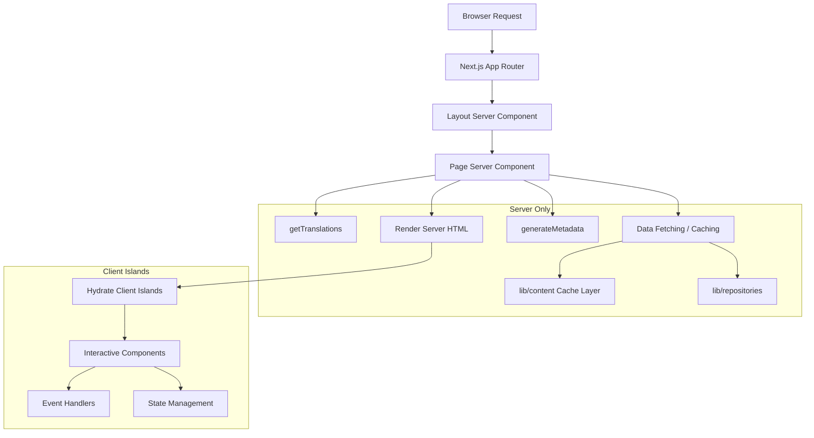

# דפוסי רכיבי שרת

## סקירה כללית

תבנית Ever Works ממנפת את רכיבי שרת React (RSC) כאסטרטגיית העיבוד המוגדרת כברירת מחדל בכל נתב האפליקציה של Next.js. רכיבי שרת מטפלים באחזור נתונים, טעינת תרגום, יצירת מטא נתונים והרכבת פריסה בשרת, ושולחים רק את ה-HTML המעובד ללקוח.

## אדריכלות



## קבצי מקור

|קובץ|דפוס מודגם|
|------|---------------------|
|`template/app/[locale]/about/page.tsx`|שליפת נתונים, i18n, מטא נתונים, עיבוד MDX|
|`template/app/[locale]/layout.tsx`|פריסת שורש עם ספק מקומי|
|`template/app/layout.tsx`|פריסה גלובלית, גופנים, ספקים|
|`template/app/sitemap.ts`|יצירת מסלול לשרת בלבד|
|`template/app/robots.ts`|תצורה לשרת בלבד|

## דפוסי ליבה

### תבנית 1: רכיבי עמוד אסינכרוניים עם i18n

כל דף מקומי עוקב אחר הדפוס הזה:

```typescript
// Server Component -- no "use client" directive
export const revalidate = 3600; // ISR: revalidate every hour

interface PageProps {
    params: Promise<{ locale: string }>;
}

export async function generateMetadata({ params }: PageProps): Promise<Metadata> {
    const { locale } = await params;
    const t = await getTranslations({ locale, namespace: 'footer' });
    return {
        title: t('ABOUT_US'),
        description: t('ABOUT_PAGE_META_DESCRIPTION'),
        alternates: {
            languages: generateHreflangAlternates('/about')
        }
    };
}

export default async function AboutPage({ params }: PageProps) {
    const { locale } = await params;
    const pageData = await getCachedPageContent('about', locale);
    const tCommon = await getTranslations({ locale, namespace: 'common' });

    return (
        <PageContainer>
            <MDX source={pageData?.content || DEFAULT_CONTENT} />
        </PageContainer>
    );
}
```

מאפיינים מרכזיים:
- `params` הוא `Promise` (מוסכמה של Next.js 15+ App Router)
- שיחות `getTranslations()` מרובות עבור מרחבי שמות שונים
- אחזור תוכן במטמון דרך `getCachedPageContent()`
- מרווח אימות סטטי עם `export const revalidate`

### דפוס 2: יצירת מטא נתונים

רכיבי שרת יוצרים מטא נתונים של SEO ברמת המסלול:

```typescript
export async function generateMetadata({ params }: PageProps): Promise<Metadata> {
    const { locale } = await params;
    const t = await getTranslations({ locale, namespace: 'pages' });

    return {
        metadataBase: new URL(appUrl),
        title: t('PAGE_TITLE'),
        description: t('PAGE_DESCRIPTION'),
        alternates: {
            languages: generateHreflangAlternates('/path')
        }
    };
}
```

כלי השירות `generateHreflangAlternates()` מ-`lib/seo/hreflang.ts` מייצר באופן אוטומטי קישורי שפה חלופיים עבור כל האזורים הנתמכים.

### תבנית 3: ISR עם מטמון תוכן

```typescript
export const revalidate = 3600; // Revalidate every hour

export default async function Page({ params }: PageProps) {
    const data = await getCachedPageContent('page-name', locale);
    // Render with cached data...
}
```

הפונקציה `getCachedPageContent()` מספקת שכבת מטמון בצד השרת מעל תוכן CMS מבוסס Git ב-`.content/`. בשילוב עם `revalidate`, זה יוצר דפוס ISR (Incremental Static Regeneration) שבו הדפים נוצרים באופן סטטי ומתרעננים מעת לעת.

### דפוס 4: בדיקות אימות בצד השרת

דפים מוגנים משתמשים בשומרים בצד השרת מ-`lib/auth/guards.ts`:

```typescript
import { requireAuth, requireAdmin } from '@/lib/auth/guards';

export default async function ProtectedPage() {
    const session = await requireAuth();
    // session.user is guaranteed to exist here
    return <div>Welcome {session.user.email}</div>;
}

export default async function AdminPage() {
    const session = await requireAdmin();
    // session.user.isAdmin is guaranteed true here
    return <AdminDashboard />;
}
```

השומרים האלה מתקשרים ל-`auth()` באופן פנימי ומשתמשים ב-`redirect()` מ-`next/navigation` כדי לשלוח משתמשים לא מאומתים לדף הכניסה. ההפניה מחדש מתרחשת בצד השרת, כך שאין צורך ב-JavaScript של הלקוח.

### דפוס 5: חיבור רכיבי שרת ולקוח

רכיבי שרת מאצילים אינטראקטיביות לרכיבי לקוח "איים":

```typescript
// Server Component (page.tsx)
export default async function Page({ params }: PageProps) {
    const { locale } = await params;
    const data = await fetchData();
    const t = await getTranslations({ locale, namespace: 'page' });

    return (
        <div>
            <h1>{t('TITLE')}</h1>
            {/* Server-rendered static content */}
            <StaticContent data={data} />
            {/* Client island for interactivity */}
            <InteractiveFilter initialData={data} />
        </div>
    );
}
```

הנתונים זורמים משרת ללקוח כאביזרים הניתנים לסידרה. רכיבי לקוח מקבלים נתונים שנשלפו מראש ומטפלים באינטראקציות של משתמשים.

## אסטרטגיות איסוף נתונים

### גישה ישירה למאגר

רכיבי שרת יכולים לייבא ולקרוא לפונקציות מאגר ישירות:

```typescript
import { getItemBySlug } from '@/lib/repositories/item-repository';

export default async function ItemPage({ params }) {
    const item = await getItemBySlug(params.slug);
    // ...
}
```

### שכבת תוכן שמור

עבור תוכן CMS מבוסס Git:

```typescript
import { getCachedPageContent } from '@/lib/content';

const pageData = await getCachedPageContent('about', locale);
```

### קריאות API חיצוניות

פונקציות השירות ב-`lib/services/` עוטפות אינטראקציות חיצוניות של API:

```typescript
import { triggerManualSync } from '@/lib/services/sync-service';
```

## סטרימינג ומתח

רכיבי שרת תומכים בסטרימינג דרך גבולות React Suspense. דפים גדולים יכולים להציג מצבי טעינה עבור חלקים בודדים:

```typescript
import { Suspense } from 'react';

export default async function Page() {
    return (
        <div>
            <Header /> {/* Renders immediately */}
            <Suspense fallback={<LoadingSkeleton />}>
                <SlowDataSection /> {/* Streams when ready */}
            </Suspense>
        </div>
    );
}
```

## שיטות עבודה מומלצות בתבנית

1. **אין `"use client"` אלא אם כן יש צורך** -- רכיבים הם רכיבי שרת כברירת מחדל
2. **תרגומים נטענים בצד השרת** -- `getTranslations()` פועל רק על השרת
3. **מטא נתונים ממוקמים יחד עם דפים** -- `generateMetadata` מיוצא מאותו קובץ
4. **אימות מחדש ברמת המסלול** -- `export const revalidate` שולט בתזמון ISR
5. **פונקציות שמירה לאימות** -- הפניות מחדש בצד השרת ללא עלות חבילת לקוח
6. **אביזרים למטה, אירועים למעלה** -- רכיבי שרת מעבירים נתונים לאיי לקוח כאביזרים
