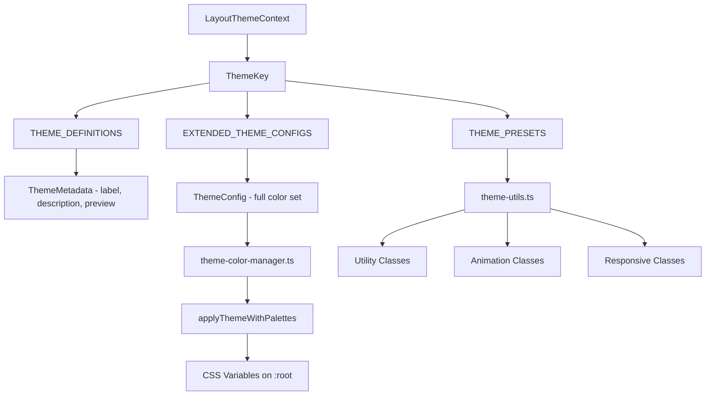
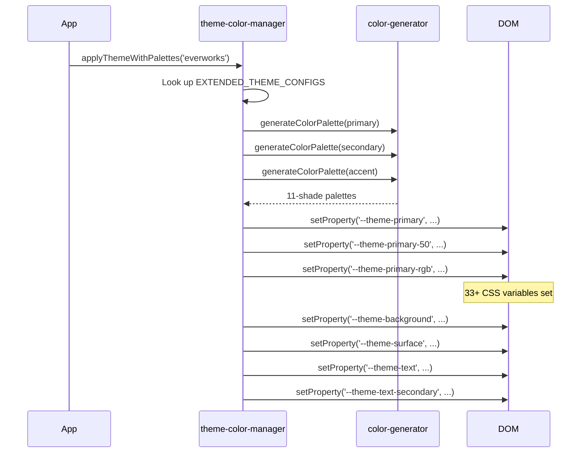

# מערכת נושאים

התבנית מספקת מערכת מרובת נושאים עם ארבעה ערכות נושא מובנות. ערכות נושא שולטות בצבעים, משתני CSS, כלי עזר של Tailwind וכוללות רכיבי תצוגה מקדימה ומטא נתונים עבור ממשקי משתמש לבחירת ערכות נושא.

## סקירה כללית של אדריכלות



## קבצי מקור

|קובץ|מטרה|
|------|---------|
|`lib/themes.tsx`|הגדרות ערכות נושא, מטא נתונים ורכיבי תצוגה מקדימה|
|`lib/theme-color-manager.ts`|הגדרות מורחבות, יישום DOM, יצירת CSS|
|`lib/theme-utils.ts`|כלי עזר, הגדרות קבועות מראש, פונקציות עוזר|
|`components/context/LayoutThemeContext`|הקשר של תגובה עבור מצב הנושא (מוזכר)|

## ערכות נושא זמינות

|מפתח נושא|תווית|ראשוני|משני|תיאור|
|-----------|-------|---------|-----------|-------------|
|`everworks`|ברירת מחדל|`#3d70ef`|`#00c853`|מודרני ומקצועי עם כחול וירוק|
|`corporate`|תאגידי|`#00c853`|`#e74c3c`|עסק מקצועי עם ירוק ואדום|
|`material`|חומר|`#673ab7`|`#ff9800`|Google Material Design עם סגול וכתום|
|`funny`|מצחיק|`#ff4081`|`#ffeb3b`|שובב ותוסס עם ורוד וצהוב|

## תצורת ערכת נושא

כל ערכת נושא מגדירה שבעה חריצי צבע:

```typescript
export interface ThemeConfig {
  primary: string;
  secondary: string;
  accent: string;
  background: string;
  surface: string;
  text: string;
  textSecondary: string;
}
```

### תצורות ערכת נושא מורחבות

ה-`EXTENDED_THEME_CONFIGS` ב-`theme-color-manager.ts` מספק את הגדרות הצבע המלאות:

```typescript
export const EXTENDED_THEME_CONFIGS: Record<ThemeKey, ThemeConfig> = {
  everworks: {
    primary: "#3d70ef",
    secondary: "#00c853",
    accent: "#0056b3",
    background: "#ffffff",
    surface: "#f8f9fa",
    text: "#1a1a1a",
    textSecondary: "#6c757d",
  },
  // ... other themes
};
```

## מטא נתונים של נושא

המודול `themes.tsx` מספק מטא נתונים לתצוגה ורכיבי תצוגה מקדימה:

```typescript
export interface ThemeMetadata {
  readonly key: ThemeKey;
  readonly label: string;
  readonly description: string;
  readonly preview: React.ReactNode;
  readonly config: ThemeConfig;
}
```

### הגדרות נושא

```typescript
export const THEME_DEFINITIONS: Record<ThemeKey, Omit<ThemeMetadata, 'config'>> = {
  everworks: {
    key: "everworks",
    label: "Default",
    description: "Modern and professional theme with blue and green accents",
    preview: ThemePreviews.everworks,
  },
  // ... other themes
};
```

### תצוגה מקדימה של רכיבים

לכל ערכת נושא יש תצוגה מקדימה ויזואלית קטנה המעובדת כסגנון `div`:

```typescript
export const ThemePreviews: Record<ThemeKey, React.ReactNode> = {
  everworks: (
    <div className="w-12 h-8 bg-[#3d70ef] rounded-sm overflow-hidden relative">
      <div className="absolute inset-0 bg-linear-to-br from-white/10 to-black/10" />
      <div className="absolute bottom-1 left-1 w-2 h-1 bg-white/80 rounded-xs" />
      <div className="absolute top-1 right-1 w-1 h-1 bg-white/60 rounded-full" />
    </div>
  ),
  // ... other previews
};
```

### פונקציות שאילתת מטא נתונים

```typescript
// Get metadata for a single theme
export const getThemeMetadata = (themeKey: ThemeKey, config: ThemeConfig): ThemeMetadata;

// Get metadata for all themes
export const getAllThemeMetadata = (configs: Record<ThemeKey, ThemeConfig>): ThemeMetadata[];
```

## יישום משתנה CSS

כאשר מוחל ערכת נושא, מנהל הצבעים מגדיר מאפייני CSS מותאמים אישית ב-`document.documentElement`:



### משתני CSS שנוצרו

עבור כל נושא נוצרים משתני CSS הבאים:

|דפוס משתנה|לספור|דוגמה|
|-----------------|-------|---------|
|`--theme-primary-{50-950}`| 11 |`--theme-primary-500: #3d70ef`|
|`--theme-primary-rgb`| 1 |`--theme-primary-rgb: 61, 112, 239`|
|`--theme-secondary-{50-950}`| 11 |`--theme-secondary-500: #00c853`|
|`--theme-accent-{50-950}`| 11 |`--theme-accent-500: #0056b3`|
|`--theme-background`| 1 |`--theme-background: #ffffff`|
|`--theme-surface`| 1 |`--theme-surface: #f8f9fa`|
|`--theme-text`| 1 |`--theme-text: #1a1a1a`|
|`--theme-text-secondary`| 1 |`--theme-text-secondary: #6c757d`|

## שיעורי עזר לרוח גב

שילובי מחלקות מובנים מראש לשימוש עקבי בנושא:

### גרסאות לחצנים

```typescript
themeClasses.button.primary   // "bg-theme-primary hover:bg-theme-accent text-white"
themeClasses.button.secondary // "bg-theme-secondary hover:bg-theme-secondary/80 text-white"
themeClasses.button.outline   // "border-2 border-theme-primary text-theme-primary ..."
themeClasses.button.ghost     // "text-theme-primary hover:bg-theme-primary/10"
```

### שיעורי אנימציה

```typescript
export const animationClasses = {
  fadeIn: "animate-in fade-in duration-200",
  slideIn: "animate-in slide-in-from-top-2 duration-200",
  scaleIn: "animate-in zoom-in-95 duration-200",
  hover: "transition-all duration-200 hover:scale-105",
  press: "transition-all duration-100 active:scale-95",
};
```

### שיעורי פריסה רספונסיביים

```typescript
export const responsiveClasses = {
  container: "container max-w-7xl px-4 sm:px-6 lg:px-8",
  grid: {
    responsive: "grid grid-cols-1 md:grid-cols-2 lg:grid-cols-3 gap-4",
    auto: "grid grid-cols-[repeat(auto-fit,minmax(300px,1fr))] gap-4",
  },
  flex: {
    center: "flex items-center justify-center",
    between: "flex items-center justify-between",
    start: "flex items-center justify-start",
  },
};
```

## בניין כיתה מודע לנושא

הפונקציה `buildThemeClasses` משלבת בסיס, ערכת נושא ומחלקות מותנות:

```typescript
import { buildThemeClasses } from '@/lib/theme-utils';

const className = buildThemeClasses(
  'px-4 py-2 rounded',           // Base classes
  'bg-theme-primary text-white',  // Theme classes
  {
    'opacity-50 cursor-not-allowed': isDisabled,
    'ring-2 ring-theme-accent': isFocused,
  }
);
```

## הגדרות קבועות מראש של צבע ערכת נושא

גישה מהירה לצבעים ראשוניים/משניים של נושא:

```typescript
export const THEME_PRESETS = {
  everworks: { primary: "#3d70ef", secondary: "#00c853" },
  corporate: { primary: "#2c3e50", secondary: "#e74c3c" },
  material: { primary: "#673ab7", secondary: "#ff9800" },
  funny: { primary: "#ff4081", secondary: "#ffeb3b" },
} as const;

// Query function
export const getThemeColor = (
  themeKey: ThemeKey,
  colorType: "primary" | "secondary"
) => colorMap[themeKey][colorType];
```

## התייחסות לצבע רוח הגב

המודול `theme-utils.ts` מייצא גם את הסט המלא של ערכי צבע Tailwind CSS כאובייקט `tailwindColors` המכסה את כל 22 משפחות הצבע (צפחה עד ורד) עם גוונים 50-950, בתוספת מפה `opacities` מ-5% עד 95%.
