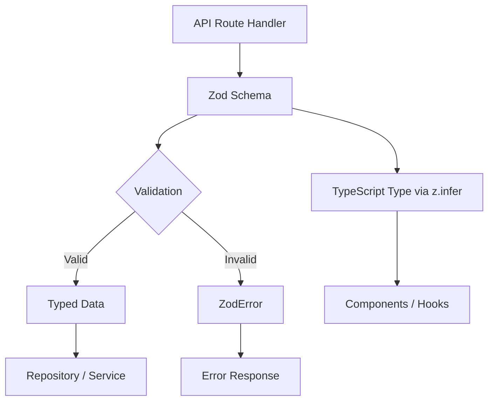

# דפוסי אימות

התבנית משתמשת ב-Zod עבור אימות מבוסס סכימה על פני כל גבולות ה-API. סכימות אימות מגדירות צורות נתונים, אילוצים, טרנספורמציות והסקת סוגים במקור אחד של אמת. לכל תחום יש מודול אימות משלו עם סכמות לפעולות יצירה, עדכון ושאילתה.

## סקירה כללית של אדריכלות



## קבצי מקור

|קובץ|מטרה|
|------|---------|
|`lib/validations/auth.ts`|סכימות סיסמא ואימות|
|`lib/validations/item.ts`|סכימת נתוני מיקום פריט|
|`lib/validations/client-item.ts`|סכימות יצירה/עדכון/שאילתות של פריט מול לקוח|
|`lib/validations/company.ts`|סכימות CRUD של חברה וסכימות שיוך פריט-חברה|
|`lib/validations/sponsor-ad.ts`|סכימות מחזור חיים של מודעות חסות|
|`lib/validations/client-dashboard.ts`|סכימות פרמטרים של שאילתות לוח מחוונים|
|`lib/validations/user-location.ts`|הגדרות מיקום ופרטיות של המשתמש|

## דפוסי ליבה

### תבנית 1: סכימה + סוג משוער

כל סכימה מייצאת סוג TypeScript מתאים באמצעות `z.infer`:

```typescript
import { z } from 'zod';

export const createCompanySchema = z.object({
  name: z.string().min(1, "Company name is required").max(255),
  website: z.string().url("Invalid URL format").optional().or(z.literal("")),
  status: z.enum(["active", "inactive"]).default("active"),
});

export type CreateCompanyInput = z.infer<typeof createCompanySchema>;
// Inferred type:
// {
//   name: string;
//   website?: string | "";
//   status: "active" | "inactive";
// }
```

### דפוס 2: שינוי ונרמל

סכמות משתמשות ב-@@TOK000@@@ כדי לנרמל נתוני קלט:

```typescript
domain: z.string()
  .max(255)
  .optional()
  .transform((val) => val?.toLowerCase().trim() || undefined),

slug: z.string()
  .max(255)
  .optional()
  .transform((val) => val?.toLowerCase().trim() || undefined)
  .refine(
    (val) => !val || /^[a-z0-9-]+$/.test(val),
    { message: "Slug must contain only lowercase letters, numbers, and hyphens" }
  ),
```

### דפוס 3: אילוצי Enum

שדות סטטוס משתמשים ב-@@TOK000@@@ עם מערכי const לבטיחות סוג:

```typescript
export const companyStatus = ["active", "inactive"] as const;
export const sponsorAdStatuses = [
  "pending_payment", "pending", "rejected",
  "active", "expired", "cancelled",
] as const;
export const sponsorAdIntervals = ["weekly", "monthly"] as const;

// Usage in schemas
status: z.enum(companyStatus).default("active"),
interval: z.enum(sponsorAdIntervals),
```

### דפוס 4: פרמטרי שאילתה כפויה

פרמטרים של מחרוזת שאילתה מבקשות HTTP נאלצים ממחרוזות:

```typescript
export const querySponsorAdsSchema = z.object({
  page: z.coerce.number().int().positive().default(1),
  limit: z.coerce.number().int().positive().max(100).default(10),
  status: z.enum(sponsorAdStatuses).optional(),
  sortBy: z.enum(["createdAt", "updatedAt", "startDate", "endDate", "status"]).default("createdAt"),
  sortOrder: z.enum(["asc", "desc"]).default("desc"),
});
```

### תבנית 5: שינוי מחרוזת למספר

עבור פרמטרי שאילתה המגיעים כמחרוזות אך מייצגים מספרים:

```typescript
page: z.string()
  .optional()
  .transform(val => (val ? parseInt(val, 10) : 1))
  .refine(val => !Number.isNaN(val), { message: 'Page must be a valid number' })
  .refine(val => val >= 1, { message: 'Page must be at least 1' }),

deleted: z.string()
  .optional()
  .transform(val => val === 'true'),  // String "true" -> boolean true
```

### דפוס 6: אימות חוצה שדות עם עידון

כללי אימות מורכבים המשתרעים על פני מספר שדות:

```typescript
export const updateLocationSchema = z.object({
  defaultLatitude: z.number().min(-90).max(90).nullable().optional(),
  defaultLongitude: z.number().min(-180).max(180).nullable().optional(),
  defaultCity: z.string().max(200).nullable().optional(),
  defaultCountry: z.string().max(100).nullable().optional(),
  locationPrivacy: locationPrivacySchema.optional(),
}).refine(
  (data) => {
    const hasLat = data.defaultLatitude != null;
    const hasLng = data.defaultLongitude != null;
    return hasLat === hasLng;  // Both or neither
  },
  { message: 'Both latitude and longitude must be provided together' }
);
```

### דפוס 7: סוגי איגוד

שדות שמקבלים מספר פורמטים:

```typescript
category: z.union([
  z.string().min(1, 'Category is required'),
  z.array(z.string().min(1)).min(1, 'At least one category is required'),
]).optional().nullable(),
```

## סכימות דומיין

### אימות

אימות סיסמה עם אילוצי ביטוי רגולרי מרובים:

```typescript
export const passwordSchema = z.string()
  .min(8, "Password must be at least 8 characters")
  .regex(/[A-Z]/, "Must contain at least one uppercase letter")
  .regex(/[a-z]/, "Must contain at least one lowercase letter")
  .regex(/[0-9]/, "Must contain at least one number")
  .regex(/[^A-Za-z0-9]/, "Must contain at least one special character");
```

### מיקום הפריט

נתונים גיאוגרפיים עם קואורדינטות מוגבלות:

```typescript
export const locationSchema = z.object({
  address: z.string().optional(),
  city: z.string().optional(),
  state: z.string().optional(),
  country: z.string().optional(),
  postal_code: z.string().optional(),
  latitude: z.number().min(-90).max(90).optional(),
  longitude: z.number().min(-180).max(180).optional(),
  service_area: z.enum(['local', 'regional', 'national', 'global']).optional(),
  is_remote: z.boolean().optional(),
  geocoded_by: z.enum(['mapbox', 'google']).optional(),
}).optional();
```

### פרטיות מיקום משתמש

הגדרות פרטיות מבוססות Enum:

```typescript
export const locationPrivacyValues = ['private', 'city', 'exact'] as const;
export const locationPrivacySchema = z.enum(locationPrivacyValues);
export type LocationPrivacy = z.infer<typeof locationPrivacySchema>;
```

### הגשת פריט ללקוח

סכימת יצירה מלאה עם קבועי אימות חיצוניים:

```typescript
import { ITEM_VALIDATION } from '@/lib/types/item';

export const clientCreateItemSchema = z.object({
  name: z.string()
    .min(ITEM_VALIDATION.NAME_MIN_LENGTH)
    .max(ITEM_VALIDATION.NAME_MAX_LENGTH),
  description: z.string()
    .min(ITEM_VALIDATION.DESCRIPTION_MIN_LENGTH)
    .max(ITEM_VALIDATION.DESCRIPTION_MAX_LENGTH),
  source_url: z.string().url('Invalid URL format'),
  category: z.union([
    z.string().min(1),
    z.array(z.string().min(1)).min(1),
  ]).optional().nullable(),
  tags: z.array(z.string().min(1)).optional().default([]),
  icon_url: z.string().url().optional().or(z.literal('')),
  location: locationSchema,
});
```

### מחזור חיים של מודעות חסות

סכימות מרובות המכסות את זרימת העבודה המלאה של מודעות נותנות חסות:

|סכימה|מטרה|
|--------|---------|
|`createSponsorAdSchema`|הגשת מודעת חסות חדשה|
|`updateSponsorAdSchema`|עדכון מנהל (סטטוס, תאריכים, מנוי)|
|`approveSponsorAdSchema`|אישור מנהל|
|`rejectSponsorAdSchema`|דחיית מנהל מערכת עם סיבה (10-500 תווים)|
|`cancelSponsorAdSchema`|ביטול מסיבה אופציונלית|
|`querySponsorAdsSchema`|רישום עם עמודים עם מסננים|

## דפוסי שימוש חוזר בסכימה

### סכימות חלקיות לעדכונים

עדכון סכמות לעתים קרובות משקף סכימות עם כל השדות אופציונליים:

```typescript
export const updateCompanySchema = z.object({
  id: z.string().uuid(),
  name: z.string().min(1).max(255).optional(),
  website: z.string().url().optional().or(z.literal("")),
  status: z.enum(companyStatus).optional(),
});
```

### כינוי סכימה

כאשר לשתי פעולות יש צורכי אימות זהים:

```typescript
export const assignCompanyToItemSchema = z.object({
  itemSlug: z.string().min(1).max(255).transform(val => val.toLowerCase().trim()),
  companyId: z.string().uuid("Invalid company ID format"),
});

// Reuse for updates (identical validation)
export const updateItemCompanySchema = assignCompanyToItemSchema;
```

### בחירה סלקטיבית

שימוש ב-`.pick()` ליצירת סכימות משנה:

```typescript
const validatedData = userValidationSchema
  .pick({ email: true, password: true })
  .parse(data);
```

## שימוש בנתיבי API

```typescript
import { clientCreateItemSchema } from '@/lib/validations/client-item';

export async function POST(request: Request) {
  const body = await request.json();

  // Validation + transformation in one step
  const result = clientCreateItemSchema.safeParse(body);

  if (!result.success) {
    return Response.json(
      { errors: result.error.flatten().fieldErrors },
      { status: 400 }
    );
  }

  // result.data is fully typed and transformed
  const item = await repository.create(result.data);
  return Response.json(item, { status: 201 });
}
```
