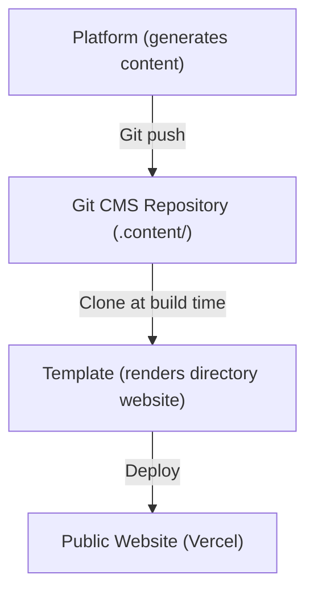
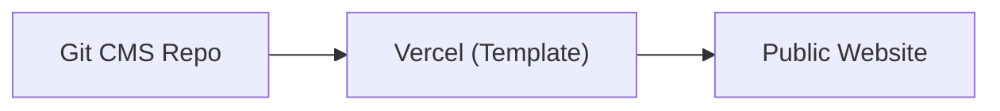
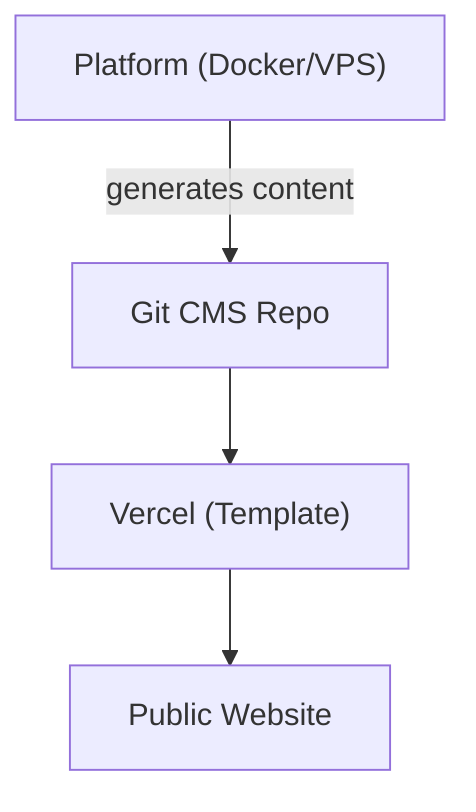
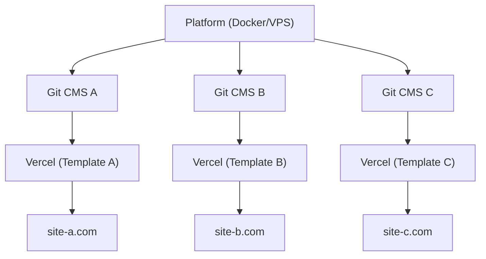

# פלטפורמה לעומת תבנית

Ever Works מורכב משני מוצרים עיקריים המשרתים מטרות שונות אך עובדים יחד כמערכת אקולוגית מאוחדת. דף זה מסביר את ההבדל ומתי להשתמש בכל אחד.

## פלטפורמת Ever Works

**פלטפורמת Ever Works** היא תשתית הצד השרתי לבניה וניהול אתרי ספרייה בקנה מידה. היא מספקת API מסוג REST, צינורות יצירת תוכן מופעלי בינה מלאכותית, מערכת תוספים ותיאום פריסה.

לתיעוד מלא של הפלטפורמה, בקר ב-[docs.ever.works](https://docs.ever.works).

## Directory Web Template

**Directory Web Template** (פרויקט זה) הוא אתר ספרייה full-stack מוכן לייצור שאפשר לשכפל, להתאים אישית ולפרוס כאפליקציה עצמאית.

### מה הוא עושה

- מספק **אתר ספרייה** מלא עם רשימות פריטים, חיפוש, סינון, קטגוריות, תגיות ואוספים
- כולל **אימות** דרך NextAuth.js v5 עם ספקי OAuth (Google, GitHub, Facebook, Twitter, Microsoft) ו-Supabase Auth
- תומך ב**תשלומים** דרך Stripe, LemonSqueezy ו-Polar עם ניהול מנויים
- מציע **בינאום** עם מספר שפות ותמיכת RTL דרך next-intl
- משתמש ב-**CMS מבוסס Git** לסנכרון תוכן הספרייה ממאגרי Git
- כולל **מערכת נושאים** עם נושאים מובנים ויצירת צבעים דינמית
- מספק **אנליטיקה וניטור** דרך PostHog ו-Sentry
- מגיע עם **אופטימיזציית SEO**, יצירת מפת אתר ונתונים מובנים (JSON-LD)
- כולל **לוח בקרה לניהול** עם ניהול תוכן, ניהול משתמשים ואנליטיקה

### ערימת הטכנולוגיות

- **מסגרת:** Next.js 15, React 19
- **שפה:** TypeScript 5
- **ORM:** Drizzle ORM (PostgreSQL)
- **ממשק משתמש:** Tailwind CSS 4, HeroUI React, Radix UI
- **אימות:** NextAuth.js v5, Supabase Auth
- **תשלומים:** Stripe, LemonSqueezy, Polar
- **בדיקות:** Playwright (E2E)
- **פריסה:** Vercel (ראשי), Docker (חלופי)

## השוואה זה לצד זה

| היבט               | פלטפורמה                                   | תבנית                                  |
| ------------------- | ------------------------------------------ | -------------------------------------- |
| **מטרה**            | תשתית צד שרתי וצינור AI                    | אתר ספרייה בצד הלקוח                  |
| **ארכיטקטורה**      | Monorepo (Turborepo + pnpm)                | אפליקציית Next.js עצמאית              |
| **צד שרתי**         | NestJS 11 API                              | מסלולי API של Next.js                  |
| **ORM בסיס נתונים** | TypeORM                                    | Drizzle ORM                            |
| **אימות**           | JWT + OAuth (NestJS Guards)                | NextAuth.js v5 + Supabase Auth         |
| **תשלומים**         | לא כלול                                    | Stripe, LemonSqueezy, Polar            |
| **תכונות AI**       | סוכני LangChain, 7 ספקי LLM               | אין (צורך תוכן שנוצר על ידי AI)       |
| **תוכן**            | מייצר תוכן דרך צינורות AI                  | קורא תוכן מ-CMS מבוסס Git             |
| **פריסה**           | Docker על כל VPS                           | Vercel (או Docker)                     |
| **בדיקות**          | Jest + Vitest                              | Playwright                             |
| **קהל יעד**         | מפעילי פלטפורמות, מפתחי AI                | בוני אתרים, יוצרי ספריות              |

## כיצד הם מתחברים

הפלטפורמה והתבנית עובדות יחד דרך דפוס **CMS מבוסס Git**:

### פעולה עצמאית

- **תבנית ללא פלטפורמה:** שמור על תוכן הספרייה ידנית על ידי עריכת קבצי YAML ו-Markdown במאגר Git CMS. התבנית עובדת כאתר ספרייה פעיל לחלוטין ללא יצירת AI.
- **פלטפורמה ללא תבנית:** השתמש ב-API של הפלטפורמה ליצירת נתוני ספרייה ויצואם לכל צד לקוח.

## מתי להשתמש במה

### השתמש בתבנית כאשר...

- אתה רוצה להשיק אתר ספרייה במהירות עם הגדרת צד שרתי מינימלית
- תוכן הספרייה שלך הוא אצור ידנית או מגיע ממקור נתונים סטטי
- אתה צריך אתר מוכן לייצור עם אימות, תשלומים ו-SEO מחוץ לקופסה
- אתה מעדיף לפרוס ב-Vercel ללא ניהול שרת

### השתמש בפלטפורמה כאשר...

- אתה צריך יצירת תוכן מופעלת AI לספריות גדולות
- אתה רוצה צינורות אוטומטיים שמגלים, מעשירים ומעדכנים פריטי ספרייה
- אתה צריך לנהל מספר ספריות מצד שרתי אחד
- אתה רוצה להשתמש במערכת התוספים לאינטגרציות מותאמות אישית

### השתמש בשניהם כאשר...

- אתה רוצה שתוכן שנוצר על ידי AI יזרום לאתר ייצור
- אתה בונה מוצר SaaS על גבי Ever Works
- אתה צריך יצירת תוכן אוטומטית וגם צד לקוח מלוטש

## ארכיטקטורות פריסה

### רק תבנית (הפשוטה ביותר)

ניהול ידני של תוכן דרך Git. פריסה יחידה ב-Vercel.

### פלטפורמה + תבנית (Full Stack)

יצירת תוכן אוטומטית דרך הפלטפורמה. מחוברת דרך Git.

### פלטפורמה + תבניות מרובות

מופע פלטפורמה יחיד מנהל מספר אתרי ספרייה.
