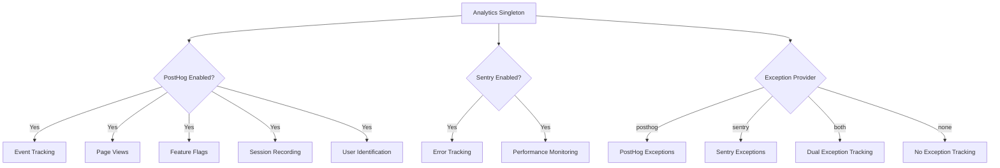
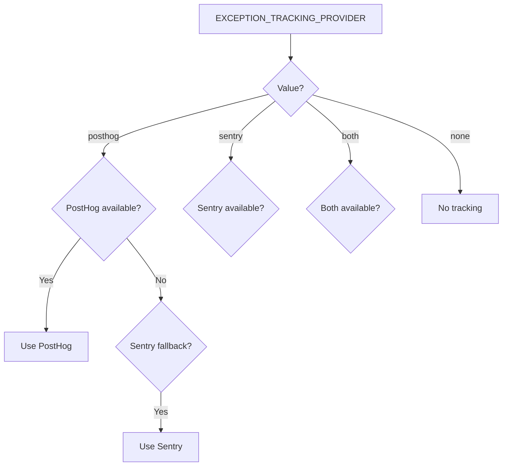

# הגדרת ניתוח נתונים

התבנית מספקת מערכת ניתוח נתונים מאוחדת המשלבת את PostHog לאנליטיקת מוצר ואת Sentry למעקב אחר שגיאות. שני הספקים מנוהלים דרך מחלקת `Analytics` יחידה עם התנהגות נפילה אוטומטית.

## ארכיטקטורה



## משתני סביבה

### הגדרת PostHog

| משתנה | נדרש | ברירת מחדל | תיאור |
|---|---|---|---|
| `NEXT_PUBLIC_POSTHOG_KEY` | כן (לניתוח) | -- | מפתח API של פרויקט PostHog |
| `NEXT_PUBLIC_POSTHOG_HOST` | כן (לניתוח) | -- | כתובת URL של מופע PostHog |
| `POSTHOG_DEBUG` | לא | `false` | הפעלת רישום ניפוי שגיאות |
| `POSTHOG_SESSION_RECORDING_ENABLED` | לא | `true` | הפעלת הקלטת סשנים |
| `POSTHOG_AUTO_CAPTURE` | לא | `false` | לכידה אוטומטית של צפיות בדפים |
| `POSTHOG_EXCEPTION_TRACKING` | לא | `true` | הפעלת מעקב חריגות ב-PostHog |

### הגדרת Sentry

| משתנה | נדרש | ברירת מחדל | תיאור |
|---|---|---|---|
| `NEXT_PUBLIC_SENTRY_DSN` | כן (לשגיאות) | -- | שם מקור נתונים של Sentry |
| `SENTRY_ENABLE_DEV` | לא | `false` | הפעלת Sentry בסביבת פיתוח |
| `SENTRY_DEBUG` | לא | `false` | הפעלת מצב ניפוי שגיאות של Sentry |
| `SENTRY_EXCEPTION_TRACKING` | לא | `true` | הפעלת מעקב חריגות ב-Sentry |

### מעקב חריגות מאוחד

| משתנה | נדרש | ברירת מחדל | תיאור |
|---|---|---|---|
| `EXCEPTION_TRACKING_PROVIDER` | לא | `both` | הספק לשימוש: `posthog`, `sentry`, `both` או `none` |

## הגדרת PostHog

### שלב 1: קבלת אישורים

1. הירשם ב-[posthog.com](https://posthog.com) או התקן PostHog בעצמך
2. צור פרויקט
3. העתק את מפתח ה-API של הפרויקט וכתובת URL של המארח

### שלב 2: הגדרת הסביבה

```env
NEXT_PUBLIC_POSTHOG_KEY=phc_your_project_key_here
NEXT_PUBLIC_POSTHOG_HOST=https://app.posthog.com
```

PostHog מופעל אוטומטית כאשר גם `NEXT_PUBLIC_POSTHOG_KEY` וגם `NEXT_PUBLIC_POSTHOG_HOST` מוגדרים.

### שלב 3: קצבי דגימה

קצבי הדגימה מתכווננים אוטומטית לפי הסביבה:

| סביבה | קצב דגימת אירועים | קצב דגימת הקלטת סשנים |
|---|---|---|
| ייצור | 10% (`0.1`) | 10% (`0.1`) |
| פיתוח | 100% (`1.0`) | 100% (`1.0`) |

## הגדרת Sentry

### שלב 1: קבלת DSN

1. צור פרויקט ב-[sentry.io](https://sentry.io)
2. העתק את ה-DSN מהגדרות הפרויקט

### שלב 2: הגדרת הסביבה

```env
NEXT_PUBLIC_SENTRY_DSN=https://examplePublicKey@o0.ingest.sentry.io/0
SENTRY_ENABLE_DEV=true  # אופציונלי: הפעלה בסביבת פיתוח
```

Sentry מופעל אוטומטית בייצור כאשר ה-DSN מוגדר. לפיתוח, הגדר `SENTRY_ENABLE_DEV=true` במפורש.

## ממשק ה-API של מחלקת Analytics

מחלקת `Analytics` היא יחידה הנגישה בכל רחבי האפליקציה:

```typescript
import { analytics } from '@/lib/analytics';
```

### אתחול

```typescript
// אתחול הניתוח (קריאה פעם אחת בשורש האפליקציה)
analytics.init();
```

מתודת `init()` היא צד-לקוח בלבד ובטוחה לקריאה בהקשרי שרת (תבצע פעולה ריקה).

### מעקב אירועים

```typescript
// מעקב אחר אירוע מותאם אישית
analytics.track('button_clicked', {
  buttonName: 'signup',
  page: '/landing'
});

// מעקב אחר צפייה בדף
analytics.trackPageView('/dashboard', {
  referrer: document.referrer
});
```

### זיהוי משתמש

```typescript
// זיהוי משתמש (לאחר כניסה)
analytics.identify('user-123', {
  email: 'user@example.com',
  plan: 'premium',
  company: 'Acme Inc.'
});

// איפוס זהות (לאחר יציאה)
analytics.reset();

// הגדרת מאפייני משתמש קבועים
analytics.setUserProperties({
  subscription_tier: 'premium',
  signup_date: '2024-01-15'
});

// הגדרת מאפיינים-על (נשלחים עם כל אירוע)
analytics.setSuperProperties({
  app_version: '2.0.0',
  platform: 'web'
});
```

### דגלי תכונות

```typescript
// בדיקה אם דגל תכונה מופעל
const isEnabled = analytics.isFeatureEnabled('new-dashboard', false);

// טעינה מחדש של דגלי תכונות מהשרת
await analytics.reloadFeatureFlags();
```

### מעקב חריגות

```typescript
// לכידת חריגה (מנותבת לספק המוגדר)
analytics.captureException(error, {
  component: 'PaymentForm',
  action: 'submit'
});

// לכידה עם הודעת מחרוזת
analytics.captureException('Payment processing failed', {
  orderId: 'ord-123'
});
```

## בחירת ספק מעקב חריגות


