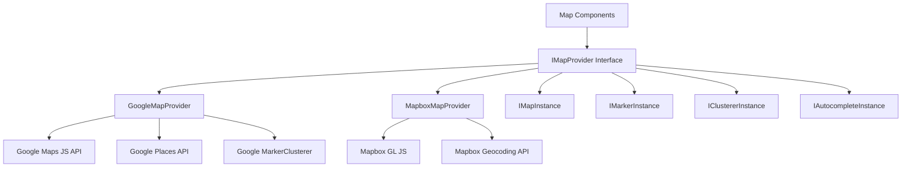
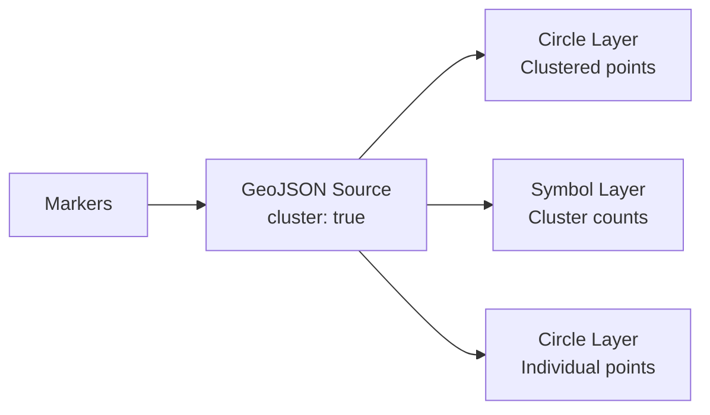

# הגדרת מפה

התבנית כוללת מערכת מפות אגנוסטית לספק התומכת ב-Google Maps וב-Mapbox GL JS. שכבת ממשק משותפת מאפשרת מעבר בין ספקים ללא שינוי קוד הרכיבים.

## ארכיטקטורה



## בחירת ספק

ספק המפה נקבע לפי מפתחות ה-API המוגדרים:

| ספק | משתנה סביבה נדרש |
|---|---|
| Google Maps | `NEXT_PUBLIC_GOOGLE_MAPS_API_KEY` |
| Mapbox | `NEXT_PUBLIC_MAPBOX_ACCESS_TOKEN` |

אם שניהם מוגדרים, הספק נבחר דרך הגדרות תצורת המפה של היישום.

## הגדרת Google Maps

### שלב 1: קבלת מפתח API

1. עבור אל [Google Cloud Console](https://console.cloud.google.com)
2. הפעל את ממשקי ה-API הבאים:
   - Maps JavaScript API
   - Places API
   - Geocoding API
3. צור מפתח API עם הגבלות HTTP Referrer

### שלב 2: הגדרת סביבה

```env
NEXT_PUBLIC_GOOGLE_MAPS_API_KEY=AIzaSy...your-api-key
NEXT_PUBLIC_GOOGLE_MAPS_MAP_ID=your-map-id        # Optional: for styled maps
```

### שלב 3: אבטחה

ספק Google Maps אוכף שימוש במפתח בדפדפן בלבד:

```typescript
// @security Uses NEXT_PUBLIC_GOOGLE_MAPS_API_KEY (browser-exposed).
// Only use HTTP referrer-restricted keys, never unrestricted or server keys.
```

**הגבלות נדרשות למפתח API:**
- הגבלת יישום: HTTP Referrer
- הוסף דפוסי דומיין (לדוגמה, `https://yourdomain.com/*`)
- הגבלת API: הגבל ל-Maps JavaScript, Places ו-Geocoding APIs

## הגדרת Mapbox

### שלב 1: קבלת טוקן גישה

1. הירשם ב-[mapbox.com](https://www.mapbox.com)
2. העתק את טוקן הגישה הציבורי שלך (מתחיל ב-`pk.`)

### שלב 2: הגדרת סביבה

```env
NEXT_PUBLIC_MAPBOX_ACCESS_TOKEN=pk.eyJ1Ijoi...your-token
```

### שלב 3: אבטחה

```typescript
// @security Uses NEXT_PUBLIC_MAPBOX_ACCESS_TOKEN (browser-exposed).
// Only use public tokens (pk.*) with URL restrictions, never secret tokens (sk.*).
```

**הגבלות נדרשות לטוקן:**
- השתמש בטוקן **ציבורי** (קידומת `pk.`)
- הוסף הגבלות URL עבור הדומיינים שלך
- לעולם אל תשתמש בטוקנים סודיים (`sk.*`) בקוד צד לקוח

## ממשק הספק

שני הספקים מממשים את הממשק `IMapProvider` עם יכולות זהות:

### מתודות IMapProvider

| מתודה | תיאור |
|---|---|
| `isLoaded()` | בדוק אם הסקריפט של הספק נטען |
| `loadScript()` | טען את ספריית הספק (אידמפוטנטי) |
| `createMap(container, options)` | צור מופע מפה באלמנט DOM |
| `createMarker(map, options)` | הוסף סמן למפה |
| `createClusterer(map, options, onClick)` | קבץ סמנים קרובים לאשכולות |
| `createAutocomplete(input, onSelect)` | צרף השלמה אוטומטית של כתובת לשדה קלט |
| `getStyleUrl(style)` | קבל את ה-URL של הסגנון לתצוגת רחובות או לוויין |
| `isConfigured()` | בדוק אם מפתחות API קיימים |

### סגנונות מפה

| סגנון | Google Maps | Mapbox |
|---|---|---|
| `streets` | `roadmap` | `mapbox://styles/mapbox/streets-v12` |
| `satellite` | `satellite` | `mapbox://styles/mapbox/satellite-streets-v12` |

## מערכת טיפוסים

ספריית המפות מגדירה טיפוסים מקיפים ב-`lib/maps/types.ts`:

### טיפוסי ליבה

```typescript
interface Coordinates {
  latitude: number;
  longitude: number;
}

interface MapBounds {
  north: number;
  south: number;
  east: number;
  west: number;
}

interface MapViewport {
  center: Coordinates;
  zoom: number;
  bounds?: MapBounds;
}
```

### טיפוסי סמנים

```typescript
interface MapMarkerData {
  id: string;
  coordinates: Coordinates;
  title: string;
  icon?: string;
  category?: string;
  slug: string;
  description?: string;
}

interface MapMarkerWithDistance extends MapMarkerData {
  distanceKm?: number;
}
```

### הגדרת אשכול

```typescript
interface ClusterOptions {
  radius?: number;     // Cluster radius in pixels (default: 60)
  maxZoom?: number;    // Max zoom for clustering (default: 16)
  minZoom?: number;    // Min zoom for clustering (default: 0)
  minPoints?: number;  // Min points to form cluster (default: 2)
}
```

### מטפלי אירועים

```typescript
interface MapEventHandlers {
  onMarkerClick?: (marker: MapMarkerData) => void;
  onClusterClick?: (cluster: MapClusterData) => void;
  onViewportChange?: (viewport: MapViewport) => void;
  onMapReady?: () => void;
  onMapError?: (error: Error) => void;
}
```

## מאפייני רכיב מפה

הממשק `MapComponentProps` מגדיר את מערכת המאפיינים המלאה של רכיב המפה הראשי:

| מאפיין | טיפוס | ברירת מחדל | תיאור |
|---|---|---|---|
| `markers` | `MapMarkerData[]` | `[]` | סמנים להצגה |
| `center` | `Coordinates` | -- | מיקום מרכז התחלתי |
| `zoom` | `number` | -- | רמת זום התחלתית (1-20) |
| `style` | `MapStyle` | `streets` | סגנון מפה (רחובות/לוויין) |
| `height` | `string \| number` | -- | גובה מיכל |
| `width` | `string \| number` | -- | רוחב מיכל |
| `enableClustering` | `boolean` | `false` | הפעל אשכול סמנים |
| `clusterOptions` | `ClusterOptions` | -- | הגדרת אשכול |
| `controls` | `MapControlsConfig` | -- | הגדרות פקדי ממשק |
| `isLoading` | `boolean` | `false` | מצב טעינה חיצוני |
| `isDisabled` | `boolean` | `false` | השבת אינטראקציה |
| `onMarkerClick` | `function` | -- | מטפל לחיצה על סמן |
| `onClusterClick` | `function` | -- | מטפל לחיצה על אשכול |
| `onViewportChange` | `function` | -- | מטפל שינוי תצוגה |

## השלמה אוטומטית של כתובת

שני הספקים תומכים בהשלמה אוטומטית של כתובת עם ממשק מאוחד:

```typescript
interface AddressSuggestion {
  id: string;
  mainText: string;       // Street address
  secondaryText: string;  // City, state
  fullAddress: string;    // Complete formatted address
  coordinates?: Coordinates;
}
```

**Google Maps:** משתמש ב-Places Autocomplete API עם השדות `formatted_address`, `geometry`, `name` ו-`address_components`.

**Mapbox:** משתמש ב-Geocoding API (`/geocoding/v5/mapbox.places/`) עם קלט מעוכב (300ms) וממשק רשימה נפתחת מותאם אישית.

## בורר מיקום

הממשק `LocationPickerProps` תומך בחוויית בחירת מיקום מלאה:

```typescript
interface LocationPickerValue {
  address?: string;
  city?: string;
  state?: string;
  country?: string;
  postalCode?: string;
  latitude?: number;
  longitude?: number;
  serviceArea?: 'local' | 'regional' | 'national' | 'global';
  isRemote?: boolean;
}
```

## שירותי גיאוקודינג

גיאוקודינג בצד השרת זמין דרך `lib/services/geocoding/`:

| קובץ | מטרה |
|---|---|
| `geocoding-provider.interface.ts` | ממשק גיאוקודינג משותף |
| `google-geocoding.provider.ts` | מימוש Google Geocoding API |
| `mapbox-geocoding.provider.ts` | מימוש Mapbox Geocoding API |
| `geocoding.service.ts` | שירות גיאוקודינג מאוחד |

## מימוש אשכול

### אשכול Google Maps

משתמש ב-`@googlemaps/markerclusterer` עם `AdvancedMarkerElement`:

- מייבא את ספריית האשכול באופן דינמי
- יוצר אלמנטי תוכן סמן מותאמים אישית עם סמלים
- התנהגות ברירת מחדל: זום לגבולות האשכול בלחיצה

### אשכול Mapbox

משתמש באשכול מקורי ברמת מקור Mapbox GL:

- מקור GeoJSON עם `cluster: true`
- שלוש שכבות: עיגולי אשכול, תוויות ספירה, נקודות לא-מאושכלות
- קידוד צבע לפי גודל אשכול (קטן: ציאן, בינוני: צהוב, גדול: ורוד)



## הגדרת פקדים

```typescript
interface MapControlsConfig {
  showZoomControls?: boolean;        // Zoom in/out buttons
  showFullscreenControl?: boolean;   // Fullscreen toggle
  showNavigationControl?: boolean;   // Compass/navigation
  showScaleControl?: boolean;        // Distance scale
}
```

## פתרון בעיות

| בעיה | פתרון |
|---|---|
| מפה לא מתרנדרת | ודא שמפתח ה-API מוגדר ונכון |
| "Google Maps API key not configured" | הגדר `NEXT_PUBLIC_GOOGLE_MAPS_API_KEY` |
| מפת Mapbox ריקה | ודא שהטוקן מתחיל ב-`pk.` (ציבורי) |
| סמנים לא מאושכלים | הגדר `enableClustering={true}` על רכיב המפה |
| השלמה אוטומטית לא עובדת | ודא ש-Places API מופעלת (Google) |
| שגיאות CORS | בדוק את הגבלות הדומיין של מפתח ה-API |
| הגבלת קצב | עקב אחר שימוש ב-API בלוח המחוונים של הספק |
