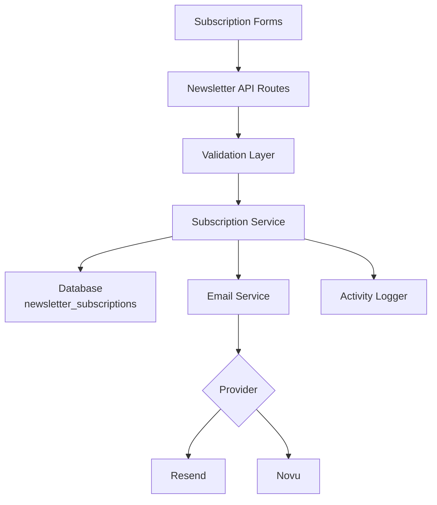
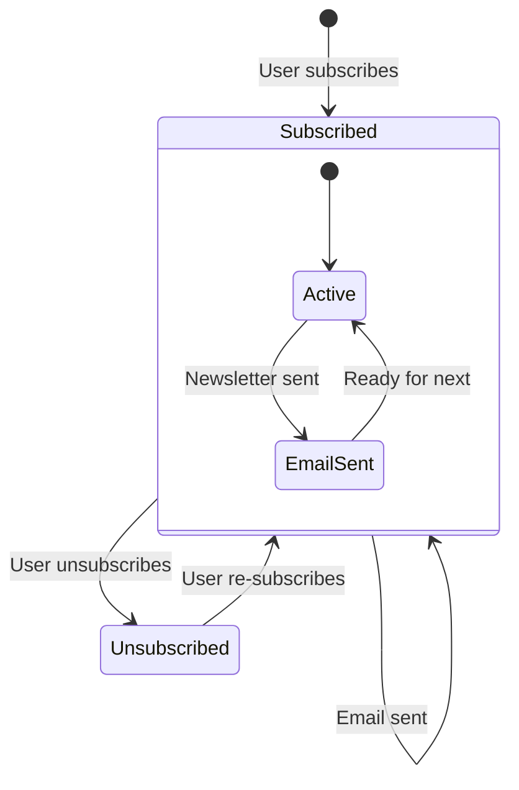

# הגדרת ניוזלטר

התבנית כוללת מערכת מנוי מלאה לניוזלטר עם שילוב ספק דוא"ל, אימות, ניהול מחזור חיים של מנוי ורישום פעילות. ההגדרה מרוכזת ב-`lib/newsletter/`.

## ארכיטקטורה



## מבנה קבצים

```
lib/newsletter/
├── config.ts    # Configuration, types, validation schemas
└── utils.ts     # Email sending, subscription validation, logging
```

## קבועי תצורה

האובייקט `NEWSLETTER_CONFIG` ב-`config.ts` מגדיר את כל ברירות המחדל וההודעות:

```typescript
export const NEWSLETTER_CONFIG = {
  DEFAULT_PROVIDER: "resend",
  DEFAULT_FROM: "onboarding@resend.dev",
  DEFAULT_COMPANY_NAME: "Ever Works",

  SOURCES: {
    FOOTER: "footer",
    POPUP: "popup",
    SIGNUP: "signup",
  },

  ERRORS: {
    INVALID_EMAIL: "Please enter a valid email address",
    ALREADY_SUBSCRIBED: "Email is already subscribed to the newsletter",
    NOT_SUBSCRIBED: "Email is not subscribed to the newsletter",
    SUBSCRIPTION_FAILED: "Failed to create subscription. Please try again.",
    UNSUBSCRIPTION_FAILED: "Failed to unsubscribe. Please try again.",
    EMAIL_SEND_FAILED: "Failed to send email. Please try again.",
    STATS_FAILED: "Failed to get newsletter statistics",
  },

  SUCCESS: {
    SUBSCRIBED: "Successfully subscribed to newsletter",
    UNSUBSCRIBED: "Successfully unsubscribed from newsletter",
  },
};
```

## הגדרת ספק דוא"ל

### Resend (ברירת מחדל)

```env
RESEND_API_KEY=re_your_api_key_here
```

1. הירשם ב-[resend.com](https://resend.com)
2. צור מפתח API
3. אמת את דומיין השליחה (או השתמש ב-`onboarding@resend.dev` לבדיקות)

### Novu

```env
NOVU_API_KEY=your_novu_api_key
```

עבור Novu, קיימת תצורה נוספת בהגדרות האתר:

```yaml
mail:
  provider: "novu"
  template_id: "your-template-id"
  backend_url: "https://api.novu.co"
```

## תצורת דוא"ל

הפונקציה `createEmailConfig()` בונה את תצורת הדוא"ל מתצורת האפליקציה:

```typescript
interface EmailConfig {
  provider: string;      // "resend" or "novu"
  defaultFrom: string;   // Sender email address
  domain: string;        // Application domain URL
  apiKeys: {
    resend: string;
    novu: string;
  };
  novu?: {
    templateId?: string;
    backendUrl?: string;
  };
}
```

עדיפות תצורה:

| הגדרה            | מקור                           | ברירת מחדל                 |
|---|---|---|
| ספק              | `config.mail.provider`         | `"resend"`                 |
| כתובת שולח       | `config.mail.default_from`     | `"onboarding@resend.dev"`  |
| דומיין           | `config.app_url`               | `coreConfig.APP_URL`       |
| מפתח Resend      | משתנה סביבה `RESEND_API_KEY`  | מחרוזת ריקה               |
| מפתח Novu        | משתנה סביבה `NOVU_API_KEY`   | מחרוזת ריקה               |

## סכמות אימות

מערכת הניוזלטר משתמשת בסכמות Zod לאימות קלט:

### סכמת דוא"ל

```typescript
const emailSchema = z.object({
  email: z
    .string()
    .email("Please enter a valid email address")
    .transform((email) => email.toLowerCase().trim()),
});
```

### סכמת מנוי

```typescript
const newsletterSubscriptionSchema = z.object({
  email: z
    .string()
    .email("Please enter a valid email address")
    .transform((email) => email.toLowerCase().trim()),
  source: z
    .enum(["footer", "popup", "signup"])
    .default("footer"),
});
```

## מקורות מנוי

מעקב אחר מקור המנויים:

| מקור     | תיאור                                    |
|---|---|
| `footer` | טופס מנוי בכותרת תחתית של האתר          |
| `popup`  | חלון קופץ/מודאל ניוזלטר                 |
| `signup` | תהליך רישום חשבון                        |

## כלי עזר לניוזלטר

### שליחת דוא"ל

```typescript
import { sendEmailSafely, createEmailService } from '@/lib/newsletter/utils';

// Create email service
const { service, config } = await createEmailService();

// Send email with error handling
const result = await sendEmailSafely(
  service,
  config,
  {
    subject: "Welcome to our newsletter!",
    html: "<h1>Welcome!</h1>",
    text: "Welcome!"
  },
  "user@example.com",
  "welcome"
);

if (!result.success) {
  console.error(result.error);
}
```

### אימות מנוי

```typescript
import { canSubscribe, canUnsubscribe } from '@/lib/newsletter/utils';

// Check if email can be subscribed
const { canSubscribe: allowed, error } = await canSubscribe("user@example.com");
if (!allowed) {
  // Email is already subscribed
}

// Check if email can be unsubscribed
const { canUnsubscribe: allowed, error } = await canUnsubscribe("user@example.com");
if (!allowed) {
  // Email is not currently subscribed
}
```

### רישום פעילות

```typescript
import { logNewsletterActivity, trackNewsletterMetric } from '@/lib/newsletter/utils';

// Log newsletter activity
logNewsletterActivity("subscribe", "user@example.com", "footer", {
  ip: "192.168.1.1"
});

// Track newsletter metrics
trackNewsletterMetric("subscription", "user@example.com", "popup");
```

סוגי פעילות:

| פעולה          | מתי נרשמת                                    |
|---|---|
| `subscribe`    | משתמש נרשם לניוזלטר                          |
| `unsubscribe`  | משתמש מבטל מנוי                              |
| `email_sent`   | דוא"ל ניוזלטר נשלח בהצלחה                   |
| `email_failed` | שליחת דוא"ל ניוזלטר נכשלה                   |

### כלי עזר לתבניות

```typescript
import { getTemplateWithCompany } from '@/lib/newsletter/utils';

// Generate email template with company name
const template = await getTemplateWithCompany(
  (email, companyName) => ({
    subject: `Welcome to ${companyName}`,
    html: `<p>Thanks for subscribing, ${email}!</p>`,
    text: `Thanks for subscribing, ${email}!`
  }),
  "user@example.com"
);
```

### פונקציות עזר לתגובה

```typescript
import { createErrorResponse, createSuccessResponse } from '@/lib/newsletter/utils';

// Standardized error response
const error = createErrorResponse(
  "Subscription failed",
  "user@example.com",
  "subscribe"
);
// { error: "Subscription failed", email: "user@example.com", context: "subscribe" }

// Standardized success response
const success = createSuccessResponse("user@example.com", "subscribe");
// { success: true, email: "user@example.com", context: "subscribe" }
```

## סכמת בסיס הנתונים

מנויי הניוזלטר מאוחסנים בטבלת `newsletter_subscriptions`:

| עמודה            | סוג       | תיאור                                           |
|---|---|---|
| `id`             | UUID      | מפתח ראשי                                       |
| `email`          | String    | דוא"ל המנוי (ייחודי)                            |
| `isActive`       | Boolean   | מצב המנוי הנוכחי                                |
| `subscribedAt`   | Timestamp | מתי החל המנוי                                   |
| `unsubscribedAt` | Timestamp | מתי בוטל המנוי (nullable)                        |
| `lastEmailSent`  | Timestamp | הדוא"ל האחרון שנשלח למנוי                       |
| `source`         | String    | מקור המנוי (footer, popup, signup)              |

## מחזור חיים של מנוי



## טיפוסים

```typescript
type NewsletterSource = "footer" | "popup" | "signup";

interface NewsletterActionResult {
  success?: boolean;
  error?: string;
  email?: string;
}

interface NewsletterStats {
  totalActive: number;
  recentSubscriptions: number;
}
```

## אבטחה

- כתובות דוא"ל מנורמלות לאותיות קטנות ומוסרות רווחים לפני אחסון
- אימות הדוא"ל משתמש ב-regex בטוח המונע התקפות ReDoS (מ-`lib/utils/email-validation.ts`)
- הפונקציה `sendEmailSafely` עוטפת את כל פעולות הדוא"ל בבלוקי try-catch
- מפתחות API לעולם אינם חשופים ללקוח — כל פעולות הדוא"ל מתבצעות בצד השרת

## פתרון בעיות

| בעיה                          | פתרון                                                                         |
|---|---|
| דוא"ל אינו נשלח               | ודא שמפתח `RESEND_API_KEY` או `NOVU_API_KEY` מוגדר                           |
| שגיאה "כבר מנוי"              | בדוק בטבלת `newsletter_subscriptions` אם יש רשומה פעילה קיימת                |
| כתובת שולח שגויה              | עדכן את `mail.default_from` בהגדרות האתר                                     |
| תבנית לא נטענת                | ודא שהפונקציה `getCompanyName()` יכולה לגשת להגדרות האתר                     |
| מקור לא נעקב                  | העבר את הפרמטר `source` בבקשות המנוי                                         |
