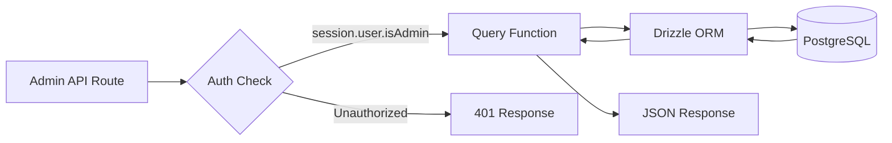
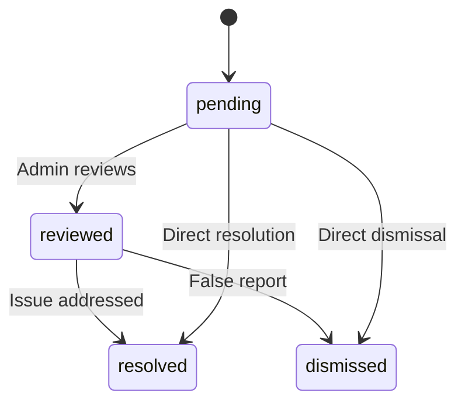

# שאילתות מסד נתונים של מנהל מערכת

שאילתות מנהל מטפלות בניהול פריטים, ניהול משתמשים/לקוחות, גישה מבוססת תפקידים, סטטיסטיקות של לוח המחוונים, ניהול דוחות והגדרות. פונקציות אלה נצרכים בעיקר על ידי מסלולי API תחת `app/api/admin/`.

## זרימת שאילתות מנהל מערכת



## ניהול משתמשים (`user.queries.ts`)

### פונקציות ליבה

|פונקציה|פרמטרים|מחזיר|תיאור|
|----------|-----------|---------|-------------|
|`getUserByEmail`|`email: string`|`משתמש \|null`|מצא משתמש לפי כתובת דוא"ל|
|`getUserById`|`id: string`|`משתמש \|null`|מצא משתמש לפי מפתח ראשי|
|`insertNewUser`|`user: NewUser`|`User[]`|צור רשומת משתמש חדשה|
|`updateUserPassword`|`hash, userId`|`void`|עדכון hash של סיסמה|
|`updateUserVerification`|`email, verified`|`void`|הגדר סטטוס אימות דוא"ל|
|`softDeleteUser`|`userId: string`|`void`|מחיקה רכה (מוסיף `-deleted` לדוא"ל)|
|`isUserAdmin`|`userId: string`|`boolean`|בדוק את תפקיד המנהל באמצעות הצטרפות|

### בדיקת תפקיד מנהל

הפונקציה `isUserAdmin` מבצעת הצטרפות מרובה שולחנות כדי לאמת את סטטוס המנהל:

```typescript
export async function isUserAdmin(userId: string): Promise<boolean> {
  const result = await db
    .select({ isAdmin: roles.isAdmin })
    .from(userRoles)
    .innerJoin(roles, eq(userRoles.roleId, roles.id))
    .where(and(
      eq(userRoles.userId, userId),
      eq(roles.isAdmin, true),
      eq(roles.status, 'active')
    ))
    .limit(1);

  return result.length > 0;
}
```

### תבנית מחיקה רכה

משתמשים לעולם לא נמחקים פיזית. המחיקה הרכה משרשרת את מזהה המשתמש לאימייל כדי לפנות את כתובת הדוא"ל לרישום מחדש:

```typescript
export async function softDeleteUser(userId: string) {
  return db
    .update(users)
    .set({
      deletedAt: sql`CURRENT_TIMESTAMP`,
      email: sql`CONCAT(email, '-', id, '-deleted')`
    })
    .where(eq(users.id, userId));
}
```

## ניהול לקוחות (`client.queries.ts`)

### פרופיל CRUD

|פונקציה|תיאור|
|----------|-------------|
|`createClientProfile(data)`|צור פרופיל עם שם משתמש ייחודי שנוצר אוטומטית|
|`getClientProfileById(id)`|אחזור לפי מזהה פרופיל|
|`getClientProfileByUserId(userId)`|אחזור לפי הפניה של משתמש|
|`getClientProfileByEmail(email)`|אחזור דרך חיפוש טבלת חשבונות|
|`updateClientProfile(id, data)`|עדכון חלקי עם חותמת זמן|
|`deleteClientProfile(id)`|מחיקה קשה של רשומת הפרופיל|

### נתוני לוח המחוונים של מנהל מערכת

הפונקציה `getAdminDashboardData` מותאמת ללוח המחוונים לניהול, ומחזירה גם רשימת לקוחות מעומדת וגם סטטיסטיקות מקיפות במספר מינימלי של שאילתות:

```typescript
export async function getAdminDashboardData(params: {
  page: number;
  limit: number;
  search?: string;
  status?: string;
  plan?: string;
  accountType?: string;
  provider?: string;
  createdAfter?: Date;
  createdBefore?: Date;
}): Promise<{
  clients: ClientProfileWithAuth[];
  stats: { overview, byProvider, byPlan, byAccountType, activity, growth };
  pagination: { page, totalPages, total, limit };
}>
```

הפונקציה לא כוללת משתמשי אדמין מרשימות לקוחות באמצעות תבנית LEFT JOIN + IS NULL:

```typescript
// Exclude admin users from client listing
.leftJoin(userRoles, eq(userRoles.userId, clientProfiles.userId))
.leftJoin(roles, and(eq(userRoles.roleId, roles.id), eq(roles.isAdmin, true)))
.where(isNull(roles.id))  // Only non-admin users
```

### חיפוש לקוחות מתקדם

`advancedClientSearch` תומך בסינון מורכב מרובה קריטריונים:

|קטגוריית סינון|פרמטרים|
|----------------|------------|
|**חיפוש טקסט**|`search` (על פני שם, דוא"ל, שם משתמש, חברה, ביוגרפיה, תפקיד, תעשייה, מיקום)|
|**מסנני Enum**|`status`, `plan`, `accountType`, `provider`|
|**טווחי תאריכים**|`createdAfter`, `createdBefore`, `updatedAfter`, `updatedBefore`, `dateRange`|
|**ספציפית לתחום**|`emailDomain`, `companySearch`, `locationSearch`, `industrySearch`|
|**מספרי**|`minSubmissions`, `maxSubmissions`|
|**בוליאנית**|`hasAvatar`, `hasWebsite`, `hasPhone`, `emailVerified`, `twoFactorEnabled`|
|**מיון**|`sortBy` (createdAt, updatedAt, שם, אימייל, חברה, totalSubmissions), `sortOrder`|

### סטטיסטיקת לקוחות

`getEnhancedClientStats` מחזיר פירוט מקיף:

```typescript
{
  overview: { total, active, inactive, suspended, trial },
  byProvider: { credentials, google, github, facebook, twitter, linkedin, other },
  byPlan: { free: number, standard: number, premium: number },
  byAccountType: { individual, business, enterprise },
  activity: { newThisWeek, newThisMonth, activeThisWeek, activeThisMonth },
  growth: { weeklyGrowth, monthlyGrowth },
}
```

## ניהול דוחות (`report.queries.ts`)

### דווח על CRUD

|פונקציה|תיאור|
|----------|-------------|
|`createReport(data)`|צור דוח תוכן (פריט או הערה)|
|`getReportById(id)`|קבל דיווח עם פרטי כתב וסוקר|
|`getReports(params)`|רישום דוח עם עמודים עם מסננים|
|`updateReport(id, data)`|עדכן סטטוס, רזולוציה, הוסף הערות ביקורת|
|`getReportStats()`|סטטיסטיקה לפי סטטוס, סוג תוכן, סיבה|
|`hasUserReportedContent(reportedBy, contentType, contentId)`|בדיקת דוח כפול|

### דיווח על זרימת מצב



### סינון דוחות

דוחות תומכים בסינון לפי סטטוס, סוג תוכן (פריט/הערה) וסיבה (ספאם, הטרדה, לא הולם, אחר):

```typescript
export async function getReports(params: {
  page?: number;
  limit?: number;
  search?: string;
  status?: ReportStatusValues;
  contentType?: ReportContentTypeValues;
  reason?: ReportReasonValues;
}): Promise<{
  reports: ReportWithReporter[];
  total: number;
  page: number;
  totalPages: number;
  limit: number;
}>
```

## נתונים סטטיסטיים של לוח המחוונים (`dashboard.queries.ts`)

### מדדים זמינים

|פונקציה|מטרה|בשימוש ב|
|----------|---------|---------|
|`getVotesReceivedCount(itemSlugs)`|סך כל ההצבעות על פריטים|סיכום לוח המחוונים|
|`getCommentsReceivedCount(itemSlugs)`|סך כל ההערות על פריטים|סיכום לוח המחוונים|
|`getUniqueItemsInteractedCount(clientId)`|פריטים שהמשתמש עסק בהם|פאנל פעילות|
|`getUserTotalActivityCount(clientId)`|סך כל הצבעות + הערות לפי משתמש|פאנל פעילות|
|`getWeeklyEngagementData(itemSlugs, weeks)`|טבלת הצבעות/הערות שבועית|תרשים אירוסין|
|`getDailyActivityData(clientId, itemSlugs, days)`|פירוט פעילות יומית|תרשים פעילות|
|`getTopItemsEngagement(itemSlugs, limit)`|פריטים מובילים לפי אירוסין|פאנל פריטים עליונים|

### נתוני מעורבות שבועיים

מחזיר נתוני מעורבות מצטברים לפי שבוע ISO, התואמים לפורמט `to_char(date, 'IYYY-IW')` של PostgreSQL:

```typescript
const weeklyVotes = await db
  .select({
    week: sql<string>`to_char(${votes.createdAt}, 'IYYY-IW')`.as('week'),
    count: count(),
  })
  .from(votes)
  .where(and(inArray(votes.itemId, itemSlugs), gte(votes.createdAt, startDate)))
  .groupBy(sql`to_char(${votes.createdAt}, 'IYYY-IW')`)
  .orderBy(sql`to_char(${votes.createdAt}, 'IYYY-IW')`);
```

## ניהול אסימון אישור (`auth.queries.ts`)

|פונקציה|תיאור|
|----------|-------------|
|`getPasswordResetTokenByEmail(email)`|מצא אסימון איפוס בדוא"ל|
|`getPasswordResetTokenByToken(token)`|מצא אסימון איפוס אחר מחרוזת אסימון|
|`deletePasswordResetToken(token)`|הסר אסימון בשימוש/פג תוקף|
|`getVerificationTokenByEmail(email)`|מצא אסימון אימות בדוא"ל|
|`getVerificationTokenByToken(token)`|מצא אסימון אימות לפי מחרוזת אסימון|
|`deleteVerificationToken(token)`|הסר אסימון בשימוש/פג תוקף|

כל פונקציות האסימון עוקבות אחר אותה תבנית פשוטה של בחירה לפי שדה עם `.limit(1)`.
