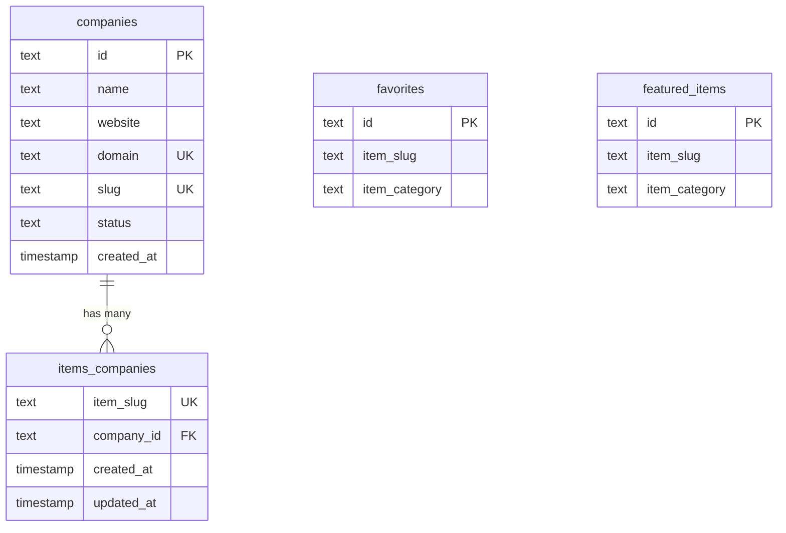

# סכימת קטגוריות וחברות Deep Dive

## סקירה כללית

בתבנית Ever Works, **קטגוריות מוגדרות ב-CMS מבוסס Git** (מאגר תוכן), לא במסד הנתונים. אין טבלת מסד נתונים `categories`. עם זאת, מסד הנתונים מספק תשתית לקישור פריטים לחברות ומעקב אחר היררכיות של חברות, המשרת מטרה ארגונית דומה.

דף זה מתעד את הטבלה `companies`, את טבלת הצומת `items_companies` וכיצד מופיעים הפניות לקטגוריות/חברות בכל הסכימה.

**קובץ מקור:** `template/lib/db/schema.ts`

---

## Table: `companies`

Stores company/organization records that can be linked to items.

### Columns

| Column | DB Name | Type | Nullable | Default | Constraints |
|---|---|---|---|---|---|
| `id` | `id` | `text` | No | `crypto.randomUUID()` | Primary Key |
| `name` | `name` | `text` | No | - | - |
| `website` | `website` | `text` | Yes | - | - |
| `domain` | `domain` | `text` | Yes | - | Unique |
| `slug` | `slug` | `text` | Yes | - | Unique |
| `status` | `status` | `text (enum)` | No | `'active'` | `active`, `inactive` |
| `createdAt` | `created_at` | `timestamp` | No | `now()` | - |
| `updatedAt` | `updated_at` | `timestamp` | No | `now()` | - |

### Indexes

| Name | Columns | Type |
|---|---|---|
| `companies_name_idx` | `name` | B-tree |
| `companies_status_idx` | `status` | B-tree |
| `companies_domain_unique_idx` | `domain` | Unique |
| `companies_slug_unique_idx` | `slug` | Unique |

### TypeScript Types

```typescript
export type Company = typeof companies.$inferSelect;
export type NewCompany = typeof companies.$inferInsert;
```

---

## טבלה: `items_companies`

טבלת צומת המקשרת שבלול פריטים לרשומות החברה. ניתן לשייך כל שבלול פריט לחברה אחת בלבד (הגבלה ייחודית על `item_slug`).

### עמודות

|עמודה|שם DB|הקלד|ניתן לבטל|ברירת מחדל|אילוצים|
|---|---|---|---|---|---|
|`itemSlug`|`item_slug`|`text`|לא| - |ייחודי|
|`companyId`|`company_id`|`text`|לא| - |FK -> `companies.id` (CASCADE)|
|`createdAt`|`created_at`|`timestamp (tz)`|לא|`now()`| - |
|`updatedAt`|`updated_at`|`timestamp (tz)`|לא|`now()`| - |

### אינדקסים

|שם|עמודות|הקלד|
|---|---|---|
|`items_companies_company_id_idx`|`companyId`|B-עץ|

### סוגי TypeScript

```typescript
export type ItemCompany = typeof itemsCompanies.$inferSelect;
export type NewItemCompany = typeof itemsCompanies.$inferInsert;
```

---

## Category References in Other Tables

While categories do not have a dedicated table, category data appears as denormalized fields in several tables:

| Table | Column | Purpose |
|---|---|---|
| `favorites` | `item_category` | Cached category name for display |
| `featured_items` | `item_category` | Cached category name for display |

These fields store the category string at the time the record is created, avoiding the need to look up the Git CMS at read time.

---

## תרשים יחסים



---

## How Categories Work

1. **Content repository defines categories.** The `.content/` directory (cloned from `DATA_REPOSITORY`) contains category definitions in markdown/YAML files.
2. **Items belong to categories in Git.** Each item's frontmatter specifies its category.
3. **Database stores category strings.** When favorites or featured items are created, the category name is copied from the content layer into the database as a denormalized field.
4. **Companies provide organizational grouping.** The `companies` + `items_companies` tables allow linking items to real-world organizations, separate from content categories.

---

## דוגמאות לשאילתות

### קבל את כל החברות הפעילות

```typescript
import { db } from '@/lib/db/drizzle';
import { companies } from '@/lib/db/schema';
import { eq } from 'drizzle-orm';

const activeCompanies = await db
    .select()
    .from(companies)
    .where(eq(companies.status, 'active'));
```

### מצא חברה לפי דומיין

```typescript
const company = await db
    .select()
    .from(companies)
    .where(eq(companies.domain, 'example.com'))
    .limit(1);
```

### קבל פריטים עבור חברה

```typescript
import { itemsCompanies } from '@/lib/db/schema';

const companyItems = await db
    .select()
    .from(itemsCompanies)
    .innerJoin(companies, eq(itemsCompanies.companyId, companies.id))
    .where(eq(companies.slug, 'acme-corp'));
```

### קישור פריט לחברה

```typescript
await db.insert(itemsCompanies).values({
    itemSlug: 'my-tool-slug',
    companyId: company.id,
});
```

---

## Design Notes

- **One item, one company.** The unique constraint on `item_slug` in `items_companies` means each item can only belong to one company.
- **Companies have unique domains and slugs.** Both `domain` and `slug` have unique indexes for fast lookups and URL routing.
- **Category data is read from Git at runtime.** The database does not need to store category hierarchies or metadata -- this comes from the content layer.
