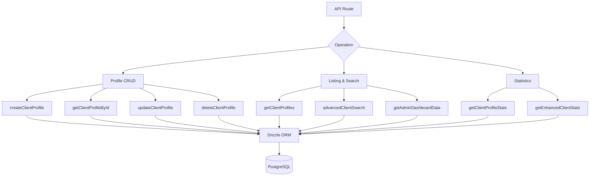

# שאילתות מול לקוחות

שאילתות לקוח מטפלות בניהול פרופילים, רישום עם מטא נתונים של אימות, חיפוש מתקדם בריבוי קריטריונים וסטטיסטיקה מקיפה. כל הפונקציות חיות ב-`client.queries.ts` ונצרכות הן על ידי מנהל מערכת והן על ידי מסלולי API מול לקוח.

## ארכיטקטורת שאילתות לקוח



## פרופיל CRUD

### צור פרופיל

פרופילים חדשים יוצרים אוטומטית שמות משתמש ייחודיים מכתובת האימייל כאשר לא מסופק שם משתמש:

```typescript
export async function createClientProfile(data: {
  userId: string;
  email: string;
  name: string;
  displayName?: string;
  username?: string;
  bio?: string;
  jobTitle?: string;
  company?: string;
  status?: string;
  plan?: string;
  accountType?: string;
}): Promise<ClientProfile>
```

לוגיקה של יצירת שם משתמש:

1. אם מסופק `username`, נרמל והבטח ייחודיות
2. אחרת, חלץ את שם המשתמש מהאימייל באמצעות `extractUsernameFromEmail()`
3. Fallback: צור קידומת `user<timestamp>`
4. כל הנתיבים עוברים דרך `ensureUniqueUsername()` אשר מוסיף סיומות מספריות במידת הצורך

ערכי ברירת מחדל שהוחלו במהלך היצירה:

|שדה|ברירת מחדל|
|-------|---------|
|`displayName`|אותו דבר כמו `name`|
|`bio`|`"Welcome! I'm a new user on this platform."`|
|`jobTitle`|`"User"`|
|`company`|`"Unknown"`|
|`status`|`"active"`|
|`plan`|`"free"`|
|`accountType`|`"individual"`|

### קרא פעולות

|פונקציה|שדה חיפוש|מחזיר|
|----------|-------------|---------|
|`getClientProfileById(id)`|`clientProfiles.id`|`פרופיל לקוח \|null`|
|`getClientProfileByUserId(userId)`|`clientProfiles.userId`|`פרופיל לקוח \|null`|
|`getClientProfileByEmail(email)`|דרך `accounts` הטבלה|`פרופיל לקוח \|null`|

חיפוש המבוסס על דוא"ל נפתר דרך הטבלה `accounts` כדי למצוא את `userId` המשויך, ולאחר מכן מבצע שאילתות `clientProfiles`:

```typescript
export async function getClientProfileByEmail(email: string): Promise<ClientProfile | null> {
  const account = await getClientAccountByEmail(email);
  if (!account) return null;
  const [profile] = await db
    .select()
    .from(clientProfiles)
    .where(eq(clientProfiles.userId, account.userId))
    .limit(1);
  return profile || null;
}
```

### עדכן ומחק

- **`updateClientProfile(id, data)`** -- עדכון חלקי עם חותמת זמן `updatedAt` אוטומטית
- **`deleteClientProfile(id)`** -- מחיקה קשה (מחזירה הצלחה בוליאנית)

## רישום מדורג

`getClientProfiles` מחזיר תוצאות מעומדות עם נתוני ספק אימות, לא כולל משתמשי מנהל:

```typescript
export async function getClientProfiles(params: {
  page?: number;
  limit?: number;
  search?: string;
  status?: string;
  plan?: string;
  accountType?: string;
  provider?: string;
}): Promise<{
  profiles: ClientProfileWithAuth[];
  total: number;
  page: number;
  totalPages: number;
  limit: number;
}>
```

### דפוס אי הכללה של מנהל מערכת

גם שאילתת הספירה וגם שאילתת הנתונים משתמשות בדפוס LEFT JOIN + IS NULL כדי לא לכלול משתמשי מנהל מערכת:

```typescript
.leftJoin(userRoles, eq(userRoles.userId, clientProfiles.userId))
.leftJoin(roles, and(eq(userRoles.roleId, roles.id), eq(roles.isAdmin, true)))
.where(isNull(roles.id))  // Only non-admin users
```

### שאילתת משנה של ספק

כדי למנוע שורות כפולות כאשר למשתמש יש מספר חשבונות אימות, הספק נפתר באמצעות שאילתת משנה סקלרית:

```typescript
accountProvider: sql<string>`coalesce(
  (SELECT provider FROM ${accounts}
   WHERE ${accounts.userId} = ${clientProfiles.userId}
   LIMIT 1),
  'unknown'
)`
```

### מסנן חיפוש

חיפוש טקסט משתמש ב-`ILIKE` בשדות מרובים עם מניעת הזרקת SQL:

```typescript
const escapedSearch = search
  .replace(/\\/g, '\\\\')
  .replace(/[%_]/g, '\\$&');

whereConditions.push(
  sql`(${clientProfiles.username} ILIKE ${`%${escapedSearch}%`} OR
       ${clientProfiles.displayName} ILIKE ${`%${escapedSearch}%`} OR
       ${clientProfiles.company} ILIKE ${`%${escapedSearch}%`} OR
       ${clientProfiles.name} ILIKE ${`%${escapedSearch}%`} OR
       ${clientProfiles.email} ILIKE ${`%${escapedSearch}%`})`
);
```

## חיפוש לקוחות מתקדם

`advancedClientSearch` תומך ביותר מ-20 קריטריוני סינון במספר קטגוריות:

|קטגוריית סינון|פרמטרים|
|----------------|------------|
|**חיפוש טקסט**|`search` (על פני שם, דוא"ל, שם משתמש, חברה, ביוגרפיה, תפקיד, תעשייה, מיקום)|
|**מסנני Enum**|`status`, `plan`, `accountType`, `provider`|
|**טווחי תאריכים**|`createdAfter`, `createdBefore`, `updatedAfter`, `updatedBefore`, `dateRange`|
|**ספציפית לתחום**|`emailDomain`, `companySearch`, `locationSearch`, `industrySearch`|
|**מספרי**|`minSubmissions`, `maxSubmissions`|
|**בוליאנית**|`hasAvatar`, `hasWebsite`, `hasPhone`, `emailVerified`, `twoFactorEnabled`|
|**מיון**|`sortBy`, `sortOrder`|

## סטטיסטיקת לקוחות

### סטטיסטיקה בסיסית

`getClientProfileStats` מחזירה ספירות פשוטות:

```typescript
{
  total: number;
  active: number;
  inactive: number;
  byPlan: Record<string, number>;
  byAccountType: Record<string, number>;
}
```

### סטטיסטיקה משופרת

`getEnhancedClientStats` מספק פירוט רב-ממדי מקיף:

```typescript
{
  overview: { total, active, inactive, suspended, trial },
  byProvider: { credentials, google, github, facebook, twitter, linkedin, other },
  byPlan: { free: number, standard: number, premium: number },
  byAccountType: { individual, business, enterprise },
  activity: { newThisWeek, newThisMonth, activeThisWeek, activeThisMonth },
  growth: { weeklyGrowth, monthlyGrowth },
}
```

הנתונים הסטטיסטיים המשופרים משתמשים ב-`countDistinct` עם צירוף ריבוי שולחנות כדי לייצר ספירות מדויקות גם כאשר למשתמשים יש מספר ספקי חשבונות:

```typescript
const statsResult = await db
  .select({
    status: clientProfiles.status,
    plan: clientProfiles.plan,
    accountType: clientProfiles.accountType,
    provider: accounts.provider,
    count: countDistinct(clientProfiles.id)
  })
  .from(clientProfiles)
  .leftJoin(accounts, eq(clientProfiles.userId, accounts.userId))
  .leftJoin(userRoles, eq(userRoles.userId, clientProfiles.userId))
  .leftJoin(roles, and(eq(userRoles.roleId, roles.id), eq(roles.isAdmin, true)))
  .where(isNull(roles.id))
  .groupBy(
    clientProfiles.status,
    clientProfiles.plan,
    clientProfiles.accountType,
    accounts.provider
  );
```

### מדדי פעילות

חלונות הפעילות מחושבים באמצעות אריתמטיקה של תאריך:

```typescript
const oneWeekAgo = new Date(now.getTime() - 7 * 24 * 60 * 60 * 1000);
const oneMonthAgo = new Date(now.getTime() - 30 * 24 * 60 * 60 * 1000);
```

שיעורי הצמיחה הם אחוזים מפושטים של רישומים חדשים ביחס לסך הכל:

```typescript
const weeklyGrowth = total > 0 ? Math.round((newThisWeek / total) * 100) : 0;
```

## סוגים

כל סוגי שאילתות הלקוח מוגדרים ב-`lib/db/queries/types.ts`:

```typescript
export type ClientProfileWithAuth = ClientProfile & {
  accountProvider: string;
  isActive: boolean;
};

export type ClientStatus = "active" | "inactive" | "suspended" | "trial";
export type ClientPlan = "free" | "standard" | "premium";
export type ClientAccountType = "individual" | "business" | "enterprise";
```
