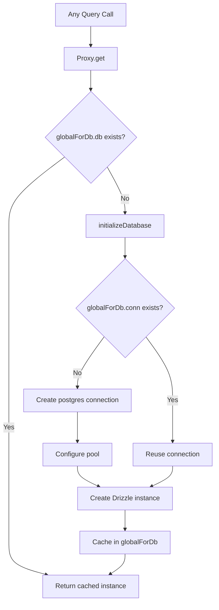

# חיבור ומאגר מידע

התבנית משתמשת ב-`postgres.js` (חבילת `postgres` npm) בתור מנהל ההתקן של PostgreSQL עם Drizzle ORM. ניהול החיבור מטופל באמצעות דפוס אתחול עצלן עם מטמון יחיד עולמי כדי לשרוד את Next.js החלפת מודול חם (HMR) בפיתוח.

## ארכיטקטורת חיבור



## הגדרת מסד נתונים (`lib/db/drizzle.ts`)

### אתחול עצלן עם פרוקסי

מופע מסד הנתונים מיוצא כ-`Proxy` המאתחל את החיבור בגישה הראשונה:

```typescript
export const db = new Proxy({} as ReturnType<typeof drizzle>, {
  get(target, prop) {
    const database = initializeDatabase();
    return database[prop as keyof typeof database];
  },
});
```

זה מבטיח:
- לא נוצר חיבור בזמן הייבוא
- סקריפטים שמייבאים את המודול אך אינם מבצעים שאילתות למסד הנתונים אינם כרוכים בתקורת חיבור
- פעולת מסד הנתונים האמיתית הראשונה מפעילה אתחול

### פונקציית אתחול

```typescript
function initializeDatabase(): ReturnType<typeof drizzle> {
  if (!getDatabaseUrl()) {
    throw new Error('DATABASE_URL environment variable is required');
  }

  if (globalForDb.db) {
    return globalForDb.db;
  }

  const poolSize = getPoolSize();
  const conn = postgres(getDatabaseUrl()!, {
    max: poolSize,
    idle_timeout: 20,
    connect_timeout: 30,
    prepare: false,
    onnotice: getNodeEnv() === 'development' ? console.log : undefined,
  });

  globalForDb.conn = conn;
  globalForDb.db = drizzle(conn, { schema });
  return globalForDb.db;
}
```

### אפשרויות חיבור

|אפשרות|ערך|מטרה|
|--------|-------|---------|
|`max`|ניתן להגדרה (ראה גודל הבריכה)|מקסימום חיבורים בבריכה|
|`idle_timeout`|`20` שניות|סגור חיבורים סרק לאחר פרק זמן זה|
|`connect_timeout`|`30` שניות|זמן מקסימלי ליצירת חיבור|
|`prepare`|`false`|השבת הצהרות מוכנות (נדרש עבור חלק מסביבות PaaS)|
|`onnotice`|`console.log` (מפתחים בלבד)|רישום הודעות PostgreSQL NOTICE בפיתוח|

## גודל בריכה

### תצורה

גודל הבריכה ניתן להגדרה באמצעות משתנה הסביבה `DB_POOL_SIZE`, עם ברירות מחדל מודעות לסביבה:

```typescript
const getPoolSize = (): number => {
  const envPoolSize = process.env.DB_POOL_SIZE;
  if (envPoolSize) {
    const parsed = parseInt(envPoolSize, 10);
    return isNaN(parsed) ? 20 : Math.max(1, Math.min(parsed, 50));
  }
  return getNodeEnv() === 'production' ? 20 : 10;
};
```

### ברירות מחדל

|סביבה|גודל הבריכה המוגדר כברירת מחדל|טווח|
|-------------|------------------|-------|
|הפקה| 20 | 1 - 50 |
|פיתוח| 10 | 1 - 50 |

גודל הבריכה מהודק בין 1 ל-50 ללא קשר לערך המוגדר.

### הנחיות לגודל הבריכה

- **פיתוח (10):** מספיק למפתח יחיד עם HMR. שומר על שימוש נמוך במשאבים.
- **ייצור (20):** מטפל בבקשות API במקביל. הגדל עבור פריסות עתירות תנועה.
- **ללא שרתים (1-5):** השתמש במאגרים קטנים בעת פריסה בפלטפורמות ללא שרתים שבהן כל מופע מקבל מאגר משלו.

## תבנית סינגלטון גלובלית

### HMR בטיחות

מצב הפיתוח Next.js מבצע מחדש מודולים על שינויים בקבצים. ללא הגנה, כל מחזור HMR ייצור מאגר חיבורים חדש, ומיצה במהירות את חיבורי מסד הנתונים.

התבנית מצרף את החיבור ל`globalThis` כדי לשרוד את HMR:

```typescript
const globalForDb = globalThis as unknown as {
  conn: postgres.Sql | undefined;
  db: ReturnType<typeof drizzle> | undefined;
};
```

כאשר מודול מופעל מחדש:
1. `initializeDatabase()` צ'קים `globalForDb.db`
2. אם המופע קיים, הוא מוחזר מיד
3. אם החיבור קיים אך מופע ה-Drizzle אינו קיים, נעשה שימוש חוזר בחיבור הקיים

רישום פיתוח מציין אם נעשה שימוש חוזר בחיבור:

```
Reusing existing database connection; pool size is unchanged
```

או שזה עתה נוצר:

```
Database connection established successfully with pool size: 10
```

### גישה ישירה למופע

עבור ספריות הדורשות מופע טפטוף קונקרטי (למשל, מתאם Auth.js), מסופקת פונקציית getter:

```typescript
export function getDrizzleInstance(): ReturnType<typeof drizzle> {
  return initializeDatabase();
}
```

## מודול תצורה (`lib/db/config.ts`)

מודול תצורה בטוח לסקריפט ש**לא** מייבא `server-only`, ומאפשר להשתמש בו על ידי העברה וסקריפטים של זריעה:

```typescript
export function getDatabaseUrl(): string | undefined {
  return process.env.DATABASE_URL;
}

export function getNodeEnv(): 'development' | 'production' | 'test' {
  const env = process.env.NODE_ENV;
  if (env === 'production' || env === 'test') return env;
  return 'development';
}

export function isProduction(): boolean {
  return getNodeEnv() === 'production';
}
```

## רץ הגירה (`lib/db/migrate.ts`)

רץ ההגירה הוא אימפוטנטי ובטוח להתקשר בכל הפעלה של אפליקציה:

```typescript
export async function runMigrations(): Promise<boolean> {
  const { db } = await import('./drizzle');
  await migrate(db, { migrationsFolder: './lib/db/migrations' });
  return true;
}
```

התנהגויות מפתח:
- טפטוף עוקב אחר הגירות שהוחלו ב-`drizzle.__drizzle_migrations`
- העברות שכבר הוחלו מדלגות באופן אוטומטי
- מחזיר `true` על הצלחה, `false` על כישלון (לא זורק)
- מצב העברת יומנים לפני ואחרי הביצוע

## משתני סביבה

|משתנה|חובה|ברירת מחדל|תיאור|
|----------|----------|---------|-------------|
|`DATABASE_URL`|כן| -- |מחרוזת חיבור PostgreSQL|
|`DB_POOL_SIZE`|לא|`20` (פרוד) / `10` (פיתוח)|גודל בריכת חיבור (1-50)|
|`NODE_ENV`|לא|`development`|סביבה (פיתוח/ייצור/בדיקה)|

## תצורת ערכת טפטוף

תצורת ערכת ה-Drizzle ליצירת סכמות וניהול הגירה:

```typescript
// drizzle.config.ts
export default {
  schema: "./lib/db/schema.ts",
  out: "./lib/db/migrations",
  dialect: "postgresql",
  dbCredentials: {
    url: process.env.DATABASE_URL,
  },
} satisfies Config;
```

## פתרון בעיות

|בעיה|סיבה|פתרון|
|-------|-------|----------|
|`DATABASE_URL is required`|חסר env var|הגדר `DATABASE_URL` ב-`.env.local`|
|פסקי זמן לחיבור|רשת איטית או DB עמוס מדי|הגדל את `connect_timeout` או בדוק את תקינות ה-DB|
|מיצוי הבריכה ב-dev|HMR יצירת בריכות מרובות|ודא שתבנית `globalForDb` תקינה|
|מיצוי הבריכה בפרוד|יותר מדי בקשות במקביל|הגדל `DB_POOL_SIZE` (מקסימום 50)|
|`prepare` שגיאות ב-PaaS|PaaS pgBouncer במצב עסקה|שמור `prepare: false`|
