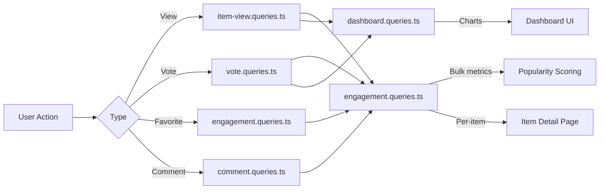

# שאילתות מעורבות ואינטראקציה

שאילתות מעורבות אוספות אינטראקציות של משתמשים (צפיות, הצבעות, מועדפים, הערות) בין פריטים. שאילתות אלו מובילות למיון פופולריות, תרשימי לוח מחוונים ופאנלים של מעורבות לכל פריט. המודולים הרלוונטיים הם `engagement.queries.ts`, `vote.queries.ts`, `comment.queries.ts`, `item-view.queries.ts`, ו-`dashboard.queries.ts`.

## זרימת נתוני מעורבות



## מדדי מעורבות בכמות גדולה (`engagement.queries.ts`)

### `getEngagementMetricsPerItem`

הפונקציה העיקרית לציון פופולריות. מחזירה את כל ממדי המעורבות עבור פריטים מרובים באצווה אחת של שאילתה מקבילה:

```typescript
export async function getEngagementMetricsPerItem(
  itemSlugs: string[]
): Promise<Map<string, ItemEngagementMetrics>>
```

סוג החזרה:

```typescript
export interface ItemEngagementMetrics {
  views: number;
  votes: number;       // Net votes (upvotes - downvotes)
  favorites: number;
  comments: number;
  avgRating: number;   // Average rating from comments (0-5)
}
```

### אסטרטגיית שאילתות מקבילה

ארבע שאילתות עצמאיות פועלות באמצעות `Promise.all` לתפוקה מקסימלית:

```typescript
const [viewsData, votesData, favoritesData, commentsData] = await Promise.all([
  // 1. Views per item
  db.select({ itemId: itemViews.itemId, count: count() })
    .from(itemViews)
    .where(inArray(itemViews.itemId, itemSlugs))
    .groupBy(itemViews.itemId),

  // 2. Net votes per item (upvotes - downvotes)
  db.select({
      itemId: votes.itemId,
      netScore: sql<number>`SUM(CASE
        WHEN vote_type = 'upvote' THEN 1
        WHEN vote_type = 'downvote' THEN -1
        ELSE 0 END)`.as('netScore'),
    })
    .from(votes)
    .where(inArray(votes.itemId, itemSlugs))
    .groupBy(votes.itemId),

  // 3. Favorites per item
  db.select({ itemSlug: favorites.itemSlug, count: count() })
    .from(favorites)
    .where(inArray(favorites.itemSlug, itemSlugs))
    .groupBy(favorites.itemSlug),

  // 4. Comments count + average rating (excluding soft-deleted)
  db.select({
      itemId: comments.itemId,
      count: count(),
      avgRating: sql<number>`COALESCE(AVG(${comments.rating}), 0)`.as('avgRating'),
    })
    .from(comments)
    .where(and(inArray(comments.itemId, itemSlugs), isNull(comments.deletedAt)))
    .groupBy(comments.itemId),
]);
```

### נורמליזציה של התוצאה

כל תוצאת שאילתה מומרת ל-`Map` עבור חיפוש O(1), ולאחר מכן משולבת למפת המדדים הסופית:

```typescript
const viewsMap = new Map<string, number>(
  viewsData.map(v => [v.itemId, Number(v.count)])
);
// ... same for votesMap, favoritesMap, commentsMap

for (const slug of itemSlugs) {
  metricsMap.set(slug, {
    views: viewsMap.get(slug) ?? 0,
    votes: votesMap.get(slug) ?? 0,
    favorites: favoritesMap.get(slug) ?? 0,
    comments: commentsMap.get(slug)?.count ?? 0,
    avgRating: commentsMap.get(slug)?.avgRating ?? 0,
  });
}
```

### פונקציות מטריות עצמאיות

|פונקציה|מחזיר|תיאור|
|----------|---------|-------------|
|`getFavoritesPerItem(itemSlugs)`|`Map<string, number>`|ספירות מועדפות לכל פריט|
|`getCommentsPerItem(itemSlugs)`|`Map<string, { count, avgRating }>`|ספירת תגובות ודירוגים ממוצעים|

שתי הפונקציות משתמשות באותה דפוס: החזרה מוקדמת עבור מערכים ריקים, `groupBy` צבירה, `Map` בנייה.

## שאילתות הצבעה (`vote.queries.ts`)

### הצביעו CRUD

|פונקציה|תיאור|
|----------|-------------|
|`createVote(vote)`|צור הצבעה עם נורמליזציה של שבלול|
|`getVoteByUserIdAndItemId(userId, itemSlug)`|בדוק הצבעה קיימת|
|`deleteVote(voteId)`|קשה למחוק הצבעה|

כל פונקציות ההצבעה מנרמלות שבלולים של פריט דרך `getItemIdFromSlug()` לפני השאילתה.

### חישוב ניקוד נטו

ציון פריט בודד באמצעות `SUM` מותנה:

```typescript
export async function getVoteCountForItem(itemSlug: string): Promise<number> {
  const itemId = getItemIdFromSlug(itemSlug);
  const [result] = await db
    .select({
      netScore: sql<number>`
        SUM(CASE
          WHEN vote_type = 'upvote' THEN 1
          WHEN vote_type = 'downvote' THEN -1
          ELSE 0
        END)`.as('netScore')
    })
    .from(votes)
    .where(eq(votes.itemId, itemId));
  return Number(result?.netScore ?? 0);
}
```

### ציוני הצבעה בכמות גדולה

`getVotesPerItem` מחזירה `Map<string, number>` של ציוני נטו עבור מספר פריטים באמצעות `inArray` ו-`groupBy`.

### פריטים ממוינים בהצבעה

```typescript
export async function getItemsSortedByVotes(limit = 10, offset = 0) {
  return db
    .select({
      itemId: votes.itemId,
      voteCount: sql<number>`count(${votes.id})`.as('vote_count')
    })
    .from(votes)
    .groupBy(votes.itemId)
    .orderBy(sql`vote_count DESC`)
    .limit(limit)
    .offset(offset);
}
```

## שאילתות תגובה (`comment.queries.ts`)

### הערה CRUD

|פונקציה|תיאור|
|----------|-------------|
|`createComment(data)`|צור עם נורמליזציה של שבלול|
|`getCommentById(id)`|רשומת הערות גולמית|
|`getCommentWithUserById(id)`|הערה עם פרופיל משתמש הצטרף|
|`updateComment(id, { content?, rating? })`|עדכן עם `editedAt` חותמת זמן|
|`updateCommentRating(id, rating)`|עדכון לדירוג בלבד|
|`deleteComment(id)`|מחיקה רכה (`deletedAt = new Date()`)|

### הערות עם נתוני משתמש

`getCommentsByItemId` משתמש ב-`innerJoin` עם `clientProfiles` כדי להעשיר כל תגובה בפרטי מחבר:

```typescript
export async function getCommentsByItemId(itemSlug: string): Promise<CommentWithUser[]> {
  const itemId = getItemIdFromSlug(itemSlug);
  return db
    .select({
      id: comments.id,
      content: comments.content,
      rating: comments.rating,
      userId: comments.userId,
      itemId: comments.itemId,
      createdAt: comments.createdAt,
      updatedAt: comments.updatedAt,
      editedAt: comments.editedAt,
      deletedAt: comments.deletedAt,
      user: {
        id: clientProfiles.id,
        name: clientProfiles.name,
        email: clientProfiles.email,
        image: clientProfiles.avatar
      }
    })
    .from(comments)
    .innerJoin(clientProfiles, eq(comments.userId, clientProfiles.id))
    .where(and(eq(comments.itemId, itemId), isNull(comments.deletedAt)))
    .orderBy(desc(comments.createdAt));
}
```

## הצג מעקב (`item-view.queries.ts`)

### מניעת כפילות יומית

ביטול כפילויות של צפיות לכל צופה לכל פריט ליום UTC באמצעות תבנית ה-`onConflictDoNothing` ההעלאה:

```typescript
export async function recordItemView(
  view: Pick<NewItemView, 'itemId' | 'viewerId' | 'viewedDateUtc'>
): Promise<boolean> {
  const result = await db
    .insert(itemViews)
    .values(view)
    .onConflictDoNothing()
    .returning({ id: itemViews.id });
  return result.length > 0; // true = new view, false = duplicate
}
```

### הצג פונקציות צבירה

|פונקציה|פרמטרים|מחזיר|תיאור|
|----------|-----------|---------|-------------|
|`getTotalViewsCount(itemSlugs)`|`string[]`|`number`|סך כל הצפיות בפריטים|
|`getRecentViewsCount(itemSlugs, days)`|`string[], number`|`number`|צפיות ב-N הימים האחרונים|
|`getDailyViewsData(itemSlugs, days)`|`string[], number`|`Map<string, number>`|ספירת צפייה יומית|
|`getViewsPerItem(itemSlugs)`|`string[]`|`Map<string, number>`|ספירת צפייה לכל פריט|

### UTC Date Helper

כל חישובי התאריכים משתמשים ב-UTC כדי למנוע שגיאות ביטול-באחת הקשורות לאזור זמן:

```typescript
function getUtcDateString(daysAgo: number = 0): string {
  const date = new Date();
  date.setUTCDate(date.getUTCDate() - daysAgo);
  return date.toISOString().split('T')[0]; // "YYYY-MM-DD"
}
```

## נתונים סטטיסטיים של לוח המחוונים (`dashboard.queries.ts`)

### מדדים זמינים

|פונקציה|מטרה|
|----------|---------|
|`getVotesReceivedCount(itemSlugs)`|סך כל ההצבעות על הפריטים של המשתמש|
|`getCommentsReceivedCount(itemSlugs)`|סך כל ההערות על הפריטים של המשתמש|
|`getUniqueItemsInteractedCount(clientId)`|פריטים שהמשתמש עסק בהם|
|`getUserTotalActivityCount(clientId)`|סך כל הצבעות + הערות לפי משתמש|
|`getWeeklyEngagementData(itemSlugs, weeks)`|נתוני תרשים מצטברים שבועיים|
|`getDailyActivityData(clientId, itemSlugs, days)`|פירוט פעילות יומית|
|`getTopItemsEngagement(itemSlugs, limit)`|פריטים מובילים לפי ציון מעורבות|

### צבירת אירוסין שבועית

משתמש ב-`to_char` של PostgreSQL עם פורמט שבוע ISO עבור איסוף שבועי עקבי:

```typescript
const weeklyVotes = await db
  .select({
    week: sql<string>`to_char(${votes.createdAt}, 'IYYY-IW')`.as('week'),
    count: count(),
  })
  .from(votes)
  .where(and(inArray(votes.itemId, itemSlugs), gte(votes.createdAt, startDate)))
  .groupBy(sql`to_char(${votes.createdAt}, 'IYYY-IW')`)
  .orderBy(sql`to_char(${votes.createdAt}, 'IYYY-IW')`);
```

## שיקולי ביצועים

- כל הפונקציות בתפזורת מקבלות מערכים ומשתמשות ב-`inArray` לעיבוד אצווה
- כניסות מערך ריקות חוזרות מוקדם מבלי לפגוע במסד הנתונים
- `Promise.all` מפעיל צבירות עצמאיות במקביל
- `Map` מבני נתונים מספקים חיפוש O(1) במהלך הרכבת התוצאות
- הערות שנמחקו ברכות אינן נכללות דרך `isNull(comments.deletedAt)` בכל הצטברות
