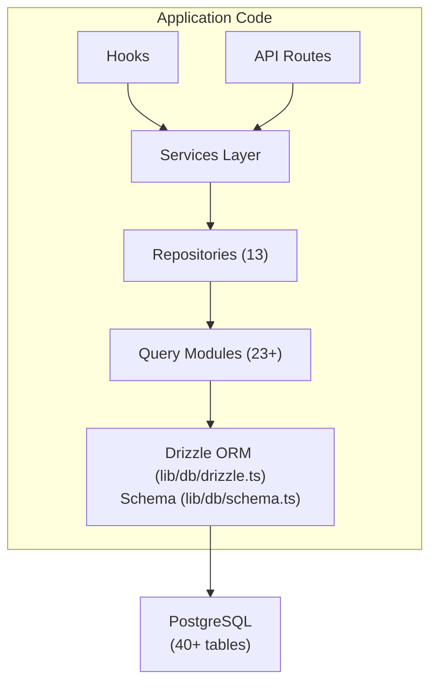

# סקירת מסד נתונים

התבנית Ever Works משתמשת ב-**Drizzle ORM** עם **PostgreSQL** כשכבת מסד הנתונים שלה. מסד הנתונים הוא אופציונלי -- היישום יכול לרוץ בלעדיו עבור פריסות תוכן בלבד -- אך הוא מפעיל את כל תכונות המשתמש, המנוי, המעורבות והמנהל.

## מחסנית טכנולוגיה

|רכיב|טכנולוגיה|מטרה|
|-----------|-----------|---------|
|ORM|טפטוף ORM|בונה שאילתות וניהול סכימה בטוחים בסוגים|
|מסד נתונים|PostgreSQL|מסד נתונים יחסי ראשוני|
|נהג|`postgres` (postgres.js)|לקוח PostgreSQL עבור Node.js|
|הגירות|ערכת טפטוף|יצירה וביצוע של העברת סכימה|
|זריעה|`drizzle-seed` + סקריפטים מותאמים אישית|אתחול מסד הנתונים עם נתוני ברירת מחדל|

## ארכיטקטורת מסדי נתונים



## תצורה

### תצורת טפטוף (`drizzle.config.ts`)

```typescript
export default {
  schema: "./lib/db/schema.ts",
  out: "./lib/db/migrations",
  dialect: "postgresql",
  dbCredentials: {
    url: process.env.DATABASE_URL,
  },
} satisfies Config;
```

התצורה מצביעה על:
- **קובץ סכימה**: `lib/db/schema.ts` -- מקור האמת היחיד עבור כל הגדרות הטבלה
- **פלט הגירה**: `lib/db/migrations/` -- היכן מאוחסנים קבצי הגירה של SQL שנוצרו
- **דיאלקט**: PostgreSQL
- **חיבור**: דרך `DATABASE_URL` משתנה סביבה

### ניהול חיבורים (`lib/db/drizzle.ts`)

חיבור מסד הנתונים מאותחל בעצלתיים בשימוש ראשון ומשתמש מחדש בחיבורים על פני טעינות חוזרות חמות בפיתוח באמצעות דפוס יחיד גלובלי.

תכונות עיקריות:
- **אתחול עצלן**: חיבור מסד הנתונים לא נוצר עד לביצוע השאילתה הראשונה
- **גישה מבוססת Proxy**: האובייקט המיוצא `db` משתמש ב-JavaScript `Proxy` כדי לאתחל את החיבור בשקיפות
- **איגוד חיבור**: גודל מאגר ניתן להגדרה באמצעות משתנה סביבה `DB_POOL_SIZE` (ברירת מחדל: 20 בייצור, 10 בפיתוח, מהודקים 1-50)
- **זמן קצוב לא פעיל**: החיבורים משתחררים לאחר 20 שניות של חוסר פעילות
- **זמן קצוב לחיבור**: פסק זמן של 30 שניות ליצירת חיבורים חדשים
- **דפוס יחיד**: משתמש ב-@@TOK000@@@ כדי להתמיד בחיבורים בטעינות חוזרות חמות של Next.js

```typescript
// Usage - just import and use
import { db } from '@/lib/db/drizzle';

const users = await db.select().from(schema.users);
```

### משתני סביבה

|משתנה|חובה|ברירת מחדל|תיאור|
|----------|----------|---------|-------------|
|`DATABASE_URL`|לא| - |מחרוזת חיבור PostgreSQL|
|`DB_POOL_SIZE`|לא| 10/20 |גודל בריכת חיבור (פיתוח/פרוד)|

כאשר `DATABASE_URL` אינו מוגדר, תכונות מסד הנתונים מושבתות בשקט, מה שמאפשר ליישום לפעול במצב תוכן בלבד.

## סקירת סכימה

סכימת מסד הנתונים מוגדרת בקובץ בודד (`lib/db/schema.ts`) המכיל 40+ טבלאות מאורגנות לפי תחום:

|דומיין|טבלאות|תיאור|
|--------|--------|-------------|
|משתמשים ואישור| 8 |משתמשים, חשבונות, הפעלות, אסימונים, מאמתים|
|תפקידים והרשאות| 3 |RBAC עם תפקידים, הרשאות ומיפוי הרשאות תפקידים|
|פרופילי לקוחות| 1 |פרופילי משתמש מורחבים עבור חשבונות לקוחות|
|מעורבות בתוכן| 4 |הערות, הצבעות, מועדפים, צפיות בפריטים|
|מנויים| 4 |תוכניות, היסטוריית מנויים, ספקי תשלומים, חשבונות תשלום|
|התראות| 1 |מערכת הודעות בתוך האפליקציה|
|ניהול וניהול| 4 |דוחות, היסטוריית ניהול, יומני ביקורת פריטים, יומני פעילות|
|אינטגרציות| 2 |תצורת CRM, מיפויי אינטגרציה|
|חברות| 2 |חברות ועמותות פריט-חברות|
|מודעות חסות| 1 |פרסומות ממומנות של פריטים|
|סקרים| 2 |סקרים ותשובות לסקר|
|ניוזלטר| 1 |מנויים לניוזלטר|
|מערכת| 1 |מעקב אחר סטטוס הזרע|

## אתחול מסד הנתונים

בעת הפעלת האפליקציה (דרך `instrumentation.ts`), התבנית באופן אוטומטי:

1. **מריץ העברות**: הפונקציה `migrate()` של Drrizzle מחילה את כל ההגירות הממתינות (אימפוטנטיות - דילגות על העברות שכבר הוחלו)
2. **נתוני זרעים**: אם מסד הנתונים לא זכה ל-Seed, סקריפט ה-Seed פועל עם הגנת נעילת ייעוץ כדי למנוע תנאי מרוץ בפריסות מרובות תהליכים

זה מטופל על ידי `lib/db/initialize.ts`. עיין ב-[מדריך ההגירות](./migrations-guide) ו-[זרעת מסד נתונים](./seeding) לפרטים.

## פקודות מפתח

```bash
# Generate a migration from schema changes
pnpm db:generate

# Run pending migrations
pnpm db:migrate

# Seed the database
pnpm db:seed

# Open Drizzle Studio (database GUI)
pnpm db:studio
```
