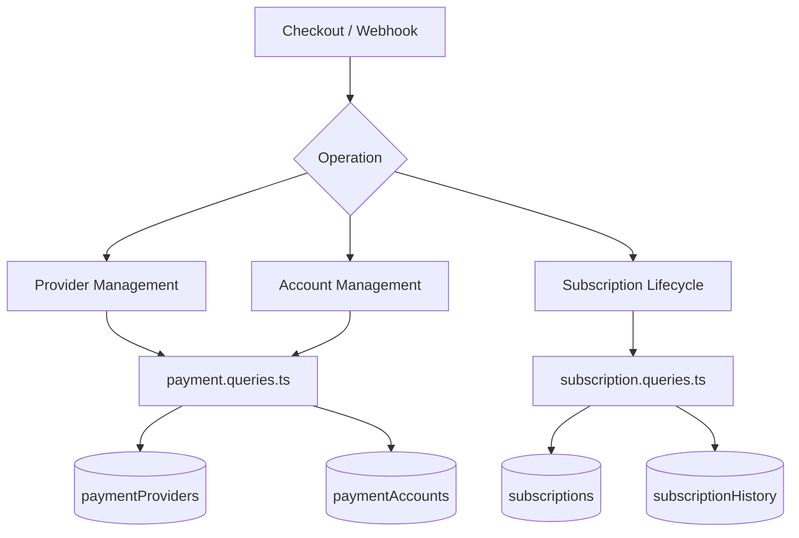
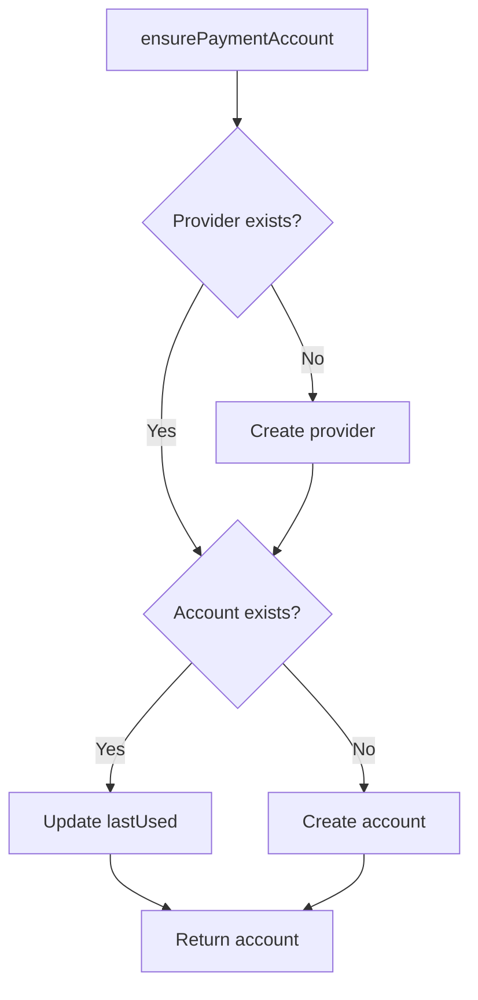
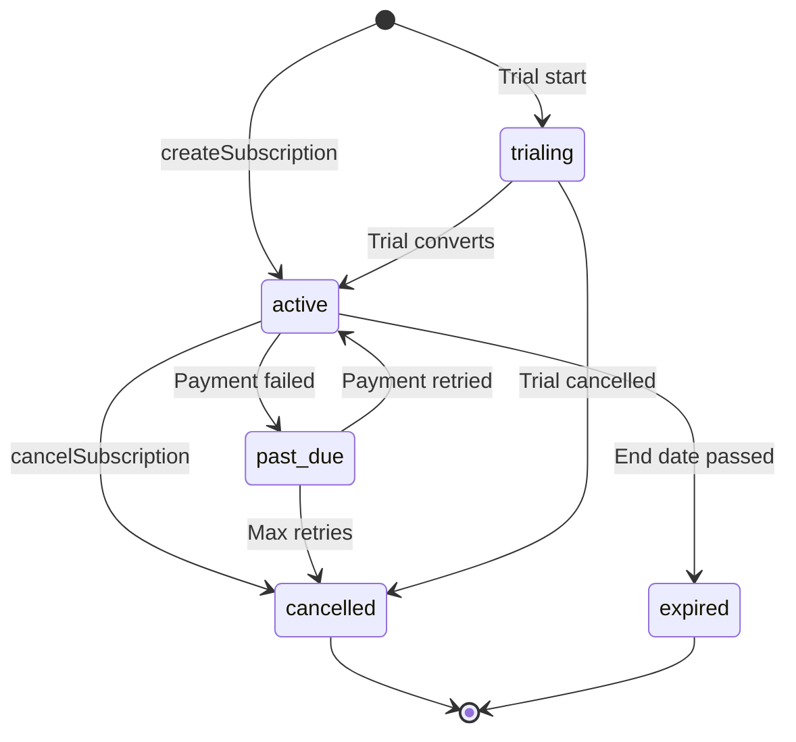

# שאילתות תשלום ומנוי

שאילתות תשלום מנהלות את רישום הספקים, חשבונות התשלום של המשתמשים ואת מחזור החיים המלא של המנוי. המודולים הרלוונטיים הם `payment.queries.ts` ו-`subscription.queries.ts`.

## ארכיטקטורת מערכת תשלומים



## שאילתות של ספקי תשלומים (`payment.queries.ts`)

### ספק CRUD

|פונקציה|תיאור|
|----------|-------------|
|`getPaymentProvider(id)`|קבל ספק לפי תעודת זהות|
|`getPaymentProviderByName(name)`|קבל ספק לפי שם (למשל, `'stripe'`)|
|`getActivePaymentProviders()`|רשום את כל הספקים הפעילים, מסודרים לפי שם|
|`createPaymentProvider(data)`|צור רשומת ספק חדשה|
|`updatePaymentProvider(id, data)`|עדכון חלקי של שדות ספק|
|`deactivatePaymentProvider(id)`|הגדר `isActive = false`|

שמות ספקים נתמכים: `stripe`, `lemonsqueezy`, `polar`, `solidgate`.

### שאילתות בחשבון תשלום

חשבונות תשלום מקשרים משתמש לזיהוי לקוח ספציפי לספק:

|פונקציה|תיאור|
|----------|-------------|
|`getPaymentAccountByUserId(userId, providerId)`|קבל חשבון עם בדיקת ספק פעילה|
|`getPaymentAccountByCustomerId(customerId, providerId)`|חיפוש הפוך לפי מזהה לקוח|
|`createPaymentAccount(data)`|צור חשבון עם `lastUsed` חותמת זמן|
|`updatePaymentAccountLastUsed(accountId)`|גע בחותמת הזמן `lastUsed`|
|`getUserPaymentAccountByProvider(userId, providerName)`|חיפוש לפי שם הספק (פותר את הספק תחילה)|

### אימות ספק פעיל

`getPaymentAccountByUserId` מבצע צירוף פנימי משולש כדי להבטיח שגם הספק וגם המשתמש תקפים:

```typescript
export async function getPaymentAccountByUserId(
  userId: string,
  providerId: string
): Promise<PaymentAccount | null> {
  const result = await db
    .select({ /* payment account fields */ })
    .from(paymentAccounts)
    .innerJoin(paymentProviders, eq(paymentAccounts.providerId, paymentProviders.id))
    .innerJoin(users, eq(paymentAccounts.userId, users.id))
    .where(and(
      eq(paymentAccounts.userId, userId),
      eq(paymentAccounts.providerId, providerId),
      eq(paymentProviders.isActive, true)
    ))
    .limit(1);
  return result[0] || null;
}
```

### ודא חשבון תשלום

`ensurePaymentAccount` מיישמת דפוס אימפוטנטי של התעללות עבור חשבונות תשלום:



```typescript
export async function ensurePaymentAccount(
  providerName: string,
  userId: string,
  customerId: string,
  accountId?: string
): Promise<PaymentAccount>
```

### הגדר חשבון תשלום למשתמש

`setupUserPaymentAccount` מרחיב את דפוס ההבטחה עם זיהוי שינוי מזהה לקוח:

```typescript
if (existingAccount.customerId !== customerId) {
  await db
    .update(paymentAccounts)
    .set({
      customerId,
      accountId: accountId || existingAccount.accountId,
      lastUsed: new Date(),
      updatedAt: new Date()
    })
    .where(eq(paymentAccounts.id, existingAccount.id));
}
```

### כינויי נוחות

- `getOrCreatePaymentAccount` -- כינוי עבור `ensurePaymentAccount`
- `createOrGetPaymentAccount` -- כינוי עבור `setupUserPaymentAccount`

## שאילתות מנוי (`subscription.queries.ts`)

### חיפוש מנויים

|פונקציה|פרמטרים|מחזיר|
|----------|-----------|---------|
|`getUserActiveSubscription(userId)`|מזהה משתמש|מנוי פעיל או ריק|
|`getUserSubscriptions(userId)`|מזהה משתמש|כל המנויים (בסדר לפי תאריך)|
|`getSubscriptionByProviderSubscriptionId(provider, subId)`|ספק + מזהה משנה|מנוי או ריק|
|`getSubscriptionByUserIdAndSubscriptionId(userId, subId)`|משתמש + מזהה משנה|מנוי או ריק|
|`getSubscriptionWithUser(subId)`|מזהה מנוי|מנוי עם הצטרפות משתמש|
|`hasActiveSubscription(userId)`|מזהה משתמש|בוליאנית|

### מחזור חיים של מנוי

#### צור

```typescript
export async function createSubscription(data: NewSubscription): Promise<Subscription> {
  const result = await db
    .insert(subscriptions)
    .values({ ...data, createdAt: new Date(), updatedAt: new Date() })
    .returning();
  return result[0];
}
```

#### עדכון סטטוס

שינויי סטטוס מוגדרים אוטומטית `cancelledAt` ו-`cancelReason` בעת המעבר ל-`CANCELLED`:

```typescript
export async function updateSubscriptionStatus(
  subscriptionId: string,
  status: string,
  reason?: string
): Promise<Subscription | null>
```

#### בטל

תומך הן בביטול מיידי והן בביטול סוף התקופה:

```typescript
export async function cancelSubscription(
  subscriptionId: string,
  reason?: string,
  cancelAtPeriodEnd: boolean = false
): Promise<Subscription | null>
```

כאשר `cancelAtPeriodEnd = true`, המצב נשאר `ACTIVE` אך `cancelledAt` ו-`cancelAtPeriodEnd` מוגדרים.

### זרימת סטטוס מנוי



### החלטת תוכנית

`getUserPlan` בודק את תפוגת המינוי ונופל בחזרה לתוכנית החינמית:

```typescript
export async function getUserPlan(userId: string): Promise<string> {
  const subscription = await getUserActiveSubscription(userId);
  if (!subscription) return PaymentPlan.FREE;
  return getEffectivePlan(subscription.planId, subscription.endDate, subscription.status);
}
```

`getUserPlanWithExpiration` מחזיר את פרטי התפוגה המלאים:

```typescript
{
  planId: string;         // Stored plan
  effectivePlan: string;  // Actual plan after expiration check
  isExpired: boolean;
  expiresAt: Date | null;
  status: string | null;
  subscriptionId: string | null;
}
```

### תפוגה וחידוש

|פונקציה|תיאור|
|----------|-------------|
|`getSubscriptionsExpiringSoon(days)`|מנויים פעילים שיפוג תוך N ימים|
|`getExpiredSubscriptions()`|מנויים אחרי תאריך הסיום שלהם|
|`getSubscriptionsForRenewalReminder(days)`|מינויים הזקוקים להודעות חידוש|

### היסטוריית מנויים

שינויים נרשמים בטבלה `subscriptionHistory`:

```typescript
export async function logSubscriptionHistory(data: NewSubscriptionHistory)
export async function getSubscriptionHistory(subscriptionId: string)
```

### סטטיסטיקת מנויים

`getSubscriptionStats` מחזירה ספירות מצטברות:

```typescript
{
  total: number;
  active: number;
  cancelled: number;
  expired: number;
  pastDue: number;
  trialing: number;
}
```

## קבועי סכימה

```typescript
// lib/db/schema.ts
export const SubscriptionStatus = {
  ACTIVE: 'active',
  CANCELLED: 'cancelled',
  EXPIRED: 'expired',
  PAST_DUE: 'past_due',
  TRIALING: 'trialing',
} as const;

// lib/constants/payment.ts
export const PaymentPlan = {
  FREE: 'free',
  STANDARD: 'standard',
  PREMIUM: 'premium',
} as const;

export const PaymentProvider = {
  STRIPE: 'stripe',
  LEMONSQUEEZY: 'lemonsqueezy',
  POLAR: 'polar',
  SOLIDGATE: 'solidgate',
} as const;
```
