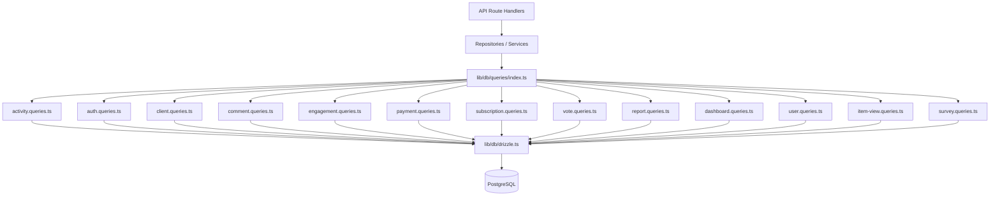

# מערכת דפוסי שאילתות

התבנית מארגנת את כל שאילתות מסד הנתונים במודולים ספציפיים לתחום תחת `lib/db/queries/`. כל מודול עוקב אחר עקרון האחריות היחידה (SRP), ומקבץ פעולות קשורות יחד. ייצוא חבית ב-`index.ts` מספק נקודת כניסה אחת לכל פונקציות השאילתה.

## סקירה כללית של אדריכלות



## מודולי שאילתה

|מודול|קובץ|מטרה|
|--------|------|---------|
|פעילות|`activity.queries.ts`|רישום פעילויות ומסלול ביקורת|
|Auth|`auth.queries.ts`|אסימוני איפוס סיסמה, אסימוני אימות|
|לקוח|`client.queries.ts`|פרופיל לקוח CRUD, חיפוש, סטטיסטיקה|
|הערה|`comment.queries.ts`|הערה CRUD עם הצטרפות משתמשים|
|חברה|`company.queries.ts`|ניהול חברה וקישור פריט-חברה|
|לוח מחוונים|`dashboard.queries.ts`|נתונים סטטיסטיים של לוח המחוונים ותרשימי מעורבות|
|אירוסין|`engagement.queries.ts`|מדדי מעורבות מצטברים (צפיות, הצבעות, מועדפים, הערות)|
|מיפוי אינטגרציה|`integration-mapping.queries.ts`|מיפויי אינטגרציה של CRM|
|פריט|`item.queries.ts`|נורמליזציה ואימות של שבלול פריט|
|ביקורת פריט|`item-audit.queries.ts`|היסטוריית שינויי פריט|
|תצוגת פריט|`item-view.queries.ts`|הצג מעקב עם מניעת כפילויות|
|אינדקס מיקום|`location-index.queries.ts`|אינדקס פריטים גיאוגרפי-מרחבי|
|מתינות|`moderation.queries.ts`|פעולות ניהול תוכן|
|ניוזלטר|`newsletter.queries.ts`|ניהול מנויי ניוזלטר|
|תשלום|`payment.queries.ts`|ספק תשלומים וניהול חשבונות|
|דווח|`report.queries.ts`|דוחות תוכן עם סינון|
|מנוי|`subscription.queries.ts`|ניהול מחזור חיים של מנוי|
|סקר|`survey.queries.ts`|תשובות לסקר וניתוח|
|משתמש|`user.queries.ts`|בדיקות CRUD ומנהלי ליבה של משתמשי ליבה|
|הצביעו|`vote.queries.ts`|הצביעו CRUD וחישוב ניקוד נטו|

## דפוסים נפוצים

### 1. דפוס עימוד

כל שאילתות הרשימה עוקבות אחר דפוס עימוד עקבי באמצעות `limit` ו-`offset`:

```typescript
export async function getClientProfiles(params: {
  page?: number;
  limit?: number;
  search?: string;
  status?: string;
}): Promise<{
  profiles: ClientProfileWithAuth[];
  total: number;
  page: number;
  totalPages: number;
  limit: number;
}> {
  const { page = 1, limit = 10, search, status } = params;
  const offset = (page - 1) * limit;

  // 1. Build WHERE conditions dynamically
  const whereConditions: SQL[] = [];
  if (search) { /* add ILIKE condition */ }
  if (status) { whereConditions.push(eq(clientProfiles.status, status)); }
  const whereClause = whereConditions.length > 0
    ? and(...whereConditions)
    : undefined;

  // 2. Count query for total
  const countResult = await db
    .select({ count: sql<number>`count(distinct ${clientProfiles.id})` })
    .from(clientProfiles)
    .where(whereClause);
  const total = Number(countResult[0]?.count || 0);

  // 3. Data query with limit/offset
  const profiles = await db
    .select({ /* fields */ })
    .from(clientProfiles)
    .where(whereClause)
    .orderBy(desc(clientProfiles.createdAt))
    .limit(limit)
    .offset(offset);

  return {
    profiles,
    total,
    page,
    totalPages: Math.ceil(total / limit),
    limit,
  };
}
```

### 2. דפוס סינון דינמי

מסננים מצטברים כמערך של תנאי SQL ומורכבים עם `and()`:

```typescript
const whereConditions: SQL[] = [];

if (search) {
  const escapedSearch = search
    .replace(/\\/g, '\\\\')
    .replace(/[%_]/g, '\\$&');
  whereConditions.push(
    sql`(${clientProfiles.name} ILIKE ${`%${escapedSearch}%`} OR
         ${clientProfiles.email} ILIKE ${`%${escapedSearch}%`})`
  );
}

if (status) {
  whereConditions.push(eq(clientProfiles.status, status));
}

if (provider) {
  whereConditions.push(
    sql`exists (
      select 1 from ${accounts}
      where ${accounts.userId} = ${clientProfiles.userId}
        and ${accounts.provider} = ${provider}
    )`
  );
}

const whereClause = whereConditions.length > 0
  ? and(...whereConditions)
  : undefined;
```

### 3. הצטרפות לתבנית

בסיס הקוד משתמש הן ב`innerJoin`/`leftJoin` והן בשאילתות משנה כדי לטפל בנתונים קשורים:

**הצטרפות פנימית ליחסים נדרשים:**

```typescript
const result = await db
  .select({
    id: comments.id,
    content: comments.content,
    user: {
      id: clientProfiles.id,
      name: clientProfiles.name,
      email: clientProfiles.email,
      image: clientProfiles.avatar,
    },
  })
  .from(comments)
  .innerJoin(clientProfiles, eq(comments.userId, clientProfiles.id))
  .where(and(eq(comments.itemId, itemId), isNull(comments.deletedAt)))
  .orderBy(desc(comments.createdAt));
```

**שאילתת משנה כדי להימנע משורות כפולות ממספר צירוף:**

```typescript
const profiles = await db
  .select({
    id: clientProfiles.id,
    // ... other fields
    accountProvider: sql<string>`coalesce(
      (SELECT provider FROM ${accounts}
       WHERE ${accounts.userId} = ${clientProfiles.userId}
       LIMIT 1),
      'unknown'
    )`,
  })
  .from(clientProfiles);
```

### 4. דפוס צבירה

פונקציות מצטברות כמו `count`, `SUM` ו-`AVG` משמשות עם `groupBy`:

```typescript
// Net vote score using conditional SUM
const voteCounts = await db
  .select({
    itemId: votes.itemId,
    netScore: sql<number>`
      SUM(CASE
        WHEN vote_type = 'upvote' THEN 1
        WHEN vote_type = 'downvote' THEN -1
        ELSE 0
      END)
    `.as('netScore'),
  })
  .from(votes)
  .where(inArray(votes.itemId, itemSlugs))
  .groupBy(votes.itemId);
```

### 5. תבנית שאילתה מקבילה

כאשר יש צורך במספר צבירות עצמאיות, שאילתות פועלות במקביל ל-`Promise.all`:

```typescript
const [viewsData, votesData, favoritesData, commentsData] =
  await Promise.all([
    db.select({ itemId: itemViews.itemId, count: count() })
      .from(itemViews)
      .where(inArray(itemViews.itemId, itemSlugs))
      .groupBy(itemViews.itemId),

    db.select({ itemId: votes.itemId, netScore: sql`...` })
      .from(votes)
      .where(inArray(votes.itemId, itemSlugs))
      .groupBy(votes.itemId),

    db.select({ itemSlug: favorites.itemSlug, count: count() })
      .from(favorites)
      .where(inArray(favorites.itemSlug, itemSlugs))
      .groupBy(favorites.itemSlug),

    db.select({ itemId: comments.itemId, count: count(), avgRating: sql`...` })
      .from(comments)
      .where(and(inArray(comments.itemId, itemSlugs), isNull(comments.deletedAt)))
      .groupBy(comments.itemId),
  ]);
```

### 6. תבנית פתרון סכסוכים/העלאה

משמש למניעת כפילויות, במיוחד במעקב אחר צפיות:

```typescript
export async function recordItemView(
  view: Pick<NewItemView, 'itemId' | 'viewerId' | 'viewedDateUtc'>
): Promise<boolean> {
  const result = await db
    .insert(itemViews)
    .values(view)
    .onConflictDoNothing()
    .returning({ id: itemViews.id });

  return result.length > 0;
}
```

### 7. תבנית מחיקה רכה

רשומות מסומנות כמחוקות במקום כמוסרות פיזית:

```typescript
export async function deleteComment(id: string) {
  const [comment] = await db
    .update(comments)
    .set({ deletedAt: new Date() })
    .where(eq(comments.id, id))
    .returning();
  return comment;
}

// Querying always filters out soft-deleted records
.where(and(eq(comments.itemId, itemId), isNull(comments.deletedAt)))
```

### 8. תבנית נורמליזציה של תוצאה

תוצאות השאילתה ממפות לעתים קרובות באמצעות חיפוש `Map` אובייקטים לגישה יעילה של O(1):

```typescript
const viewsMap = new Map<string, number>(
  viewsData.map(v => [v.itemId, Number(v.count)])
);
const votesMap = new Map<string, number>(
  votesData.map(v => [v.itemId, Number(v.netScore ?? 0)])
);

// Combine into final metrics
for (const slug of itemSlugs) {
  metricsMap.set(slug, {
    views: viewsMap.get(slug) ?? 0,
    votes: votesMap.get(slug) ?? 0,
  });
}
```

## כלי עזר משותפים

### `lib/db/queries/utils.ts`

מספק פונקציות עוזר המשותפות בין מודולי שאילתה:

- **`extractUsernameFromEmail(email)`** -- מחלץ ומחטא שם משתמש מכתובת דוא"ל
- **`ensureUniqueUsername(baseUsername)`** -- יוצר שם משתמש ייחודי על ידי הוספת סיומות מספריות במידת הצורך

### `lib/db/queries/types.ts`

מגדיר סוגים משותפים המשמשים בין מודולי שאילתה:

- **`ClientProfileWithAuth`** -- פרופיל לקוח בשילוב עם נתוני ספק אימות
- **`ClientStatus`** / **`ClientPlan`** / **`ClientAccountType`** -- סוגי אנום לסינון
- **`CommentWithUser`** -- נתוני הערות מועשרים בפרטי משתמש

## אמנת יבוא

כל השאילתות מיובאות דרך ייצוא החבית:

```typescript
import {
  getClientProfiles,
  createVote,
  getEngagementMetricsPerItem,
  getUserActiveSubscription,
} from '@/lib/db/queries';
```
