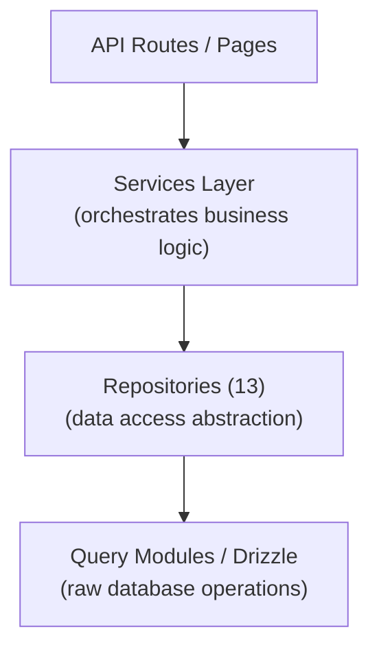

# דפוס מאגר

התבנית Ever Works מיישמת דפוס מאגר באמצעות 13 מחלקות מאגר מיוחדות ב-`lib/repositories/`. מאגרים מספקים הפשטה ברמה גבוהה יותר על פני שאילתות מסד נתונים גולמיים, ומעטפים לוגיקה מורכבת של שאילתות, כללים עסקיים ושינוי נתונים.

## אדריכלות



## רשימת מאגר

|מאגר|קובץ|דומיין|
|------------|------|--------|
|Admin Analytics (אופטימיזציה)|`admin-analytics-optimized.repository.ts`|ניתוח ניהול עם אופטימיזציה של ביצועים|
|סטטיסטיקות מנהל|`admin-stats.repository.ts`|נתונים סטטיסטיים של לוח המחוונים של מנהל המערכת|
|קטגוריה|`category.repository.ts`|ניהול קטגוריות|
|לוח מחוונים ללקוח|`client-dashboard.repository.ts`|תפעול לוח המחוונים של הלקוח|
|פריט לקוח|`client-item.repository.ts`|הגשת פריטים ללקוח|
|אוסף|`collection.repository.ts`|ניהול גבייה|
|מיפוי אינטגרציה|`integration-mapping.repository.ts`|מיפויי אינטגרציה של CRM|
|פריט|`item.repository.ts`|פעולות פריט|
|תפקיד|`role.repository.ts`|ניהול תפקידים|
|מודעת חסות|`sponsor-ad.repository.ts`|ניהול פרסומות ממומנות|
|תג|`tag.repository.ts`|ניהול תגים|
|Twenty CRM Config|`twenty-crm-config.repository.ts`|תצורת CRM|
|משתמש|`user.repository.ts`|ניהול משתמשים|

## מאגר תוכן מבוסס Git (`lib/repository.ts`)

בנוסף למאגרי מסד הנתונים, התבנית כוללת מאגר תוכן מבוסס Git בכתובת `lib/repository.ts`. זה מטפל בפעולות Git CMS:

- שיבוט מאגר תוכן מ-`DATA_REPOSITORY` URL
- סנכרן תוכן עם למעלה (משיכה/דחיפה עם זיהוי התנגשות)
- עקוב אחר שינויים מקומיים ובצע אותם
- הגנה על פסק זמן עבור פעולות Git (פסק זמן של 120 שניות)

זה נבדל ממאגרי מסד הנתונים ומנהל את הספרייה `.content/` המשמשת את שכבת התוכן.

## פרטי מאגר

### admin-analytics-optimized.repository.ts

מאגר ניתוח מותאם לביצועים עבור לוח המחוונים לניהול. משתמש בשאילתות אצווה ואסטרטגיות אחסון במטמון כדי למזער את העומס של מסד הנתונים בעת יצירת תצוגות ניתוח.

יכולות מפתח:
- סטטיסטיקות צפייה מצטברות
- מגמות צמיחת משתמשים
- סיכומי מעורבות בתוכן
- ניתוח הכנסות

### admin-stats.repository.ts

מספק נתונים סטטיסטיים של לוח המחוונים עבור פאנל הניהול.

יכולות מפתח:
- סך כל ספירת המשתמשים
- מנויים פעילים סופרים
- סטטיסטיקות תוכן (פריטים, הערות, דוחות)
- סיכומי פעילות אחרונים

### category.repository.ts

מנהל נתוני קטגוריות עם פעולות CRUD וטיפול בקשרים.

יכולות מפתח:
- רישום קטגוריות עם ספירת פריטים
- חציית עץ בקטגוריה (הורה/ילד)
- חיפוש וסינון קטגוריות
- הזמנת קטגוריה

### client-dashboard.repository.ts

המאגר הגדול ביותר (28KB), המטפל בכל נתוני לוח המחוונים בצד הלקוח.

יכולות מפתח:
- ניהול הגשת לקוחות
- ניתוח הגשה (צפיות, הצבעות, הערות לכל פריט)
- היסטוריית פעילות הלקוח
- נתונים סטטיסטיים של סיכום לוח המחוונים
- רישום פריטים עם עמודים עם מסננים

### client-item.repository.ts

מנהל פריטים מנקודת מבט הלקוח (המגיש).

יכולות מפתח:
- יצירה ועדכונים של הגשת פריטים
- מעקב אחר מצב פריט
- היסטוריית הגשה
- סינון פריט ספציפי ללקוח

### collection.repository.ts

ניהול אוסף עבור קבוצות פריטים שנאספו.

יכולות מפתח:
- פעולות איסוף CRUD
- עמותות איסוף פריטים
- הזמנת וסטטוס איסוף
- רישום אוסף מדורג

### integration-mapping.repository.ts

התמדה במיפוי אינטגרציה של CRM.

יכולות מפתח:
- צור ועדכן מיפויים בין מזהים פנימיים ומזהי CRM
- פעולות חילוץ בתפזורת
- חיפוש לפי מזהה פנימי או מזהה CRM
- סנכרון מעקב אחר חותמות זמן
- ניהול hash של גרסה לזיהוי שינויים

### item.repository.ts

פעולות הליבה של נתוני פריט (עבור מטא נתונים המאוחסנים במסד נתונים, לא לתוכן Git).

יכולות מפתח:
- ניהול מטא נתונים של פריטים
- חיפוש פריטים עם מסננים מרובים
- צבירת נתוני מעורבות בפריטים
- ניהול פריטים מומלצים

### תפקיד.מאגר.ts

ניהול תפקידים למערכת RBAC.

יכולות מפתח:
- תפקיד פעולות CRUD
- עמותות הרשאות תפקיד
- הקצאות תפקידי משתמש
- אימות תפקיד

### sponsor-ad.repository.ts

ניהול מחזור חיים של פרסומת ממומנת.

יכולות מפתח:
- יצירת וניהול מודעות חסות
- מעברי סטטוס (בהמתנה, פעיל, פג תוקף)
- סינון מודעות לפי סטטוס, משתמש או פריט
- נתוני שילוב תשלומים
- טיפול בתפוגה

### tag.repository.ts

ניהול תגים עם שיוך פריטים.

יכולות מפתח:
- תג פעולות CRUD
- חיפוש תגים והשלמה אוטומטית
- סטטיסטיקת שימוש בתגים
- שיוך פריט-תג

### twenty-crm-config.repository.ts

ניהול תצורה של עשרים CRM יחידות.

יכולות מפתח:
- קבל/עדכן תצורת CRM
- הפעל/השבת אינטגרציה של CRM
- ניהול מצב סנכרון
- ניהול מפתחות API

### user.repository.ts

ניהול חשבון משתמש.

יכולות מפתח:
- פעולות פרופיל משתמש
- חיפוש וסינון משתמשים
- ניהול מצב חשבון
- מחיקת משתמש (מחיקה רכה)

## דפוס שימוש

מאגרים מיובאים ומשמשים ישירות בנתיבי API, שירותים ורכיבי שרת:

```typescript
import { clientDashboardRepository } from '@/lib/repositories/client-dashboard.repository';

// In an API route
export async function GET(request: NextRequest) {
  const session = await auth();
  const dashboard = await clientDashboardRepository.getDashboardStats(session.user.id);
  return NextResponse.json({ success: true, data: dashboard });
}
```

```typescript
import { itemRepository } from '@/lib/repositories/item.repository';

// In a server component
export default async function ItemPage({ params }) {
  const item = await itemRepository.findBySlug(params.slug);
  return <ItemDetail item={item} />;
}
```

## מאגר לעומת מודולי שאילתה

|היבט|מודולי שאילתה (`lib/db/queries/`)|מאגרים (`lib/repositories/`)|
|--------|-----------------------------------|-------------------------------------|
|מורכבות|שאילתות פשוטות וממוקדות|פעולות מורכבות עם ריבוי שולחנות|
|היגיון עסקי|אין (גישה טהורה לנתונים)|כולל אימות וכללים עסקיים|
|טרנספורמציה של נתונים|תוצאות גולמיות של מסד נתונים|נתונים שעברו שינוי/מועשר|
|מקרה שימוש|פעולות ישירות בבסיס הנתונים|גישה לנתונים ברמת התכונה|
|צרכן טיפוסי|מודולי שאילתה אחרים, מסלולים פשוטים|שירותים, מסלולי API, רכיבי שרת|

שתי השכבות משתמשות ב-Drizzle ORM ומייבאות את חיבור מסד הנתונים מ-`lib/db/drizzle.ts`. הבחירה ביניהם תלויה במורכבות הפעולה: קריאה פשוטה משתמשת ישירות במודולי שאילתה, בעוד שתכונות מורכבות עוברות דרך מאגרים.
