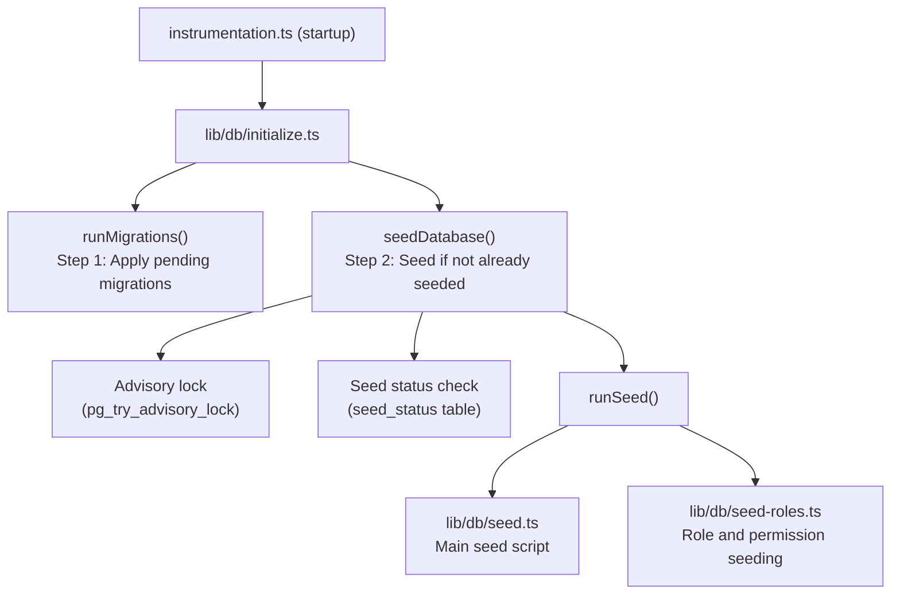

# זריעה של מסד נתונים

תבנית Ever Works כוללת מערכת זריעה מקיפה של מסד נתונים המאתחלת נתונים חיוניים (תפקידים, הרשאות, ספקי תשלום) ואופציונלית מייצרת נתוני הדגמה לפיתוח ובדיקה.

## אדריכלות זרעים



## Seed Scripts

### סקריפט ראשי (`lib/db/seed.ts`)

סקריפט ה-Seed הראשי מטפל בכל אתחול מסד הנתונים. הוא פועל בשני מצבים:

**מצב ייצור**: זרעים רק נתונים חיוניים הנדרשים כדי שהאפליקציה תפעל:
- תפקידי מנהל ולקוח
- הרשאות מערכת
- ספקי תשלומים כברירת מחדל
- רישומי מערכת נדרשים

**מצב הדגמה**: משחזר בנוסף נתוני בדיקה מקיפים לפיתוח:
- משתמשים לדוגמה בעלי תפקידים שונים
- פרופילי לקוחות לדוגמה
- מנויים לדוגמה
- הערות הדגמה, הצבעות ומועדפים
- הודעות בדיקה
- רשומות יומן פעילות

מצב הדגמה מופעל כאשר משתנה הסביבה `DEMO_MODE` מוגדר.

מאפיינים מרכזיים:
- **אימפוטנציה לכל שולחן**: כל טבלה נבדקת לפני זריעה; רק טבלאות ריקות מאוכלסות
- **בדיקות קיום טבלה**: מאמת טבלאות קיימות לפני ניסיון הוספה
- **משתמש ב-`drizzle-seed`**: ממנף את ספריית זרעי הטפטוף הרשמית ליצירת נתונים מובנה
- **בטוח להרצה חוזרת**: ניתן לקרוא מספר פעמים מבלי לשכפל נתונים

```typescript
// Simplified seed flow
export async function runSeed(): Promise<void> {
  await ensureDb();
  const isDemo = isDemoMode();

  if (isDemo) {
    // Seed comprehensive test data
  } else {
    // Seed minimal essential data only
  }

  // Seed roles (always)
  if (await isTableEmpty('roles', roles)) {
    await seedRoles();
  }

  // Seed permissions (always)
  if (await isTableEmpty('permissions', permissions)) {
    await seedPermissions();
  }

  // Seed payment providers (always)
  if (await isTableEmpty('paymentProviders', paymentProviders)) {
    await seedPaymentProviders();
  }

  // Demo-only: seed users, profiles, subscriptions, etc.
  if (isDemo) {
    await seedDemoData();
  }
}
```

### זרימת תפקידים (`lib/db/seed-roles.ts`)

סקריפט ייעודי לזריעה של מערכת RBAC, שניתן להפעיל גם באופן עצמאי.

**`seedPermissions()`** יוצר את ערכת ההרשאות הראשונית:

|מפתח הרשאה|תיאור|
|---------------|-------------|
|`read:own`|יכול לקרוא נתונים משלו|
|`write:own`|יכול לכתוב נתונים משלו|
|`admin:all`|גישה מנהלתית מלאה|
|`client:manage`|יכול לנהל פעולות ספציפיות ללקוח|
|`user:read`|יכול לקרוא נתוני משתמש|
|`user:write`|יכול לכתוב נתוני משתמש|

משתמש ב-`onConflictDoUpdate` לעדכון בטוח של הרשאות קיימות מבלי להיכשל בריצות חוזרות.

**`linkRolesToPermissions()`** יוצר שיוך הרשאות תפקיד:

- **תפקיד מנהל**: מקבל את כל ההרשאות
- **תפקיד לקוח**: מקבל `read:own`, `write:own`, ו-`client:manage`

הפונקציה מאמתת שהתפקידים הנדרשים (אדמין, לקוח) קיימים ופעילים לפני יצירת שיוכים.

**`seedRolesAndPermissions()`** מתזמר את שתי הפעולות בתוך עסקת מסד נתונים:

```typescript
export async function seedRolesAndPermissions() {
  await db.transaction(async () => {
    await seedPermissions();
    await linkRolesToPermissions();
  });
}
```

ניתן להפעיל באופן עצמאי:
```bash
# Run directly (if configured as a script)
npx tsx lib/db/seed-roles.ts
```

## מערכת אתחול (`lib/db/initialize.ts`)

מערכת האתחול מנהלת את רצף האתחול המלא עם הגנת במקביל.

### מעקב אחר סטטוס זרעים

טבלה `seed_status` עוקבת אחר מצב הזריעה:

|סטטוס|משמעות|
|--------|---------|
|`seeding`|פעולת הזרע בעיצומה|
|`completed`|ה-Seed הושלם בהצלחה|
|`failed`|ה-Seed נכשל (שגיאה מאוחסנת)|

### הגנת מקבילות

בפריסות מרובות תהליכים (למשל, מספר פונקציות ללא שרת של Vercel המתחילות בו זמנית), המערכת מונעת זריעה כפולה באמצעות:

1. **נעילות ייעוץ PostgreSQL**: `pg_try_advisory_lock(12345)` מספק נעילה לא חוסמת. רק תהליך אחד יכול לרכוש אותו.
2. **טבלת סטטוס זרעים**: תהליכים אחרים בודקים את הטבלה `seed_status` וממתינים להשלמה.
3. **זיהוי עבש**: אם סטטוס `seeding` ישן יותר מ-5 דקות, הוא יטופל כמיושן ומנקה.
4. **זמן קצוב להמתנה**: תהליכים הממתינים להשלמה של מופע נוסף יקצוב פסק זמן לאחר 60 שניות.

### זרימת אתחול

```
initializeDatabase()
│
├── DATABASE_URL not set? → Silent skip (DB is optional)
│
├── Step 1: Run migrations (always, idempotent)
│   └── Failure? → Error in production, warning in dev/preview
│
├── Step 2: Check if already seeded
│   └── seed_status = 'completed'? → Done
│
├── Step 3: Handle edge cases
│   ├── Previous seed failed? → Delete failed status, retry
│   ├── Stale seeding (>5min)? → Clean up, retry
│   └── Another instance seeding? → Wait for completion
│
├── Step 4: Acquire advisory lock
│   └── Lock not available? → Wait for other instance
│
├── Step 5: Double-check (another instance may have finished)
│
├── Step 6: Run seed
│   ├── Create seed_status record ('seeding')
│   ├── Execute runSeed()
│   └── Update seed_status ('completed' or 'failed')
│
└── Step 7: Release advisory lock (always, in finally block)
```

## הפעלת זרעים באופן ידני

### זרע סטנדרטי

```bash
pnpm db:seed
```

### תסריטי זרעים בודדים

```bash
# Seed roles and permissions only
npx tsx lib/db/seed-roles.ts
```

### מצב הדגמה

כדי לראות עם נתוני הדגמה, הגדר את משתנה הסביבה `DEMO_MODE`:

```bash
DEMO_MODE=true pnpm db:seed
```

## משתני סביבה

|משתנה|ברירת מחדל|תיאור|
|----------|---------|-------------|
|`DATABASE_URL`| - |מחרוזת חיבור PostgreSQL (נדרשת לזריעה)|
|`DEMO_MODE`|`false`|אפשר זרימת נתוני הדגמה|

## סיכום נתוני זרעים

### זרע תמיד (מצב ייצור)

|טבלה|נתונים|
|-------|------|
|`roles`|תפקידי מנהל ולקוח|
|`permissions`|הגדרות הרשאות מערכת|
|`rolePermissions`|עמותות הרשאות תפקיד|
|`paymentProviders`|Stripe, LemonSqueezy, Polar, Solidgate|

### מצב הדגמה בלבד

|טבלה|נתונים|
|-------|------|
|`users`|משתמשי מנהל ולקוח לדוגמה|
|`accounts`|חשבונות אימות עבור משתמשים לדוגמה|
|`clientProfiles`|פרופילי לקוחות עם סטטוסים מגוונים|
|`subscriptions`|מינויים לדוגמה על פני תוכניות|
|`comments`|הערות לדוגמא|
|`votes`|הצבעות לדוגמה|
|`favorites`|מועדפים לדוגמה|
|`notifications`|הודעות מנהל לדוגמה|
|`activityLogs`|היסטוריית פעילות לדוגמה|

## שיטות עבודה מומלצות

1. **לעולם אל תריצו סיד בייצור עם DEMO_MODE**: יש להשתמש בנתוני הדגמה רק בפיתוח ובשלב
2. **בדוק את מצב ה-Seed לפני זריעה ידנית**: בצע שאילתה בטבלה `seed_status` כדי להבין את המצב הנוכחי
3. **השתמש בטרנזקציות**: זרימת התפקידים משתמשת בטרנזקציות כדי להבטיח עקביות
4. **עיצוב אימפוטנטי**: בדוק תמיד אם קיימים נתונים לפני ההכנסה כדי לתמוך בהרצה חוזרת בטוחה
5. **נעילות ייעוץ**: מערכת נעילת הייעוץ מונעת בעיות בסביבות ללא שרתים שבהן מספר מופעים עשויים להתחיל בו זמנית
